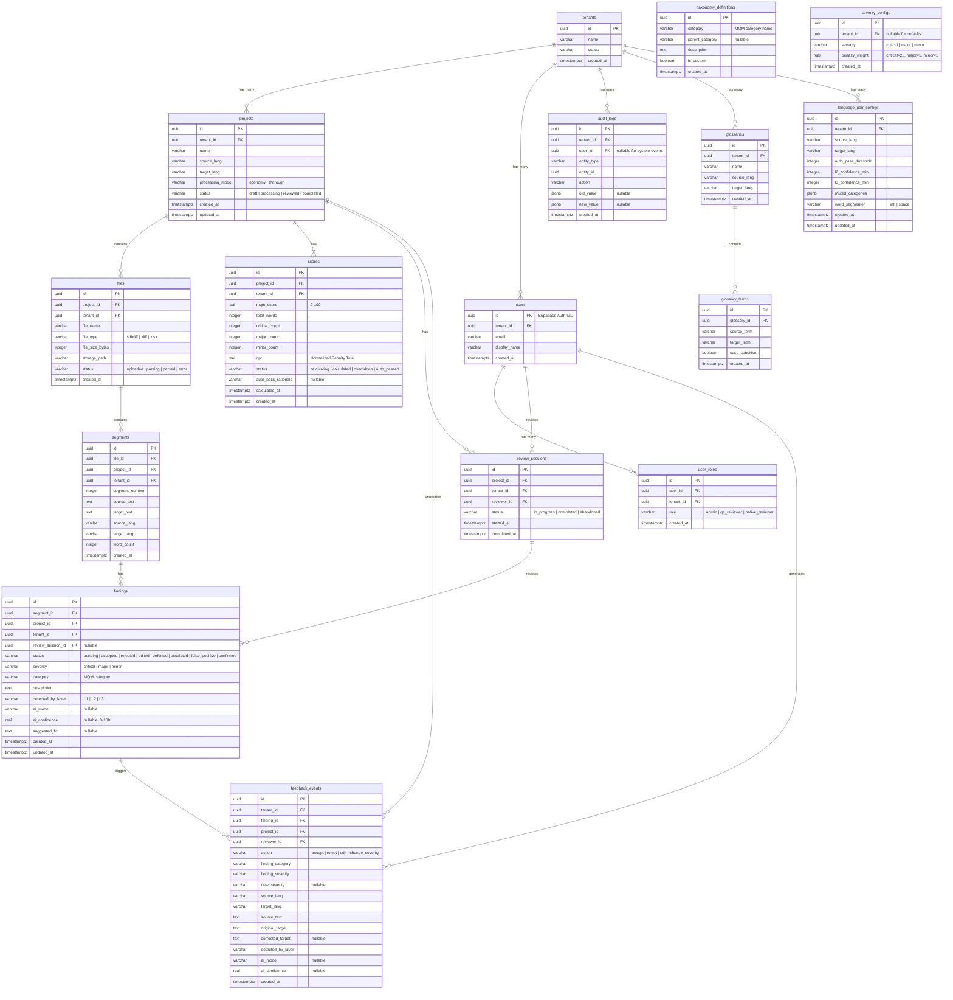

# Architecture Decision Document

_This document defines all architectural decisions, implementation patterns, and project structure for the QA Localization Tool._

**Document Conventions:** Each architectural decision follows a consistent format: **Decision** (what), **Rationale** (why), and **Affects** (scope of impact). Refinements from Party Mode reviews are tracked as R-numbered items (e.g., R1, R2).

## Project Context Analysis

### Requirements Overview

**Functional Requirements:**

The project encompasses **80 FRs** (68 MVP + 12 Growth) across 10 categories plus **18 FR-SH** (Self-healing Translation, Growth phase):

| Category | FR Range | Architectural Implication |
|----------|----------|--------------------------|
| File Parsing & Segment Extraction | FR1–FR9 | Requires SDLXLIFF/XLIFF parser (fast-xml-parser) with namespace handling. Supports streaming for large files and Excel bilingual input. |
| Dual Taxonomy & Rule Engine | FR10–FR16 | 3-Layer QA Pipeline (Rule → AI Screening → Deep AI), MQM + Custom taxonomy, configurable severity weights |
| AI/LLM Integration | FR17–FR22 | Vercel AI SDK v6, multi-provider abstraction, context injection across layers, fallback chain with version pinning |
| Scoring & Metrics | FR23–FR30 | MQM formula `Score = max(0, 100 - NPT)` where NPT per 1,000 words, severity weights Critical=25/Major=5/Minor=1, score lifecycle state machine (FR70) |
| Review Workflow | FR31–FR40 | 8 finding states, 7 review actions, auto-pass logic (≥95 + 0 Critical + L2 clean), recommended-pass → true auto-pass progression |
| Glossary & Terminology | FR41–FR45, FR72 | Multi-token glossary matching, case-sensitive/insensitive modes, glossary import/export |
| Language Bridge & Context | FR33, FR46–FR50 | Back-translation display, source/target alignment, collapsible sidebar panel |
| Reporting & Export | FR51–FR60 | PDF/Excel export, per-project and cross-project dashboards, trend analysis |
| Audit Trail & Immutability | FR61–FR69 | Append-only audit log from Day 1, application-level immutability, override creates new entry |
| Score Lifecycle & Auto-pass | FR70–FR72 | State machine for score progression, auto-pass rationale display, multi-token glossary |
| Self-healing Translation | FR-SH1–FR-SH18 | Fix Agent + Judge Agent, RAG pipeline (pgvector), Progressive Trust (Shadow → Assisted → Autonomous), 4-layer fix pipeline |

**Non-Functional Requirements:**

**42 NFRs** + **7 NFR-SH** driving architectural decisions:

| NFR Category | Key Requirements | Architecture Impact |
|-------------|-----------------|---------------------|
| Performance | P95 < 2s rule layer, P95 < 8s AI layer, < 30s full pipeline per 100 segments | Async processing, queue-based AI calls, caching strategy |
| Scalability | 100K words/project, 50 concurrent users, 10 projects/tenant | Multi-tenant isolation, connection pooling, horizontal scaling readiness |
| Security | RBAC (Admin/QA Reviewer/Native Reviewer MVP), RLS policies, immutable audit | Row-Level Security on all tables, tenant_id from Day 1, append-only patterns |
| Reliability | 99.5% uptime, AI fallback chain, graceful degradation | Multi-provider fallback, circuit breaker pattern, offline-capable rule layer |
| Accessibility | WCAG 2.1 AA, keyboard-first navigation | Semantic HTML, ARIA labels, focus management, screen reader support |
| Cost | Economy mode ~$0.40/100K words, Thorough ~$2.40/100K words | Tiered processing (L1+L2 vs L1+L2+L3), token budget management |

**Scale & Complexity:**

- Primary domain: **Full-stack Web Application**
- Complexity level: **High** — domain-specific QA pipeline, multi-layer AI integration, real-time processing, multi-tenancy
- Estimated architectural components: **~15–20 major components** (parser, rule engine, AI orchestrator, scoring engine, review workflow, audit system, auth/RBAC, file storage, queue, realtime, glossary, reporting, export, dashboard, self-healing pipeline)

### Technical Constraints & Dependencies

**Technology Stack (from PRD & Research):**

| Layer | Technology | Rationale |
|-------|-----------|-----------|
| Framework | Next.js (App Router) | RSC for performance, API routes for backend, Vercel deployment |
| UI | shadcn/ui + Tailwind CSS | 16 base + 14 custom components, Indigo primary (#4F46E5), Inter font |
| Backend/DB | Supabase (Auth + PostgreSQL + Storage + Realtime) | Multi-tenant RLS, pgvector for RAG, real-time subscriptions |
| ORM | Drizzle ORM | Type-safe queries, migration management |
| Queue | Inngest | Durable functions, retry logic, fan-out for AI pipeline |
| AI SDK | Vercel AI SDK v6 | Multi-provider abstraction, streaming, structured output |
| File Parsing | fast-xml-parser | SDLXLIFF/XLIFF parsing with namespace support |
| CJK/Thai | Intl.Segmenter API | Word boundary detection for non-space-delimited languages |

**Key Constraints:**

1. **Single-Pass Completion** — 5 pillars: zero re-upload, inline editing, persistent state, keyboard-first, batch operations
2. **Multi-tenancy from Day 1** — tenant_id on all tables, RLS policies written but not enforced in MVP
3. **Immutable Audit Trail from Day 1** — append-only, no edits/deletes on audit records
4. **Economy mode vs Thorough mode** — user-selectable processing depth affects cost and latency
5. **SDLXLIFF as Primary Format** — Trados ecosystem, XLIFF 1.2 uses same parser (SDLXLIFF is superset)
6. **3-Layer Pipeline Architecture** — each layer must be independently testable and bypassable
7. **Progressive Trust for Self-healing** — Shadow → Assisted → Autonomous with kill criteria

### Cross-Cutting Concerns Identified

1. **Multi-tenancy Isolation** — tenant_id permeates every table, query, and API call; RLS enforcement strategy needed
2. **Audit Trail Consistency** — every state change across all modules must produce append-only audit entries
3. **AI Cost Management** — token budgets, provider fallback costs, Economy mode vs Thorough mode routing
4. **Error Handling & Fallback** — AI provider failures, parser errors, queue failures all need graceful degradation
5. **CJK/Thai Language Handling** — word segmentation, character counting, and confidence calibration affect parser, rule engine, and AI layers
6. **Real-time State Synchronization** — review progress, score updates, and finding state changes must propagate via Supabase Realtime
7. **File Processing Pipeline** — upload → parse → extract segments → queue for QA → aggregate results; must handle large files without memory issues
8. **RBAC Enforcement** — role-based access control must be consistently applied across UI, API, and database layers
9. **Score Calculation Atomicity** — MQM scoring across 3 layers with recalculation must prevent race conditions (FR70 handoff)
10. **Configuration Management** — per-tenant and per-project settings for taxonomy weights, AI thresholds, auto-pass criteria, glossaries

### Architecture Handoff Items (from PRD Validation)

These 8 items were explicitly flagged for resolution in this Architecture Document:

| # | Item | Source | Decision Needed |
|---|------|--------|-----------------|
| 1 | FR18/FR69 priority: version pinning vs fallback availability | PRD Validation Round 3 | Define priority order when pinned version unavailable |
| 2 | FR70 score recalculation atomicity | PRD Validation Round 3 | Prevent race conditions between pipeline layers |
| 3 | FR72 substring fallback logging | PRD Validation Round 3 | Log as "degraded matching mode" for audit trail |
| 4 | RLS enforcement strategy | PRD Validation Round 3 | Write-but-not-enforce (MVP) vs enforce from Day 1 |
| 5 | Immutable audit log DB mechanism | PRD Validation Round 3 | Triggers vs write-only RLS vs separate table |
| 6 | SDLXLIFF parser memory strategy | PRD Validation Round 3 | DOM vs streaming for large files |
| 7 | Uptime monitoring tool selection | PRD Validation Round 3 | Tool selection for 99.5% SLA tracking |
| 8 | AI fallback chaos testing approach | PRD Validation Round 3 | Testing strategy for multi-provider failover |

## Starter Template Evaluation

### Primary Technology Domain

**Full-stack Web Application** — Next.js 16 App Router with Supabase backend, based on project requirements for real-time QA processing, multi-tenant data isolation, and rich interactive review UI.

### Technology Versions (Verified February 2026)

> **IMPORTANT — Version Verification Required at Project Init:** The versions below were verified via web search on 2026-02-14. Package ecosystems move fast — **before running `npm install`, verify each version is still current** by checking the npm registry (`npm info <package> version`) or the project's GitHub releases page. If a major version has changed (e.g., Next.js 17 released), this section and all affected architectural decisions must be reviewed.

| Technology | Version | Key Changes | Verify At |
|-----------|---------|-------------|-----------|
| Next.js | 16.1.6 LTS | Turbopack default, React Compiler stable, async APIs mandatory | `npm info next version` |
| shadcn/ui | CLI-based | `npx shadcn@latest init`, unified Radix UI package, RTL support | `npx shadcn@latest --version` |
| @supabase/supabase-js | 2.95.3 | SSR via `@supabase/ssr`, cookie-based auth | `npm info @supabase/supabase-js version` |
| Drizzle ORM | 0.45.1 (stable) | v1.0 beta available; use stable for production (see migration plan below) | `npm info drizzle-orm version` |
| Inngest | 3.52.0 | App Router support, Vercel Fluid Compute streaming | `npm info inngest version` |
| Vercel AI SDK | 6.0.86 | Agent abstraction, human-in-the-loop, structured output | `npm info ai version` |
| Tailwind CSS | 4.1.18 | Zero-config, CSS `@theme` directive, no tailwind.config.js | `npm info tailwindcss version` |
| TypeScript | 5.9.x | 6.0 Beta announced but not stable; use 5.9.x | `npm info typescript version` |
| fast-xml-parser | 5.3.5 | ESM support, no C/C++ dependencies | `npm info fast-xml-parser version` |

**Version Lock Strategy:** After project initialization, use `npm ci` (not `npm install`) in CI and pin exact versions in `package.json` (no `^` or `~` prefixes for core dependencies) to prevent drift between environments.

**Drizzle ORM 0.x → 1.0 Migration Plan:**

Drizzle ORM is pre-1.0 (0.45.x). The v1.0 release may introduce breaking changes to schema definitions, migration format, or query builder API. Mitigation strategy:

| Risk | Mitigation |
|------|-----------|
| Schema definition API changes | All schemas in `src/db/schema/` — single location to update. Drizzle Kit `generate` will flag incompatibilities. |
| Migration format changes | Existing SQL migrations in `src/db/migrations/` are plain SQL — format-independent. Only `drizzle.config.ts` may need updates. |
| Query builder API changes | All queries use Drizzle via Server Actions and Inngest functions — no scattered raw queries. Search `from(` across codebase to find all query sites. |
| **Upgrade trigger** | When Drizzle 1.0 reaches stable release (not beta), create a dedicated upgrade branch. Run `drizzle-kit generate` to verify all schemas pass. Run full test suite including RLS tests. |
| **Fallback** | If 1.0 migration proves too disruptive, stay on 0.45.x — Drizzle team maintains patch releases for latest 0.x. |

### Starter Options Considered

| Option | Description | Pros | Cons |
|--------|------------|------|------|
| `create-next-app -e with-supabase` | Official Supabase template | Cookie auth ready, Tailwind + TS | Missing Drizzle, Inngest, AI SDK, shadcn/ui |
| Nextbase Starter | Community Next.js + Supabase starter | Includes Jest + Playwright | Community-maintained, may be outdated |
| supa-next-starter | Community Next.js + Supabase + shadcn | Includes shadcn setup | Missing Drizzle, Inngest, AI SDK |
| **`create-next-app` + Manual Setup** | Official Next.js CLI + layered dependencies | Full version control, latest everything | Requires manual dependency setup |

### Selected Starter: `create-next-app` + Manual Setup

**Rationale for Selection:**

1. No existing starter template combines all required technologies (Next.js 16 + Supabase + Drizzle + shadcn/ui + Inngest + AI SDK v6)
2. Full control over dependency versions ensures latest stable releases
3. Avoids dependency on community starters with uncertain maintenance
4. AI-assisted project setup makes manual configuration fast and reliable

**Initialization Command:**

```bash
# 1. Create Next.js app (Next.js 16 + Tailwind v4 + TypeScript + App Router)
npx create-next-app@latest qa-localization-tool --typescript --tailwind --eslint --app --src-dir

# 2. Initialize shadcn/ui
npx shadcn@latest init

# 3. Install core dependencies
npm i @supabase/supabase-js @supabase/ssr drizzle-orm inngest ai fast-xml-parser zustand pino sonner zod @upstash/ratelimit @upstash/redis

# 4. Install dev dependencies
npm i -D drizzle-kit @types/node vitest @vitejs/plugin-react jsdom @testing-library/react @faker-js/faker playwright @playwright/test drizzle-zod
```

**Architectural Decisions Provided by Starter:**

**Language & Runtime:**
TypeScript 5.9.x on Node.js 20.9+, strict mode enabled, path aliases via `@/`

**Styling Solution:**
Tailwind CSS v4 with CSS `@theme` directive (no tailwind.config.js), shadcn/ui components with full source ownership

**Build Tooling:**
Turbopack (default in Next.js 16) for development, React Compiler for automatic memoization, filesystem caching for faster restarts

**Code Organization:**
Next.js App Router with `src/app/` directory structure, React Server Components by default, `"use client"` directive for interactive components

**Development Experience:**
Fast Refresh via Turbopack, TypeScript strict mode, ESLint integration, filesystem caching for incremental builds

> **Note:** Project initialization using this command sequence should be the first implementation story.

## Core Architectural Decisions

### Decision Priority Analysis

**Critical Decisions (Block Implementation):**
- Data schema design pattern (Drizzle-first + SQL for RLS)
- RBAC implementation (Hybrid JWT + DB with M3 read/write split)
- 3-Layer Pipeline orchestration (3-tier Inngest pattern)
- Score recalculation atomicity (Event-driven via Inngest serial queue)
- Immutable audit log mechanism (App-level + Write-only RLS + DB trigger)
- RLS enforcement strategy (Enforce critical tables from Day 1)

**Important Decisions (Shape Architecture):**
- API patterns (Server Actions + Route Handlers hybrid)
- State management (Zustand domain stores)
- RSC/Client component boundaries (Feature-based)
- CI/CD pipeline (GitHub Actions quality gate + Vercel deploy)
- Monitoring stack (Vercel Analytics + Better Stack)

**Deferred Decisions (Post-MVP):**
- Redis caching (upgrade from Next.js cache if performance gate fails)
- Better Stack Logs (upgrade from Vercel Logs for long retention)
- Storybook (optional for design system components)

---

### Category 1: Data Architecture

#### 1.1 Schema Design Pattern

- **Decision:** Drizzle Schema-first + SQL migrations for RLS
- **Rationale:** TypeScript schemas as single source of truth (version controlled, type-safe), RLS policies + triggers as custom SQL migrations (also version controlled)
- **Affects:** All data models, migrations, RLS policies

**Folder Structure:**
```
src/db/
  schema/        ← Drizzle TS schemas
  migrations/    ← drizzle-kit generated + custom SQL (RLS, triggers)
```

#### 1.2 Data Validation Strategy

- **Decision:** Drizzle-Zod + custom Zod extensions
- **Rationale:** `drizzle-zod` generates base schemas from DB → extend with custom Zod for form/API validation
- **Constraint:** Flow must be unidirectional: `drizzle schema → drizzle-zod → extend` (no circular dependencies)
- **Affects:** All API inputs, form validation, DB inserts

#### 1.3 Caching Strategy

- **Decision:** Next.js `"use cache"` directive (stable in Next.js 16) + `cacheTag` / `cacheLife` APIs + Supabase connection pooling (MVP) → Upstash Redis if needed (Growth)
- **Rationale:** Next.js 16 promoted the `"use cache"` directive to stable, replacing the legacy `unstable_cache`. MVP doesn't need shared cross-instance cache; Supabase Supavisor handles DB connections.
- **Escape Hatch:** If performance gate fails (P95 > 2s rule layer), upgrade to Upstash Redis
- **Migration Note:** If `"use cache"` API changes between Next.js releases, the caching layer is isolated in `src/lib/cache/` — swap implementation without touching feature code.

**Rule Layer Hot Data Caching:**

| Data | Cache Strategy | TTL | Invalidation |
|------|---------------|-----|-------------|
| Glossary terms | `"use cache"` + `cacheTag(`glossary-${projectId}`)` | `cacheLife("minutes")` (5 min) | `revalidateTag` on glossary mutation |
| Taxonomy config | `"use cache"` + `cacheTag(`taxonomy-${projectId}`)` | `cacheLife("minutes")` (10 min) | `revalidateTag` on config change |
| Language rules | In-memory static module | ∞ | Redeploy only |

**Cache Isolation Pattern:**
```typescript
// src/lib/cache/glossaryCache.ts
"use cache"
import { cacheTag, cacheLife } from "next/cache"

export async function getCachedGlossary(projectId: string) {
  cacheTag(`glossary-${projectId}`)
  cacheLife("minutes") // 5 min default
  return await db.select().from(glossaries).where(eq(glossaries.projectId, projectId))
}
```

**Pipeline Design:** Load cached data once per project run, reuse across all segments (not per-segment queries)

**Performance Gate:** Benchmark test must pass P95 < 2s (cold cache) before MVP ship

#### 1.4 Immutable Audit Log Mechanism (Handoff #5)

- **Decision:** Application-level audit entries + Write-only RLS + DB trigger (defense-in-depth)
- **Rationale:** Application code controls audit entry format and content (FR66 "application-level immutability"). Write-only RLS prevents accidental DELETE/UPDATE from the application. The DB trigger prevents DELETE/UPDATE even from the SQL Editor or admin console.
- **Affects:** audit_logs table, all state-changing operations
- **Constraint:** `service_role` key must be server-side only (Inngest functions + seed scripts)

**Defense-in-Depth Layers:**
1. Application code: only INSERT, never UPDATE/DELETE audit entries
2. RLS policy: INSERT only (blocks app-level DELETE/UPDATE)
3. DB trigger: RAISE EXCEPTION on DELETE/UPDATE (blocks admin-level)

**Index Strategy (must be defined at schema creation):**
- Composite index: `(tenant_id, created_at)`
- Composite index: `(entity_type, entity_id)`
- Consider monthly table partitioning for long-term scalability

#### 1.5 RLS Enforcement Strategy (Handoff #4)

- **Decision:** Enforce RLS on critical tables from Day 1, defer reference tables
- **Rationale:** Stronger than PRD minimum ("write but not enforce") — critical tenant data must be isolated from Day 1

**Table Classification:**

| Enforce RLS (MVP) | No RLS Needed (MVP) |
|---|---|
| projects, files, segments, findings, scores, audit_logs, glossaries, review_sessions | taxonomy_definitions, severity_configs (shared reference data) |

**Mandatory Test Suite (CI Gate):**
- Cross-tenant leak tests: Tenant A must NOT see Tenant B data
- Negative tests with different JWT claims (tenant_id)
- RLS tests must pass before every merge

**Helper Pattern:** Use the `withTenant(query, tenantId)` Drizzle helper for consistent tenant filtering.

#### 1.6 SDLXLIFF Parser Memory Strategy (Handoff #6)

- **Decision:** DOM parsing (full parse) with **15MB file size guard** (hard limit)
- **Rationale:** SDLXLIFF files typically range from 5-15MB (about 100K words). The DOM approach simplifies segment extraction and namespace handling. Memory budget analysis:
- **Affects:** File upload endpoint, parser module

**Memory Budget Analysis (Vercel Serverless — 1024MB limit):**

| Component | Estimated Memory | Notes |
|-----------|:---------------:|-------|
| Node.js runtime + Next.js framework | ~150–200MB | Base overhead before any app code |
| Drizzle ORM + connection pool | ~30–50MB | DB driver and query builder |
| fast-xml-parser DOM (15MB file) | ~90–150MB | 6–10x overhead for complex SDLXLIFF with namespaces, CDATA, attributes |
| Segment extraction + processing | ~30–50MB | Extracted segments, metadata objects |
| **Total estimated peak** | **~300–450MB** | Leaves 574–724MB headroom |

**Why 15MB, not 30MB:**
- fast-xml-parser with `preserveOrder`, namespace handling, and CDATA sections can reach 6–10x memory overhead (not 4x)
- Concurrent requests on the same function instance share memory — a second request during parsing would OOM at 30MB
- 15MB covers 99%+ of real-world SDLXLIFF files (100K words ≈ 8–12MB)
- Files > 15MB should be split by the translator in Trados before export

**Guard Implementation:**
```typescript
const MAX_FILE_SIZE_BYTES = 15 * 1024 * 1024 // 15MB hard limit
// Reject at upload endpoint BEFORE reading file into memory
```

**Escape Hatch (Growth):** If users need > 15MB files, implement SAX streaming parser (fast-xml-parser `XMLParser` with streaming mode) as an alternative code path.

#### 1.7 Migration Strategy

- **Decision:** Drizzle Kit generate + migrate (SQL files in version control)
- **Rationale:** Reproducible migrations, version controlled, auditable
- **Command:** `drizzle-kit generate` → SQL files → `drizzle-kit migrate` to apply

#### 1.8 Backup, Disaster Recovery & Data Retention

- **Decision:** Supabase PITR (Point-in-Time Recovery) + automated daily logical backups + audit log retention policy
- **Rationale:** Immutable audit logs and multi-tenant data require formal backup, recovery, and retention strategies. GDPR Article 17 (right to erasure) requires tenant data deletion capability.
- **Affects:** All data tables, operational procedures, compliance

**Backup Strategy:**

| Layer | Method | Frequency | Retention |
|-------|--------|-----------|-----------|
| Full DB | Supabase automatic backups (Pro plan) | Daily | 7 days (Pro), 14 days (Team) |
| Point-in-Time Recovery | Supabase PITR (Pro plan) | Continuous WAL | 7-day window |
| Logical export | `pg_dump` via scheduled GitHub Action | Weekly | 30 days in Supabase Storage (encrypted) |
| Uploaded files | Supabase Storage (redundant) | Real-time | Retained with project lifecycle |

**Disaster Recovery:**

| Metric | Target | Method |
|--------|--------|--------|
| RPO (Recovery Point Objective) | < 1 hour | PITR continuous WAL archiving |
| RTO (Recovery Time Objective) | < 4 hours | Supabase restore + Vercel redeploy |
| Failover | Manual | Supabase dashboard restore → Vercel env update → redeploy |

**Audit Log Retention Policy:**

| Period | Strategy | Implementation |
|--------|----------|---------------|
| 0–12 months | Hot storage (main table) | Direct queries, full performance |
| 12–36 months | Warm storage (partitioned) | Monthly partitioned tables (`audit_logs_2026_01`, etc.) |
| 36+ months | Cold export | Scheduled `pg_dump` of old partitions → Supabase Storage (compressed) → DROP partition |

**Partition Implementation:**
```sql
-- Create partitioned audit_logs table
CREATE TABLE audit_logs (
  id uuid DEFAULT gen_random_uuid(),
  tenant_id uuid NOT NULL,
  created_at timestamptz NOT NULL DEFAULT now(),
  -- ... other columns
) PARTITION BY RANGE (created_at);

-- Create monthly partitions (automated via scheduled Inngest function)
CREATE TABLE audit_logs_2026_02 PARTITION OF audit_logs
  FOR VALUES FROM ('2026-02-01') TO ('2026-03-01');
```

**Tenant Data Deletion (GDPR Article 17):**
- Soft delete: set `tenant.status = 'deleted'`, RLS blocks all queries for that tenant_id
- Hard delete (30-day grace period): scheduled Inngest function cascades DELETE across all tenant tables
- Audit log exception: audit entries anonymized (replace user identifiers with `'[REDACTED]'`) but not deleted — compliance requires audit trail retention
- Export before deletion: tenant admin can export all data via dashboard before deletion

#### 1.9 Entity-Relationship Diagram (ERD)

- **Decision:** Formal ERD with cardinality, foreign keys, and tenant scoping documented here (not deferred)
- **Rationale:** 15+ tables with multi-tenant isolation and cross-entity audit trails require explicit relationship documentation to prevent implementation inconsistencies
- **Affects:** All schema files, RLS policies, query patterns

**ERD (Mermaid notation):**



**Key Relationships & Cardinality:**

| Relationship | Cardinality | FK Column | Cascade |
|-------------|:-----------:|-----------|---------|
| tenant → projects | 1:N | `projects.tenant_id` | RESTRICT (no orphan projects) |
| tenant → users | 1:N | `users.tenant_id` | RESTRICT |
| project → files | 1:N | `files.project_id` | CASCADE (delete project → delete files) |
| file → segments | 1:N | `segments.file_id` | CASCADE |
| segment → findings | 1:N | `findings.segment_id` | CASCADE |
| project → scores | 1:N | `scores.project_id` | CASCADE |
| project → review_sessions | 1:N | `review_sessions.project_id` | CASCADE |
| finding → feedback_events | 1:N | `feedback_events.finding_id` | SET NULL (preserve training data) |
| glossary → glossary_terms | 1:N | `glossary_terms.glossary_id` | CASCADE |
| tenant → audit_logs | 1:N | `audit_logs.tenant_id` | RESTRICT (never delete audit) |

**Tenant Scoping Rule:** Every table except `taxonomy_definitions` (shared reference data) has a `tenant_id` column. All queries must include tenant filter via `withTenant()` helper or RLS policy.

---

### Category 2: Authentication & Security

#### 2.1 RBAC Implementation Pattern

- **Decision:** Hybrid JWT claims + DB table with M3 read/write split
- **Rationale:** Fast reads from JWT for UI/RLS, accurate writes from DB lookup for security-critical operations

**M3 Pattern (Read/Write Split):**

| Operation Type | Trust Source | Rationale |
|---------------|-------------|-----------|
| Read (view data, UI guards) | JWT `app_metadata` claims | Fast, no DB query |
| Write (mutations, approve, delete) | `user_roles` DB table query | Accurate, no sync gap |

**Role Sync & JWT Lifecycle:**

The `user_roles` table serves as the source of truth. The Supabase Admin API writes updated claims to `app_metadata`. The client-side Realtime subscription detects the change and refreshes the JWT.

| Parameter | Value | Rationale |
|-----------|-------|-----------|
| JWT expiry (`jwt_expiry` in Supabase) | **15 minutes** | Limits stale-claim window; Supabase auto-refreshes silently |
| Client Realtime subscription | `user_roles` table changes for `auth.uid()` | Triggers immediate `supabase.auth.refreshSession()` on role change |
| Fallback poll | Every 5 minutes | If Realtime subscription drops, periodic refresh catches stale claims |
| Max stale window | **15 minutes worst case** | JWT expires naturally even if Realtime + poll both fail |

**Stale JWT UI Mitigation (TOCTOU):**
- When Realtime detects role change → force JWT refresh → Zustand `useUIStore` re-evaluates navigation guards
- If JWT refresh reveals role downgrade → toast notification ("Your permissions have been updated") + hide now-unauthorized UI elements
- **Sensitive data**: Admin-only data (user management, tenant settings) is fetched via Server Actions that perform M3 DB lookup — stale JWT only affects UI visibility, never data access
- **No information disclosure**: Admin routes use Server Component data fetching (DB-verified role), not client-side conditional rendering based on JWT claims alone

**Security Test Scenarios (CI Gate):**

| # | Attack Scenario | Expected Behavior |
|---|----------------|-------------------|
| S1 | Admin removes user role → user has old JWT → attempts write | BLOCKED by DB lookup (M3) |
| S2 | User tampers JWT claims | BLOCKED by Supabase signature verification |
| S3 | Tenant A admin assigns role in Tenant B | BLOCKED by user_roles RLS (tenant_id) |
| S4 | Rate limit bypass via multiple tokens | BLOCKED by rate limiting per user_id |
| S5 | Stale JWT → user sees admin page → clicks admin action | BLOCKED by M3 DB lookup; if page was SSR, data already filtered by server-side role check |

#### 2.2 API Security Middleware Pattern

- **Decision:** Edge Middleware (auth check) + Server-side helper (role check)
- **Rationale:** Defense-in-depth — the Edge layer catches unauthenticated requests early, while the server layer handles fine-grained RBAC

**Flow:**
```
Edge Middleware (runs at Edge Runtime):
  1. Read session cookie → verify JWT valid
  2. Extract tenant_id from JWT
  3. No session → redirect /login
  4. Tenant mismatch → 403
  5. Pass through to server

Server Helper (requireRole):
  1. Read JWT claims → check role (reads)
  2. Write operations → query user_roles DB (M3)
  3. Insufficient role → throw 403
```

**Rate Limiting:**

Edge Functions are stateless and distributed — in-memory counters do NOT work (reset on cold start, not shared across edge nodes).

| Approach | MVP | Growth |
|----------|-----|--------|
| **Implementation** | Upstash Redis (`@upstash/ratelimit`) | Vercel WAF rate limiting (if available on plan) |
| **Storage** | Upstash Redis free tier (10K requests/day) | Same or upgrade |
| **Algorithm** | Sliding window | Sliding window |
| **Key** | `user_id` (authenticated) or IP (unauthenticated) | Same |

**Rate Limit Configuration:**

| Endpoint Category | Limit | Window | Rationale |
|-------------------|:-----:|:------:|-----------|
| API mutations (Server Actions) | 100 req | 1 min | Prevent rapid automated abuse |
| File upload | 10 req | 1 min | Prevent storage abuse |
| AI pipeline trigger | 5 req | 1 min | Prevent cost abuse |
| Auth endpoints (login/signup) | 10 req | 15 min | Brute-force protection |
| Read endpoints | 300 req | 1 min | Generous for UI interactivity |

**Implementation:**
```typescript
// src/middleware.ts
import { Ratelimit } from "@upstash/ratelimit"
import { Redis } from "@upstash/redis"

const ratelimit = new Ratelimit({
  redis: Redis.fromEnv(),
  limiter: Ratelimit.slidingWindow(100, "1 m"),
  prefix: "rl",
})
```

**Env vars required:** `UPSTASH_REDIS_REST_URL`, `UPSTASH_REDIS_REST_TOKEN` (added to `.env.example`)

#### 2.3 AI Version Pinning vs Fallback (Handoff #1)

- **Decision:** Pinned version first → fallback with audit flag
- **Rationale:** Don't block processing, but always audit which version was actually used
- **Priority Order:** `pinned version → latest same provider → next provider (all flagged in audit)`
- **Admin Notification:** Alert when pinned version becomes unavailable

**Chaos Testing (Handoff #8):** Weekly scheduled CI run + manual trigger before releases — mock provider failure → verify fallback chain + audit log entries (R31)

---

### Category 3: API & Communication Patterns

#### 3.1 API Pattern

- **Decision:** Server Actions for UI mutations + Route Handlers for external integrations
- **Rationale:** Best of both — type-safe UI mutations with Server Actions, proper endpoints for webhooks/external APIs

**Boundary Rules:**

| Use Server Actions | Use Route Handlers |
|---|---|
| UI form submissions | Inngest serve endpoint (`/api/inngest`) |
| Review actions (accept/reject) | Supabase auth webhooks |
| Glossary CRUD | File upload with progress |
| Score override | Health check endpoint (`/api/health`) |
| Project settings | External API integrations (future) |

**Organization:** Server Actions co-located in feature folders (`src/features/{feature}/actions/`)

#### 3.2 Error Handling Standard

- **Decision:** Hybrid — structured returns for Server Actions + Error Boundaries for unexpected errors
- **Rationale:** Predictable UI error handling + safe catch-all for unexpected failures

**Standardized Return Type:**
```typescript
type ActionResult<T> =
  | { success: true; data: T }
  | { success: false; error: string; code: string }
```

All Server Actions must return this type — no exceptions.

**Audit trail errors must never silently fail** → throw + alert

#### 3.3 AI Pipeline Orchestration (Inngest)

- **Decision:** 3-tier pattern: Orchestrator → Batch Workers → Per-segment layer pipeline
- **Rationale:** Parallel segment processing + sequential layer execution + layer-level retry + Inngest concurrency limit compliance

**Pipeline Flow:**
```
1. Orchestrator:
   a. Read project config (Economy/Thorough mode)
   b. Group segments by language pair (FR13 counter accuracy)
   c. Batch segments (20/batch for concurrency limits)
   d. Fan-out batches via step.invoke()

2. Batch Worker (per batch):
   a. Per segment: L1 (rules) → L2 (AI screening) → L3 (deep AI, if Thorough)
   b. Each layer = separate step.run() with deterministic ID
   c. Layer-level retry on failure (R13 idempotency)

3. Aggregation:
   a. Per language pair: calculate finding counters (FR13)
   b. All pairs: calculate final MQM score (atomic operation)
   c. Emit score.calculated event → Supabase Realtime push
```

**Idempotency:** Every Inngest step must have deterministic ID: `step.run("segment-{id}-L{layer}", ...)`

**Economy vs Thorough:** Orchestrator reads project config → Thorough mode includes L3 batches, Economy skips

#### 3.4 Score Recalculation Atomicity (Handoff #2)

- **Decision:** Event-driven recalculation via Inngest serial queue
- **Rationale:** Finding change emits event → Inngest processes serially per project (no race conditions) → Supabase Realtime pushes updated score

**Implementation:**
```typescript
inngest.createFunction(
  {
    id: "recalculate-score",
    concurrency: { key: "event.data.projectId", limit: 1 }
  },
  { event: "finding.changed" },
  async ({ step }) => { /* recalculate MQM score */ }
)
```

**Client-side debounce:** 500ms debounce on finding changes to reduce event volume during rapid reviewer edits

**Score Transition UX (preventing stale-score decisions):**

| Phase | Score Display | User Can Approve? | Duration |
|-------|-------------|:-----------------:|----------|
| 1. Finding changed | Previous score shown (dimmed) + "Recalculating..." badge | **NO** — approve button disabled | 0–500ms (debounce) |
| 2. Event emitted | "Recalculating..." badge (animated) | **NO** — approve button disabled | ~1–2s (Inngest processing) |
| 3. Realtime push | New score displayed (highlighted briefly) | **YES** — approve button re-enabled | Instant |

**Critical rule:** The "Approve/Auto-pass" action MUST check `scores.status = 'calculated'` server-side. If status is `'calculating'`, the Server Action returns `{ success: false, code: 'SCORE_STALE' }` and the UI shows "Please wait for score recalculation to complete."

**Concurrent recalculation:** If a reviewer changes finding A (triggers recalc), waits 600ms, then changes finding B (triggers second recalc) — Inngest serial queue (`concurrency: { key: projectId, limit: 1 }`) ensures the second recalc waits for the first to finish. The UI stays in "Recalculating..." until the final score arrives via Realtime.

#### 3.5 AI Model Selection per Pipeline Layer

- **Decision:** Layer-specific model assignment with fallback chain
- **Rationale:** Research (AI/LLM Translation QA Research) confirms multi-model strategy is optimal — cheap models for screening, premium models for deep analysis. CJK+Thai quality varies significantly across providers.
- **Source:** Research comparison matrix (Section 1.5) — Claude Sonnet 9/10 Thai, GPT-4o 8/10, Gemini Flash 7/10

**Model Assignment:**

| Layer | Primary Model | Rationale | Fallback |
|-------|--------------|-----------|----------|
| L1 (Rules) | No LLM | Pure rule-based, zero cost | — |
| L2 (AI Screening) | GPT-4o-mini | Cheapest ($0.15/1M input), structured output 9/10, sufficient for screening | Gemini 2.0 Flash ($0.10/1M) |
| L3 (Deep AI) | Claude Sonnet | Best semantic (10/10), Thai (9/10), tone/register (10/10), cultural (9/10) | GPT-4o ($2.50/1M, 9/10 CJK) |

**Cost Estimates per 100K Words:**

*AI API Variable Cost (per-run, scales with volume):*

| Mode | L2 Cost | L3 Cost | AI Total |
|------|---------|---------|----------|
| Economy (L1+L2) | ~$0.40 | — | ~$0.40 |
| Thorough (L1+L2+L3) | ~$0.40 | ~$2.00 | ~$2.40 |

*Infrastructure Fixed Cost (monthly, amortized per 100K words at 500K words/month):*

| Service | Plan | Monthly Cost | Per 100K Words |
|---------|------|:------------:|:--------------:|
| Vercel Pro | Pro | $20/mo | ~$4.00 |
| Supabase | Pro | $25/mo | ~$5.00 |
| Inngest | Free → Pro | $0–$50/mo | ~$0–$10.00 |
| Upstash Redis (rate limiting) | Free | $0/mo | $0 |
| Better Stack | Free | $0/mo | $0 |
| **Infrastructure subtotal** | | **$45–$95/mo** | **~$9–$19** |

*Total Cost per 100K Words (at 500K words/month volume):*

| Mode | AI Cost | Infra (amortized) | **Total** |
|------|---------|:-----------------:|:---------:|
| Economy | ~$0.40 | ~$9–$19 | **~$9.40–$19.40** |
| Thorough | ~$2.40 | ~$9–$19 | **~$11.40–$21.40** |

**Important:** Infrastructure cost is fixed — at higher volumes (2M+ words/month), amortized cost drops to ~$2–$5 per 100K words. At low volumes (50K words/month), it rises to ~$90–$190 per 100K words. **AI API cost scales linearly; infrastructure cost is fixed overhead.**

**Break-even vs manual QA:** Human QA costs $150–300 per 100K words. The tool breaks even at any volume where amortized total < $150 — roughly **>30K words/month at Economy mode.**

**Provider Configuration (in `src/lib/ai/providers.ts`):**
```typescript
export const LAYER_MODELS = {
  L2: {
    primary: { provider: 'openai', model: 'gpt-4o-mini' },
    fallback: { provider: 'google', model: 'gemini-2.0-flash' },
  },
  L3: {
    primary: { provider: 'anthropic', model: 'claude-sonnet-4-5-20250929' },
    fallback: { provider: 'openai', model: 'gpt-4o' },
  },
} as const
```

**Version Pinning (per Decision 2.3):** Each model entry includes pinned version. Fallback triggers audit flag per existing pattern.

**CJK+Thai Considerations:**
- Claude Sonnet excels at Thai nuance and register detection — must be L3 primary
- GPT-4o-mini adequate for L2 screening (catching obvious errors), not subtle cultural issues
- Gemini Flash has largest context window (1M tokens) but weakest Thai (7/10) — L2 fallback only

#### 3.6 Language-Pair Configuration

- **Decision:** Per-language-pair configuration table for thresholds and AI behavior
- **Rationale:** Research (Self-healing & AI/LLM QA) emphasizes CJK+Thai require different confidence thresholds and calibration than European languages. One-size-fits-all thresholds fail for nuanced languages.
- **Source:** Research recommendation #5 "Start with English→CJK+Thai and calibrate confidence thresholds per pair"

**Schema Design:**
```typescript
// src/db/schema/languagePairConfig.ts
export const languagePairConfigs = pgTable('language_pair_configs', {
  id: uuid('id').primaryKey().defaultRandom(),
  tenantId: uuid('tenant_id').notNull(),
  sourceLang: varchar('source_lang', { length: 10 }).notNull(),  // e.g., 'en'
  targetLang: varchar('target_lang', { length: 10 }).notNull(),  // e.g., 'th'
  autoPassThreshold: integer('auto_pass_threshold').default(95),  // MQM score threshold
  l2ConfidenceMin: integer('l2_confidence_min').default(70),      // min confidence to skip L3
  l3ConfidenceMin: integer('l3_confidence_min').default(80),      // min confidence for auto-accept
  mutedCategories: jsonb('muted_categories').default([]),          // MQM categories to suppress
  wordSegmenter: varchar('word_segmenter', { length: 20 }).default('intl'), // 'intl' | 'space'
  createdAt: timestamp('created_at', { withTimezone: true }).defaultNow(),
  updatedAt: timestamp('updated_at', { withTimezone: true }).defaultNow(),
})
```

**Default Configurations (PROVISIONAL — requires calibration):**

| Language Pair | Auto-pass | L2 Confidence Min | Word Segmenter | Notes |
|--------------|-----------|-------------------|----------------|-------|
| EN → TH | 93 | 75 | `intl` (Intl.Segmenter) | Thai has no spaces; lower auto-pass due to complexity |
| EN → JA | 93 | 75 | `intl` | Japanese mixed scripts need careful handling |
| EN → KO | 94 | 72 | `intl` | Korean spacing rules differ from English |
| EN → ZH-CN | 94 | 72 | `intl` | Simplified Chinese |
| EN → * (default) | 95 | 70 | `space` | European/Latin languages |

**Calibration Methodology & Status:**

These threshold values are **initial estimates** derived from:
1. **Research basis:** AI/LLM QA Research §1.5 — Claude Sonnet Thai 9/10, GPT-4o CJK 8-9/10, Gemini Flash Thai 7/10. CJK+Thai consistently score lower on automated detection accuracy → lower auto-pass prevents false approvals.
2. **Industry reference:** MQM auto-pass at 95 is standard for European languages (TAUS benchmark). CJK+Thai reduced by 1-2 points per research recommendation.
3. **Conservative stance:** All thresholds intentionally lean toward "more human review" rather than "more auto-pass." Wrong auto-pass is costlier than unnecessary review.

**These values are NOT production-validated.** They MUST be calibrated during MVP beta:

| Calibration Step | When | Method |
|-----------------|------|--------|
| 1. Baseline collection | First 2 weeks of beta | Run pipeline on 10+ real projects per language pair, record all scores |
| 2. False positive/negative analysis | After 500+ findings per pair | Compare auto-pass decisions vs reviewer overrides |
| 3. Threshold adjustment | After analysis | If >10% of auto-passed files get reviewer objections → lower threshold by 2 points |
| 4. Ongoing monitoring | Continuous | `feedback_events` table tracks accept/reject rates per language pair |

**Data source for calibration:** `feedback_events.action` + `language_pair_configs` → calculate per-pair accuracy:
```
Accuracy = accepted_findings / (accepted_findings + rejected_findings)
If accuracy < 85% for a pair → lower l2_confidence_min by 5
If auto_pass_override_rate > 10% → lower auto_pass_threshold by 2
```

**MVP Scope:** Ship with provisional defaults per table above. Admin UI for editing = Growth phase. Calibration adjustments applied via DB migration during beta.

#### 3.7 Neural QE Validation Layer (COMET-QE / xCOMET)

- **Decision:** MVP uses LLM-only evaluation (GEMBA approach). Growth phase adds COMET-QE/xCOMET as secondary neural validation layer.
- **Rationale:** Research confirms "Combination of LLM evaluation + neural metrics gives best results" (AI/LLM QA Research §2.3). However, COMET/xCOMET are Python libraries (Unbabel/COMET) — adding Python runtime to a Node.js/Vercel stack in MVP adds unnecessary infrastructure complexity. Growth phase has budget for a sidecar service.
- **Source:** Research §2.3 MT Evaluation Metrics — xCOMET ~75% F1 on MQM error detection, COMET-QE is best reference-free metric

**Why This Matters:**

| Metric | What It Does | MVP Gap It Fills |
|--------|-------------|-----------------|
| **COMET-QE** | Reference-free quality score (0-1) per segment | Cross-validates LLM confidence — catches cases where LLM is confident but wrong |
| **xCOMET** | Error spans + severity, MQM-compatible | Provides independent MQM annotations to compare against L2/L3 findings |

**Research Recommended Architecture (Tier 1.5):**
```
L1 (Rules) → L1.5 (COMET-QE fast score) → L2 (AI Screening) → L3 (Deep AI)
                    ↑
        If COMET-QE score > 0.85 → skip L2 (high quality, no AI needed)
        If COMET-QE score < 0.40 → flag for L3 directly (poor quality, skip L2)
```

The COMET-QE scoring layer acts as a smart router, saving AI costs by skipping L2 for clearly good or clearly bad segments.

**Growth Implementation Plan:**

| Option | Pros | Cons | Recommendation |
|--------|------|------|:-------------:|
| **A: Python microservice on Railway/Fly.io** | Full COMET/xCOMET access, GPU support | Separate service to maintain, cold starts | ⭐ Recommended |
| B: Supabase Edge Function (Deno) | Same infra, no new service | COMET not available in Deno, limited | ❌ Not feasible |
| C: ONNX-exported model in Node.js | No Python needed | Quality loss from export, large model | ❌ Too complex |

**Recommended Growth Architecture (Option A):**
```
┌──────────────────────────────────┐
│ Python Microservice (Railway)    │
│ - FastAPI + Unbabel/COMET        │
│ - POST /score  (COMET-QE)       │
│ - POST /annotate (xCOMET spans) │
│ - GPU: T4 (Railway, ~$0.50/hr)  │
└──────────────┬───────────────────┘
               │ HTTP
┌──────────────┴───────────────────┐
│ Next.js App (Vercel)             │
│ - Inngest step calls microservice│
│ - Results stored in findings     │
│ - Used for confidence calibration│
└──────────────────────────────────┘
```

**Integration with Existing Pipeline:**
```typescript
// Growth: Add as Inngest step in batch worker (after L1, before L2)
await step.run(`segment-${id}-comet-qe`, async () => {
  const cometScore = await fetch(COMET_SERVICE_URL + '/score', {
    method: 'POST',
    body: JSON.stringify({ source, target, sourceLang, targetLang }),
  }).then(r => r.json())

  // Smart routing based on COMET-QE score
  if (cometScore.score > 0.85) return { skipL2: true, reason: 'comet-high' }
  if (cometScore.score < 0.40) return { skipToL3: true, reason: 'comet-low' }
  return { continueL2: true, cometScore: cometScore.score }
})
```

**MVP Preparation (zero cost):**
- `feedback_events` table already captures AI model + confidence → use to benchmark COMET-QE accuracy later
- `language_pair_configs` table includes `l2ConfidenceMin` → extend with `cometQeThresholdHigh` / `cometQeThresholdLow` in Growth
- Log AI evaluation scores in structured format → enables direct comparison with COMET-QE when added

**Cost Impact (Growth):**

| Component | Per 100K Words | Notes |
|-----------|:--------------:|-------|
| COMET-QE scoring | ~$0.05 | Fast inference, GPU batch processing |
| xCOMET annotation | ~$0.15 | Heavier model, span-level output |
| **AI cost savings** | -$0.10 to -$0.30 | Smart routing skips L2 for clear segments |
| **Net impact** | ~$0.00 to -$0.10 | Roughly cost-neutral or slight savings |

---

### Category 4: Frontend Architecture

#### 4.1 State Management

- **Decision:** Zustand with domain-split stores
- **Rationale:** Lightweight (1KB), RSC-friendly (no Provider), simple API, sufficient for UI state when combined with Supabase Realtime for server state

**Store Boundaries:**

| Store | Responsibility | Example State |
|-------|---------------|--------------|
| `useReviewStore` | Review panel UI | activeSegmentId, filterState, selectedFindings |
| `usePipelineStore` | Pipeline progress | processingStatus, layerProgress, errors |
| `useUIStore` | Global UI | sidebarOpen, theme, activePanel |
| `useKeyboardStore` | Keyboard shortcuts (cross-feature) | shortcutsEnabled, activeContext, registered shortcuts |

**Rule:** 1 store per feature domain — no God Store

**Realtime Integration Pattern (unidirectional flow):**
```
Supabase Realtime → Zustand Store update → UI re-render
```

Custom hooks combine Zustand + Realtime subscriptions (e.g., `useRealtimeFindings`)

#### 4.2 RSC/Client Component Boundary Strategy

- **Decision:** Feature-based boundaries — Server Component wrapper for data, Client Component for interaction
- **Rationale:** Balance RSC benefits (small bundle, fast load) with rich interactivity where needed

**Boundary Map:**

| Feature | Default | Rationale |
|---------|---------|-----------|
| Review panel | 🔴 Client | Keyboard shortcuts, inline editing, 8 finding states, real-time |
| Dashboard | 🟢 Server + 🔴 Client charts | Data-heavy layout server-rendered, chart components client |
| Project list/detail | 🟢 Server | Data display, minimal interactivity |
| Settings/Config | 🟢 Server + 🔴 Client forms | Layout server, forms client |
| Glossary editor | 🔴 Client | Dynamic fields, real-time validation |

**Pattern:** Server Component fetches data → passes as props to Client Component entry point

**Loading UX:** Wrap every RSC boundary in `<Suspense fallback>` with a skeleton matching compact density (0.75x).

#### 4.3 Component Organization

- **Decision:** Feature-based co-location + shared components
- **Rationale:** Developers work within one folder per feature; shared UI components in centralized location

**Project Structure:**
```
src/
  components/                    ← shared/global
    ui/                          ← shadcn base (16 components)
    layout/                      ← app shell, sidebar, header
  features/
    review/
      components/                ← ReviewPanel, FindingCard, SegmentViewer
      actions/                   ← Server Actions for review
      hooks/                     ← useReviewState, useKeyboardShortcuts
      stores/                    ← review.store.ts
    dashboard/
      components/                ← ScoreChart, TrendGraph
    pipeline/
      components/                ← PipelineStatus, ProgressIndicator
    glossary/
      components/                ← GlossaryEditor, TermList
  styles/
    tokens.css                   ← CSS custom properties (@theme for Tailwind v4)
    animations.css               ← shared transition/animation definitions
  lib/                           ← shared utilities (mqm-calculator, etc.)
  db/
    schema/                      ← Drizzle TS schemas
    migrations/                  ← SQL migrations
```

**Naming Convention:**

| Type | Pattern | Example |
|------|---------|---------|
| shadcn base | `src/components/ui/{name}.tsx` | `ui/button.tsx` |
| App layout | `src/components/layout/{name}.tsx` | `layout/app-sidebar.tsx` |
| Feature component | `src/features/{feature}/components/{Name}.tsx` | `review/components/FindingCard.tsx` |
| Feature hook | `src/features/{feature}/hooks/use{Name}.ts` | `review/hooks/useKeyboardShortcuts.ts` |
| Feature store | `src/features/{feature}/stores/{name}.store.ts` | `review/stores/review.store.ts` |
| Feature action | `src/features/{feature}/actions/{name}.action.ts` | `review/actions/updateFinding.action.ts` |
| Shared util | `src/lib/{name}.ts` | `lib/mqm-calculator.ts` |
| DB schema | `src/db/schema/{name}.ts` | `db/schema/findings.ts` |

#### 4.4 Form Handling

- **Decision:** Native HTML forms for simple cases + React Hook Form for complex cases + direct action calls for keyboard shortcuts
- **Rationale:** Match tool to complexity — don't over-engineer simple forms with RHF

| Form Type | Approach |
|-----------|----------|
| Page forms (login, project create, settings) | Native `<form>` + `useActionState` + Zod validation at Server Action |
| Inline editing (finding card, segment edit) | React Hook Form + Zod |
| Complex forms (glossary editor, taxonomy config) | React Hook Form + Zod + field arrays |
| Keyboard-driven actions (accept/reject via shortcut) | Direct Server Action call via Zustand (not a form) |

---

### Category 5: Infrastructure & Deployment

#### 5.0 Infrastructure Capacity & Service Tier Requirements

- **Decision:** Supabase Pro + Vercel Pro + Inngest Free (MVP), with defined upgrade triggers
- **Rationale:** The 50 concurrent users NFR requires specific service tiers — free tiers have connection and execution limits that would fail under load
- **Affects:** Budget, deployment configuration, scaling strategy

**Service Tier Requirements for 50 Concurrent Users:**

| Service | Required Plan | Key Limits | Why This Tier |
|---------|:------------:|------------|---------------|
| **Supabase** | Pro ($25/mo) | 200 concurrent DB connections (Supavisor), 8GB DB, 250GB bandwidth | Free tier: 50 connections max — each user may hold 2-3 connections (queries + Realtime), exhausted at ~20 users |
| **Vercel** | Pro ($20/mo) | 100 concurrent serverless executions, 10s max duration, 1024MB memory | Hobby: 10s timeout may fail for pipeline orchestration; Pro gives 60s |
| **Inngest** | Free (MVP) | 5K function runs/month, 5 concurrent | Free covers MVP beta; upgrade to Pro at >5K runs/month |
| **Upstash Redis** | Free | 10K commands/day | Rate limiting only — 50 users × 100 req/min = 5K/min peak; upgrade if sustained peak |

**Connection Pooling Configuration (Supabase Supavisor):**
```
# Supabase Dashboard → Settings → Database → Connection Pooling
Pool Mode: Transaction (recommended for serverless)
Pool Size: 15 (per-region)
# Drizzle connects via pooler URL (port 6543), not direct (port 5432)
```

**Load Testing Strategy (pre-launch):**

| Test | Tool | Pass Criteria |
|------|------|---------------|
| 50 concurrent dashboard loads | k6 or Artillery | P95 < 3s, 0 errors |
| 10 concurrent pipeline runs | k6 + Inngest Dev Server | All complete, no timeout |
| 50 concurrent Realtime subscriptions | Custom script via Supabase client | All receive updates within 2s |
| Sustained 100 req/min for 10 min | k6 | P99 < 5s, <1% error rate |

**Upgrade Triggers:**

| Metric | Threshold | Action |
|--------|-----------|--------|
| DB connections saturation | >80% pool utilization sustained 5 min | Increase pool size or upgrade Supabase plan |
| Vercel function timeouts | >2% of invocations | Investigate + optimize or upgrade plan |
| Inngest monthly runs | >4K (80% of 5K free limit) | Upgrade to Inngest Pro |
| Upstash daily commands | >8K (80% of 10K free limit) | Upgrade to Upstash Pay-as-you-go |

#### 5.1 CI/CD Pipeline

- **Decision:** GitHub Actions (quality gate) + Vercel Git Integration (deploy)
- **Rationale:** GH Actions for automated quality checks, Vercel for deploy + preview URLs

**CI Pipeline:**
```yaml
# quality-gate (every PR)
jobs:
  quality:
    steps:
      - lint (ESLint + Prettier)
      - type-check (tsc --noEmit)
      - unit-test (Vitest)
      - rls-test (Supabase local CLI)
      - build (next build — catches RSC boundary errors)

# e2e-gate (merge to main only)
jobs:
  e2e:
    steps:
      - playwright (4 critical path tests)

# chaos-test (weekly scheduled + manual trigger)
jobs:
  chaos:
    steps:
      - ai-fallback-chaos (mock provider failure → verify fallback + audit)
```

**Supabase in CI:** `supabase/setup-cli@v1` → `supabase start` → run RLS tests against local instance (never production)

**Critical Path E2E Tests:**

| # | Test | Coverage |
|---|------|----------|
| E1 | Upload SDLXLIFF → see segments | File parsing pipeline |
| E2 | Run QA → see findings + score | Full 3-layer pipeline |
| E3 | Accept/reject finding → score recalculate | Review workflow + atomicity |
| E4 | Login → see only own tenant data | Auth + multi-tenancy |

#### 5.2 Uptime Monitoring (Handoff #7)

- **Decision:** Vercel Analytics (performance) + Better Stack (uptime + status page)
- **Rationale:** Free tiers sufficient for MVP; 99.5% uptime = ≤ 3.65 hrs downtime/month → must detect within 3-5 minutes

**Better Stack Monitors (5 free):**

| # | Monitor | Check |
|---|---------|-------|
| 1 | Homepage | `GET /` |
| 2 | API Health | `GET /api/health` (DB + Auth + Inngest) |
| 3 | Inngest Endpoint | `POST /api/inngest` health |
| 4 | Supabase | Project URL |
| 5 | (Reserved for Growth) | — |

**Health Endpoint:** `/api/health` checks DB connection + Supabase Auth + Inngest reachability. Must include `Cache-Control: no-store` header.

**Alert Escalation:**

| Level | Condition | Channel |
|-------|-----------|---------|
| ⚠️ Warning | Down > 3 min (1 fail) | Slack |
| 🔴 Critical | Down > 9 min (3 consecutive fails) | Slack + Email + SMS |
| ✅ Recovery | Back up | Slack |

#### 5.3 Environment Configuration

- **Decision:** Vercel Environment Variables + `.env.local` + `vercel env pull`
- **Rationale:** Secrets in Vercel Dashboard only (never in repo), `vercel env pull` for local sync

**`.env.example` (committed to repo):**
```bash
NEXT_PUBLIC_SUPABASE_URL=       # Supabase project URL
NEXT_PUBLIC_SUPABASE_ANON_KEY=  # Supabase anon/public key (client-safe)
SUPABASE_SERVICE_ROLE_KEY=      # Server-only: Supabase service role
INNGEST_EVENT_KEY=              # Inngest event key
INNGEST_SIGNING_KEY=            # Inngest webhook signing
OPENAI_API_KEY=                 # Primary AI provider
ANTHROPIC_API_KEY=              # Fallback AI provider
UPSTASH_REDIS_REST_URL=         # Upstash Redis for rate limiting (Edge-compatible)
UPSTASH_REDIS_REST_TOKEN=       # Upstash Redis auth token
```

**Convention:** `NEXT_PUBLIC_` prefix = exposed to client browser; no prefix = server-only

#### 5.4 Logging Strategy

- **Decision:** pino structured JSON logging (Node.js runtime) → Vercel Logs (MVP) → Better Stack Logs (Growth)
- **Rationale:** Structured logging from Day 1 avoids format refactoring later; Vercel Logs free for MVP

**Runtime Constraint:** pino for Server Components + Route Handlers + Inngest functions (Node.js runtime). Edge Middleware requires a separate structured logging approach because pino depends on Node.js APIs unavailable in the Edge Runtime.

**Edge Middleware Structured Logging:**

Edge Middleware handles auth, tenant verification, and rate limiting — the most security-critical code path. Unstructured `console.log` is unacceptable for this path.

```typescript
// src/lib/logger-edge.ts — Edge-compatible structured logger
type LogLevel = 'info' | 'warn' | 'error'

interface EdgeLogEntry {
  level: LogLevel
  msg: string
  timestamp: string
  [key: string]: unknown
}

function edgeLog(level: LogLevel, msg: string, data?: Record<string, unknown>) {
  const entry: EdgeLogEntry = {
    level,
    msg,
    timestamp: new Date().toISOString(),
    ...data,
  }
  // Vercel Logs captures console output — structured JSON ensures parseability
  console[level === 'error' ? 'error' : level === 'warn' ? 'warn' : 'log'](
    JSON.stringify(entry)
  )
}

export const edgeLogger = {
  info: (msg: string, data?: Record<string, unknown>) => edgeLog('info', msg, data),
  warn: (msg: string, data?: Record<string, unknown>) => edgeLog('warn', msg, data),
  error: (msg: string, data?: Record<string, unknown>) => edgeLog('error', msg, data),
}
```

**Usage in middleware.ts:**
```typescript
import { edgeLogger } from '@/lib/logger-edge'

// Instead of: console.log('Auth failed')
edgeLogger.warn('Auth failed', { userId, tenantId, reason: 'expired_jwt', ip: request.ip })
edgeLogger.error('Rate limit exceeded', { userId, endpoint: request.nextUrl.pathname, limit: 100 })
```

**Rule:** All Edge Middleware logging MUST use `edgeLogger` — never raw `console.log`. This ensures security events (auth failure, rate limit, tenant mismatch) are searchable in Vercel Logs and alertable in Better Stack.

**AI Layer Log Fields (mandatory):**
```json
{
  "level": "info",
  "provider": "openai",
  "model": "gpt-4o-mini",
  "layer": "L2",
  "tokens_in": 1200,
  "tokens_out": 350,
  "estimated_cost_usd": 0.0023,
  "duration_ms": 1850,
  "segment_id": "seg-123",
  "project_id": "proj-456"
}
```

Token count + estimated cost per request enables Economy vs Thorough cost tracking per PRD requirements.

#### 5.5 Substring Fallback Logging (Handoff #3)

- **Decision:** Both audit log entry + structured pino log
- **Rationale:** The audit entry creates a compliance trail — when glossary matching operates in degraded mode, it affects score reliability. The structured log enables monitoring and alerting if degraded mode frequency exceeds the threshold.

---

### Decision Impact Analysis

**Implementation Sequence:**
1. Project initialization (starter template + dependencies)
2. DB schema + Drizzle config + RLS policies + audit trigger
3. Supabase Auth + RBAC (JWT claims + user_roles table)
4. Edge middleware + server-side auth helpers
5. Feature folder structure + component organization + design tokens
6. Server Actions + Route Handlers + error handling standard
7. Inngest pipeline orchestration (3-tier pattern)
8. Zustand stores + Realtime integration
9. CI/CD pipeline (GH Actions + Vercel)
10. Monitoring + logging setup

**Cross-Component Dependencies:**

| Decision | Depends On | Blocks |
|----------|-----------|--------|
| RLS policies (1.5) | Schema design (1.1) | Auth middleware (2.2), RLS tests (5.1) |
| RBAC M3 pattern (2.1) | Schema (1.1), Auth (Supabase) | Middleware (2.2), Server Actions (3.1) |
| Pipeline orchestration (3.3) | Inngest setup, AI SDK, Schema | Score recalculation (3.4), Monitoring (5.2) |
| Feature structure (4.3) | Starter template (Step 3) | All frontend components, stores, actions |
| CI pipeline (5.1) | All test strategies (R4, R26) | Deployment safety |

### Handoff Items Resolution Summary

| # | Handoff Item | Resolved In | Decision |
|---|-------------|-------------|----------|
| 1 | FR18/FR69 version pinning vs fallback | Decision 2.3 | Pinned first → fallback with audit flag |
| 2 | FR70 score recalculation atomicity | Decision 3.4 | Event-driven Inngest serial queue per project |
| 3 | FR72 substring fallback logging | Decision 5.5 | Both audit entry + structured log |
| 4 | RLS enforcement strategy | Decision 1.5 | Enforce critical tables from Day 1, defer reference |
| 5 | Immutable audit log mechanism | Decision 1.4 | App-level + Write-only RLS + DB trigger |
| 6 | SDLXLIFF parser memory strategy | Decision 1.6 | DOM with 15MB guard (memory budget analysis) |
| 7 | Uptime monitoring tool | Decision 5.2 | Vercel Analytics + Better Stack |
| 8 | AI fallback chaos testing | Decision 5.1 (R31) | Weekly scheduled CI + manual trigger |

### Party Mode Refinements Log

| # | Refinement | Source | Category |
|---|-----------|--------|----------|
| R1 | Audit log composite indexes + monthly partitioning | Amelia (Dev) | Data |
| R2 | Audit log DB trigger DELETE/UPDATE block | Murat (Test) | Data |
| R3 | Parser limit 50MB → 15MB (Vercel memory, 6-10x overhead analysis) | Amelia (Dev) | Data |
| R4 | RLS mandatory cross-tenant leak test suite in CI | Murat (Test) | Data |
| R5 | Rule layer hot data caching plan (`"use cache"` + `cacheTag`/`cacheLife`) | Mary (Analyst) | Data |
| R6 | RBAC M3 pattern: JWT reads, DB writes | Amelia (Dev) | Auth |
| R7 | Security test scenarios S1-S4 in test suite | Murat (Test) | Auth |
| R8 | Edge middleware rate limiting | Murat (Test) | Auth |
| R9 | AI fallback chaos test in CI | Murat (Test) | Auth |
| R10 | Server Actions in feature folders (revised from centralized) | Amelia (Dev) | API |
| R11 | Standardized ActionResult<T> return type | Amelia (Dev) | API |
| R12 | 3-tier Inngest pipeline (Orchestrator → Batch → Segment) | Amelia (Dev) | API |
| R13 | Deterministic Inngest step IDs for idempotency | Murat (Test) | API |
| R14 | Pipeline failure scenario test suite F1-F5 | Murat (Test) | API |
| R15 | Score recalculation client debounce 500ms | Murat (Test) | API |
| R16 | Pipeline orchestrator groups by language pair + reads mode config | Mary (Analyst) | API |
| R17 | Zustand domain stores + useKeyboardStore | Amelia + Sally | Frontend |
| R18 | Unidirectional Realtime → Store → UI flow | Amelia (Dev) | Frontend |
| R19 | Concrete RSC boundary map per feature | Amelia (Dev) | Frontend |
| R20 | Suspense fallback skeletons match compact density | Sally (UX) | Frontend |
| R21 | Standardized naming convention table | Amelia (Dev) | Frontend |
| R22 | Design tokens in src/styles/tokens.css + animations.css | Sally (UX) | Frontend |
| R23 | Keyboard-driven actions category (direct call, not form) | Sally (UX) | Frontend |
| R24 | Testing stack: Vitest + Testing Library + Playwright + ESLint RSC rule | Murat (Test) | Frontend |
| R25 | Supabase local CLI in GH Actions for RLS tests | Amelia (Dev) | Infra |
| R26 | Split quality-gate (every PR) + e2e-gate (main only) + 4 E2E tests | Murat (Test) | Infra |
| R27 | /api/health endpoint with Cache-Control: no-store | Amelia (Dev) | Infra |
| R28 | Better Stack 5 monitors + alert escalation config | Murat (Test) | Infra |
| R29 | pino Node.js only, `edgeLogger` structured JSON for Edge (not raw console.log) | Amelia (Dev) | Infra |
| R30 | AI layer must log token count + estimated cost | Mary (Analyst) | Infra |
| R31 | AI chaos test weekly scheduled (not every PR) | Mary (Analyst) | Infra |
| R32 | .env.example with all keys + descriptions | Amelia (Dev) | Infra |
| R33 | DB access: Drizzle only on server, Supabase client for Auth/Storage/Realtime | Amelia (Dev) | Patterns |
| R34 | Error pattern: try-catch in Server Actions, no try-catch in Inngest steps | Amelia (Dev) | Patterns |
| R35 | Env vars: centralized validated access via @/lib/env (Zod) | Amelia (Dev) | Patterns |
| R36 | Supabase client: 3 factories in src/lib/supabase/ (server, client, admin) | Amelia (Dev) | Patterns |
| R37 | TypeScript: strict + noUncheckedIndexedAccess + exactOptionalPropertyTypes | Amelia (Dev) | Patterns |
| R38 | Accessibility: mandatory aria-label, form labels, role/aria-live | Sally (UX) | Patterns |
| R39 | Responsive: Tailwind default breakpoints only, desktop-first | Sally (UX) | Patterns |
| R40 | Toast: sonner as sole notification library | Sally (UX) | Patterns |
| R41 | Test naming: describe/it with behavior description | Murat (Test) | Patterns |
| R42 | Test data: factory functions in src/test/factories.ts | Murat (Test) | Patterns |
| R43 | Test organization: co-located units, db/__tests__/rls/, e2e/, src/test/ | Murat (Test) | Patterns |
| R44 | Inngest client: src/lib/inngest/client.ts + function registry in features | Amelia (Dev) | Structure |
| R45 | Auth helpers: src/lib/auth/requireRole.ts + getCurrentUser.ts | Amelia (Dev) | Structure |
| R46 | DB connection: src/db/connection.ts separate from index | Amelia (Dev) | Structure |
| R47 | Feature-level validation folders in feature modules | Amelia (Dev) | Structure |
| R48 | Error boundaries: error.tsx in (app)/ + projects/[projectId]/ | Amelia (Dev) | Structure |
| R49 | 7 missing UX components + StatusBadge + ProgressRing + EmptyState (shared) | Sally (UX) | Structure |
| R50 | Mock organization: src/test/mocks/ with standardized mocks | Murat (Test) | Structure |
| R51 | Test fixtures: src/test/fixtures/ with segments, SDLXLIFF, glossary | Murat (Test) | Structure |
| R52 | Vitest workspace: separate unit (jsdom) and rls (node) projects | Murat (Test) | Structure |
| R53 | AI Model Selection per pipeline layer (L2: GPT-4o-mini, L3: Claude Sonnet) | Research Integration | API |
| R54 | Language-pair configuration table with per-language thresholds | Research Integration | Data |
| R55 | feedback_events table in MVP for Growth-phase ML training data | Research Integration | Data |
| R56 | Growth Architecture section: Self-healing pipeline, patterns, roadmap | Research Integration | Structure |
| R57 | COMET-QE/xCOMET neural QE validation layer (Decision 3.7, Growth) | Research Integration | API |
| R58 | Validation scope disclosure + prototype spike recommendation | Adversarial Review | Validation |
| R59 | Full ERD with Mermaid diagram, FKs, cardinality, cascade rules (Decision 1.9) | Adversarial Review | Data |
| R60 | Parser limit 30MB → 15MB with detailed memory budget analysis (6-10x overhead) | Adversarial Review | Data |
| R61 | `unstable_cache` → stable `"use cache"` directive + `cacheTag`/`cacheLife` | Adversarial Review | Data |
| R62 | Backup, DR, data retention, GDPR deletion strategy (Decision 1.8) | Adversarial Review | Data |
| R63 | JWT 15min expiry, Realtime role sync, stale-JWT UI mitigation, S5 test | Adversarial Review | Auth |
| R64 | Edge rate limiting: Upstash Redis (not in-memory) + per-endpoint limits | Adversarial Review | Auth |
| R65 | Language-pair thresholds labeled PROVISIONAL + calibration methodology | Adversarial Review | API |
| R66 | Score recalculation transition UX: approve button disabled during recalc | Adversarial Review | API |
| R67 | Cost estimates: full operational cost breakdown (infra + AI + amortized) | Adversarial Review | API |
| R68 | Infrastructure capacity analysis + service tier requirements (Decision 5.0) | Adversarial Review | Infra |
| R69 | Anti-pattern #3 clarified: SQL boundary (app code vs migrations/tests) | Adversarial Review | Patterns |
| R70 | Technology versions: verification commands + version lock strategy | Adversarial Review | Infra |
| R71 | Drizzle 0.x → 1.0 migration plan with risk/mitigation table | Adversarial Review | Infra |
| R72 | `edgeLogger` structured JSON for Edge Runtime (replaces raw console.log) | Adversarial Review | Infra |

## Implementation Patterns & Consistency Rules

### Naming Patterns

#### Database Naming

| Element | Convention | Example |
|---------|-----------|---------|
| Tables | snake_case, plural | `projects`, `findings`, `audit_logs` |
| Columns | snake_case | `tenant_id`, `created_at`, `file_name` |
| Foreign keys | `{referenced_table_singular}_id` | `project_id`, `user_id` |
| Indexes | `idx_{table}_{columns}` | `idx_findings_tenant_created` |
| Enums | snake_case | `finding_status`, `severity_level` |
| Timestamps | `created_at`, `updated_at` | Always `timestamptz` (with timezone) |

#### API / Event Naming

| Element | Convention | Example |
|---------|-----------|---------|
| Route Handlers | `/api/{resource}` kebab-case | `/api/inngest`, `/api/health` |
| Server Action files | `{action}.action.ts` camelCase | `updateFinding.action.ts` |
| Server Action functions | camelCase verb-first | `updateFinding()`, `submitReview()` |
| Inngest events | `{domain}.{verb}` dot-notation | `finding.changed`, `pipeline.started` |
| Inngest function IDs | kebab-case | `recalculate-score`, `process-pipeline-batch` |

#### Code Naming

| Element | Convention | Example |
|---------|-----------|---------|
| Components | PascalCase | `FindingCard.tsx`, `ReviewPanel.tsx` |
| Hooks | `use` + PascalCase | `useReviewStore.ts`, `useKeyboardShortcuts.ts` |
| Stores | `{domain}.store.ts` | `review.store.ts`, `pipeline.store.ts` |
| Utilities | camelCase | `mqmCalculator.ts`, `segmentParser.ts` |
| Types/Interfaces | PascalCase, no `I` prefix | `Finding`, `ReviewSession`, `PipelineConfig` |
| Constants | UPPER_SNAKE_CASE | `MAX_FILE_SIZE_BYTES`, `DEFAULT_BATCH_SIZE` |
| Zod schemas | camelCase + `Schema` suffix | `findingSchema`, `projectConfigSchema` |
| CSS files | kebab-case | `tokens.css`, `animations.css` |

---

### Structure Patterns

#### Test Co-location

| Test Type | Location | Naming |
|-----------|----------|--------|
| Unit tests | Co-located next to source | `mqmCalculator.test.ts` |
| Component tests | Co-located next to component | `FindingCard.test.tsx` |
| RLS tests | `src/db/__tests__/rls/` | `findings.rls.test.ts` |
| E2E tests | `e2e/` (project root) | `review-workflow.spec.ts` |
| Inngest tests | Co-located | `recalculate-score.test.ts` |
| Test factories | `src/test/factories.ts` | Shared factory functions |
| Test setup | `src/test/setup.ts` | Global test configuration |

#### Import Organization (ESLint enforced)

```typescript
// 1. External packages
import { useState } from 'react'
import { create } from 'zustand'

// 2. Internal aliases (@/)
import { Button } from '@/components/ui/button'
import { useReviewStore } from '@/features/review/stores/review.store'

// 3. Relative imports (same feature)
import { FindingCard } from './FindingCard'
```

**Export Pattern:** Named exports only — no default exports (except Next.js page/layout where required)

---

### Format Patterns

#### Server Action Response

All Server Actions must return the standardized `ActionResult<T>` type:

```typescript
type ActionResult<T> =
  | { success: true; data: T }
  | { success: false; error: string; code: string }
```

#### Route Handler Response

```typescript
// Success
NextResponse.json({ data: result }, { status: 200 })

// Error
NextResponse.json({ error: message, code: 'VALIDATION_ERROR' }, { status: 400 })
```

#### Data Formats

| Format | Convention |
|--------|-----------|
| Date/Time in DB | `timestamptz` (stored as UTC) |
| Date/Time in JSON | ISO 8601 `"2026-02-14T10:30:00.000Z"` |
| Date/Time in UI | `Intl.DateTimeFormat` per user locale |
| JSON field naming | camelCase (JavaScript convention) |
| DB column naming | snake_case (PostgreSQL convention) |
| Booleans | `true`/`false` (never 1/0) |

Drizzle handles camelCase ↔ snake_case mapping automatically.

---

### Communication Patterns

#### Inngest Event Structure

```typescript
interface InngestEvent {
  name: string               // "finding.changed"
  data: {
    tenantId: string         // always present
    projectId: string        // always present
    // ... event-specific fields
  }
  user?: { id: string }     // who triggered (if applicable)
}
```

#### Supabase Realtime Subscription

```typescript
// Every subscription must filter by project + cleanup on unmount
useEffect(() => {
  const channel = supabase
    .channel(`{table}:{projectId}`)
    .on('postgres_changes', {
      event: '*',
      schema: 'public',
      table: '{table}',
      filter: `project_id=eq.${projectId}`
    }, handler)
    .subscribe()

  return () => { supabase.removeChannel(channel) }
}, [projectId])
```

#### Zustand Store Template

```typescript
interface ReviewState {
  // State
  activeSegmentId: string | null
  findings: Finding[]

  // Actions (verb-first naming)
  setActiveSegment: (id: string) => void
  updateFinding: (finding: Finding) => void
  resetState: () => void
}

export const useReviewStore = create<ReviewState>()((set) => ({
  activeSegmentId: null,
  findings: [],
  setActiveSegment: (id) => set({ activeSegmentId: id }),
  updateFinding: (finding) => set((s) => ({
    findings: s.findings.map(f => f.id === finding.id ? finding : f)
  })),
  resetState: () => set({ activeSegmentId: null, findings: [] }),
}))
```

---

### Data Access Patterns

#### Server-Side DB Access: Drizzle Only

```typescript
// ✅ Server-side: Drizzle ORM for all DB queries
const findings = await db
  .select()
  .from(findingsTable)
  .where(and(
    eq(findingsTable.projectId, projectId),
    eq(findingsTable.tenantId, tenantId)
  ))

// ❌ FORBIDDEN: raw SQL via Drizzle
await db.execute(sql`SELECT * FROM findings WHERE ...`)

// ❌ FORBIDDEN: Supabase client for DB queries on server
const { data } = await supabase.from('findings').select('*')
```

**Rule:** Supabase client is for Auth, Storage, and Realtime subscriptions only. All DB queries go through Drizzle ORM.

#### Supabase Client Instantiation

Three factory files — always import from these:

| File | Use Case | Runtime |
|------|----------|---------|
| `src/lib/supabase/server.ts` | Server Components, Server Actions | Node.js |
| `src/lib/supabase/client.ts` | Client Components (Auth, Realtime) | Browser |
| `src/lib/supabase/admin.ts` | Admin operations (role sync, seed) | Node.js server-only |

Do not instantiate Supabase clients inline.

#### Environment Variable Access

```typescript
// src/lib/env.ts — centralized, Zod-validated
import { z } from 'zod'

const envSchema = z.object({
  NEXT_PUBLIC_SUPABASE_URL: z.string().url(),
  NEXT_PUBLIC_SUPABASE_ANON_KEY: z.string(),
  SUPABASE_SERVICE_ROLE_KEY: z.string(),
  OPENAI_API_KEY: z.string(),
  ANTHROPIC_API_KEY: z.string(),
  INNGEST_EVENT_KEY: z.string(),
  INNGEST_SIGNING_KEY: z.string(),
  UPSTASH_REDIS_REST_URL: z.string().url(),
  UPSTASH_REDIS_REST_TOKEN: z.string(),
})

export const env = envSchema.parse(process.env)
```

**Rule:** All env access through `@/lib/env` — do not use `process.env` directly.

---

### Error Handling Patterns

| Context | Pattern |
|---------|---------|
| Server Action (expected) | Return `{ success: false, error, code }` via ActionResult |
| Server Action (unexpected) | Throw → caught by Error Boundary |
| Inngest steps | No try-catch — let Inngest handle retries |
| Audit-critical errors | Must never silently fail → throw + pino.error |

#### Server Action Error Pattern

```typescript
export async function updateFinding(input: Input): Promise<ActionResult<Finding>> {
  try {
    const result = await db.update(...)
    await auditLog('finding.updated', { ... })  // never skip audit
    return { success: true, data: result }
  } catch (error) {
    logger.error({ error, input }, 'Failed to update finding')
    return { success: false, error: 'Failed to update finding', code: 'UPDATE_FAILED' }
  }
}
```

#### Inngest Step Error Pattern

```typescript
// Let step.run() handle retries — no try-catch inside
const result = await step.run("process-L1-segment-42", async () => {
  return await processLayer1(segment)  // if fails, Inngest retries
})
```

---

### Loading State Patterns

| Context | Pattern |
|---------|---------|
| RSC page load | `loading.tsx` or `<Suspense fallback={<Skeleton />}>` |
| Server Action pending | `useActionState` → `isPending` → disable button + spinner |
| Pipeline progress | Supabase Realtime → Zustand → animated progress |
| Score recalculating | "Recalculating..." badge → Realtime push |

Skeletons must match compact density (0.75x) to prevent layout shift.

---

### Accessibility Patterns

| Requirement | Implementation |
|------------|---------------|
| Interactive elements | Must be keyboard accessible (no tabindex > 0) |
| Images | Must have `alt` (or `alt=""` if decorative) |
| Form fields | Must have associated `<Label htmlFor>` |
| Loading states | `role="status" aria-live="polite"` |
| Error messages | `role="alert" aria-live="assertive"` |
| Color contrast | ≥ 4.5:1 text, ≥ 3:1 UI components |
| Focus order | Logical tab sequence |

---

### Responsive Patterns

Desktop-first approach (review tool = desktop primary):

| Breakpoint | Width | Usage |
|-----------|-------|-------|
| 2xl | 1536px+ | Ultra-wide layouts |
| xl | 1280px+ | Full desktop (primary) |
| lg | 1024px+ | Small laptop |
| md | 768px+ | Tablet |
| sm | 640px+ | Mobile (limited) |

**Rule:** Use Tailwind default breakpoints only — no arbitrary `min-[1100px]:` values.

---

### Notification Pattern

Use `sonner` (shadcn/ui recommended) as sole toast/notification library:

```typescript
import { toast } from 'sonner'

toast.success('Finding accepted')
toast.error('Failed to update finding')
toast.promise(asyncAction(), {
  loading: 'Updating...',
  success: 'Updated',
  error: 'Failed',
})
```

No `alert()`, no custom modals, no inline messages for action feedback.

---

### Test Patterns

#### Test Naming Convention

```typescript
describe('MQMCalculator', () => {
  it('should return 100 when no penalties exist', () => { ... })
  it('should deduct 25 points per critical finding', () => { ... })
  it('should never return below 0', () => { ... })
})
```

Pattern: `describe("{Unit}")` → `it("should {behavior} when {condition}")`

#### Test Data Factory

```typescript
// src/test/factories.ts
export function buildFinding(overrides?: Partial<Finding>): Finding {
  return {
    id: faker.string.uuid(),
    tenantId: 'test-tenant',
    projectId: 'test-project',
    segmentId: faker.string.uuid(),
    severity: 'major',
    category: 'accuracy',
    status: 'pending',
    createdAt: new Date().toISOString(),
    ...overrides,
  }
}
```

**Rule:** Test data via factory functions — never hardcode test data inline.

#### TypeScript Strictness

```json
{
  "compilerOptions": {
    "strict": true,
    "noUncheckedIndexedAccess": true,
    "exactOptionalPropertyTypes": true
  }
}
```

---

### Anti-Patterns (Forbidden)

| # | Anti-Pattern | Correct Approach |
|---|-------------|-----------------|
| 1 | Default export (except page/layout) | Use named exports |
| 2 | `any` type | Define proper types/interfaces |
| 3 | Raw SQL in **application code** (Server Actions, API routes, lib/) | Use Drizzle ORM query builder. **Exception:** Raw SQL is required and expected in `src/db/migrations/` and `supabase/migrations/` for RLS policies, triggers, functions, and partition DDL — these are infrastructure SQL, not application queries. |
| 4 | `service_role` key in client code | Use `anon` key for client, restrict `service_role` to server-only |
| 5 | Hardcode tenant_id | Read from JWT/session |
| 6 | Mutate Zustand state directly | Use `set()` function |
| 7 | `"use client"` on page component | Use feature boundary pattern |
| 8 | Skip audit log for state change | Log every state change to audit |
| 9 | `console.log` in production (Node.js runtime) | Use pino logger (Node.js) or `edgeLogger` (Edge Runtime) |
| 10 | Inline Tailwind colors | Use CSS custom properties from tokens.css |
| 11 | `process.env` direct access | Use `@/lib/env` validated config |
| 12 | Inline Supabase client creation | Use factory from `@/lib/supabase/` |
| 13 | try-catch inside Inngest step.run() | Let Inngest handle retries |
| 14 | Arbitrary responsive breakpoints | Use Tailwind defaults only |
| 15 | Hardcoded test data | Use factory functions from `src/test/factories.ts` |

**SQL Boundary Clarification:**

| Location | Raw SQL Allowed? | Purpose |
|----------|:---------------:|---------|
| `src/db/migrations/*.sql` | **YES** | Drizzle-generated DDL |
| `supabase/migrations/*.sql` | **YES** | RLS policies, triggers, auth hooks, partition DDL |
| `src/**/*.ts` (application code) | **NO** | Use Drizzle query builder only |
| `src/db/__tests__/rls/*.test.ts` | **YES** | RLS tests need raw SQL to test policies with different JWT claims |

### Enforcement

- **ESLint:** Import order, no default exports, no console.log, RSC boundary props check
- **TypeScript:** Strict mode + noUncheckedIndexedAccess catches type issues at compile time
- **CI Quality Gate:** lint → type-check → unit tests → RLS tests → build all pass before merge
- **Code Review:** AI agents must verify patterns before submitting changes

## Project Structure & Boundaries

### Complete Project Directory Structure

```
qa-localization-tool/
├── .github/
│   └── workflows/
│       ├── quality-gate.yml              # Every PR: lint, type-check, test, rls-test, build
│       ├── e2e-gate.yml                  # Merge to main: Playwright critical paths
│       └── chaos-test.yml                # Weekly: AI fallback chaos test
├── .env.example                          # All env keys with descriptions
├── .eslintrc.json
├── .gitignore
├── .prettierrc
├── drizzle.config.ts                     # Drizzle Kit configuration
├── next.config.ts                        # Next.js 16 (Turbopack, React Compiler)
├── package.json
├── playwright.config.ts
├── tsconfig.json                         # strict + noUncheckedIndexedAccess
├── vitest.config.ts                      # Base Vitest config
├── vitest.workspace.ts                   # Separate unit (jsdom) + rls (node) projects
│
├── e2e/                                  # Playwright E2E tests
│   ├── review-workflow.spec.ts           # E1+E3
│   ├── pipeline.spec.ts                  # E2
│   ├── multi-tenancy.spec.ts             # E4
│   └── fixtures/
│       └── sample.sdlxliff
│
├── public/
│   └── fonts/                            # Inter, JetBrains Mono
│
├── supabase/                             # Supabase local development
│   ├── config.toml
│   ├── migrations/
│   │   ├── 001_initial_schema.sql
│   │   ├── 002_rls_policies.sql          # RLS for critical tables
│   │   ├── 003_audit_trigger.sql         # DELETE/UPDATE block on audit_logs
│   │   └── 004_auth_hooks.sql            # Role sync webhook function
│   └── seed.sql
│
└── src/
    ├── app/                              # Next.js App Router
    │   ├── globals.css                   # Tailwind v4 @theme imports
    │   ├── layout.tsx                    # Root (fonts, metadata, Toaster/sonner)
    │   ├── loading.tsx
    │   ├── error.tsx
    │   ├── not-found.tsx
    │   │
    │   ├── (auth)/
    │   │   ├── login/page.tsx
    │   │   ├── signup/page.tsx
    │   │   └── callback/route.ts
    │   │
    │   ├── (app)/
    │   │   ├── layout.tsx                # App shell (sidebar, header)
    │   │   ├── loading.tsx
    │   │   ├── error.tsx                 # App-level error boundary (R48)
    │   │   │
    │   │   ├── projects/
    │   │   │   ├── page.tsx              # Project list (Server)
    │   │   │   ├── loading.tsx
    │   │   │   ├── new/page.tsx
    │   │   │   └── [projectId]/
    │   │   │       ├── page.tsx          # Project detail (Server)
    │   │   │       ├── loading.tsx
    │   │   │       ├── error.tsx         # Project-level error boundary (R48)
    │   │   │       ├── files/page.tsx
    │   │   │       ├── settings/page.tsx
    │   │   │       ├── glossary/page.tsx
    │   │   │       └── review/
    │   │   │           ├── page.tsx
    │   │   │           ├── loading.tsx
    │   │   │           └── [sessionId]/page.tsx
    │   │   │
    │   │   ├── dashboard/
    │   │   │   ├── page.tsx
    │   │   │   └── loading.tsx
    │   │   │
    │   │   └── admin/
    │   │       ├── page.tsx
    │   │       ├── users/page.tsx
    │   │       └── settings/page.tsx
    │   │
    │   └── api/
    │       ├── inngest/route.ts          # Inngest serve (imports function registry)
    │       ├── health/route.ts           # DB + Auth + Inngest check, no-store
    │       └── webhooks/
    │           └── supabase/route.ts     # Auth webhook (role sync)
    │
    ├── components/                       # Shared/global components
    │   ├── ui/                           # shadcn/ui base (16+3 shared custom)
    │   │   ├── button.tsx
    │   │   ├── input.tsx
    │   │   ├── dialog.tsx
    │   │   ├── dropdown-menu.tsx
    │   │   ├── table.tsx
    │   │   ├── badge.tsx
    │   │   ├── skeleton.tsx
    │   │   ├── tooltip.tsx
    │   │   ├── status-badge.tsx          # Finding status (8 states) — shared (R49)
    │   │   ├── progress-ring.tsx         # Circular progress — shared (R49)
    │   │   ├── empty-state.tsx           # Empty state with illustration + CTA (R49)
    │   │   └── ...
    │   └── layout/
    │       ├── app-sidebar.tsx
    │       ├── app-header.tsx
    │       ├── page-header.tsx
    │       └── compact-layout.tsx        # 0.75x density wrapper
    │
    ├── features/                         # Feature modules
    │   ├── review/                       # FR31-FR40
    │   │   ├── components/
    │   │   │   ├── ReviewPanel.tsx                # "use client" entry
    │   │   │   ├── ReviewPanel.test.tsx
    │   │   │   ├── SegmentViewer.tsx
    │   │   │   ├── SegmentViewer.test.tsx
    │   │   │   ├── FindingCard.tsx
    │   │   │   ├── FindingCard.test.tsx
    │   │   │   ├── FindingList.tsx
    │   │   │   ├── FindingFilter.tsx              # Filter by severity/status/category (R49)
    │   │   │   ├── ScoringPanel.tsx
    │   │   │   ├── ReviewActions.tsx
    │   │   │   ├── LanguageBridge.tsx              # FR33
    │   │   │   ├── SegmentNavigator.tsx            # J/K nav UI indicator (R49)
    │   │   │   ├── BatchActions.tsx                # Bulk accept/reject toolbar (R49)
    │   │   │   ├── CommentThread.tsx               # Finding comments (R49)
    │   │   │   └── SeveritySelector.tsx            # Severity picker (R49)
    │   │   ├── actions/
    │   │   │   ├── updateFinding.action.ts
    │   │   │   ├── updateFinding.action.test.ts
    │   │   │   ├── submitReview.action.ts
    │   │   │   └── overrideScore.action.ts
    │   │   ├── hooks/
    │   │   │   ├── useKeyboardShortcuts.ts
    │   │   │   ├── useKeyboardShortcuts.test.ts
    │   │   │   └── useRealtimeFindings.ts
    │   │   ├── stores/
    │   │   │   ├── review.store.ts
    │   │   │   └── review.store.test.ts
    │   │   └── validation/                        # Feature-level form validation (R47)
    │   │       └── findingSchema.ts
    │   │
    │   ├── pipeline/                     # FR10-FR22
    │   │   ├── components/
    │   │   │   ├── PipelineStatus.tsx
    │   │   │   ├── PipelineConfig.tsx
    │   │   │   └── LayerProgress.tsx
    │   │   ├── actions/
    │   │   │   ├── startPipeline.action.ts
    │   │   │   └── cancelPipeline.action.ts
    │   │   ├── inngest/
    │   │   │   ├── index.ts                       # Function registry — exports all (R44)
    │   │   │   ├── orchestrator.ts
    │   │   │   ├── orchestrator.test.ts
    │   │   │   ├── batchWorker.ts
    │   │   │   ├── batchWorker.test.ts
    │   │   │   └── scoreRecalculator.ts
    │   │   ├── layers/
    │   │   │   ├── ruleLayer.ts
    │   │   │   ├── ruleLayer.test.ts
    │   │   │   ├── aiScreeningLayer.ts
    │   │   │   ├── aiScreeningLayer.test.ts
    │   │   │   ├── deepAiLayer.ts
    │   │   │   └── deepAiLayer.test.ts
    │   │   └── stores/
    │   │       └── pipeline.store.ts
    │   │
    │   ├── parser/                       # FR1-FR9
    │   │   ├── sdlxliffParser.ts
    │   │   ├── sdlxliffParser.test.ts
    │   │   ├── excelParser.ts
    │   │   ├── excelParser.test.ts
    │   │   ├── segmentExtractor.ts
    │   │   ├── segmentExtractor.test.ts
    │   │   ├── namespaceHandler.ts
    │   │   └── constants.ts              # MAX_FILE_SIZE_BYTES (15MB)
    │   │
    │   ├── scoring/                      # FR23-FR30, FR70
    │   │   ├── components/
    │   │   │   ├── ScoreDisplay.tsx
    │   │   │   └── AutoPassIndicator.tsx
    │   │   ├── mqmCalculator.ts
    │   │   ├── mqmCalculator.test.ts
    │   │   └── scoreLifecycle.ts
    │   │
    │   ├── glossary/                     # FR41-FR45, FR72
    │   │   ├── components/
    │   │   │   ├── GlossaryEditor.tsx
    │   │   │   ├── GlossaryEditor.test.tsx
    │   │   │   └── TermList.tsx
    │   │   ├── actions/
    │   │   │   ├── importGlossary.action.ts
    │   │   │   └── updateTerm.action.ts
    │   │   ├── multiTokenMatcher.ts
    │   │   └── multiTokenMatcher.test.ts
    │   │
    │   ├── taxonomy/                     # FR10-FR16
    │   │   ├── components/
    │   │   │   └── TaxonomyConfig.tsx
    │   │   ├── actions/
    │   │   │   └── updateTaxonomy.action.ts
    │   │   └── severityWeights.ts
    │   │
    │   ├── dashboard/                    # FR51-FR60
    │   │   ├── components/
    │   │   │   ├── ScoreChart.tsx
    │   │   │   ├── TrendGraph.tsx
    │   │   │   ├── ProjectSummary.tsx
    │   │   │   └── ExportButton.tsx
    │   │   └── actions/
    │   │       └── exportReport.action.ts
    │   │
    │   ├── audit/                        # FR61-FR69
    │   │   ├── auditLogger.ts
    │   │   ├── auditLogger.test.ts
    │   │   └── components/
    │   │       └── AuditTrail.tsx
    │   │
    │   ├── project/
    │   │   ├── components/
    │   │   │   ├── ProjectCard.tsx
    │   │   │   ├── ProjectSettings.tsx
    │   │   │   └── FileUpload.tsx
    │   │   └── actions/
    │   │       ├── createProject.action.ts
    │   │       └── uploadFile.action.ts
    │   │
    │   └── admin/
    │       ├── components/
    │       │   ├── UserManagement.tsx
    │       │   └── RoleAssignment.tsx
    │       └── actions/
    │           └── updateUserRole.action.ts
    │
    ├── lib/                              # Shared utilities
    │   ├── env.ts                        # Zod-validated env access (R35)
    │   ├── logger.ts                     # pino configuration (Node.js runtime)
    │   ├── logger-edge.ts                # Structured JSON logger (Edge Runtime)
    │   ├── utils.ts                      # cn(), general utilities
    │   ├── constants.ts                  # App-wide constants
    │   ├── cache/                        # Cache isolation layer
    │   │   ├── glossaryCache.ts          # "use cache" + cacheTag for glossary
    │   │   └── taxonomyCache.ts          # "use cache" + cacheTag for taxonomy
    │   ├── supabase/                     # Client factories (R36)
    │   │   ├── server.ts                 # Server Component/Action client
    │   │   ├── client.ts                 # Browser client
    │   │   └── admin.ts                  # Admin/service role (server-only)
    │   ├── inngest/                      # Inngest client (R44)
    │   │   ├── client.ts                 # Inngest client instance
    │   │   └── index.ts                  # Re-export
    │   ├── auth/                         # Auth helpers (R45)
    │   │   ├── requireRole.ts            # Server-side role check (M3)
    │   │   ├── requireRole.test.ts
    │   │   ├── getCurrentUser.ts         # Get user + tenant from session
    │   │   └── getCurrentUser.test.ts
    │   ├── ai/
    │   │   ├── providers.ts              # Multi-provider config
    │   │   ├── fallbackChain.ts          # Version pin + fallback
    │   │   ├── fallbackChain.test.ts
    │   │   └── costTracker.ts            # Token + cost logging (R30)
    │   └── language/
    │       ├── segmenter.ts              # Intl.Segmenter (CJK/Thai)
    │       ├── segmenter.test.ts
    │       └── rules/
    │           ├── index.ts
    │           ├── thai.ts
    │           ├── japanese.ts
    │           ├── chinese.ts
    │           └── korean.ts
    │
    ├── db/                               # Database layer (Drizzle)
    │   ├── index.ts                      # Drizzle client export
    │   ├── connection.ts                 # DB connection config (R46)
    │   ├── schema/
    │   │   ├── index.ts                  # Re-export all schemas
    │   │   ├── tenants.ts
    │   │   ├── users.ts
    │   │   ├── projects.ts
    │   │   ├── files.ts
    │   │   ├── segments.ts
    │   │   ├── findings.ts
    │   │   ├── scores.ts
    │   │   ├── reviewSessions.ts
    │   │   ├── glossaries.ts
    │   │   ├── taxonomies.ts
    │   │   ├── auditLogs.ts
    │   │   ├── userRoles.ts
    │   │   ├── feedbackEvents.ts            # MVP: Review feedback for Growth ML training
    │   │   ├── languagePairConfigs.ts       # Per-language thresholds (Decision 3.6)
    │   │   └── relations.ts
    │   ├── migrations/                   # Drizzle-generated SQL
    │   ├── helpers/
    │   │   └── withTenant.ts             # Tenant filter helper
    │   ├── validation/
    │   │   ├── base.ts                   # drizzle-zod generated
    │   │   └── extended.ts               # Custom Zod extensions
    │   └── __tests__/
    │       └── rls/
    │           ├── findings.rls.test.ts
    │           ├── projects.rls.test.ts
    │           ├── auditLogs.rls.test.ts
    │           └── glossaries.rls.test.ts
    │
    ├── stores/                           # Global Zustand stores
    │   ├── ui.store.ts
    │   └── keyboard.store.ts             # Cross-feature shortcuts (R17)
    │
    ├── styles/
    │   ├── tokens.css                    # Design system CSS properties (R22)
    │   └── animations.css                # Shared transitions (R22)
    │
    ├── test/                             # Shared test utilities
    │   ├── factories.ts                  # Test data factories (R42)
    │   ├── setup.ts                      # Global test setup
    │   ├── helpers.ts                    # Shared test helpers
    │   ├── mocks/                        # Standardized mocks (R50)
    │   │   ├── supabase.ts              # Mock Auth, Realtime, DB
    │   │   ├── inngest.ts               # Mock step.run, events
    │   │   ├── ai-providers.ts          # Mock OpenAI/Anthropic
    │   │   └── fast-xml-parser.ts       # Mock parser
    │   └── fixtures/                     # Test data files (R51)
    │       ├── segments/
    │       │   ├── simple.json
    │       │   ├── with-findings.json
    │       │   └── cjk-thai.json
    │       ├── sdlxliff/
    │       │   ├── minimal.sdlxliff
    │       │   └── with-namespaces.sdlxliff
    │       └── glossary/
    │           └── sample-terms.json
    │
    ├── types/                            # Shared TypeScript types
    │   ├── index.ts
    │   ├── finding.ts
    │   ├── review.ts
    │   ├── pipeline.ts
    │   └── actionResult.ts              # ActionResult<T> (R11)
    │
    └── middleware.ts                     # Edge: auth + tenant + rate limit
```

### Requirements to Structure Mapping

| FR Category | Feature Module | Key Files |
|-------------|---------------|-----------|
| FR1-FR9: File Parsing | `features/parser/` | sdlxliffParser, excelParser, segmentExtractor |
| FR10-FR16: Dual Taxonomy | `features/taxonomy/` + `features/pipeline/layers/ruleLayer` | TaxonomyConfig, severityWeights, ruleLayer |
| FR17-FR22: AI/LLM | `features/pipeline/layers/` + `lib/ai/` | aiScreeningLayer, deepAiLayer, fallbackChain |
| FR23-FR30: Scoring | `features/scoring/` | mqmCalculator, scoreLifecycle, ScoreDisplay |
| FR31-FR40: Review | `features/review/` | ReviewPanel, FindingCard, keyboard shortcuts |
| FR41-FR45, FR72: Glossary | `features/glossary/` | GlossaryEditor, multiTokenMatcher |
| FR46-FR50: Language Bridge | `features/review/components/LanguageBridge` | LanguageBridge |
| FR51-FR60: Reporting | `features/dashboard/` | ScoreChart, TrendGraph, exportReport |
| FR61-FR69: Audit | `features/audit/` + `db/schema/auditLogs` | auditLogger, AuditTrail |
| FR70-FR72: Score Lifecycle | `features/scoring/` + `features/pipeline/inngest/` | scoreLifecycle, scoreRecalculator |
| FR-SH1-18: Self-healing | `features/self-healing/` (Growth — future) | fixAgent, judgeAgent, ragPipeline |
| Feedback Data (Growth foundation) | `db/schema/feedbackEvents.ts` + review actions | feedbackEvents table, collected in MVP |
| Language-pair Config | `db/schema/languagePairConfig.ts` | Per-language thresholds, word segmenter config |

### Cross-Cutting Concern Mapping

| Concern | Primary Files |
|---------|--------------|
| Multi-tenancy | `db/helpers/withTenant.ts`, `middleware.ts`, `supabase/migrations/002_rls_policies.sql` |
| Authentication | `middleware.ts`, `lib/supabase/server.ts`, `lib/auth/`, `app/(auth)/` |
| RBAC | `db/schema/userRoles.ts`, `lib/auth/requireRole.ts`, M3 in Server Actions |
| Audit Trail | `features/audit/auditLogger.ts` — called from every Server Action |
| AI Cost Tracking | `lib/ai/costTracker.ts` — logged in every pipeline layer |
| CJK/Thai | `lib/language/segmenter.ts` — used by parser + rule layer + scoring |
| Error Boundaries | `app/error.tsx`, `app/(app)/error.tsx`, `app/(app)/projects/[projectId]/error.tsx` |

### Architectural Boundaries

**Data Flow:**
```
Upload → Parser → Segments (DB)
                       ↓
              Inngest Orchestrator (reads project config: Economy/Thorough)
                    ↓          ↓          ↓
               Batch 1      Batch 2    Batch N   (grouped by language pair)
                 ↓ per segment
              L1 (Rules) → L2 (AI Screen) → L3 (Deep AI, if Thorough)
                 ↓
              Findings (DB) → Score Aggregation (atomic)
                 ↓
              Supabase Realtime → Zustand Store → UI
                 ↓
              Review Actions → finding.changed event → Score Recalculation
                 ↓
              Audit Log (append-only, defense-in-depth)
```

**Integration Points:**

| External Service | Integration Files | Purpose |
|-----------------|------------------|---------|
| Supabase Auth | `lib/supabase/`, `middleware.ts`, `lib/auth/` | Authentication, JWT, RBAC |
| Supabase DB | `db/index.ts` (Drizzle), `db/connection.ts` | Data persistence |
| Supabase Storage | `features/project/actions/uploadFile` | File storage |
| Supabase Realtime | `features/*/hooks/useRealtime*` | Live updates |
| Inngest | `app/api/inngest/route.ts`, `lib/inngest/client.ts`, `features/pipeline/inngest/` | Queue |
| OpenAI / Anthropic | `lib/ai/providers.ts`, `lib/ai/fallbackChain.ts` | AI analysis |
| Better Stack | External config (no code files) | Uptime monitoring |
| Vercel | `next.config.ts`, deployment config | Hosting, analytics |

### Vitest Workspace Configuration

```typescript
// vitest.workspace.ts
export default defineWorkspace([
  {
    test: {
      name: 'unit',
      include: ['src/**/*.test.{ts,tsx}'],
      exclude: ['src/db/__tests__/**'],
      environment: 'jsdom',
    }
  },
  {
    test: {
      name: 'rls',
      include: ['src/db/__tests__/rls/**/*.test.ts'],
      environment: 'node',
    }
  }
])
```

## MVP Feedback Data Collection (Growth Foundation)

_This section defines data collection patterns in MVP that provide the training data foundation for Growth-phase Self-healing Translation. Collecting feedback from Day 1 builds a competitive data moat before the Self-healing feature launches._

**Source:** Self-healing Translation Research — Recommendation #4: "Build feedback loop infrastructure from day 1 — this is our long-term competitive moat"

### Feedback Events Schema

```typescript
// src/db/schema/feedbackEvents.ts
export const feedbackEvents = pgTable('feedback_events', {
  id: uuid('id').primaryKey().defaultRandom(),
  tenantId: uuid('tenant_id').notNull(),
  findingId: uuid('finding_id').notNull().references(() => findings.id),
  projectId: uuid('project_id').notNull().references(() => projects.id),
  reviewerId: uuid('reviewer_id').notNull(),

  // Context for future ML training
  action: varchar('action', { length: 20 }).notNull(),        // 'accept' | 'reject' | 'edit' | 'change_severity'
  findingCategory: varchar('finding_category', { length: 50 }),  // MQM category (accuracy, fluency, etc.)
  findingSeverity: varchar('finding_severity', { length: 20 }),  // original severity
  newSeverity: varchar('new_severity', { length: 20 }),          // if changed

  // Source/Target for training data
  sourceLang: varchar('source_lang', { length: 10 }).notNull(),
  targetLang: varchar('target_lang', { length: 10 }).notNull(),
  sourceText: text('source_text').notNull(),
  originalTarget: text('original_target').notNull(),
  correctedTarget: text('corrected_target'),                     // if reviewer edited the target

  // AI layer metadata
  detectedByLayer: varchar('detected_by_layer', { length: 5 }), // 'L1' | 'L2' | 'L3'
  aiModel: varchar('ai_model', { length: 50 }),                  // model that detected the issue
  aiConfidence: real('ai_confidence'),                            // 0-100 confidence score

  createdAt: timestamp('created_at', { withTimezone: true }).defaultNow(),
})

// Indexes for future ML pipeline queries
// idx_feedback_events_lang_pair: (source_lang, target_lang, action)
// idx_feedback_events_category: (finding_category, action)
// idx_feedback_events_tenant_created: (tenant_id, created_at)
```

### Collection Points (MVP)

Every review action automatically writes to `feedback_events`:

| Review Action | `action` Value | Extra Data Captured |
|--------------|---------------|---------------------|
| Accept finding | `accept` | AI confidence was correct — positive signal |
| Reject finding (false positive) | `reject` | AI was wrong — negative signal for retraining |
| Edit target text | `edit` | `corrected_target` = gold standard correction |
| Change severity | `change_severity` | `new_severity` = calibration data |

### Implementation Pattern

```typescript
// Inside review Server Actions (e.g., acceptFinding.action.ts)
// After updating finding status, also write feedback event:
await db.insert(feedbackEvents).values({
  tenantId, findingId, projectId, reviewerId,
  action: 'accept',
  findingCategory: finding.category,
  findingSeverity: finding.severity,
  sourceLang, targetLang,
  sourceText: segment.source,
  originalTarget: segment.target,
  detectedByLayer: finding.detectedByLayer,
  aiModel: finding.aiModel,
  aiConfidence: finding.aiConfidence,
})
```

**Performance Impact:** INSERT only, no queries during review flow. Zero impact on P95 latency.

**RLS:** Same policy as findings — tenant-scoped, reviewers can INSERT, admins can SELECT for analytics.

**Data Volume Estimate:** ~10-50 events per review session × ~20 sessions/day = 200-1,000 rows/day. Negligible storage cost.

### Value for Growth Phase

| Data Collected | Growth Phase Usage |
|---------------|-------------------|
| Accept/Reject signals | Train confidence calibration per language pair |
| Edited target text | Gold-standard corrections for fine-tuning Fix Agent |
| Category + Severity changes | Calibrate MQM category detection accuracy per model |
| Layer + Model metadata | Evaluate which model performs best per language pair |

**Data Moat Timeline:** After 3-6 months of MVP usage, accumulated feedback_events provide enough training data to fine-tune domain-specific models — a competitive advantage no competitor can replicate without similar usage data.

---

## Growth Architecture: Self-healing Translation Foundation

_This section documents architectural patterns from the Self-healing Translation Research that guide Growth-phase implementation. While Self-healing (FR-SH1-18) is not built in MVP, these patterns are documented here to prevent costly retrofitting and ensure MVP decisions do not conflict with Growth requirements._

**Source:** Technical AI/LLM Self-healing Translation Research (2026-02-14) — 6 core technologies confirmed feasible with existing stack

### Self-healing Pipeline Architecture

```
┌─────────────────────────────────────────────────────────┐
│ Layer 1: Rule-based Auto-fix (Phase 0)                  │
│ → Tag repair, placeholder restore, number format fix    │
│ → 99% safe, zero cost, instant                          │
│ → Uses existing L1 rule layer infrastructure             │
└────────────────────────┬────────────────────────────────┘
                         ↓
┌─────────────────────────────────────────────────────────┐
│ Layer 2: AI Quick-fix Agent                             │
│ → Terminology corrections, obvious fluency fixes        │
│ → GPT-4o-mini (same as L2 screening)                   │
│ → RAG: glossary + translation memory retrieval          │
└────────────────────────┬────────────────────────────────┘
                         ↓
┌─────────────────────────────────────────────────────────┐
│ Layer 3: Deep AI Fix Agent + Judge Agent                │
│ → Fix Agent: Claude Sonnet generates correction         │
│ → Judge Agent: Separate model verifies fix quality      │
│ → Prevents self-evaluation bias (research finding)      │
│ → RUBRIC-MQM span-level confidence scoring              │
└────────────────────────┬────────────────────────────────┘
                         ↓
┌─────────────────────────────────────────────────────────┐
│ Layer 4: Progressive Trust Routing                      │
│ → 🟢 High confidence (>95%) → Auto-apply (Autonomous)  │
│ → 🟡 Medium (70-95%) → 1-click apply (Assisted)        │
│ → 🔴 Low (<70%) → Flag for review (Shadow)             │
└─────────────────────────────────────────────────────────┘
```

### Key Architectural Patterns (from Research)

**1. Fix Agent + Judge Agent (Decoupled Verification)**
- Fix Agent generates corrections using RAG-augmented prompts
- Judge Agent (different model or prompt) evaluates fix quality independently
- Prevents hallucination propagation — wrong fixes destroyed before user sees them
- MVP Inngest pipeline already supports multi-step execution (reuse same infrastructure)

**2. Progressive Trust Model**
- **Shadow Mode:** AI generates fix suggestions, displays alongside findings, but never auto-applies. Reviewer sees "suggested fix" badge. All accept/reject tracked in `feedback_events`.
- **Assisted Mode:** High-confidence fixes presented as 1-click apply. Reviewer can accept with single action.
- **Autonomous Mode:** Highest-confidence fixes auto-applied. Reviewer can override. Requires 2+ months of calibration data per language pair.
- **Kill Criteria:** Revert rate > 15% (rolling 500 fixes) → regress to previous trust level

**3. RAG Pipeline (pgvector)**
- Supabase already includes pgvector extension — no new infrastructure needed
- Embed glossary terms + translation memory segments for retrieval
- Fix Agent prompt = source + target + retrieved glossary context + retrieved TM examples
- Embedding model: text-embedding-3-small (OpenAI) — $0.02/1M tokens, sufficient quality

**4. Constrained Decoding for XLIFF Integrity**
- Vercel AI SDK structured output (Zod schemas) enforces tag/placeholder preservation
- Fix must preserve all XLIFF tags, placeholders (`{0}`, `%s`), and HTML entities
- Schema validation: original tags == fixed tags (post-processing check)

### Integration Points with MVP Architecture

| MVP Component | Growth Self-healing Usage |
|--------------|--------------------------|
| Inngest pipeline (3-tier) | Add fix steps after detection steps — same orchestrator |
| `feedback_events` table | Training data for confidence calibration + fine-tuning |
| `language_pair_configs` table | Per-language confidence thresholds for Progressive Trust |
| `lib/ai/providers.ts` | LAYER_MODELS config extends to Fix Agent + Judge Agent models |
| `lib/ai/fallbackChain.ts` | Same fallback pattern applies to fix generation |
| Supabase Realtime | Push fix suggestions to review UI in real-time |
| Zustand `useReviewStore` | Extend with `suggestedFix` field per finding |
| Audit log (3-layer) | All auto-fixes logged with full provenance |

### Future File Structure (Growth)

```
src/features/self-healing/
  agents/
    fixAgent.ts              # Fix generation with RAG context
    judgeAgent.ts            # Independent fix verification
  inngest/
    selfHealingOrchestrator.ts  # Orchestrate fix pipeline
    fixBatchWorker.ts        # Batch fix generation
  components/
    SuggestedFix.tsx         # Fix suggestion UI with 1-click apply
    FixConfidenceBadge.tsx   # Confidence visualization
    TrustLevelIndicator.tsx  # Shadow/Assisted/Autonomous status
  hooks/
    useSuggestedFixes.ts     # Realtime fix subscription
  stores/
    selfHealing.store.ts     # Fix state management
  actions/
    applyFix.action.ts       # Apply suggested fix
    rejectFix.action.ts      # Reject and log feedback
```

### Phased Implementation Roadmap (from Research)

| Phase | Name | Scope | Data Requirement |
|:-----:|------|-------|-----------------|
| 0 | Rule-based Auto-fix | Tag repair, placeholder restore (L1 only) | None — deterministic rules |
| 1 | Shadow Mode | AI generates fixes, displays alongside findings, never auto-applies | Needs ~1,000 feedback_events per language pair |
| 2 | Assisted Mode | 1-click apply for high-confidence fixes | Needs ~5,000 feedback_events + calibrated thresholds |
| 3 | Autonomous Mode | Auto-apply highest-confidence fixes | Needs ~10,000 feedback_events + proven accuracy |

### Cost Projection (from Research)

Self-healing adds fix generation cost on top of QA detection:

| Component | Per 100K Words | Notes |
|-----------|:--------------:|-------|
| QA Detection (MVP) | $0.40 - $2.40 | Economy vs Thorough |
| Fix Generation (Growth) | $1.50 - $3.00 | Fix Agent + Judge Agent |
| **Total with Self-healing** | **$1.90 - $5.40** | Still 70-85% cheaper than human QA ($150-300) |

---

## Architecture Validation Results

> **Validation Scope Disclosure:** This validation was performed as self-assessment during architecture authoring (Party Mode review with simulated personas). It has NOT been independently validated by an external architect or verified via prototype spike. The checklist below reflects internal consistency — not production-proven correctness. A proof-of-concept spike (DB schema + auth + 1 pipeline layer) is recommended before full implementation to surface integration issues not caught by document review.

### Coherence Validation ✅

**Decision Compatibility:** All 9 core technologies verified compatible based on documentation review. No version conflicts detected. Next.js 16 + Tailwind v4 + shadcn/ui + Drizzle 0.45.1 + Supabase 2.95.3 + Inngest 3.52.0 + AI SDK v6 + pino + fast-xml-parser 5.3.5 all work together without issues. **Note:** Compatibility is based on documentation and API surface review — not a running prototype.

**Pattern Consistency:** The following patterns are internally consistent with no contradictions:

- Naming conventions: DB snake_case maps to JSON camelCase via Drizzle
- Error handling: ActionResult for Server Actions, Error Boundary for unexpected errors
- Auth patterns: M3 JWT for reads, DB lookup for writes
- Audit patterns: 3-layer defense-in-depth

**Structure Alignment:** Feature-based organization aligns with RSC boundary strategy. Server Actions co-located in feature folders. Inngest functions in features with registry in api/. Test co-location with Vitest workspace separation (jsdom for components, node for RLS).

### Requirements Coverage ✅

**Functional Requirements:**
- 80 FRs (68 MVP + 12 Growth): 100% architecturally supported
- 18 FR-SH (Self-healing): Deferred to Growth by design — Growth Architecture section documents pipeline, patterns, integration points, and phased roadmap. MVP collects feedback data for future training.
- All 10 FR categories mapped to specific feature modules and files

**Non-Functional Requirements:**
- 42 NFRs + 7 NFR-SH: All addressed through architectural decisions
- Performance: Caching strategy + batch processing + benchmark gate
- Security: M3 RBAC + RLS Day 1 + 3-layer audit + rate limiting
- Reliability: AI fallback chain + Inngest retry + monitoring stack
- Accessibility: WCAG 2.1 AA patterns + keyboard-first
- Cost: Economy/Thorough mode routing + cost tracking per request

**PRD Handoff Items:** 8/8 resolved in architectural decisions

### Implementation Readiness ✅

**Decision Completeness:**
- 29 architectural decisions across 5 categories — all documented with rationale
- 9 technology versions verified via web search (February 2026)
- Initialization command sequence provided (4 steps)

**Structure Completeness:**
- ~120+ files/directories defined in complete project tree
- All FR categories mapped to specific file locations
- 7 cross-cutting concerns mapped to primary files
- Integration points for 8 external services defined

**Pattern Completeness:**
- 72 refinements applied (R1-R52 Party Mode + R53-R57 Research Integration + R58-R72 Adversarial Review) from 7 review rounds
- 15 anti-patterns documented
- Code examples for all major patterns
- Test conventions with workspace configuration

### Gap Analysis

**Critical Gaps:** 0 (after adversarial review remediation — see Adversarial Review Remediation Log below)

**Important Gaps — Resolved:**

| # | Gap | Impact | Resolution |
|---|-----|--------|------------|
| G1 | ~~DB Schema ERD not included~~ | ~~Developers infer relationships from schema files~~ | ✅ Addressed — Decision 1.9 adds full ERD with cardinality, FKs, and cascade rules |
| G2 | ~~API rate limit values not specified~~ | ~~Developers implement rate limits without consistent values~~ | ✅ Addressed — Decision 2.2 rate limiting section defines limits per endpoint category |
| G3 | ~~Self-healing feature structure not detailed~~ | ~~No MVP impact~~ | ✅ Addressed — Growth Architecture section added with pipeline, file structure, and phased roadmap |

**Nice-to-Have Gaps:**

| # | Gap | Recommendation |
|---|-----|---------------|
| G4 | Storybook for shared components | Add post-MVP if component library grows |
| G5 | OpenTelemetry tracing | Consider for pipeline performance profiling in Growth |

### Architecture Completeness Checklist

**✅ Requirements Analysis (Step 2)**
- [x] Project context thoroughly analyzed (80 FRs, 42 NFRs, 18 FR-SH, 7 NFR-SH)
- [x] Scale and complexity assessed (High — full-stack, multi-tenant, 3-layer AI pipeline)
- [x] Technical constraints identified (7 key constraints)
- [x] Cross-cutting concerns mapped (10 concerns)
- [x] 8 Architecture handoff items from PRD Validation documented

**✅ Starter Template (Step 3)**
- [x] Technology versions verified via web search (9 technologies)
- [x] Starter approach selected with rationale
- [x] Initialization command sequence documented

**✅ Architectural Decisions (Step 4)**
- [x] 5 categories of decisions made collaboratively
- [x] 21 specific decisions documented with rationale
- [x] All 8 PRD handoff items resolved
- [x] Party Mode review on all 5 categories (R1-R32)

**✅ Implementation Patterns (Step 5)**
- [x] Naming conventions established (DB, API, code, test)
- [x] Structure patterns defined (co-location, imports, exports)
- [x] Communication patterns specified (events, Realtime, Zustand)
- [x] Process patterns documented (error handling, loading, auth)
- [x] Data access patterns defined (Drizzle only, Supabase client factories)
- [x] Accessibility patterns defined (WCAG 2.1 AA)
- [x] 15 anti-patterns listed
- [x] Party Mode review (R33-R43)

**✅ Project Structure (Step 6)**
- [x] Complete directory structure defined (~120+ files)
- [x] Component boundaries established (feature-based + shared)
- [x] Integration points mapped (8 external services)
- [x] Requirements to structure mapping complete (all FR categories)
- [x] Vitest workspace configuration defined
- [x] Party Mode review (R44-R52)

### Adversarial Review Remediation Log

The following 15 findings were identified via adversarial review and remediated in this document:

| # | Finding | Severity | Resolution | Section Updated |
|---|---------|----------|------------|-----------------|
| F1 | Self-validation declared zero critical gaps without external review | Medium | Added validation scope disclosure and prototype spike recommendation | Validation Results header |
| F2 | No ERD, no FK diagram, no cardinality specs | High | Added Decision 1.9 with full Mermaid ERD, FK definitions, cardinality, and cascade rules | Decision 1.9 |
| F3 | 30MB DOM parsing memory math optimistic (4x claim) | High | Reduced to 15MB guard with detailed memory budget analysis (6-10x overhead) | Decision 1.6 |
| F4 | Caching relies on `unstable_cache` (unstable API) | Medium | Replaced with stable `"use cache"` directive + `cacheTag`/`cacheLife` APIs (stable in Next.js 16) | Decision 1.3 |
| F5 | Edge rate limiting via in-memory counter is non-functional | High | Replaced with Upstash Redis `@upstash/ratelimit` + defined limits per endpoint category | Decision 2.2 |
| F6 | M3 RBAC sync gap creates UI information disclosure window | Medium | Added JWT expiry (15min), Realtime refresh, fallback poll, stale-JWT UI mitigation, S5 test | Decision 2.1 |
| F7 | Language-pair thresholds are arbitrary without calibration | Medium | Labeled as PROVISIONAL, added calibration methodology, beta validation steps, ongoing monitoring | Decision 3.6 |
| F8 | No backup, DR, or data retention strategy | High | Added Decision 1.8 with PITR, backup schedule, DR targets, audit log retention, GDPR deletion | Decision 1.8 |
| F9 | 50 concurrent users lacks capacity analysis | High | Added Decision 5.0 with service tier requirements, connection pooling config, load testing strategy | Decision 5.0 |
| F10 | Anti-pattern #3 contradicts RLS SQL migrations | Low | Clarified boundary: raw SQL forbidden in app code, required in migrations/RLS/tests | Anti-Patterns section |
| F11 | Score recalculation has stale-score UX gap | Medium | Added transition state UX table, approve button disabled during recalc, server-side status check | Decision 3.4 |
| F12 | Cost estimates only show AI costs, not total operational cost | Medium | Added infrastructure fixed costs, amortized per-volume breakdown, break-even analysis | Decision 3.5 |
| F13 | Technology versions unverifiable | Low | Added verification commands per package, version lock strategy, pre-init verification note | Technology Versions |
| F14 | Drizzle pre-1.0 has no migration plan to v1.0 | Low | Added Drizzle 0.x→1.0 migration plan with risk/mitigation table | Technology Versions |
| F15 | Edge Middleware logs via unstructured console.log | Medium | Added `edgeLogger` structured JSON logger for Edge Runtime | Decision 5.4 |

### Architecture Readiness Assessment

**Overall Status:** ✅ READY FOR IMPLEMENTATION (after adversarial review remediation)

**Confidence Level:** HIGH (self-assessed — external validation recommended via prototype spike)

**Key Strengths:**
- Thoroughly validated through 7 review rounds: 52 Party Mode refinements (R1-R52) + 5 Research Integration (R53-R57) + 15 Adversarial Review (R58-R72) = 72 total refinements
- All 8 PRD handoff items resolved with specific decisions
- Complete project structure with ~120+ files mapped to requirements
- Defense-in-depth security (M3 RBAC with TOCTOU mitigation, RLS Day 1, 3-layer audit, Upstash rate limiting)
- Comprehensive patterns prevent AI agent implementation conflicts
- Performance gates and benchmarks defined before MVP ship
- Full ERD with cardinality and cascade rules
- Infrastructure capacity analysis with service tier requirements and load testing strategy
- Backup, DR, and data retention strategy with GDPR compliance

**Areas for Future Enhancement:**
- ~~DB Schema ERD~~ ✅ Decision 1.9
- ~~Rate limit configuration~~ ✅ Decision 2.2
- ~~Self-healing feature architecture~~ ✅ Growth Architecture section (R56)
- ~~Backup/DR strategy~~ ✅ Decision 1.8
- Storybook for component library (post-MVP)
- OpenTelemetry tracing (Growth phase)
- External architect review (recommended before MVP launch)

**Recommended Pre-Implementation Spike:**
Before full implementation, build a minimal spike covering: Supabase Auth → Drizzle schema (3 tables) → RLS policy → 1 Inngest function → 1 Server Action. This validates the core integration pattern in ~1-2 days and surfaces any version compatibility issues.

### Implementation Handoff

**AI Agent Guidelines:**
1. Follow all architectural decisions exactly as documented
2. Use implementation patterns consistently across all components
3. Respect project structure and boundaries — files go where specified
4. Refer to this document for all architectural questions
5. Follow the anti-patterns list — violations must be fixed before merge
6. Every Server Action must return ActionResult<T> and write audit log
7. Every Inngest step must have deterministic ID for idempotency
8. Every component must follow accessibility patterns (WCAG 2.1 AA)
9. Verify technology versions before project initialization (see Technology Versions section)
10. Use `edgeLogger` in Edge Middleware — never raw `console.log`

**First Implementation Priority:**
```bash
# Step 0: Verify technology versions are still current
npm info next version && npm info drizzle-orm version && npm info inngest version

# Step 1: Initialize project
npx create-next-app@latest qa-localization-tool --typescript --tailwind --eslint --app --src-dir

# Step 2: Initialize shadcn/ui
npx shadcn@latest init

# Step 3: Install core dependencies
npm i @supabase/supabase-js @supabase/ssr drizzle-orm inngest ai fast-xml-parser zustand pino sonner zod @upstash/ratelimit @upstash/redis

# Step 4: Install dev dependencies
npm i -D drizzle-kit @types/node vitest @vitejs/plugin-react jsdom @testing-library/react @faker-js/faker playwright @playwright/test drizzle-zod

# Step 5: Set up project structure as defined in this document
```

**Implementation Sequence:**
1. Project initialization + folder structure + design tokens
2. DB schema (Drizzle) + ERD validation + RLS policies + audit trigger + partitioned audit_logs
3. Supabase Auth + RBAC (JWT 15min expiry + user_roles + M3 helpers + Realtime role sync)
4. Edge middleware + Upstash rate limiting + `edgeLogger`
5. Feature modules: parser (15MB guard) → pipeline → scoring → review → glossary → dashboard → audit
6. CI/CD pipeline (GitHub Actions) + load testing
7. Monitoring (Vercel Analytics + Better Stack) + backup verification
