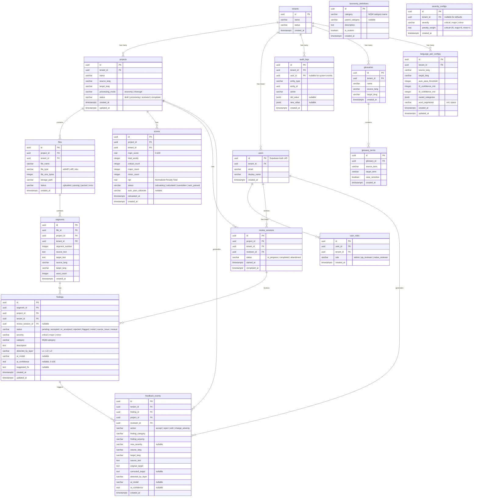

# Core Architectural Decisions

### Decision Priority Analysis

**Critical Decisions (Block Implementation):**
- Data schema design pattern (Drizzle-first + SQL for RLS)
- RBAC implementation (Hybrid JWT + DB with M3 read/write split)
- 3-Layer Pipeline orchestration (3-tier Inngest pattern)
- Score recalculation atomicity (Event-driven via Inngest serial queue)
- Immutable audit log mechanism (App-level + Write-only RLS + DB trigger)
- RLS enforcement strategy (Enforce critical tables from Day 1)

**Important Decisions (Shape Architecture):**
- API patterns (Server Actions + Route Handlers hybrid)
- State management (Zustand domain stores)
- RSC/Client component boundaries (Feature-based)
- CI/CD pipeline (GitHub Actions quality gate + Vercel deploy)
- Monitoring stack (Vercel Analytics + Better Stack)

**Deferred Decisions (Post-MVP):**
- Redis caching (upgrade from Next.js cache if performance gate fails)
- Better Stack Logs (upgrade from Vercel Logs for long retention)
- Storybook (optional for design system components)

---

### Category 1: Data Architecture

#### 1.1 Schema Design Pattern

- **Decision:** Drizzle Schema-first + SQL migrations for RLS
- **Rationale:** TypeScript schemas as single source of truth (version controlled, type-safe), RLS policies + triggers as custom SQL migrations (also version controlled)
- **Affects:** All data models, migrations, RLS policies

**Folder Structure:**
```
src/db/
  schema/        ← Drizzle TS schemas
  migrations/    ← drizzle-kit generated + custom SQL (RLS, triggers)
```

#### 1.2 Data Validation Strategy

- **Decision:** Drizzle-Zod + custom Zod extensions
- **Rationale:** `drizzle-zod` generates base schemas from DB → extend with custom Zod for form/API validation
- **Constraint:** Flow must be unidirectional: `drizzle schema → drizzle-zod → extend` (no circular dependencies)
- **Affects:** All API inputs, form validation, DB inserts

#### 1.3 Caching Strategy

- **Decision:** Next.js `"use cache"` directive (stable in Next.js 16) + `cacheTag` / `cacheLife` APIs + Supabase connection pooling (MVP) → Upstash Redis if needed (Growth)
- **Rationale:** Next.js 16 promoted the `"use cache"` directive to stable, replacing the legacy `unstable_cache`. MVP doesn't need shared cross-instance cache; Supabase Supavisor handles DB connections.
- **Escape Hatch:** If performance gate fails (P95 > 2s rule layer), upgrade to Upstash Redis
- **Migration Note:** If `"use cache"` API changes between Next.js releases, the caching layer is isolated in `src/lib/cache/` — swap implementation without touching feature code.

**Rule Layer Hot Data Caching:**

| Data | Cache Strategy | TTL | Invalidation |
|------|---------------|-----|-------------|
| Glossary terms | `"use cache"` + `cacheTag(`glossary-${projectId}`)` | `cacheLife("minutes")` (5 min) | `revalidateTag` on glossary mutation |
| Taxonomy config | `"use cache"` + `cacheTag(`taxonomy-${projectId}`)` | `cacheLife("minutes")` (10 min) | `revalidateTag` on config change |
| Language rules | In-memory static module | ∞ | Redeploy only |

**Cache Isolation Pattern:**
```typescript
// src/lib/cache/glossaryCache.ts
"use cache"
import { cacheTag, cacheLife } from "next/cache"

export async function getCachedGlossary(projectId: string) {
  cacheTag(`glossary-${projectId}`)
  cacheLife("minutes") // 5 min default
  return await db.select().from(glossaries).where(eq(glossaries.projectId, projectId))
}
```

**Pipeline Design:** Load cached data once per project run, reuse across all segments (not per-segment queries)

**Performance Gate:** Benchmark test must pass P95 < 2s (cold cache) before MVP ship

#### 1.4 Immutable Audit Log Mechanism (Handoff #5)

- **Decision:** Application-level audit entries + Write-only RLS + DB trigger (defense-in-depth)
- **Rationale:** Application code controls audit entry format and content (FR66 "application-level immutability"). Write-only RLS prevents accidental DELETE/UPDATE from the application. The DB trigger prevents DELETE/UPDATE even from the SQL Editor or admin console.
- **Affects:** audit_logs table, all state-changing operations
- **Constraint:** `service_role` key must be server-side only (Inngest functions + seed scripts)

**Defense-in-Depth Layers:**
1. Application code: only INSERT, never UPDATE/DELETE audit entries
2. RLS policy: INSERT only (blocks app-level DELETE/UPDATE)
3. DB trigger: RAISE EXCEPTION on DELETE/UPDATE (blocks admin-level)

**Index Strategy (must be defined at schema creation):**
- Composite index: `(tenant_id, created_at)`
- Composite index: `(entity_type, entity_id)`
- Consider monthly table partitioning for long-term scalability

#### 1.5 RLS Enforcement Strategy (Handoff #4)

- **Decision:** Enforce RLS on critical tables from Day 1, defer reference tables
- **Rationale:** Stronger than PRD minimum ("write but not enforce") — critical tenant data must be isolated from Day 1

**Table Classification:**

| Enforce RLS (MVP) | No RLS Needed (MVP) |
|---|---|
| projects, files, segments, findings, scores, audit_logs, glossaries, review_sessions | taxonomy_definitions, severity_configs (shared reference data) |

**Mandatory Test Suite (CI Gate):**
- Cross-tenant leak tests: Tenant A must NOT see Tenant B data
- Negative tests with different JWT claims (tenant_id)
- RLS tests must pass before every merge

**Helper Pattern:** Use the `withTenant(query, tenantId)` Drizzle helper for consistent tenant filtering.

#### 1.6 SDLXLIFF Parser Memory Strategy (Handoff #6)

- **Decision:** DOM parsing (full parse) with **15MB file size guard** (hard limit)
- **Rationale:** SDLXLIFF files typically range from 5-15MB (about 100K words). The DOM approach simplifies segment extraction and namespace handling. Memory budget analysis:
- **Affects:** File upload endpoint, parser module

**Memory Budget Analysis (Vercel Serverless — 1024MB limit):**

| Component | Estimated Memory | Notes |
|-----------|:---------------:|-------|
| Node.js runtime + Next.js framework | ~150–200MB | Base overhead before any app code |
| Drizzle ORM + connection pool | ~30–50MB | DB driver and query builder |
| fast-xml-parser DOM (15MB file) | ~90–150MB | 6–10x overhead for complex SDLXLIFF with namespaces, CDATA, attributes |
| Segment extraction + processing | ~30–50MB | Extracted segments, metadata objects |
| **Total estimated peak** | **~300–450MB** | Leaves 574–724MB headroom |

**Why 15MB, not 30MB:**
- fast-xml-parser with `preserveOrder`, namespace handling, and CDATA sections can reach 6–10x memory overhead (not 4x)
- Concurrent requests on the same function instance share memory — a second request during parsing would OOM at 30MB
- 15MB covers 99%+ of real-world SDLXLIFF files (100K words ≈ 8–12MB)
- Files > 15MB should be split by the translator in Trados before export

**Guard Implementation:**
```typescript
const MAX_FILE_SIZE_BYTES = 15 * 1024 * 1024 // 15MB hard limit
// Reject at upload endpoint BEFORE reading file into memory
```

**Escape Hatch (Growth):** If users need > 15MB files, implement SAX streaming parser (fast-xml-parser `XMLParser` with streaming mode) as an alternative code path.

#### 1.7 Migration Strategy

- **Decision:** Drizzle Kit generate + migrate (SQL files in version control)
- **Rationale:** Reproducible migrations, version controlled, auditable
- **Command:** `drizzle-kit generate` → SQL files → `drizzle-kit migrate` to apply

#### 1.8 Backup, Disaster Recovery & Data Retention

- **Decision:** Supabase PITR (Point-in-Time Recovery) + automated daily logical backups + audit log retention policy
- **Rationale:** Immutable audit logs and multi-tenant data require formal backup, recovery, and retention strategies. GDPR Article 17 (right to erasure) requires tenant data deletion capability.
- **Affects:** All data tables, operational procedures, compliance

**Backup Strategy:**

| Layer | Method | Frequency | Retention |
|-------|--------|-----------|-----------|
| Full DB | Supabase automatic backups (Pro plan) | Daily | 7 days (Pro), 14 days (Team) |
| Point-in-Time Recovery | Supabase PITR (Pro plan) | Continuous WAL | 7-day window |
| Logical export | `pg_dump` via scheduled GitHub Action | Weekly | 30 days in Supabase Storage (encrypted) |
| Uploaded files | Supabase Storage (redundant) | Real-time | Retained with project lifecycle |

**Disaster Recovery:**

| Metric | Target | Method |
|--------|--------|--------|
| RPO (Recovery Point Objective) | < 1 hour | PITR continuous WAL archiving |
| RTO (Recovery Time Objective) | < 4 hours | Supabase restore + Vercel redeploy |
| Failover | Manual | Supabase dashboard restore → Vercel env update → redeploy |

**Audit Log Retention Policy:**

| Period | Strategy | Implementation |
|--------|----------|---------------|
| 0–12 months | Hot storage (main table) | Direct queries, full performance |
| 12–36 months | Warm storage (partitioned) | Monthly partitioned tables (`audit_logs_2026_01`, etc.) |
| 36+ months | Cold export | Scheduled `pg_dump` of old partitions → Supabase Storage (compressed) → DROP partition |

**Partition Implementation:**
```sql
-- Create partitioned audit_logs table
CREATE TABLE audit_logs (
  id uuid DEFAULT gen_random_uuid(),
  tenant_id uuid NOT NULL,
  created_at timestamptz NOT NULL DEFAULT now(),
  -- ... other columns
) PARTITION BY RANGE (created_at);

-- Create monthly partitions (automated via scheduled Inngest function)
CREATE TABLE audit_logs_2026_02 PARTITION OF audit_logs
  FOR VALUES FROM ('2026-02-01') TO ('2026-03-01');
```

**Tenant Data Deletion (GDPR Article 17):**
- Soft delete: set `tenant.status = 'deleted'`, RLS blocks all queries for that tenant_id
- Hard delete (30-day grace period): scheduled Inngest function cascades DELETE across all tenant tables
- Audit log exception: audit entries anonymized (replace user identifiers with `'[REDACTED]'`) but not deleted — compliance requires audit trail retention
- Export before deletion: tenant admin can export all data via dashboard before deletion

#### 1.9 Entity-Relationship Diagram (ERD)

- **Decision:** Formal ERD with cardinality, foreign keys, and tenant scoping documented here (not deferred)
- **Rationale:** 15+ tables with multi-tenant isolation and cross-entity audit trails require explicit relationship documentation to prevent implementation inconsistencies
- **Affects:** All schema files, RLS policies, query patterns

**ERD (Mermaid notation):**



**Key Relationships & Cardinality:**

| Relationship | Cardinality | FK Column | Cascade |
|-------------|:-----------:|-----------|---------|
| tenant → projects | 1:N | `projects.tenant_id` | RESTRICT (no orphan projects) |
| tenant → users | 1:N | `users.tenant_id` | RESTRICT |
| project → files | 1:N | `files.project_id` | CASCADE (delete project → delete files) |
| file → segments | 1:N | `segments.file_id` | CASCADE |
| segment → findings | 1:N | `findings.segment_id` | CASCADE |
| project → scores | 1:N | `scores.project_id` | CASCADE |
| project → review_sessions | 1:N | `review_sessions.project_id` | CASCADE |
| finding → feedback_events | 1:N | `feedback_events.finding_id` | SET NULL (preserve training data) |
| glossary → glossary_terms | 1:N | `glossary_terms.glossary_id` | CASCADE |
| tenant → audit_logs | 1:N | `audit_logs.tenant_id` | RESTRICT (never delete audit) |

**Tenant Scoping Rule:** Every table except `taxonomy_definitions` (shared reference data) has a `tenant_id` column. All queries must include tenant filter via `withTenant()` helper or RLS policy.

---

### Category 2: Authentication & Security

#### 2.1 RBAC Implementation Pattern

- **Decision:** Hybrid JWT claims + DB table with M3 read/write split
- **Rationale:** Fast reads from JWT for UI/RLS, accurate writes from DB lookup for security-critical operations

**M3 Pattern (Read/Write Split):**

| Operation Type | Trust Source | Rationale |
|---------------|-------------|-----------|
| Read (view data, UI guards) | JWT `app_metadata` claims | Fast, no DB query |
| Write (mutations, approve, delete) | `user_roles` DB table query | Accurate, no sync gap |

**Role Sync & JWT Lifecycle:**

The `user_roles` table serves as the source of truth. The Supabase Admin API writes updated claims to `app_metadata`. The client-side Realtime subscription detects the change and refreshes the JWT.

| Parameter | Value | Rationale |
|-----------|-------|-----------|
| JWT expiry (`jwt_expiry` in Supabase) | **15 minutes** | Limits stale-claim window; Supabase auto-refreshes silently |
| Client Realtime subscription | `user_roles` table changes for `auth.uid()` | Triggers immediate `supabase.auth.refreshSession()` on role change |
| Fallback poll | Every 5 minutes | If Realtime subscription drops, periodic refresh catches stale claims |
| Max stale window | **15 minutes worst case** | JWT expires naturally even if Realtime + poll both fail |

**Stale JWT UI Mitigation (TOCTOU):**
- When Realtime detects role change → force JWT refresh → Zustand `useUIStore` re-evaluates navigation guards
- If JWT refresh reveals role downgrade → toast notification ("Your permissions have been updated") + hide now-unauthorized UI elements
- **Sensitive data**: Admin-only data (user management, tenant settings) is fetched via Server Actions that perform M3 DB lookup — stale JWT only affects UI visibility, never data access
- **No information disclosure**: Admin routes use Server Component data fetching (DB-verified role), not client-side conditional rendering based on JWT claims alone

**Security Test Scenarios (CI Gate):**

| # | Attack Scenario | Expected Behavior |
|---|----------------|-------------------|
| S1 | Admin removes user role → user has old JWT → attempts write | BLOCKED by DB lookup (M3) |
| S2 | User tampers JWT claims | BLOCKED by Supabase signature verification |
| S3 | Tenant A admin assigns role in Tenant B | BLOCKED by user_roles RLS (tenant_id) |
| S4 | Rate limit bypass via multiple tokens | BLOCKED by rate limiting per user_id |
| S5 | Stale JWT → user sees admin page → clicks admin action | BLOCKED by M3 DB lookup; if page was SSR, data already filtered by server-side role check |

#### 2.2 API Security Middleware Pattern

- **Decision:** Edge Middleware (auth check) + Server-side helper (role check)
- **Rationale:** Defense-in-depth — the Edge layer catches unauthenticated requests early, while the server layer handles fine-grained RBAC

**Flow:**
```
Edge Middleware (runs at Edge Runtime):
  1. Read session cookie → verify JWT valid
  2. Extract tenant_id from JWT
  3. No session → redirect /login
  4. Tenant mismatch → 403
  5. Pass through to server

Server Helper (requireRole):
  1. Read JWT claims → check role (reads)
  2. Write operations → query user_roles DB (M3)
  3. Insufficient role → throw 403
```

**Rate Limiting:**

Edge Functions are stateless and distributed — in-memory counters do NOT work (reset on cold start, not shared across edge nodes).

| Approach | MVP | Growth |
|----------|-----|--------|
| **Implementation** | Upstash Redis (`@upstash/ratelimit`) | Vercel WAF rate limiting (if available on plan) |
| **Storage** | Upstash Redis free tier (10K requests/day) | Same or upgrade |
| **Algorithm** | Sliding window | Sliding window |
| **Key** | `user_id` (authenticated) or IP (unauthenticated) | Same |

**Rate Limit Configuration:**

| Endpoint Category | Limit | Window | Rationale |
|-------------------|:-----:|:------:|-----------|
| API mutations (Server Actions) | 100 req | 1 min | Prevent rapid automated abuse |
| File upload | 10 req | 1 min | Prevent storage abuse |
| AI pipeline trigger | 5 req | 1 min | Prevent cost abuse |
| Auth endpoints (login/signup) | 10 req | 15 min | Brute-force protection |
| Read endpoints | 300 req | 1 min | Generous for UI interactivity |

**Implementation:**
```typescript
// src/middleware.ts
import { Ratelimit } from "@upstash/ratelimit"
import { Redis } from "@upstash/redis"

const ratelimit = new Ratelimit({
  redis: Redis.fromEnv(),
  limiter: Ratelimit.slidingWindow(100, "1 m"),
  prefix: "rl",
})
```

**Env vars required:** `UPSTASH_REDIS_REST_URL`, `UPSTASH_REDIS_REST_TOKEN` (added to `.env.example`)

#### 2.3 AI Version Pinning vs Fallback (Handoff #1)

- **Decision:** Pinned version first → fallback with audit flag
- **Rationale:** Don't block processing, but always audit which version was actually used
- **Priority Order:** `pinned version → latest same provider → next provider (all flagged in audit)`
- **Admin Notification:** Alert when pinned version becomes unavailable

**Chaos Testing (Handoff #8):** Weekly scheduled CI run + manual trigger before releases — mock provider failure → verify fallback chain + audit log entries (R31)

---

### Category 3: API & Communication Patterns

#### 3.1 API Pattern

- **Decision:** Server Actions for UI mutations + Route Handlers for external integrations
- **Rationale:** Best of both — type-safe UI mutations with Server Actions, proper endpoints for webhooks/external APIs

**Boundary Rules:**

| Use Server Actions | Use Route Handlers |
|---|---|
| UI form submissions | Inngest serve endpoint (`/api/inngest`) |
| Review actions (accept/reject) | Supabase auth webhooks |
| Glossary CRUD | File upload with progress |
| Score override | Health check endpoint (`/api/health`) |
| Project settings | External API integrations (future) |

**Organization:** Server Actions co-located in feature folders (`src/features/{feature}/actions/`)

#### 3.2 Error Handling Standard

- **Decision:** Hybrid — structured returns for Server Actions + Error Boundaries for unexpected errors
- **Rationale:** Predictable UI error handling + safe catch-all for unexpected failures

**Standardized Return Type:**
```typescript
type ActionResult<T> =
  | { success: true; data: T }
  | { success: false; error: string; code: string }
```

All Server Actions must return this type — no exceptions.

**Audit trail errors must never silently fail** → throw + alert

#### 3.3 AI Pipeline Orchestration (Inngest)

- **Decision:** 3-tier pattern: Orchestrator → Batch Workers → Per-segment layer pipeline
- **Rationale:** Parallel segment processing + sequential layer execution + layer-level retry + Inngest concurrency limit compliance

**Pipeline Flow:**
```
1. Orchestrator:
   a. Read project config (Economy/Thorough mode)
   b. Group segments by language pair (FR13 counter accuracy)
   c. Batch segments (20/batch for concurrency limits)
   d. Fan-out batches via step.invoke()

2. Batch Worker (per batch):
   a. Per segment: L1 (rules) → L2 (AI screening) → L3 (deep AI, if Thorough)
   b. Each layer = separate step.run() with deterministic ID
   c. Layer-level retry on failure (R13 idempotency)

3. Aggregation:
   a. Per language pair: calculate finding counters (FR13)
   b. All pairs: calculate final MQM score (atomic operation)
   c. Emit score.calculated event → Supabase Realtime push
```

**Idempotency:** Every Inngest step must have deterministic ID: `step.run("segment-{id}-L{layer}", ...)`

**Economy vs Thorough:** Orchestrator reads project config → Thorough mode includes L3 batches, Economy skips

#### 3.4 Score Recalculation Atomicity (Handoff #2)

- **Decision:** Event-driven recalculation via Inngest serial queue
- **Rationale:** Finding change emits event → Inngest processes serially per project (no race conditions) → Supabase Realtime pushes updated score

**Implementation:**
```typescript
inngest.createFunction(
  {
    id: "recalculate-score",
    concurrency: { key: "event.data.projectId", limit: 1 }
  },
  { event: "finding.changed" },
  async ({ step }) => { /* recalculate MQM score */ }
)
```

**Client-side debounce:** 500ms debounce on finding changes to reduce event volume during rapid reviewer edits

**Score Transition UX (preventing stale-score decisions):**

| Phase | Score Display | User Can Approve? | Duration |
|-------|-------------|:-----------------:|----------|
| 1. Finding changed | Previous score shown (dimmed) + "Recalculating..." badge | **NO** — approve button disabled | 0–500ms (debounce) |
| 2. Event emitted | "Recalculating..." badge (animated) | **NO** — approve button disabled | ~1–2s (Inngest processing) |
| 3. Realtime push | New score displayed (highlighted briefly) | **YES** — approve button re-enabled | Instant |

**Critical rule:** The "Approve/Auto-pass" action MUST check `scores.status = 'calculated'` server-side. If status is `'calculating'`, the Server Action returns `{ success: false, code: 'SCORE_STALE' }` and the UI shows "Please wait for score recalculation to complete."

**Concurrent recalculation:** If a reviewer changes finding A (triggers recalc), waits 600ms, then changes finding B (triggers second recalc) — Inngest serial queue (`concurrency: { key: projectId, limit: 1 }`) ensures the second recalc waits for the first to finish. The UI stays in "Recalculating..." until the final score arrives via Realtime.

#### 3.5 AI Model Selection per Pipeline Layer

- **Decision:** Layer-specific model assignment with fallback chain
- **Rationale:** Research (AI/LLM Translation QA Research) confirms multi-model strategy is optimal — cheap models for screening, premium models for deep analysis. CJK+Thai quality varies significantly across providers.
- **Source:** Research comparison matrix (Section 1.5) — Claude Sonnet 9/10 Thai, GPT-4o 8/10, Gemini Flash 7/10

**Model Assignment:**

| Layer | Primary Model | Rationale | Fallback |
|-------|--------------|-----------|----------|
| L1 (Rules) | No LLM | Pure rule-based, zero cost | — |
| L2 (AI Screening) | GPT-4o-mini | Cheapest ($0.15/1M input), structured output 9/10, sufficient for screening | Gemini 2.0 Flash ($0.10/1M) |
| L3 (Deep AI) | Claude Sonnet | Best semantic (10/10), Thai (9/10), tone/register (10/10), cultural (9/10) | GPT-4o ($2.50/1M, 9/10 CJK) |

**Cost Estimates per 100K Words:**

*AI API Variable Cost (per-run, scales with volume):*

| Mode | L2 Cost | L3 Cost | AI Total |
|------|---------|---------|----------|
| Economy (L1+L2) | ~$0.40 | — | ~$0.40 |
| Thorough (L1+L2+L3) | ~$0.40 | ~$2.00 | ~$2.40 |

*Infrastructure Fixed Cost (monthly, amortized per 100K words at 500K words/month):*

| Service | Plan | Monthly Cost | Per 100K Words |
|---------|------|:------------:|:--------------:|
| Vercel Pro | Pro | $20/mo | ~$4.00 |
| Supabase | Pro | $25/mo | ~$5.00 |
| Inngest | Free → Pro | $0–$50/mo | ~$0–$10.00 |
| Upstash Redis (rate limiting) | Free | $0/mo | $0 |
| Better Stack | Free | $0/mo | $0 |
| **Infrastructure subtotal** | | **$45–$95/mo** | **~$9–$19** |

*Total Cost per 100K Words (at 500K words/month volume):*

| Mode | AI Cost | Infra (amortized) | **Total** |
|------|---------|:-----------------:|:---------:|
| Economy | ~$0.40 | ~$9–$19 | **~$9.40–$19.40** |
| Thorough | ~$2.40 | ~$9–$19 | **~$11.40–$21.40** |

**Important:** Infrastructure cost is fixed — at higher volumes (2M+ words/month), amortized cost drops to ~$2–$5 per 100K words. At low volumes (50K words/month), it rises to ~$90–$190 per 100K words. **AI API cost scales linearly; infrastructure cost is fixed overhead.**

**Break-even vs manual QA:** Human QA costs $150–300 per 100K words. The tool breaks even at any volume where amortized total < $150 — roughly **>30K words/month at Economy mode.**

**Provider Configuration (in `src/lib/ai/providers.ts`):**
```typescript
export const LAYER_MODELS = {
  L2: {
    primary: { provider: 'openai', model: 'gpt-4o-mini' },
    fallback: { provider: 'google', model: 'gemini-2.0-flash' },
  },
  L3: {
    primary: { provider: 'anthropic', model: 'claude-sonnet-4-5-20250929' },
    fallback: { provider: 'openai', model: 'gpt-4o' },
  },
} as const
```

**Version Pinning (per Decision 2.3):** Each model entry includes pinned version. Fallback triggers audit flag per existing pattern.

**CJK+Thai Considerations:**
- Claude Sonnet excels at Thai nuance and register detection — must be L3 primary
- GPT-4o-mini adequate for L2 screening (catching obvious errors), not subtle cultural issues
- Gemini Flash has largest context window (1M tokens) but weakest Thai (7/10) — L2 fallback only

#### 3.6 Language-Pair Configuration

- **Decision:** Per-language-pair configuration table for thresholds and AI behavior
- **Rationale:** Research (Self-healing & AI/LLM QA) emphasizes CJK+Thai require different confidence thresholds and calibration than European languages. One-size-fits-all thresholds fail for nuanced languages.
- **Source:** Research recommendation #5 "Start with English→CJK+Thai and calibrate confidence thresholds per pair"

**Schema Design:**
```typescript
// src/db/schema/languagePairConfig.ts
export const languagePairConfigs = pgTable('language_pair_configs', {
  id: uuid('id').primaryKey().defaultRandom(),
  tenantId: uuid('tenant_id').notNull(),
  sourceLang: varchar('source_lang', { length: 10 }).notNull(),  // e.g., 'en'
  targetLang: varchar('target_lang', { length: 10 }).notNull(),  // e.g., 'th'
  autoPassThreshold: integer('auto_pass_threshold').default(95),  // MQM score threshold
  l2ConfidenceMin: integer('l2_confidence_min').default(70),      // min confidence to skip L3
  l3ConfidenceMin: integer('l3_confidence_min').default(80),      // min confidence for auto-accept
  mutedCategories: jsonb('muted_categories').default([]),          // MQM categories to suppress
  wordSegmenter: varchar('word_segmenter', { length: 20 }).default('intl'), // 'intl' | 'space'
  createdAt: timestamp('created_at', { withTimezone: true }).defaultNow(),
  updatedAt: timestamp('updated_at', { withTimezone: true }).defaultNow(),
})
```

**Default Configurations (PROVISIONAL — requires calibration):**

| Language Pair | Auto-pass | L2 Confidence Min | Word Segmenter | Notes |
|--------------|-----------|-------------------|----------------|-------|
| EN → TH | 93 | 75 | `intl` (Intl.Segmenter) | Thai has no spaces; lower auto-pass due to complexity |
| EN → JA | 93 | 75 | `intl` | Japanese mixed scripts need careful handling |
| EN → KO | 94 | 72 | `intl` | Korean spacing rules differ from English |
| EN → ZH-CN | 94 | 72 | `intl` | Simplified Chinese |
| EN → * (default) | 95 | 70 | `space` | European/Latin languages |

**Calibration Methodology & Status:**

These threshold values are **initial estimates** derived from:
1. **Research basis:** AI/LLM QA Research §1.5 — Claude Sonnet Thai 9/10, GPT-4o CJK 8-9/10, Gemini Flash Thai 7/10. CJK+Thai consistently score lower on automated detection accuracy → lower auto-pass prevents false approvals.
2. **Industry reference:** MQM auto-pass at 95 is standard for European languages (TAUS benchmark). CJK+Thai reduced by 1-2 points per research recommendation.
3. **Conservative stance:** All thresholds intentionally lean toward "more human review" rather than "more auto-pass." Wrong auto-pass is costlier than unnecessary review.

**These values are NOT production-validated.** They MUST be calibrated during MVP beta:

| Calibration Step | When | Method |
|-----------------|------|--------|
| 1. Baseline collection | First 2 weeks of beta | Run pipeline on 10+ real projects per language pair, record all scores |
| 2. False positive/negative analysis | After 500+ findings per pair | Compare auto-pass decisions vs reviewer overrides |
| 3. Threshold adjustment | After analysis | If >10% of auto-passed files get reviewer objections → lower threshold by 2 points |
| 4. Ongoing monitoring | Continuous | `feedback_events` table tracks accept/reject rates per language pair |

**Data source for calibration:** `feedback_events.action` + `language_pair_configs` → calculate per-pair accuracy:
```
Accuracy = accepted_findings / (accepted_findings + rejected_findings)
If accuracy < 85% for a pair → lower l2_confidence_min by 5
If auto_pass_override_rate > 10% → lower auto_pass_threshold by 2
```

**MVP Scope:** Ship with provisional defaults per table above. Admin UI for editing = Growth phase. Calibration adjustments applied via DB migration during beta.

#### 3.7 Neural QE Validation Layer (COMET-QE / xCOMET)

- **Decision:** MVP uses LLM-only evaluation (GEMBA approach). Growth phase adds COMET-QE/xCOMET as secondary neural validation layer.
- **Rationale:** Research confirms "Combination of LLM evaluation + neural metrics gives best results" (AI/LLM QA Research §2.3). However, COMET/xCOMET are Python libraries (Unbabel/COMET) — adding Python runtime to a Node.js/Vercel stack in MVP adds unnecessary infrastructure complexity. Growth phase has budget for a sidecar service.
- **Source:** Research §2.3 MT Evaluation Metrics — xCOMET ~75% F1 on MQM error detection, COMET-QE is best reference-free metric

**Why This Matters:**

| Metric | What It Does | MVP Gap It Fills |
|--------|-------------|-----------------|
| **COMET-QE** | Reference-free quality score (0-1) per segment | Cross-validates LLM confidence — catches cases where LLM is confident but wrong |
| **xCOMET** | Error spans + severity, MQM-compatible | Provides independent MQM annotations to compare against L2/L3 findings |

**Research Recommended Architecture (Tier 1.5):**
```
L1 (Rules) → L1.5 (COMET-QE fast score) → L2 (AI Screening) → L3 (Deep AI)
                    ↑
        If COMET-QE score > 0.85 → skip L2 (high quality, no AI needed)
        If COMET-QE score < 0.40 → flag for L3 directly (poor quality, skip L2)
```

The COMET-QE scoring layer acts as a smart router, saving AI costs by skipping L2 for clearly good or clearly bad segments.

**Growth Implementation Plan:**

| Option | Pros | Cons | Recommendation |
|--------|------|------|:-------------:|
| **A: Python microservice on Railway/Fly.io** | Full COMET/xCOMET access, GPU support | Separate service to maintain, cold starts | ⭐ Recommended |
| B: Supabase Edge Function (Deno) | Same infra, no new service | COMET not available in Deno, limited | ❌ Not feasible |
| C: ONNX-exported model in Node.js | No Python needed | Quality loss from export, large model | ❌ Too complex |

**Recommended Growth Architecture (Option A):**
```
┌──────────────────────────────────┐
│ Python Microservice (Railway)    │
│ - FastAPI + Unbabel/COMET        │
│ - POST /score  (COMET-QE)       │
│ - POST /annotate (xCOMET spans) │
│ - GPU: T4 (Railway, ~$0.50/hr)  │
└──────────────┬───────────────────┘
               │ HTTP
┌──────────────┴───────────────────┐
│ Next.js App (Vercel)             │
│ - Inngest step calls microservice│
│ - Results stored in findings     │
│ - Used for confidence calibration│
└──────────────────────────────────┘
```

**Integration with Existing Pipeline:**
```typescript
// Growth: Add as Inngest step in batch worker (after L1, before L2)
await step.run(`segment-${id}-comet-qe`, async () => {
  const cometScore = await fetch(COMET_SERVICE_URL + '/score', {
    method: 'POST',
    body: JSON.stringify({ source, target, sourceLang, targetLang }),
  }).then(r => r.json())

  // Smart routing based on COMET-QE score
  if (cometScore.score > 0.85) return { skipL2: true, reason: 'comet-high' }
  if (cometScore.score < 0.40) return { skipToL3: true, reason: 'comet-low' }
  return { continueL2: true, cometScore: cometScore.score }
})
```

**MVP Preparation (zero cost):**
- `feedback_events` table already captures AI model + confidence → use to benchmark COMET-QE accuracy later
- `language_pair_configs` table includes `l2ConfidenceMin` → extend with `cometQeThresholdHigh` / `cometQeThresholdLow` in Growth
- Log AI evaluation scores in structured format → enables direct comparison with COMET-QE when added

**Cost Impact (Growth):**

| Component | Per 100K Words | Notes |
|-----------|:--------------:|-------|
| COMET-QE scoring | ~$0.05 | Fast inference, GPU batch processing |
| xCOMET annotation | ~$0.15 | Heavier model, span-level output |
| **AI cost savings** | -$0.10 to -$0.30 | Smart routing skips L2 for clear segments |
| **Net impact** | ~$0.00 to -$0.10 | Roughly cost-neutral or slight savings |

---

### Category 4: Frontend Architecture

#### 4.1 State Management

- **Decision:** Zustand with domain-split stores
- **Rationale:** Lightweight (1KB), RSC-friendly (no Provider), simple API, sufficient for UI state when combined with Supabase Realtime for server state

**Store Boundaries:**

| Store | Responsibility | Example State |
|-------|---------------|--------------|
| `useReviewStore` | Review panel UI | activeSegmentId, filterState, selectedFindings |
| `usePipelineStore` | Pipeline progress | processingStatus, layerProgress, errors |
| `useUIStore` | Global UI | sidebarOpen, theme, activePanel |
| `useKeyboardStore` | Keyboard shortcuts (cross-feature) | shortcutsEnabled, activeContext, registered shortcuts |

**Rule:** 1 store per feature domain — no God Store

**Realtime Integration Pattern (unidirectional flow):**
```
Supabase Realtime → Zustand Store update → UI re-render
```

Custom hooks combine Zustand + Realtime subscriptions (e.g., `useRealtimeFindings`)

#### 4.2 RSC/Client Component Boundary Strategy

- **Decision:** Feature-based boundaries — Server Component wrapper for data, Client Component for interaction
- **Rationale:** Balance RSC benefits (small bundle, fast load) with rich interactivity where needed

**Boundary Map:**

| Feature | Default | Rationale |
|---------|---------|-----------|
| Review panel | 🔴 Client | Keyboard shortcuts, inline editing, 8 finding states, real-time |
| Dashboard | 🟢 Server + 🔴 Client charts | Data-heavy layout server-rendered, chart components client |
| Project list/detail | 🟢 Server | Data display, minimal interactivity |
| Settings/Config | 🟢 Server + 🔴 Client forms | Layout server, forms client |
| Glossary editor | 🔴 Client | Dynamic fields, real-time validation |

**Pattern:** Server Component fetches data → passes as props to Client Component entry point

**Loading UX:** Wrap every RSC boundary in `<Suspense fallback>` with a skeleton matching compact density (0.75x).

#### 4.3 Component Organization

- **Decision:** Feature-based co-location + shared components
- **Rationale:** Developers work within one folder per feature; shared UI components in centralized location

**Project Structure:**
```
src/
  components/                    ← shared/global
    ui/                          ← shadcn base (16 components)
    layout/                      ← app shell, sidebar, header
  features/
    review/
      components/                ← ReviewPanel, FindingCard, SegmentViewer
      actions/                   ← Server Actions for review
      hooks/                     ← useReviewState, useKeyboardShortcuts
      stores/                    ← review.store.ts
    dashboard/
      components/                ← ScoreChart, TrendGraph
    pipeline/
      components/                ← PipelineStatus, ProgressIndicator
    glossary/
      components/                ← GlossaryEditor, TermList
  styles/
    tokens.css                   ← CSS custom properties (@theme for Tailwind v4)
    animations.css               ← shared transition/animation definitions
  lib/                           ← shared utilities (mqm-calculator, etc.)
  db/
    schema/                      ← Drizzle TS schemas
    migrations/                  ← SQL migrations
```

**Naming Convention:**

| Type | Pattern | Example |
|------|---------|---------|
| shadcn base | `src/components/ui/{name}.tsx` | `ui/button.tsx` |
| App layout | `src/components/layout/{name}.tsx` | `layout/app-sidebar.tsx` |
| Feature component | `src/features/{feature}/components/{Name}.tsx` | `review/components/FindingCard.tsx` |
| Feature hook | `src/features/{feature}/hooks/use{Name}.ts` | `review/hooks/useKeyboardShortcuts.ts` |
| Feature store | `src/features/{feature}/stores/{name}.store.ts` | `review/stores/review.store.ts` |
| Feature action | `src/features/{feature}/actions/{name}.action.ts` | `review/actions/updateFinding.action.ts` |
| Shared util | `src/lib/{name}.ts` | `lib/mqm-calculator.ts` |
| DB schema | `src/db/schema/{name}.ts` | `db/schema/findings.ts` |

#### 4.4 Form Handling

- **Decision:** Native HTML forms for simple cases + React Hook Form for complex cases + direct action calls for keyboard shortcuts
- **Rationale:** Match tool to complexity — don't over-engineer simple forms with RHF

| Form Type | Approach |
|-----------|----------|
| Page forms (login, project create, settings) | Native `<form>` + `useActionState` + Zod validation at Server Action |
| Inline editing (finding card, segment edit) | React Hook Form + Zod |
| Complex forms (glossary editor, taxonomy config) | React Hook Form + Zod + field arrays |
| Keyboard-driven actions (accept/reject via shortcut) | Direct Server Action call via Zustand (not a form) |

---

### Category 5: Infrastructure & Deployment

#### 5.0 Infrastructure Capacity & Service Tier Requirements

- **Decision:** Supabase Pro + Vercel Pro + Inngest Free (MVP), with defined upgrade triggers
- **Rationale:** The 50 concurrent users NFR requires specific service tiers — free tiers have connection and execution limits that would fail under load
- **Affects:** Budget, deployment configuration, scaling strategy

**Service Tier Requirements for 50 Concurrent Users:**

| Service | Required Plan | Key Limits | Why This Tier |
|---------|:------------:|------------|---------------|
| **Supabase** | Pro ($25/mo) | 200 concurrent DB connections (Supavisor), 8GB DB, 250GB bandwidth | Free tier: 50 connections max — each user may hold 2-3 connections (queries + Realtime), exhausted at ~20 users |
| **Vercel** | Pro ($20/mo) | 100 concurrent serverless executions, 10s max duration, 1024MB memory | Hobby: 10s timeout may fail for pipeline orchestration; Pro gives 60s |
| **Inngest** | Free (MVP) | 5K function runs/month, 5 concurrent | Free covers MVP beta; upgrade to Pro at >5K runs/month |
| **Upstash Redis** | Free | 10K commands/day | Rate limiting only — 50 users × 100 req/min = 5K/min peak; upgrade if sustained peak |

**Connection Pooling Configuration (Supabase Supavisor):**
```
# Supabase Dashboard → Settings → Database → Connection Pooling
Pool Mode: Transaction (recommended for serverless)
Pool Size: 15 (per-region)
# Drizzle connects via pooler URL (port 6543), not direct (port 5432)
```

**Load Testing Strategy (pre-launch):**

| Test | Tool | Pass Criteria |
|------|------|---------------|
| 50 concurrent dashboard loads | k6 or Artillery | P95 < 3s, 0 errors |
| 10 concurrent pipeline runs | k6 + Inngest Dev Server | All complete, no timeout |
| 50 concurrent Realtime subscriptions | Custom script via Supabase client | All receive updates within 2s |
| Sustained 100 req/min for 10 min | k6 | P99 < 5s, <1% error rate |

**Upgrade Triggers:**

| Metric | Threshold | Action |
|--------|-----------|--------|
| DB connections saturation | >80% pool utilization sustained 5 min | Increase pool size or upgrade Supabase plan |
| Vercel function timeouts | >2% of invocations | Investigate + optimize or upgrade plan |
| Inngest monthly runs | >4K (80% of 5K free limit) | Upgrade to Inngest Pro |
| Upstash daily commands | >8K (80% of 10K free limit) | Upgrade to Upstash Pay-as-you-go |

#### 5.1 CI/CD Pipeline

- **Decision:** GitHub Actions (quality gate) + Vercel Git Integration (deploy)
- **Rationale:** GH Actions for automated quality checks, Vercel for deploy + preview URLs

**CI Pipeline:**
```yaml
# quality-gate (every PR)
jobs:
  quality:
    steps:
      - lint (ESLint + Prettier)
      - type-check (tsc --noEmit)
      - unit-test (Vitest)
      - rls-test (Supabase local CLI)
      - build (next build — catches RSC boundary errors)

# e2e-gate (merge to main only)
jobs:
  e2e:
    steps:
      - playwright (4 critical path tests)

# chaos-test (weekly scheduled + manual trigger)
jobs:
  chaos:
    steps:
      - ai-fallback-chaos (mock provider failure → verify fallback + audit)
```

**Supabase in CI:** `supabase/setup-cli@v1` → `supabase start` → run RLS tests against local instance (never production)

**Critical Path E2E Tests:**

| # | Test | Coverage |
|---|------|----------|
| E1 | Upload SDLXLIFF → see segments | File parsing pipeline |
| E2 | Run QA → see findings + score | Full 3-layer pipeline |
| E3 | Accept/reject finding → score recalculate | Review workflow + atomicity |
| E4 | Login → see only own tenant data | Auth + multi-tenancy |

#### 5.2 Uptime Monitoring (Handoff #7)

- **Decision:** Vercel Analytics (performance) + Better Stack (uptime + status page)
- **Rationale:** Free tiers sufficient for MVP; 99.5% uptime = ≤ 3.65 hrs downtime/month → must detect within 3-5 minutes

**Better Stack Monitors (5 free):**

| # | Monitor | Check |
|---|---------|-------|
| 1 | Homepage | `GET /` |
| 2 | API Health | `GET /api/health` (DB + Auth + Inngest) |
| 3 | Inngest Endpoint | `POST /api/inngest` health |
| 4 | Supabase | Project URL |
| 5 | (Reserved for Growth) | — |

**Health Endpoint:** `/api/health` checks DB connection + Supabase Auth + Inngest reachability. Must include `Cache-Control: no-store` header.

**Alert Escalation:**

| Level | Condition | Channel |
|-------|-----------|---------|
| ⚠️ Warning | Down > 3 min (1 fail) | Slack |
| 🔴 Critical | Down > 9 min (3 consecutive fails) | Slack + Email + SMS |
| ✅ Recovery | Back up | Slack |

#### 5.3 Environment Configuration

- **Decision:** Vercel Environment Variables + `.env.local` + `vercel env pull`
- **Rationale:** Secrets in Vercel Dashboard only (never in repo), `vercel env pull` for local sync

**`.env.example` (committed to repo):**
```bash
NEXT_PUBLIC_SUPABASE_URL=       # Supabase project URL
NEXT_PUBLIC_SUPABASE_ANON_KEY=  # Supabase anon/public key (client-safe)
SUPABASE_SERVICE_ROLE_KEY=      # Server-only: Supabase service role
INNGEST_EVENT_KEY=              # Inngest event key
INNGEST_SIGNING_KEY=            # Inngest webhook signing
OPENAI_API_KEY=                 # Primary AI provider
ANTHROPIC_API_KEY=              # Fallback AI provider
UPSTASH_REDIS_REST_URL=         # Upstash Redis for rate limiting (Edge-compatible)
UPSTASH_REDIS_REST_TOKEN=       # Upstash Redis auth token
```

**Convention:** `NEXT_PUBLIC_` prefix = exposed to client browser; no prefix = server-only

#### 5.4 Logging Strategy

- **Decision:** pino structured JSON logging (Node.js runtime) → Vercel Logs (MVP) → Better Stack Logs (Growth)
- **Rationale:** Structured logging from Day 1 avoids format refactoring later; Vercel Logs free for MVP

**Runtime Constraint:** pino for Server Components + Route Handlers + Inngest functions (Node.js runtime). Edge Middleware requires a separate structured logging approach because pino depends on Node.js APIs unavailable in the Edge Runtime.

**Edge Middleware Structured Logging:**

Edge Middleware handles auth, tenant verification, and rate limiting — the most security-critical code path. Unstructured `console.log` is unacceptable for this path.

```typescript
// src/lib/logger-edge.ts — Edge-compatible structured logger
type LogLevel = 'info' | 'warn' | 'error'

interface EdgeLogEntry {
  level: LogLevel
  msg: string
  timestamp: string
  [key: string]: unknown
}

function edgeLog(level: LogLevel, msg: string, data?: Record<string, unknown>) {
  const entry: EdgeLogEntry = {
    level,
    msg,
    timestamp: new Date().toISOString(),
    ...data,
  }
  // Vercel Logs captures console output — structured JSON ensures parseability
  console[level === 'error' ? 'error' : level === 'warn' ? 'warn' : 'log'](
    JSON.stringify(entry)
  )
}

export const edgeLogger = {
  info: (msg: string, data?: Record<string, unknown>) => edgeLog('info', msg, data),
  warn: (msg: string, data?: Record<string, unknown>) => edgeLog('warn', msg, data),
  error: (msg: string, data?: Record<string, unknown>) => edgeLog('error', msg, data),
}
```

**Usage in middleware.ts:**
```typescript
import { edgeLogger } from '@/lib/logger-edge'

// Instead of: console.log('Auth failed')
edgeLogger.warn('Auth failed', { userId, tenantId, reason: 'expired_jwt', ip: request.ip })
edgeLogger.error('Rate limit exceeded', { userId, endpoint: request.nextUrl.pathname, limit: 100 })
```

**Rule:** All Edge Middleware logging MUST use `edgeLogger` — never raw `console.log`. This ensures security events (auth failure, rate limit, tenant mismatch) are searchable in Vercel Logs and alertable in Better Stack.

**AI Layer Log Fields (mandatory):**
```json
{
  "level": "info",
  "provider": "openai",
  "model": "gpt-4o-mini",
  "layer": "L2",
  "tokens_in": 1200,
  "tokens_out": 350,
  "estimated_cost_usd": 0.0023,
  "duration_ms": 1850,
  "segment_id": "seg-123",
  "project_id": "proj-456"
}
```

Token count + estimated cost per request enables Economy vs Thorough cost tracking per PRD requirements.

#### 5.5 Substring Fallback Logging (Handoff #3)

- **Decision:** Both audit log entry + structured pino log
- **Rationale:** The audit entry creates a compliance trail — when glossary matching operates in degraded mode, it affects score reliability. The structured log enables monitoring and alerting if degraded mode frequency exceeds the threshold.

#### 5.6 Glossary Matching Strategy for CJK/Thai (Research Spike 2026-02-15)

- **Decision:** Hybrid approach — substring search (`indexOf`) as primary + Intl.Segmenter boundary validation as secondary
- **Rationale:** Research spike (`research/intl-segmenter-cjk-thai-research-spike-2026-02-15.md`) found that `Intl.Segmenter` alone is insufficient for glossary matching because:
  1. **Compound words are split** — Thai: โรงพยาบาล → โรง+พยาบาล (4/10 terms affected). Chinese: ALL 4-char terms split (人工智能 → 人工+智能). Japanese: Kanji compounds split, Katakana preserved. Korean: Sino-Korean compounds split (인공지능 → 인공+지능), loan words intact.
  2. **Cross-engine inconsistency** — V8/JSC use ICU4C, Firefox uses ICU4X (Rust). Same text can produce different segment boundaries.
  3. **Context-dependent segmentation** — Same term can segment differently depending on surrounding text.
- **Implementation:**
  ```
  Pre-process: NFKC normalize text + glossary terms (halfwidth/fullwidth consistency)
  Pre-process: Strip inline markup/tags/placeholders before segmentation (XLIFF <x/>, HTML <b>, {0}, %s)
  Primary: substring search (indexOf) — deterministic, cross-engine safe
  Secondary: Intl.Segmenter boundary validation — confirms match aligns to word edges
  Fallback: if boundary validation fails, accept substring match with "Low confidence" flag
  ```
- **Intl.Segmenter valid uses:** Word counting (MQM NPT calculation), text highlighting at word boundaries, `isWordLike` filtering, boundary validation, Korean eojeol parsing (particle separation)
- **Performance:** ~0.017ms per segment call, 5,000 segments in <250ms. Cache Segmenter instances per locale.
- **Node.js requirement:** 18+ LTS with full ICU (small-icu will SEGFAULT)
- **NFKC normalization:** Required before segmentation — halfwidth katakana (ﾌﾟﾛｸﾞﾗﾐﾝｸﾞ) won't match fullwidth (プログラミング) without `text.normalize('NFKC')`
- **Markup pre-processing:** Strip inline tags/placeholders before segmentation, maintain character offset map for position translation back to original text
- **Text size guard:** Chunk at 30,000 chars to prevent stack overflow
- **Affects:** Story 1.5 (Glossary Matching Engine), Story 2.4 (Rule Engine glossary checks), FR43, FR44
- **Cross-ref:** Research spike document (updated with Korean section, NFKC, localization edge cases), Architecture Decision 5.5 (fallback logging)

---

### Decision Impact Analysis

**Implementation Sequence:**
1. Project initialization (starter template + dependencies)
2. DB schema + Drizzle config + RLS policies + audit trigger
3. Supabase Auth + RBAC (JWT claims + user_roles table)
4. Edge middleware + server-side auth helpers
5. Feature folder structure + component organization + design tokens
6. Server Actions + Route Handlers + error handling standard
7. Inngest pipeline orchestration (3-tier pattern)
8. Zustand stores + Realtime integration
9. CI/CD pipeline (GH Actions + Vercel)
10. Monitoring + logging setup

**Cross-Component Dependencies:**

| Decision | Depends On | Blocks |
|----------|-----------|--------|
| RLS policies (1.5) | Schema design (1.1) | Auth middleware (2.2), RLS tests (5.1) |
| RBAC M3 pattern (2.1) | Schema (1.1), Auth (Supabase) | Middleware (2.2), Server Actions (3.1) |
| Pipeline orchestration (3.3) | Inngest setup, AI SDK, Schema | Score recalculation (3.4), Monitoring (5.2) |
| Feature structure (4.3) | Starter template (Step 3) | All frontend components, stores, actions |
| CI pipeline (5.1) | All test strategies (R4, R26) | Deployment safety |

### Handoff Items Resolution Summary

| # | Handoff Item | Resolved In | Decision |
|---|-------------|-------------|----------|
| 1 | FR18/FR69 version pinning vs fallback | Decision 2.3 | Pinned first → fallback with audit flag |
| 2 | FR70 score recalculation atomicity | Decision 3.4 | Event-driven Inngest serial queue per project |
| 3 | FR72 substring fallback logging | Decision 5.5 | Both audit entry + structured log |
| 4 | RLS enforcement strategy | Decision 1.5 | Enforce critical tables from Day 1, defer reference |
| 5 | Immutable audit log mechanism | Decision 1.4 | App-level + Write-only RLS + DB trigger |
| 6 | SDLXLIFF parser memory strategy | Decision 1.6 | DOM with 15MB guard (memory budget analysis) |
| 7 | Uptime monitoring tool | Decision 5.2 | Vercel Analytics + Better Stack |
| 8 | AI fallback chaos testing | Decision 5.1 (R31) | Weekly scheduled CI + manual trigger |

### Party Mode Refinements Log

| # | Refinement | Source | Category |
|---|-----------|--------|----------|
| R1 | Audit log composite indexes + monthly partitioning | Amelia (Dev) | Data |
| R2 | Audit log DB trigger DELETE/UPDATE block | Murat (Test) | Data |
| R3 | Parser limit 50MB → 15MB (Vercel memory, 6-10x overhead analysis) | Amelia (Dev) | Data |
| R4 | RLS mandatory cross-tenant leak test suite in CI | Murat (Test) | Data |
| R5 | Rule layer hot data caching plan (`"use cache"` + `cacheTag`/`cacheLife`) | Mary (Analyst) | Data |
| R6 | RBAC M3 pattern: JWT reads, DB writes | Amelia (Dev) | Auth |
| R7 | Security test scenarios S1-S4 in test suite | Murat (Test) | Auth |
| R8 | Edge middleware rate limiting | Murat (Test) | Auth |
| R9 | AI fallback chaos test in CI | Murat (Test) | Auth |
| R10 | Server Actions in feature folders (revised from centralized) | Amelia (Dev) | API |
| R11 | Standardized ActionResult<T> return type | Amelia (Dev) | API |
| R12 | 3-tier Inngest pipeline (Orchestrator → Batch → Segment) | Amelia (Dev) | API |
| R13 | Deterministic Inngest step IDs for idempotency | Murat (Test) | API |
| R14 | Pipeline failure scenario test suite F1-F5 | Murat (Test) | API |
| R15 | Score recalculation client debounce 500ms | Murat (Test) | API |
| R16 | Pipeline orchestrator groups by language pair + reads mode config | Mary (Analyst) | API |
| R17 | Zustand domain stores + useKeyboardStore | Amelia + Sally | Frontend |
| R18 | Unidirectional Realtime → Store → UI flow | Amelia (Dev) | Frontend |
| R19 | Concrete RSC boundary map per feature | Amelia (Dev) | Frontend |
| R20 | Suspense fallback skeletons match compact density | Sally (UX) | Frontend |
| R21 | Standardized naming convention table | Amelia (Dev) | Frontend |
| R22 | Design tokens in src/styles/tokens.css + animations.css | Sally (UX) | Frontend |
| R23 | Keyboard-driven actions category (direct call, not form) | Sally (UX) | Frontend |
| R24 | Testing stack: Vitest + Testing Library + Playwright + ESLint RSC rule | Murat (Test) | Frontend |
| R25 | Supabase local CLI in GH Actions for RLS tests | Amelia (Dev) | Infra |
| R26 | Split quality-gate (every PR) + e2e-gate (main only) + 4 E2E tests | Murat (Test) | Infra |
| R27 | /api/health endpoint with Cache-Control: no-store | Amelia (Dev) | Infra |
| R28 | Better Stack 5 monitors + alert escalation config | Murat (Test) | Infra |
| R29 | pino Node.js only, `edgeLogger` structured JSON for Edge (not raw console.log) | Amelia (Dev) | Infra |
| R30 | AI layer must log token count + estimated cost | Mary (Analyst) | Infra |
| R31 | AI chaos test weekly scheduled (not every PR) | Mary (Analyst) | Infra |
| R32 | .env.example with all keys + descriptions | Amelia (Dev) | Infra |
| R33 | DB access: Drizzle only on server, Supabase client for Auth/Storage/Realtime | Amelia (Dev) | Patterns |
| R34 | Error pattern: try-catch in Server Actions, no try-catch in Inngest steps | Amelia (Dev) | Patterns |
| R35 | Env vars: centralized validated access via @/lib/env (Zod) | Amelia (Dev) | Patterns |
| R36 | Supabase client: 3 factories in src/lib/supabase/ (server, client, admin) | Amelia (Dev) | Patterns |
| R37 | TypeScript: strict + noUncheckedIndexedAccess + exactOptionalPropertyTypes | Amelia (Dev) | Patterns |
| R38 | Accessibility: mandatory aria-label, form labels, role/aria-live | Sally (UX) | Patterns |
| R39 | Responsive: Tailwind default breakpoints only, desktop-first | Sally (UX) | Patterns |
| R40 | Toast: sonner as sole notification library | Sally (UX) | Patterns |
| R41 | Test naming: describe/it with behavior description | Murat (Test) | Patterns |
| R42 | Test data: factory functions in src/test/factories.ts | Murat (Test) | Patterns |
| R43 | Test organization: co-located units, db/__tests__/rls/, e2e/, src/test/ | Murat (Test) | Patterns |
| R44 | Inngest client: src/lib/inngest/client.ts + function registry in features | Amelia (Dev) | Structure |
| R45 | Auth helpers: src/lib/auth/requireRole.ts + getCurrentUser.ts | Amelia (Dev) | Structure |
| R46 | DB connection: src/db/connection.ts separate from index | Amelia (Dev) | Structure |
| R47 | Feature-level validation folders in feature modules | Amelia (Dev) | Structure |
| R48 | Error boundaries: error.tsx in (app)/ + projects/[projectId]/ | Amelia (Dev) | Structure |
| R49 | 7 missing UX components + StatusBadge + ProgressRing + EmptyState (shared) | Sally (UX) | Structure |
| R50 | Mock organization: src/test/mocks/ with standardized mocks | Murat (Test) | Structure |
| R51 | Test fixtures: src/test/fixtures/ with segments, SDLXLIFF, glossary | Murat (Test) | Structure |
| R52 | Vitest workspace: separate unit (jsdom) and rls (node) projects | Murat (Test) | Structure |
| R53 | AI Model Selection per pipeline layer (L2: GPT-4o-mini, L3: Claude Sonnet) | Research Integration | API |
| R54 | Language-pair configuration table with per-language thresholds | Research Integration | Data |
| R55 | feedback_events table in MVP for Growth-phase ML training data | Research Integration | Data |
| R56 | Growth Architecture section: Self-healing pipeline, patterns, roadmap | Research Integration | Structure |
| R57 | COMET-QE/xCOMET neural QE validation layer (Decision 3.7, Growth) | Research Integration | API |
| R58 | Validation scope disclosure + prototype spike recommendation | Adversarial Review | Validation |
| R59 | Full ERD with Mermaid diagram, FKs, cardinality, cascade rules (Decision 1.9) | Adversarial Review | Data |
| R60 | Parser limit 30MB → 15MB with detailed memory budget analysis (6-10x overhead) | Adversarial Review | Data |
| R61 | `unstable_cache` → stable `"use cache"` directive + `cacheTag`/`cacheLife` | Adversarial Review | Data |
| R62 | Backup, DR, data retention, GDPR deletion strategy (Decision 1.8) | Adversarial Review | Data |
| R63 | JWT 15min expiry, Realtime role sync, stale-JWT UI mitigation, S5 test | Adversarial Review | Auth |
| R64 | Edge rate limiting: Upstash Redis (not in-memory) + per-endpoint limits | Adversarial Review | Auth |
| R65 | Language-pair thresholds labeled PROVISIONAL + calibration methodology | Adversarial Review | API |
| R66 | Score recalculation transition UX: approve button disabled during recalc | Adversarial Review | API |
| R67 | Cost estimates: full operational cost breakdown (infra + AI + amortized) | Adversarial Review | API |
| R68 | Infrastructure capacity analysis + service tier requirements (Decision 5.0) | Adversarial Review | Infra |
| R69 | Anti-pattern #3 clarified: SQL boundary (app code vs migrations/tests) | Adversarial Review | Patterns |
| R70 | Technology versions: verification commands + version lock strategy | Adversarial Review | Infra |
| R71 | Drizzle 0.x → 1.0 migration plan with risk/mitigation table | Adversarial Review | Infra |
| R72 | `edgeLogger` structured JSON for Edge Runtime (replaces raw console.log) | Adversarial Review | Infra |

