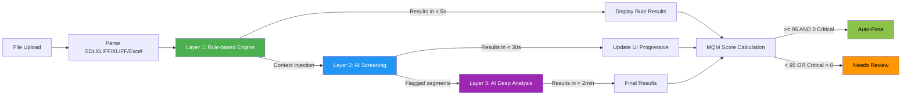

---
stepsCompleted:
  - step-01-init
  - step-01b-continue
  - step-02-discovery
  - step-03-success
  - step-04-journeys
  - step-05-domain
  - step-06-innovation
  - step-07-project-type
  - step-08-scoping
  - step-09-functional
  - step-10-nonfunctional
  - step-11-polish
  - step-12-complete
workflowStatus: 'COMPLETE'
completedAt: '2026-02-12'
classification:
  projectType: 'Internal Productivity Tool (MVP) → SaaS B2B (Long-term)'
  domain: 'Localization Technology / Translation QA'
  complexity: 'High'
  projectContext: 'Greenfield — Category Creator'
  goToMarket: 'Dogfooding → External'
  domainKnowledgeDependency: 'High — domain expertise from Mona/QA team required'
  strategicMoat: 'Data-driven quality moat — more usage = more accuracy'
inputDocuments:
  - _bmad-output/planning-artifacts/product-brief-qa-localization-tool-2026-02-11.md
  - _bmad-output/planning-artifacts/research/ai-llm-translation-qa-research-2025.md
  - _bmad-output/planning-artifacts/research/deployment-queue-infrastructure-research-2026-02-11.md
  - _bmad-output/planning-artifacts/research/technical-qa-localization-tools-and-frameworks-research-2026-02-11/index.md
  - _bmad-output/planning-artifacts/research/technical-rule-engine-3-layer-pipeline-research-2026-02-12/index.md
  - _bmad-output/planning-artifacts/research/technical-ai-llm-self-healing-translation-research-2026-02-14.md
  - _bmad-output/planning-artifacts/data-requirements-and-human-feedback-plan.md
  - docs/qa-localization-tool-plan.md
  - docs/QA _ Quality Cosmetic.md
documentCounts:
  briefs: 1
  research: 5
  planning: 1
  projectDocs: 2
workflowType: 'prd'
date: 2026-02-12
author: Mona
lastEdited: '2026-02-14'
editHistory:
  - date: '2026-02-14'
    changes: 'UX Party Mode backport: Added 4 new review actions (Note, Source Issue, Severity Override, Add Finding) with FR76-FR80; added 8 Finding States lifecycle (Pending→Accepted→Re-accepted→Rejected→Flagged→Noted→Source Issue→Manual); expanded FR30 Suppress Pattern with trigger/scope/duration detail from UX spec UJ6; enhanced FR56 Reviewer Selection for PM role with language-pair matching; updated Category 4 (7→12 items), Requirements Count (75→80), MVP Scope table, and roadmap accordingly'
  - date: '2026-02-14'
    changes: 'PM review: FR73-FR75 (rule-based auto-fix) moved from MVP to Growth scope. MVP focuses on detection (Xbench parity), not correction. Schema design (fix_suggestions, self_healing_config tables) remains in MVP for Growth readiness. Updated Sections 3, 6, 8, 9 accordingly'
  - date: '2026-02-14'
    changes: 'Self-healing Translation integration: updated anti-pattern L696 + AI constraint L657 to allow rule-based auto-fix and verified AI fixes; added FR73-FR75 (rule-based auto-fix, preview, tracking); added Innovation #6 Self-healing Translation; updated Growth scope (Shadow+Assisted Mode) and Vision scope (Autonomous Mode+RAG+Analytics); added validation/risk entries for Self-healing; cross-referenced Self-healing Translation Research and separate Self-healing PRD. Party Mode review fixes: reconciled kill criteria thresholds (< 60% deprioritize / 60-85% retune / > 85% gate), clarified auto-apply paradigm shift (Growth=human approval, Vision=auto-apply verified), aligned with Self-healing PRD'
  - date: '2026-02-12'
    changes: 'Validation-driven edits: fixed vague quantifiers, removed vendor names, added verification methods, added FR67 glossary notification, strengthened FR13/FR62, added Security rationale column, added 3-Layer Pipeline diagram'
  - date: '2026-02-12'
    changes: 'Party Mode adversarial review: FR8 added Xbench Parity Spec prerequisite, FR11 added MQM edge cases + score recalculation rules, FR13 clarified counter scope (per project per language pair), FR18 defined fallback triggers + cross-provider recalibration, FR30 changed >95 to >=configurable + rejected Criticals excluded, FR31 added transition logic (admin toggle per project), FR33 expanded Language Bridge display spec, FR41 added accuracy thresholds + research spike prerequisite, FR66 clarified immutability scope, NFR Scalability upgraded to paid tier, added FR70 (score lifecycle), FR71 (auto-pass rationale), FR72 (multi-token glossary matching)'
  - date: '2026-02-12'
    changes: 'PM review: added FR20 (retry AI) + FR21 (report missing check), added NFR30 (UI language English-only), renumbered all FRs to FR1-FR72 sequential (FR70→FR22, FR71→FR23, FR72→FR44), renumbered NFRs to NFR1-NFR42 sequential, updated all cross-references, added PM access note to RBAC, added MQM formula to FR11'
---

# Product Requirements Document - qa-localization-tool

**Author:** Mona
**Date:** 2026-02-12

## 1. Executive Summary

### Vision

An AI-powered standalone localization QA web application that eliminates the QA → Proofreader → QA review loop by combining deterministic rule-based checks (Xbench parity) with intelligent AI semantic analysis and confidence-based automation.

### Core Differentiator

**Single-Pass Completion** — The first tool that tells QA reviewers not just "what's wrong" but "what to look at and what to skip," enabling file approval in a single pass without proofreader involvement.

### Target Users

| Persona | Role | Key Need |
|---------|------|----------|
| **คุณแพร** | Senior QA Reviewer (5yr experience) | Trust the tool enough to stop using Xbench |
| **คุณนิด** | QA Reviewer (non-native languages) | Review ZH/JA/AR files without native proficiency via AI Language Bridge |
| **PM** | Project Manager | Self-service urgent file QA without waiting for QA team |

### Product Classification

- **Type:** Internal Productivity Tool (MVP) → SaaS B2B (Long-term)
- **Domain:** Localization Technology / Translation QA
- **Context:** Greenfield — Category Creator (first standalone AI-powered localization QA)
- **Strategic Moat:** Data-driven quality — more usage = more accuracy per language pair × domain

### Tech Stack

Next.js (App Router) + shadcn/ui + Tailwind CSS | Supabase (Auth, DB, Storage) | Inngest (Queue) | Vercel AI SDK (model-agnostic AI) | Vercel (Hosting)

## 2. Success Criteria

### Core Value Insight

**Single-Pass Completion** — The core value of this product is NOT speed or accuracy (those are table stakes). It is the **elimination of the QA → Proofreader → QA review loop**. The first time a QA Reviewer checks a file and it's "done" — without sending to a proofreader — that is the Aha! moment.

**Root Cause (5 Whys):** The proofreader loop exists because current tools lack intelligent prioritization. Every segment is treated equally, forcing reviewers to read everything "just in case." Our tool breaks this cycle by telling reviewers **what to look at and what to skip**.

### 5 Pillars of Single-Pass Completion

All 5 pillars must work together. If any one is missing, single-pass completion breaks down:

| # | Pillar | What It Does | If Missing |
|:-:|--------|-------------|------------|
| 1 | **Intelligent Prioritization** | Score tells which segments need attention | Still must read every segment → slow as before |
| 2 | **Severity-based Progressive Disclosure** | Critical first, Clean hidden | Information overload → don't know where to start |
| 3 | **Confidence-based Trust** | High = trust AI, Low = review yourself | Don't trust AI → cross-check with proofreader "just in case" |
| 4 | **Language-agnostic Semantic Check** | AI covers languages reviewer can't read | Non-native reviewers still need native reviewer → multi-pass |
| 5 | **Actionable Suggestions** | Not just "wrong" but "here's the fix" with confidence | Know it's wrong but can't fix → send to proofreader |

### User Success

**North Star Metric:** Time-to-Xbench-replacement — the day the team stops opening Xbench entirely.

| Metric | Target | Persona |
|--------|--------|---------|
| Proofreader elimination | Month 1: < 30% → Month 3: **0%** | คุณแพร |
| Review rounds per file | **≤ 1.2** average | คุณแพร |
| QA review time reduction | **-50%** per file | คุณแพร |
| Native reviewer dependency | **-70%** files needing native reviewer | คุณนิด |
| PM self-service rate | **≥ 40%** auto-pass without QA | PM |
| Time to first value | **< 5 minutes** from upload to results | All |
| Processing speed | Rule-based < 10s, Full < 3 min / 1000 segments | All |
| User satisfaction pulse | **≥ 4.0/5** monthly | All |

### Business Success

| Timeframe | Objective | Target |
|:---------:|-----------|--------|
| Month 1-3 | Dogfooding — QA team of 6-9 uses daily | ≥ 80% files through tool; proofreader → 0% by Month 3 |
| Month 3-6 | Xbench replacement (North Star) | Team stops using Xbench; auto-pass > 99%; false positive < 5% |
| Month 6-12 | Scale | Files/person/day **2-3x** baseline |
| Month 12+ | External readiness | Product-market fit metrics ready |

### Technical Success

| Metric | Target | Priority |
|--------|--------|:--------:|
| False positive rate | **< 5%** per language pair (audited) | Critical |
| False negative rate | **< 3%** | Critical |
| Auto-pass accuracy | **> 99%** (weekly blind audit) | Critical |
| Xbench parity | **100%** — rule-based catches everything Xbench catches | MVP Gate |
| Rule-based coverage | ≥ 80% of QA Cosmetic checklist | MVP Gate |
| Critical issue detection | **100%** — zero misses | Critical |

### Pillar Health Tracking

| Pillar | Metric | Target |
|--------|--------|--------|
| Prioritization | % segments correctly scored (high-risk flagged, clean passed) | > 95% |
| Progressive Disclosure | Clicks to reach critical issue from batch summary | ≤ 3 clicks |
| Confidence Trust | % high-confidence (>85%) suggestions actually correct | > 90% |
| Language Coverage | AI semantic accuracy per language pair | > 80% agreement with expert |
| Actionable Suggestions | % suggestions rated "helpful" by reviewer | > 70% |

### Measurable Outcomes

**Leading Indicators:** Adoption funnel completion (> 90%), AI suggestion accept rate per language pair, Time in tool decreasing 10%/month, Xbench cross-check decreasing weekly

**Lagging Indicators:** Client complaint rate < 1%, Files/person/day 2-3x, AI cost per file trending down

**Quality Gates (must pass before every release):** Xbench parity 100%, Regression test 100%, False positive stable, 0 new critical bugs, AI drift detection (accept rate change < 10%)

## 3. Product Scope

### MVP — Minimum Viable Product

**Core (required to prove single-pass completion):**
- 3-Layer QA Pipeline (Rule-based → AI Screening → Deep AI Analysis)
- SDLXLIFF + XLIFF 1.2 + Excel bilingual parsing (Trados Studio primary)
- Batch upload + batch summary ("7 auto-pass, 3 need review")
- Issue list + segment navigation + severity filter (progressive disclosure)
- AI suggestions with confidence scores + 7 review actions (Accept/Reject/Flag/Note/Source Issue/Severity Override/Add Finding)
- Bulk accept/reject for false positive fatigue reduction
- Auto-pass system (Score >= 95 + 0 Critical + AI Layer 2 clean) with audit trail
- Glossary import (TBX, CSV, Excel)
- Report export (PDF/Excel) + Smart report mode (verified vs needs-verification)
- Role-based access: Admin (full), QA Reviewer (review + export), Native Reviewer (assigned segments only)
- Economy/Thorough processing modes
- Supabase Auth + project management
- Model-agnostic AI via Vercel AI SDK
- Admin taxonomy mapping editor (QA Cosmetic ↔ MQM)
- Self-healing schema design only (fix_suggestions, self_healing_config tables with mode="disabled") — no auto-fix logic in MVP, schema prepared for Growth

### Growth Features (Phase 2 — Month 3-6)

- XLIFF 2.0 format support
- VP Dashboard — summary cards, quality trend chart, activity feed, export PDF/Excel
- Client feedback loop — ✅/❌ logging per file, feeds AI improvement
- Read-only / PM role + Client portal
- AI accuracy tracking per language pair
- Feedback loop visibility ("AI learned from your rejections")
- Additional formats: Bilingual Word, CSV
- **Rule-based Auto-fix** (FR73-FR75) — Deterministic auto-fix for tags, placeholders, numbers with preview and acceptance tracking. Moved from MVP: MVP focuses on detection, not correction
- **Self-healing Shadow Mode** — AI generates fix suggestions silently alongside QA findings; accuracy tracked but fixes not shown to users yet (calibration period). See Self-healing Translation PRD
- **Self-healing Assisted Mode** — AI fix suggestions displayed to reviewers with confidence scores; Accept/Modify/Reject actions feed learning loop. Requires Shadow Mode accuracy > 85% per language pair

### Vision (Phase 3+ — Month 6-12+)

- Public API + documentation → CI/CD, plugins, CLI
- Developer file formats (JSON, PO, Android XML, iOS .strings)
- External customers → multi-tenant, billing, trial
- PDF visual QA
- Data-driven quality moat → per-domain accuracy improvement
- Marketplace for custom QA rule sets
- **Self-healing Autonomous Mode** — High-confidence AI fixes auto-applied with Judge Agent verification (confidence > 95%, verified by independent Judge Agent). Progressive trust: per language pair × per fix category. See Self-healing Translation PRD
- **RAG-enhanced Fix Generation (Advanced)** — Advanced RAG with TM embeddings, cross-project learning, and fine-tuning preparation. Note: Basic RAG (glossary retrieval for fix context) starts in Growth Phase Shadow Mode — see Self-healing Translation PRD
- **Self-healing Analytics** — Fix acceptance rate, cost savings, time saved, accuracy trend per language pair

## 4. User Journeys

> **Note:** Journey 1-6 cover core QA workflow (MVP → Growth). Journey 7 (คุณแพร — "The Self-healing Day") covers Self-healing Assisted Mode and is documented in the [Self-healing Translation PRD](prd-self-healing-translation.md) Section 4.

### Journey 1: คุณแพร — "The Trust Test" (Onboarding, Week 1-2)

**Opening Scene:** คุณแพรเปิด browser เข้า tool ใหม่ที่ผู้บริหารบอกให้ลอง เธอเป็น QA Reviewer มา 5 ปี ใช้ Xbench ทุกวัน รู้จุดแข็งจุดอ่อนของมันหมด เธอคิดในใจว่า "ดูซิว่าจะดีกว่า Xbench จริงไหม"

**Rising Action:**
1. Login ด้วย Google → สร้าง Project → ตั้งชื่อ, เลือก language pair EN→TH, import glossary จากไฟล์ CSV ที่ใช้อยู่, ตั้ง auto-pass threshold ที่ 95
2. Upload ไฟล์ XLIFF ที่เพิ่ง QA ด้วย Xbench เมื่อเช้า — เธอจงใจเลือกไฟล์ที่รู้ว่ามีปัญหา เพราะอยากทดสอบ
3. Rule-based findings โผล่ขึ้นมาทันที — tags, placeholders, numbers, glossary terms
4. เธอเปิด Xbench report ข้างๆ เทียบทีละจุด: "อันนี้ Xbench จับได้... tool เราก็จับได้ ✅"
5. เทียบครบ — ไม่พลาดแม้แต่จุดเดียว → เธอเริ่มหายใจสบายขึ้น

**Climax:** AI findings เริ่มโผล่เข้ามา — segment #47 "แปลผิดความหมาย — ต้นฉบับพูดถึง 'bank account' แต่แปลเป็น 'ริมฝั่งแม่น้ำ'" confidence 94% พร้อม suggestion "บัญชีธนาคาร" — Xbench ไม่เคยจับ issue แบบนี้ได้ เธอกดเข้าไปดู segment ตรงนั้น กลับไปดูต้นฉบับ... "โอ้โห จริงด้วย!"

**Resolution:** สิ้นสัปดาห์ที่ 2 คุณแพรยังเปิด Xbench คู่กันอยู่ แต่เริ่มสังเกตว่าเธอแค่ glance ที่ Xbench แล้วปิด สัปดาห์ที่ 3 เธอไม่เปิด Xbench แล้ว

**Trust Recovery Path (ถ้า parity test fail):**
> ถ้าคุณแพรเทียบแล้วพบว่า tool พลาดแม้แต่จุดเดียวที่ Xbench จับได้ — **trust จะเสียทันทีและกู้คืนยาก** ระบบต้องมี:
> - **Parity diff report** — แสดงชัดเจนว่า tool จับอะไรได้บ้าง vs Xbench จับอะไรได้บ้าง
> - **"Report missing check"** button — คุณแพรแจ้งว่า Xbench จับได้แต่ tool ไม่จับ → เข้า priority fix queue
> - **Recovery message** — "เราเพิ่ม check ที่คุณแจ้งแล้ว — ลองรันใหม่ได้เลย" → rebuild trust cycle
> - **Critical rule:** Xbench parity 100% เป็น MVP Gate — ถ้ายังไม่ถึง ห้าม launch
> - **Pre-launch parity certification:** คุณแพรต้อง sign-off ด้วยตัวเองอย่างน้อย 3 รอบ (human sign-off ไม่ใช่แค่ automated test)
> - **Parity regression test:** ทุก deploy ต้อง run golden test suite อัตโนมัติ — parity < 100% = block deploy

> **Requirements revealed:** Xbench parity 100%, Rule-based results instant, AI findings appear progressively, Segment navigation from issue list, Glossary import on project setup, Side-by-side comparison-friendly UX, Parity diff report, "Report missing check" action, Trust recovery messaging, Pre-launch parity certification (human sign-off), Parity regression test (automated per deploy)

---

### Journey 2: คุณแพร — "Single-Pass Day" (Daily Workflow, Month 1+)

**Opening Scene:** เช้าวันจันทร์ คุณแพรมีไฟล์รอตรวจ 12 ไฟล์จากสุดสัปดาห์ก่อน สมัยก่อนจะใช้เวลา 2 วันกว่าจะครบ loop กับ proofreader วันนี้เธอไม่ต้องทำแบบนั้นแล้ว

**Rising Action:**
1. Batch upload 12 ไฟล์ → เลือก Thorough mode → กด Run
2. **Rule-based results โผล่ทันทีระหว่างรอ AI** — เธอเริ่ม scan rule-based findings ไปก่อน (ถ้า AI queue เต็ม ก็ทำงานจาก rule-based ได้เลย — ถ้า batch ใหญ่/ไฟล์ใหญ่ เธอออกไปทำงานอื่นแล้วกลับมาเมื่อได้ notification "Batch complete")
3. 2 นาทีผ่านไป — Batch summary ขึ้น:
   - **Month 1:** "8 recommended-pass ✅, 4 need review ⚠️" (ต้อง confirm 1 click per file)
   - **Month 2+:** "8 auto-pass ✅, 4 need review ⚠️" (agreement rate > 99% → upgrade เป็น true auto-pass)
4. 8 ไฟล์ pass — Score >= 95, 0 Critical, **AI Layer 2 clean** — สัปดาห์แรกเธอยังเปิดดูทุกไฟล์ (spot check mode) เห็นว่า findings ตรงกับที่ตัวเองตรวจ → กด Confirm → สัปดาห์ที่ 3+ เริ่ม glance แล้ว Confirm (audit trail บันทึกไว้หมด)
5. เข้าดูไฟล์แรกที่ต้อง review — Score 82, Critical 2, Major 3, **Minor 14 (collapsed by default)** — Progressive disclosure: เห็น Critical ก่อน → expand Major → Minor ซ่อนอยู่กด expand ถ้าต้องการ
6. กดเข้า Critical #1 → กระโดดไปที่ segment → เห็น AI suggestion confidence 91% → Accept ✅
7. Critical #2 → confidence 68% 🔴 → อ่านเอง → "อันนี้ AI ตีความผิด" → Reject ❌
8. Major issues → bulk select 3 อัน → Bulk Accept ✅
9. ไฟล์นี้จบ — ไม่ต้องส่ง proofreader

**Climax:** ถึง 11 โมง — 12 ไฟล์เสร็จหมด เธอยังมีเวลาเหลือทั้งบ่าย สมัยก่อนจะเสร็จแค่ 6 ไฟล์แล้วรอ proofreader อีก 1-2 วัน

**Resolution:** เธอ export Smart Report สำหรับ 4 ไฟล์ที่ review → ส่งให้ PM ว่า "ตรวจเสร็จแล้ว 12 ไฟล์ ส่งลูกค้าได้" ไม่มี proofreader ในสมการ Review rounds = 1.0

> **Requirements revealed:** Batch upload + summary, "Recommended pass" soft launch (Month 1) → true Auto-pass (Month 2+), Auto-pass requires AI Layer 2 clean (not just rule-based score), Auto-pass with audit trail, Auto-pass spot check mode (expanded detail for first 2 weeks → collapsed after trust established), Progressive disclosure (Critical → Major → Minor collapsed by default), Rule-based results first + "AI pending" badge, Segment navigation, Bulk accept/reject, Smart report export, Economy/Thorough mode selection, Partial results preservation on timeout/error

---

### Journey 3: คุณนิด — "The Language Bridge" (Non-Native QA)

> **Note:** Journey 3 เป็น representative flow สำหรับภาษาที่คุณนิดอ่านไม่ออก (ZH, JA, AR) สำหรับภาษาที่เธออ่านได้ (EN→TH) เธอใช้ flow เดียวกับ Journey 2 ของคุณแพร

**Opening Scene:** คุณนิดได้รับไฟล์ EN→ZH 5 ไฟล์ เธอรัน Xbench ได้ — tag, placeholder, number check ไม่มีปัญหา แต่เธออ่านภาษาจีนไม่ออก สมัยก่อนต้องส่งไฟล์ให้ native reviewer ที่เซี่ยงไฮ้แล้วรอ 1-2 วัน

**Rising Action:**
1. Upload 5 ไฟล์ EN→ZH → Run Thorough mode
2. Rule-based: ทุกอย่าง clean ✅ (เหมือน Xbench)
3. AI findings — Segment #23: "Mistranslation — 'quarterly report' แปลเป็น 'รายงานรายเดือน'" confidence 89% 🟢 — **AI explanation with back-translation:** "Source means 'every 3 months report', but target translates to 'monthly report' — frequency mismatch"
4. เธออ่าน target ไม่ออก แต่เห็น confidence สูง + **AI อธิบายเป็นภาษาอังกฤษพร้อม back-translation** ให้เทียบ meaning ได้โดยไม่ต้องอ่าน target language → เข้าใจว่ามีปัญหาจริง
5. กด "Flag for native review" 🏳️ — mark ไว้สำหรับ report
6. อีก 2 findings confidence 72% 🟡 → Flag อีก
7. 12 findings ที่เหลือ confidence > 92% 🟢 **(EN→ZH threshold สูงกว่า EN→TH เพราะ per-language calibration)** → Accept ✅ — แต่ทุก Accept ถูก tag อัตโนมัติ: **"Accepted by non-native reviewer — subject to native audit"**

**Climax:** Export Smart Report — แยกชัดเจน 3 ส่วน: ① Rule-based: "Verified ✅" ② AI accepted by non-native: "Verified with caveat — non-native acceptance" ③ AI flagged: "Needs native verification" — แค่ 3 items

**Resolution:** Native reviewer ดูแค่ 3 items แทนทั้งไฟล์ — ตอบกลับใน 2 ชั่วโมงแทน 2 วัน "AI ถูก 2 จาก 3" นิดกด Accept 2, Reject 1 → feedback log เข้า AI

> **Requirements revealed:** Confidence visual indicators, Flag for native review action, Smart report with verified vs needs-verification sections (3-tier: verified / non-native accepted / needs native), AI explanation in English with back-translation for non-native reviewers, Feedback loop logging, Per-language confidence calibration (separate thresholds per language pair), Non-native safety net ("Accepted by non-native" auto-tag)

---

### Journey 4: PM — "The Self-Service Shortcut" (Month 2+ — after auto-pass activated)

**Opening Scene:** บ่ายวันศุกร์ PM ต้องส่งไฟล์ให้ลูกค้าวันจันทร์ QA Reviewer ติดงานหมด ปกติต้องรอคิว QA อีก 2 วัน

**Rising Action:**
1. PM login → Upload 3 ไฟล์ EN→TH → **Economy mode เป็น default** (เร็ว + ถูก — เห็น tooltip "Thorough mode costs ~5x more") → กด Run + mark **"Urgent"** 🔴
2. Batch summary: "2 auto-pass ✅, 1 need review ⚠️"
3. 2 ไฟล์ auto-pass — Score 97, 0 Critical → ส่งลูกค้าได้เลย
4. 1 ไฟล์ Score 78, Critical 2 → PM กด "Route to QA reviewer" → **manually select reviewer** (เลือกคุณแพรเพราะเป็น EN→TH) → issue list ส่งต่อให้คุณแพรดูเฉพาะ 2 Critical issues

**Climax:** คุณแพรเปิดดู 2 Critical issues → Accept fix → จบ 10 นาที แทนที่จะตรวจทั้งไฟล์ 1 ชั่วโมง

**Resolution:** PM ส่งลูกค้าได้วันศุกร์เย็น ไม่ต้องรอ QA 2 วัน QA Reviewer ใช้เวลาแค่ 10 นาทีแทน 1 ชั่วโมง Win-win

> **Requirements revealed:** Economy mode as default (Thorough = explicit opt-in with cost tooltip), Priority queue (urgent files jump queue), Auto-pass for non-QA users, Route to QA reviewer action (manual select by PM), QA Reviewer sees only flagged issues, Cost per file visibility (estimated before run)

---

### Journey 5: คุณแพร — "The False Positive Storm" (Edge Case)

**Opening Scene:** คุณแพรรัน tool กับไฟล์ภาษาไทยที่มีสำนวนเฉพาะเยอะ — คำที่ดูเหมือน "แปลผิด" แต่จริงๆ เป็นสำนวนไทยที่ถูกต้อง

**Rising Action:**
1. AI flag 15 issues — แต่ 8 อันเป็น false positive (สำนวนไทยที่ AI ไม่เข้าใจ)
2. คุณแพรเริ่มหงุดหงิด — ต้อง reject ทีละอัน
3. เธอ select 8 false positives → Bulk Reject ❌ → เสร็จใน 10 วินาทีแทน 5 นาที
4. ระบบ log ว่า 8 findings ถูก reject → บันทึก pattern "สำนวนไทย EN→TH" → feedback loop
5. **AI Learning Indicator ขึ้น:** "🧠 AI กำลังเรียนรู้จาก feedback ของคุณ — ปรับปรุงไปแล้ว 8 patterns สำหรับ EN→TH" — คุณแพรรู้ว่าระบบไม่ได้ ignore rejection ของเธอ

**Climax:** เดือนถัดมา ไฟล์ลักษณะเดียวกัน — AI flag แค่ 3 issues (ลดจาก 15) เพราะ prompt ถูก tune จาก rejection data → false positive rate ลดจาก 53% → 8% — **banner แสดง: "AI accuracy สำหรับ EN→TH สำนวนไทย: 47% → 92% (เรียนรู้จาก feedback 23 ครั้ง)"**

**Resolution:** คุณแพรสังเกตว่า AI "เรียนรู้" จากเธอจริง → เชื่อมั่นมากขึ้น → reject น้อยลงทุกเดือน **ถ้า false positive สูงเกินไปช่วงแรก เธอยัง option "ปิด AI suggestions ชั่วคราว" ใช้แค่ rule-based ก่อน → เปิดกลับมาเมื่อ AI accuracy ถึง threshold**

> **Requirements revealed:** Bulk reject action, False positive rate tracking per language pair, Rejection data feeds prompt improvement, Visible improvement over time builds trust, AI Learning Indicator (shows patterns learned + accuracy trend), Option to disable AI suggestions temporarily (use rule-based only)

---

### Journey 6: PM — "The Auto-Pass Audit" (Trust Chain to Client)

**Opening Scene:** วันพฤหัสบ่าย ลูกค้าญี่ปุ่นส่ง email มาถามว่า "ไฟล์ที่ส่งมาเมื่อวาน เราอยากทราบว่าผ่านการตรวจสอบอะไรบ้าง?" PM นึกถึง 3 ไฟล์ที่ auto-pass เมื่อวาน — ตอนนั้นเห็นว่า Score 97 ก็ปล่อยผ่าน แต่ตอนนี้ต้องพิสูจน์ให้ลูกค้าเห็น

**Rising Action:**
1. PM เข้า tool → เปิด Project → ดู File History → เห็น 3 ไฟล์ status "Auto-passed ✅"
2. กดเข้าไฟล์แรก → เห็น **QA Audit Trail**: Rule-based checks 127/127 passed, AI screening 342 segments checked, 0 Critical, 0 Major, 2 Minor (cosmetic)
3. กด **"Generate QA Certificate"** → 1-click สร้าง summary PDF:
   - File name, language pair, date processed
   - Score: 97/100
   - Checks performed: Tag integrity ✅, Placeholder ✅, Number consistency ✅, Glossary compliance ✅, AI semantic check ✅
   - Issues found: 2 Minor (cosmetic spacing) — auto-resolved
   - Conclusion: "Passed automated QA — no critical or major issues detected"
4. PM ส่ง QA Certificate ให้ลูกค้า → ลูกค้าพอใจ

**Climax:** สัปดาห์ถัดมา ลูกค้าเจอ typo 1 จุดในไฟล์ที่ auto-pass → PM เปิด audit trail → เห็นว่า typo เป็น Minor ที่ rule-based ตรวจไม่เจอ (เป็น context-dependent) → PM กด **"Report missed issue"** → ระบบ log ไว้ → AI learns → ครั้งต่อไปจับได้

**Resolution:** PM มี confidence ส่งไฟล์ auto-pass เพราะ: (1) audit trail พิสูจน์ได้ (2) ถ้าพลาดมี recovery path (3) ระบบเรียนรู้จากทุก miss → พลาดน้อยลงเรื่อยๆ

> **Requirements revealed:** QA Audit Trail per file, QA Certificate generation (1-click PDF), File history with status tracking, "Report missed issue" action for post-delivery feedback, Auto-pass audit includes all check categories performed

---

### Journey Requirements Summary

> 80 requirements จาก 6 journeys + 4 elicitation methods + UX Party Mode review จัดกลุ่มเป็น 10 categories
> Source key: J=Journey, PM=Pre-mortem, WI=What-If, ST=Support-Theater

#### 1. Core QA Engine (8 MVP, 0 Growth)

| Capability | Source | Priority |
|-----------|--------|:--------:|
| Xbench parity (rule-based 100%) | J1 | MVP Gate |
| Parity diff report + "Report missing check" | J1 | MVP Gate |
| Pre-launch parity certification (human sign-off by คุณแพร) | PM-A | MVP Gate |
| Parity regression test (automated per deploy) | PM-A | MVP Gate |
| Rule-based results instant (+ progress bar if > 1,000 segments) | J1, J2, WI#1 | MVP |
| AI findings progressive loading | J1, J2 | MVP |
| Per-language confidence calibration (separate thresholds) | J3, PM-C | MVP |
| Cold start protocol for new language pairs (conservative defaults) | WI#4 | MVP |

#### 2. Auto-pass & Trust Building (9 MVP, 0 Growth)

| Capability | Source | Priority |
|-----------|--------|:--------:|
| "Recommended pass" soft launch Month 1 → true Auto-pass Month 2+ | J2, PM-B | MVP |
| Auto-pass requires Score >= 95 + 0 Critical + AI Layer 2 clean | J2, PM-B | MVP |
| Auto-pass blocked if AI layer incomplete | WI#2 | MVP |
| Auto-pass with audit trail | J2, J4, J6 | MVP |
| Auto-pass spot check mode (expanded → collapsed over time) | J2 | MVP |
| Weekly blind audit protocol (5% auto-pass files) | PM-B | MVP |
| Trust recovery messaging | J1 | MVP |
| Non-native safety net ("Accepted by non-native" auto-tag) | J3, PM-C | MVP |
| Monday morning spike capacity (50 concurrent files) | PM-D | MVP |

#### 3. UX & Navigation (8 MVP, 2 Growth)

| Capability | Source | Priority |
|-----------|--------|:--------:|
| Progressive disclosure (Critical → Major → Minor collapsed by default) | J2 | MVP |
| Segment navigation from issue list | J1, J2 | MVP |
| Confidence visual indicators (color-coded by threshold) | J3 | MVP |
| AI explanation with back-translation (for non-native reviewers) | J3 | MVP |
| Severity tooltips (definition + example + action guidance) | ST#5 | MVP |
| Action tooltips (consequence explanation for all 7 review actions) | ST#5 | MVP |
| First-time user onboarding tour (5-step walkthrough) | ST#5 | MVP |
| Estimated time remaining + notification when complete | WI#1 | MVP |
| Findings grouping by segment range (200+ findings) | WI#1 | Growth |
| RTL support in segment viewer | WI#4 | Growth |

#### 4. Review Actions & Decisions (12 MVP, 0 Growth)

| Capability | Source | Priority |
|-----------|--------|:--------:|
| 7 review actions per finding (Accept/Reject/Flag/Note/Source Issue/Severity Override/Add Finding) | J2, J3, J5, UX-PM | MVP |
| Note action — stylistic observation, state changes to Noted, no MQM penalty (Hotkey: N) | UX-PM | MVP |
| Source Issue action — reclassify as source text problem, not translation error (Hotkey: S) | UX-PM | MVP |
| Severity Override — accept finding but downgrade severity (e.g., Critical → Minor) with score recalculation | UX-PM | MVP |
| Add Finding — manually add finding not caught by system with Manual badge + MQM score impact (Hotkey: +) | UX-PM | MVP |
| Bulk accept/reject | J2, J5 | MVP |
| Bulk action confirmation dialog (> 5 items) | ST#4 | MVP |
| Override action (append new entry, immutable + reversible) | ST#4 | MVP |
| Flag for native review | J3 | MVP |
| "Suppress this pattern" action (trigger: 3+ rejects of same pattern; configurable scope + duration) | ST#3, UX-PM | MVP |
| Option to disable AI suggestions temporarily (rule-based only) | J5 | MVP |
| Finding lifecycle — 8 states (Pending/Accepted/Re-accepted/Rejected/Flagged/Noted/Source Issue/Manual) with defined score impact per state | UX-PM | MVP |

#### 5. Collaboration & Workflow (4 MVP, 0 Growth)

| Capability | Source | Priority |
|-----------|--------|:--------:|
| Route to QA reviewer (manual select by PM) | J4 | MVP |
| File assignment/lock ("In review by...") | WI#3 | MVP |
| Priority queue (urgent files jump queue) | J4, PM-D | MVP |
| Economy/Thorough mode (Economy as default, Thorough = explicit opt-in) | J2, J4, PM-E | MVP |

#### 6. Glossary Management (4 MVP, 2 Growth)

| Capability | Source | Priority |
|-----------|--------|:--------:|
| Glossary import on project setup (CSV, TBX, Excel) | J1 | MVP |
| Glossary index/cache (precompute on import) | WI#1 | MVP |
| Per-project glossary override | WI#5 | MVP |
| "Add to project glossary" from review (1-click) | WI#5 | MVP |
| Glossary change notification to reviewers | ST#1 | MVP |
| Glossary hierarchy (Global → Project → Client) | WI#5 | Growth |

#### 7. Reporting & Certificates (5 MVP, 3 Growth)

| Capability | Source | Priority |
|-----------|--------|:--------:|
| Smart report 3-tier (verified / non-native accepted / needs native) | J3 | MVP |
| QA Audit Trail per file | J6 | MVP |
| QA Certificate generation (1-click PDF) | J6 | MVP |
| Decision attribution per finding ("Accepted by X at timestamp") | WI#7 | MVP |
| Report invalidation flag after override | ST#4 | MVP |
| "Report missed issue" post-delivery feedback | J6 | Growth |
| QA Certificate detail levels (Standard + Detailed/enterprise) | ST#2 | Growth |
| Bulk QA Certificate export by date range | WI#7 | Growth |

#### 8. AI Learning & Feedback (6 MVP, 1 Growth)

| Capability | Source | Priority |
|-----------|--------|:--------:|
| Feedback loop (rejection → AI improvement) | J3, J5 | MVP |
| False positive rate tracking per language pair | J5 | MVP |
| AI Learning Indicator (patterns learned + accuracy trend) | J5 | MVP |
| AI Learning status: Logged vs Applied (separate states) | ST#3 | MVP |
| AI update changelog ("AI updated: +12 patterns, accuracy 85%→91%") | ST#3 | MVP |
| Confidence accuracy dashboard per language pair | PM-C | Growth |

#### 9. Resilience & Recovery (5 MVP, 1 Growth)

| Capability | Source | Priority |
|-----------|--------|:--------:|
| Rule-based results first + "AI pending" badge | J2, PM-D | MVP |
| Partial results preservation on timeout/error | PM-D | MVP |
| Per-file status in batch view (AI complete/failed/rule-only) | WI#2 | MVP |
| "Retry AI" button per file | WI#2 | MVP |
| Fallback model provider (Vercel AI SDK — configure backup) | WI#2 | MVP |
| Run comparison diff (score change + root cause) | ST#1 | Growth |

#### 10. Architecture & Governance (7 MVP, 3 Growth)

| Capability | Source | Priority |
|-----------|--------|:--------:|
| Immutable audit log (append-only, Day 1 architecture) | WI#7 | MVP |
| Run metadata logging (model ver, glossary ver, config per run) | ST#1 | MVP |
| Model version pinning per project | ST#1 | MVP |
| File history with status tracking | J6 | MVP |
| Duplicate file detection (hash-based) | WI#6 | MVP |
| Cost per file visibility (estimated before run) | J4, PM-E | MVP |
| Monthly budget alert + auto-switch at cap | PM-E | MVP |
| File version comparison (diff from previous run) | WI#6 | Growth |
| Data retention policy per project | WI#7 | Growth |
| "Learn more" links to QA Cosmetic standard | ST#5 | Growth |

#### Requirements Count

| Priority | Count |
|----------|:-----:|
| **MVP Gate** | 4 |
| **MVP** | 64 |
| **Growth** | 12 |
| **Total** | **80** |

> **Notes:**
> - F6 (Partial understanding spectrum): Handle via confidence threshold per user preference — no separate journey needed
> - F9 (QA Summary Certificate): Covered by Journey 6 QA Certificate
> - F10 (PM onboarding): Fold into Journey 4 opening scene or create lightweight onboarding wizard — defer to UX design phase
> - คุณนิด: J3 = non-native flow; for native languages (EN→TH) she uses the same flow as J2
> - FR73-75 (Rule-based Auto-fix): Added from Self-healing Translation integration, not from Journey elicitation. Source: Self-healing Translation Research + Innovation #6. See Self-healing Translation PRD for detailed requirements (FR-SH1 through FR-SH18)
> - UX-PM (Party Mode Review backport): 5 capabilities added from UX Design Specification Party Mode cross-functional review. Source: Note/Source Issue/Severity Override/Add Finding actions + 8 Finding States lifecycle + Suppress Pattern detail. See UX spec "Party Mode Review Summary" section

### Deep Analysis (supplements Journey 1-6 above)

> ส่วนต่อไปเป็น Deep Analysis จาก 3 elicitation methods ที่เสริม Journey content — requirements ที่ค้นพบถูกรวมเข้า Requirements Summary ข้างบนแล้ว

#### Pre-mortem Risk Mitigations

> จินตนาการว่า tool ล้มเหลวหลัง launch แล้วย้อนกลับมาหาสาเหตุ

| Scenario | Risk | Severity | Prevention | Timeline |
|----------|------|:--------:|-----------|:--------:|
| **A: Day One Kill** | Parity test fail → trust destroyed | 💀 Fatal | Golden test suite (20+ production XLIFF + Xbench output) + คุณแพร sign-off 3 รอบ + regression test ทุก deploy | MVP Gate |
| **B: Silent Killer** | Auto-pass lets through Critical issue | 💀 Fatal | "Recommended pass" soft launch → true auto-pass เมื่อ agreement > 99% + auto-pass requires AI Layer 2 clean + weekly blind audit 5% | MVP |
| **C: Language Blindspot** | High confidence AI wrong on CJK | 🔥 Critical | Per-language confidence calibration (EN→ZH/JA/KO start at 92% threshold) + non-native safety net tag + confidence accuracy tracking | Sprint 3-5 |
| **D: Batch Bomb** | Queue overload Monday morning | ⚡ Major | Priority queue + rule-based results first + partial results preservation + capacity test 50 concurrent files | Sprint 4-6 |
| **E: Cost Spiral** | AI API cost exceeds budget | ⚡ Major | Economy as default + cost per file visibility + monthly budget alert + auto-switch at cap | Sprint 5-7 |

**Critical Dependencies (from Data Requirements Plan):**
- Scenario A prevention requires: A1 (20-50 production XLIFF), A3 (Xbench output for parity), C3 (Xbench parity review by Mona)
- Scenario B prevention requires: C2 (Score validation by Mona), C6 (Weekly blind audit)
- Scenario C prevention requires: B1-B5 (Language pair samples), C5 (Multi-language rule validation by Mona)

#### What If Scenarios — Edge Case Requirements

> สำรวจสถานการณ์ที่ Journey ปัจจุบันยังไม่ครอบคลุม

#### WI#1: Large Files (8,000+ segments)
- Progress bar for rule-based when > 1,000 segments (not truly "instant")
- Estimated time remaining + email/push notification when complete
- Findings grouping by segment range for 200+ findings (Growth)
- Glossary index/cache — precompute on import, not on-the-fly matching

#### WI#2: AI API Outage Mid-Processing
- Per-file status in batch view ("AI complete ✅ / AI failed ⚠️ / Rule-based only 📋")
- "Retry AI" button per file for recovery from partial failure
- Auto-pass blocked if AI layer incomplete — force manual review
- Fallback model provider via Vercel AI SDK (configure backup model)

#### WI#3: Concurrent Reviewers on Same File
- File assignment/lock — "In review by คุณแพร" visible to others
- Assignment visibility in file list (prevents duplicate work)
- Last-write-wins with conflict log (MVP — no real-time collab needed)

#### WI#4: Cold Start New Language Pair (e.g., EN→AR)
- "New language pair" badge + conservative defaults
- Cold start protocol — first 50 files = mandatory manual review → build baseline
- RTL support in segment viewer (Growth — Arabic/Hebrew)
- "No glossary loaded" warning + recommend setup before run

#### WI#5: Glossary Conflicts (multiple approved translations)
- Per-project glossary override (project-level terms override global)
- "Add to project glossary" action from review screen (1-click)
- Multi-term matching — glossary entry supports multiple approved translations
- Glossary hierarchy: Global → Project → Client override (Growth)

#### WI#6: Duplicate/Updated File Upload
- Duplicate detection — "This file was uploaded yesterday (Score 97) — re-run?"
- File version comparison — diff from previous run showing changed segments (Growth)
- File versioning — store history of all versions + results

#### WI#7: Compliance Audit Trail
- Immutable audit log — append-only, cannot edit/delete decision history
- Decision attribution — "Accepted by คุณแพร at 2027-01-15 14:32" per finding
- Bulk QA Certificate export by date range + project (Growth)
- Data retention policy per project (Growth)

##### MVP-Critical Architecture Decisions

> สิ่งที่ต้อง design ให้ถูกตั้งแต่ Day 1 — แก้ทีหลังแพงมาก:

| # | Decision | Why Day 1 |
|:-:|----------|-----------|
| 1 | **Immutable audit log** (append-only) | Retrofit = migrate entire decision history |
| 2 | **Glossary index architecture** (precompute on import) | On-the-fly matching won't scale past 500 terms |
| 3 | **Per-file status tracking** in batch | Batch ≠ all-or-nothing, need file-level granularity |
| 4 | **File assignment model** (simple lock) | Concurrency bugs are hard to fix retroactively |
| 5 | **File versioning model** (hash-based dedup) | Adding versioning to flat file storage = schema migration |
| 6 | **Run metadata logging** (model version, glossary version per run) | Cannot explain score changes retroactively without this |
| 7 | **Override model** (append new entry, not edit) for immutable + reversible | Undo architecture is hard to add after immutable log is live |

#### Customer Support Theater — Support-ability Requirements

> Roleplay user ที่มีปัญหาจริง + support ที่ต้องช่วย → เปิดเผย 4 hidden requirement categories

#### Reproducibility — "ทำไม score เปลี่ยน?"
- **Run metadata logging** — ทุก run บันทึก: AI model version, glossary version, rule engine version, config snapshot, timestamp
- **Run comparison (diff)** — เทียบ 2 runs ของไฟล์เดียวกัน: score change + findings added/removed + root cause
- **Model version pinning per project** — lock AI model version จนกว่า admin จะ explicit upgrade
- **Glossary change notification** — เมื่อ glossary update → notify reviewers ที่ใช้

#### Explainability — "ทำไม AI บอกแบบนี้?"
- **QA Certificate detail levels** — Standard (pass/fail) + Detailed (enterprise: checks performed, segments analyzed, AI model, confidence distribution)
- **Exportable findings detail** — per-finding: source/target/issue/severity/confidence/reviewer decision
- **AI Learning status แยก 2 สถานะ** — "📝 Feedback logged (50)" vs "✅ Applied to AI (32 patterns, last update: Jan 15)"
- **AI update changelog** — "AI updated: +12 patterns applied, accuracy EN→TH: 85% → 91%"

#### Reversibility — "กด Accept ผิด undo ยังไง?"
- **Override action** — ไม่ลบ entry เดิม สร้าง new entry: "Override: Accept → Reject by คุณแพร, reason: 'Accepted in error'"
- **Bulk action confirmation** — Bulk accept/reject > 5 items = confirm dialog
- **Report invalidation** — ถ้ามี override หลัง export → flag: "⚠️ Decisions updated — re-export recommended"
- **"Suppress this pattern" action** — reject สำนวนเดิม 3+ ครั้ง → offer immediate suppress (ไม่ต้องรอ AI retrain)

#### Learnability — "tool ต้องสอนตัวเอง"
- **Severity tooltips** — hover Critical/Major/Minor → definition + example + action guidance
- **Action tooltips** — hover any review action (Accept/Reject/Flag/Note/Source Issue/Severity Override/Add Finding) → consequence explanation
- **First-time user onboarding tour** — 5-step walkthrough: severity → actions → auto-pass → report
- **"Learn more" links** — finding detail → link ไปหา QA Cosmetic standard ที่เกี่ยวข้อง

## 5. Domain-Specific Requirements

### 3-Layer QA Pipeline Architecture

> **Key Innovation:** Layer 1 results inject into AI prompts as context, so Layer 2-3 know what rule-based checks already found — eliminating duplicate findings. Economy mode = L1+L2, Thorough mode = L1+L2+L3.

### Localization Standards Compliance

| Standard | Requirement | Priority |
|----------|-----------|:--------:|
| **SDLXLIFF** (Trados Studio) | Parse Trados proprietary XLIFF: `sdl:` namespace, confirmation states, match %, `<sdl:cmt>` comments — **primary file source from production**. Parser: `fast-xml-parser` + SDLXLIFF namespace awareness layer | MVP |
| **XLIFF 1.2** (OASIS) | Full parsing: `<trans-unit>`, inline tags (`<g>`, `<x/>`, `<ph>`, `<bx/>`, `<ex/>`, `<bpt>`, `<ept>`), notes, context — **uses same unified parser as SDLXLIFF** (SDLXLIFF is superset; strip `sdl:` namespace = standard XLIFF 1.2) | MVP |
| **XLIFF 2.0** (OASIS) | Full parsing: `<unit>/<segment>`, inline tags (`<pc>`, `<ph>`, `<sc>`, `<ec>`), modules — **different spec from 1.2, requires separate parser** | Growth |
| **MQM Error Taxonomy** | MQM-compatible error categories: Accuracy, Fluency, Terminology, Style, Locale Convention — with Critical/Major/Minor severity | MVP |
| **TBX** (TermBase eXchange) | Glossary import from TBX format | MVP |
| **Unicode/UTF-8** | Handle BOM, NFC/NFD normalization, full Unicode range | MVP |
| **SRX** (Segmentation Rules) | Segmentation boundary awareness | Growth |

### Dual Taxonomy: QA Cosmetic + MQM

> **Decision:** Option C — UI แสดง QA Cosmetic terms ที่ทีมคุ้นเคย, report/export ออกเป็น MQM standard

| Layer | Terminology | Audience |
|-------|-----------|---------|
| **UI / Review Screen** | QA Cosmetic terms ที่ทีมใช้ประจำ (จาก `docs/QA _ Quality Cosmetic.md`) | QA Reviewers (คุณแพร, คุณนิด) — คุ้นเคย ไม่ต้องเรียนใหม่ |
| **Report / Export** | MQM standard terms (Accuracy > Mistranslation, Fluency > Grammar, etc.) | Clients, enterprise, external stakeholders — industry standard |
| **Internal Mapping** | 1:1 mapping table: QA Cosmetic term ↔ MQM category ↔ severity | Dev/Config — **MVP: admin mapping editor UI** (Mona ต้องการ control mapping เอง) |

**Implementation:** MVP = admin UI สำหรับจัดการ mapping table — Mona แก้ไข/เพิ่ม/ลบ mapping ได้เอง ไม่ต้องพึ่ง dev. Initial mapping = pre-populated จาก QA Cosmetic document, Mona ตรวจ + ปรับก่อน launch

### Language-Specific Processing Rules

| Language Group | Constraint | Impact on Rule Engine |
|---------------|-----------|---------------------|
| **No-space languages** (TH, ZH, JA) | Word boundary `\b` ไม่ทำงาน | Glossary matching ต้องใช้ **Intl.Segmenter API** (built-in Node.js) สำหรับ word segmentation → match กับ segmented terms แทน substring match (ลด false positive) |
| **Thai (TH)** | ไม่มีช่องว่างระหว่างคำ, Thai numerals (๐-๙), particles (ครับ/ค่ะ) | Thai numeral ↔ Arabic numeral mapping; glossary match = **Intl.Segmenter('th')** → segment target text → match terms |
| **Chinese (ZH)** | Fullwidth punctuation (。，！？), Simplified vs Traditional | Punctuation check ต้องมี fullwidth mapping; glossary ต้องแยก SC/TC; word segmentation via **Intl.Segmenter('zh')** |
| **Japanese (JA)** | Mixed scripts (hiragana/katakana/kanji), fullwidth | Script detection per segment; katakana loan words ≠ mistranslation; segmentation via **Intl.Segmenter('ja')** |
| **Korean (KO)** | Korean spacing rules, Hangul syllable blocks | Spacing check ต้อง Korean-aware |
| **RTL languages** (AR, HE) | Right-to-left text direction, bidi markers | UI ต้อง RTL-aware; tag order validation account for bidi |
| **Latin with diacritics** (ES, FR, DE) | Accented characters (á, ñ, ü), inverted punctuation (¿¡) | Diacritics ≠ error; inverted punctuation = required for ES |

### AI/LLM Domain Constraints

| Concern | Risk | Mitigation |
|---------|------|-----------|
| **LLM Hallucination** | AI "เห็น" error ที่ไม่มีจริง → false positive | Confidence threshold + human review; AI-generated fixes require human approval **during Growth Phase (Assisted Mode)**. Rule-based deterministic fixes (tags/placeholders/numbers) may auto-apply with audit trail. Vision Phase enables auto-apply for verified high-confidence fixes via Self-healing Translation PRD (requires Shadow Mode validation + Judge Agent verification + confidence > 95%) |
| **Prompt Injection** | Malicious content ใน source/target manipulate AI | **Do NOT sanitize input** (เสีย meaning) → ใช้ **structured output** (JSON mode / tool calling) เพื่อ constrain AI response + **input framing** (wrap source/target ใน XML tags ใน prompt เพื่อ delimit จาก instructions) + validate AI output matches expected JSON schema |
| **Model Drift** | AI behavior เปลี่ยนตาม version | Model version pinning per project; regression test suite |
| **Token Cost Scaling** | Large files × Thorough mode = expensive | Economy default; intelligent segment batching; cost visibility |
| **Context Window Limits** | File ใหญ่เกิน context window | Sliding window with overlap; summarize previous context |
| **Multi-language Accuracy** | AI ไม่แม่นเท่ากันทุกภาษา | Per-language calibration; cold start protocol; accuracy tracking |

### Data Handling & Privacy

| Aspect | Requirement | Priority |
|--------|-----------|:--------:|
| **AI API Usage** | All content ส่ง AI API ได้ — ไม่มี client restriction (confirmed by Mona) | MVP |
| **Data at Rest** | Encrypted at rest (Supabase default) | MVP |
| **Data in Transit** | HTTPS only | MVP |
| **File Retention** | Retained for audit trail; user can delete per project | MVP |
| **Glossary as IP** | Project-scoped access control; ไม่ share across projects unless explicit | MVP |
| **AI Training Opt-out** | Use API with data-not-used-for-training policy (OpenAI/Anthropic API default) | MVP |

### TMS Integration Strategy

| Phase | Approach |
|:-----:|---------|
| **MVP** | **TMS-agnostic input** — accept **SDLXLIFF (Trados = primary source)**, XLIFF 1.2, Excel. File-format-first, not TMS-first |
| **Growth** | Add XLIFF 2.0 support (different spec, separate parser); Export in TMS-importable formats; leverage Trados confirmation states in QA logic (skip `Approved`, focus on `Draft`) |
| **Vision** | Public API + Trados Studio plugin (AppStore); CI/CD integration |

### Trados-Aware QA Intelligence

| Feature | Benefit | Priority |
|---------|---------|:--------:|
| **Read confirmation states** | Skip `Translation Approved` segments → focus on `Draft`/`Translated` → faster review | MVP |
| **Read Trados comments** | `<sdl:cmt>` = translator notes → feed as context to AI | MVP |
| **Read match percentage** | 100% match = lower risk (Economy); 0% new translation = higher risk (Thorough) | Growth |

### Domain Anti-patterns

| Anti-pattern | Correct Approach |
|-------------|-----------------|
| Treat all languages the same | Per-language rule configuration + calibration |
| Auto-fix without confirmation | Always suggest, never auto-apply — **except** rule-based deterministic fixes (tags, placeholders, numbers) which may auto-fix with audit trail (FR73). AI-generated fixes require human approval **during Growth Phase (Assisted Mode)**; Vision Phase enables auto-apply for verified high-confidence fixes (>95% + Judge Agent pass) per Self-healing Translation PRD progressive trust model (Shadow → Assisted → Autonomous) |
| Ignore inline tags in AI prompt | Preserve tag structure; teach AI to recognize tags |
| Word-boundary regex for CJK | **Intl.Segmenter API** for word segmentation (not substring) |
| Single confidence threshold | Per-language calibration with cold start protocol |
| Flatten XLIFF to plain text | Preserve full structure; extract text for AI, map back |
| Sanitize translation content before AI | **Do NOT sanitize** — use structured output + input framing instead |
| Build separate parsers for XLIFF 1.2 and SDLXLIFF | **Unified parser** — SDLXLIFF is superset of XLIFF 1.2 |

### Expert Panel Architecture Notes

> ผลจาก Expert Panel Review: Winston (Architect) + Amelia (Dev) + Quinn (QA)

**Unified Parser Architecture:**
- SDLXLIFF parser = `fast-xml-parser` + SDLXLIFF namespace awareness layer
- XLIFF 1.2 ใช้ parser เดียวกัน (strip `sdl:` namespace = standard XLIFF 1.2)
- MVP = 1 parser covers 2 formats → ลด codebase + testing surface
- XLIFF 2.0 = separate parser → Growth phase (different spec entirely)

**Data Requirement Update:**
- **A1 (XLIFF files) ต้องรวม SDLXLIFF** จาก Trados Studio โดยเฉพาะ — ไม่ใช่แค่ standard XLIFF
- ต้องมี SDLXLIFF ที่มี mixed confirmation states (Draft + Translated + Approved ในไฟล์เดียว)
- ต้องมี SDLXLIFF ที่มี `<sdl:cmt>` comments
- เพิ่ม: **adversarial test suite** สำหรับ prompt injection testing (craft malicious source/target texts)

**Implementation Priority Adjustments:**

| Original Plan | Changed To | Reason |
|--------------|-----------|--------|
| XLIFF 2.0 = MVP | XLIFF 2.0 = **Growth** | Trados = primary source = XLIFF 1.2/SDLXLIFF; 2.0 = different spec, low ROI in MVP |
| ~Dual taxonomy admin UI~ | **Admin mapping editor UI = MVP** (kept) | Mona ต้องการ control mapping เอง — mapping อาจเปลี่ยนบ่อย |
| Substring match for CJK glossary | **Intl.Segmenter API** | Substring has high false positive for no-space languages |

## 6. Innovation & Novel Patterns

### Detected Innovation Areas

#### 1. Category Creation: Standalone AI-Powered Localization QA

**What's novel:** ไม่มี tool ที่รวม rule-based QA + AI semantic analysis + confidence-based automation ใน standalone web app สำหรับ localization

**Current landscape:**
- **Xbench** = rule-based only (tags, placeholders, numbers, glossary) — ไม่มี AI
- **TMS built-in QA** (memoQ, Trados) = rule-based only, locked to ecosystem
- **General AI translation tools** (DeepL, Google) = translate ไม่ใช่ QA
- **Custom scripts** = per-team, ไม่ scale, ไม่ maintain

**Indirect competitors (real-world workarounds):**
- **Xbench + ChatGPT manual combo** = QA reviewers run Xbench → copy suspect segments → paste into ChatGPT → ask "is this translation correct?" → manual, slow, no audit trail, no automation — but this IS how some teams already do "AI-assisted QA"
- **Lilt / Smartling AI QA features** = TMS-embedded, not standalone, limited to their ecosystem

**Our position:** First tool ที่รวม **deterministic rules (Xbench parity) + AI semantic analysis (beyond Xbench) + intelligent automation (auto-pass)** ใน standalone platform ที่ TMS-agnostic. Not "no competitor exists" — rather, no **integrated, automated, standalone** solution exists. The Xbench+ChatGPT combo validates market demand but is manual and unscalable.

#### 2. Single-Pass Completion Paradigm

**What's novel:** ไม่ใช่แค่ "faster QA" — เป็นการ **ลบ step ออกจาก workflow** ทั้งหมด

| Before (Existing Paradigm) | After (Our Paradigm) |
|---------------------------|---------------------|
| Translator → QA Reviewer → Proofreader → QA Re-check → Delivery | Translator → QA Reviewer (with AI) → Delivery |

**Why this hasn't been done:** Tools เดิม flag issues แต่ไม่บอกว่า "ไหนสำคัญ ไหนไม่สำคัญ" → reviewer ไม่กล้าตัดสินใจเอง → ต้องพึ่ง proofreader. เราแก้ด้วย **5 Pillars of Single-Pass Completion** (Prioritization, Progressive Disclosure, Confidence Trust, Language Coverage, Actionable Suggestions)

#### 3. Risk-based Routing: From "Check Everything" to "Check What Matters"

**What's novel:** Auto-pass ที่ไม่ใช่แค่ threshold-based — เป็น **multi-signal scoring:**
- Rule-based score (deterministic, free)
- AI Layer 2 screening (semantic, probabilistic)
- AI Layer 3 deep analysis (context-aware)
- Confidence calibration per language pair
- Historical accuracy per project/domain

**Paradigm shift:** จาก "ตรวจทุก segment เท่าเทียมกัน" → "บอกว่า segment ไหนต้องดู segment ไหนปลอดภัย" → reviewer ใช้เวลากับสิ่งที่สำคัญจริงๆ

#### 4. Data-Driven Quality Moat

**What's novel:** ทุก review action (Accept/Reject/Flag/Note/Source Issue/Severity Override/Add Finding) จาก reviewer = training data สำหรับ AI → ยิ่งใช้ยิ่งแม่น **per language pair × per domain × per project** — Severity overrides + manual findings เป็น high-value signals ที่ช่วย AI calibrate ได้ดีขึ้น

**Moat mechanism:** More files → More feedback → Better accuracy → Higher auto-pass rate → More files → ...

**Why competitors can't replicate easily:** ต้องมี production QA data ในหลาย language pairs × domains × content types — ไม่มี shortcut ต้อง accumulate จาก real usage

**Moat Acceleration Strategy (Victor's recommendation):**
- **Month 1-2:** Mona's team = seed data (EN→TH primary, EN→ZH/JA/KO secondary)
- **Month 3-4:** Invite 2-3 friendly LSPs to beta → multiply language pair coverage
- **Month 6+:** Each new customer adds unique language pair × domain data → compounding advantage
- **Key metric:** Track "unique language pair × domain combinations" — this IS the moat, not just "number of files"

#### 5. Language Bridge: AI as Non-Native Reviewer's Eyes ⭐ Core Differentiator

**What's novel:** AI อธิบายความหมายเป็นภาษาที่ reviewer เข้าใจ (back-translation + explanation) → non-native reviewer ตัดสินใจได้โดยไม่ต้องอ่าน target language

**Why this is a core differentiator (not just a feature):**
- This is the innovation most directly tied to Mona's daily pain — reviewing languages she doesn't natively speak
- Xbench ไม่มี AI, TMS QA ไม่มี back-translation, General AI tools ไม่ได้ออกแบบสำหรับ QA reviewer workflow
- **Every other innovation improves speed; this one expands capability** — doing something previously impossible (QA review without native proficiency)
- Feeds directly into Single-Pass Completion — if reviewer understands meaning via Language Bridge, no need to escalate to native reviewer

#### 6. Self-healing Translation: From "Detect" to "Detect + Fix" ⭐ Future Core Differentiator

**What's novel:** ไม่มี standalone QA tool ที่ตรวจเจอ error แล้ว **สร้าง verified correction ให้ reviewer approve** — ทุก tool ที่มีอยู่แค่บอกว่า "ตรงนี้ผิด" แต่ไม่บอกว่า "แก้เป็นอะไร" ให้เลือก

**Paradigm shift:**

| Before (Detective Model) | After (Doctor Model) |
|---------------------------|---------------------|
| Tool detects error → Report → Human fixes manually → Re-review | Tool detects error → Generates verified fix → Human approves/modifies → Done |

**Self-healing Architecture (4 Layers):**
1. **Rule-based Auto-fix** (Growth — FR73) — Deterministic fixes for tags, placeholders, numbers. Free, instant, 100% accurate. Schema design in MVP for readiness
2. **AI Screening + Quick Fix** (Growth) — Simple fixes with high confidence. Cheap, fast
3. **Deep AI Fix + Judge Agent** (Growth) — Complex fixes verified by independent Judge Agent. Premium, accurate
4. **Auto-apply Gateway** (Vision) — High-confidence fixes (>95%) auto-applied; Medium suggests; Low flags only

**Progressive Trust Model:**
- **Shadow Mode** (Growth Month 3-4) — AI generates fixes silently, accuracy tracked but not shown to users
- **Assisted Mode** (Growth Month 5-6) — Fixes shown to reviewers with confidence scores for Accept/Modify/Reject
- **Autonomous Mode** (Vision Month 8+) — High-confidence fixes auto-applied with Judge verification

**Key technologies:** Automatic Post-Editing (APE), Multi-agent pipeline (Fix Agent + Judge Agent), LLM-as-Judge (GEMBA-MQM), RAG with pgvector, Constrained decoding for XLIFF preservation

**Why now:** LLM translation quality reached near-human level in 2025-2026. APE closes quality gap by 43%. Cost dropping from $10 to $2 per 1,000 words by 2028. No competitor offers this in standalone QA tool.

**Cross-reference:** See [Self-healing Translation Research](research/technical-ai-llm-self-healing-translation-research-2026-02-14.md) for complete technical analysis. See Self-healing Translation PRD (separate document) for detailed requirements.

### Validation Approach

| Innovation | How to Validate | Success Metric (measurable from tool data) | Kill Criteria | Timeline |
|-----------|----------------|---------------------------------------------|---------------|----------|
| Category Creation | Mona's team ใช้ tool แทน Xbench | **Weekly active usage > 80%** of team (login + file upload frequency) | Team returns to Xbench after 4 weeks | Month 3 |
| Single-Pass Completion | Track Accept-without-escalate rate | **> 70% files accepted without "Flag for native review"** action | < 30% direct-accept rate after 8 weeks | Month 1-3 |
| Risk-based Routing | Weekly blind audit of auto-pass files | **Auto-pass agreement rate > 95%** (human agrees with auto-pass decision on blind audit) | Agreement rate < 85% after calibration | Month 2+ |
| Data Moat | Track AI false positive rate trend over time | **False positive rate decreases** measurably per 500 files processed | No improvement after 2,000 files | Month 3-6 |
| Language Bridge | Track "Flag for native review" rate for non-native reviewers | **< 30% segments flagged** for native review (vs baseline ~80%) | > 60% still flagged after Month 3 | Month 2-3 |
| Self-healing (Rule-based) | Track auto-fix accuracy and revert rate | **Auto-fix revert rate < 2%** for deterministic categories (tags, numbers) | Revert rate > 5% after 4 weeks | Growth |
| Self-healing (AI-assisted) | Shadow Mode accuracy tracking before showing to users | **Shadow Mode accuracy > 85%** per language pair before enabling Assisted Mode | Accuracy < 60% after 2,000 fix attempts → deprioritize; 60-85% → retune & monitor | Growth |

> **Note:** All metrics are measurable directly from tool usage data (login frequency, accept/reject/flag actions, audit results, AI accuracy logs). No external surveys or time-tracking required.

### Risk Mitigation for Innovation

| Innovation Risk | If It Fails | Fallback | Kill Decision Point |
|----------------|-----------|---------|---------------------|
| AI semantic check not accurate enough | Users don't trust AI → use only rule-based | Tool still works as "better Xbench" (rule-based + batch + report) | False positive rate > 30% after 3 prompt iteration rounds |
| Auto-pass lets through errors | Client complaints → disable auto-pass | Fall back to "recommended-pass" permanently (human confirm always) | Blind audit agreement < 85% after 4-week calibration |
| Data moat takes too long to build | AI accuracy plateaus at 80% | Manual prompt tuning per language pair (Mona provides corrections) | No measurable improvement after 2,000 files processed |
| Non-native reviewer misled by AI | Wrong Accept decisions → quality drop | Non-native safety net catches this → native reviewer still in loop | Native audit finds > 15% error rate in non-native accepted segments |
| Category creation — no market demand | Only internal tool, no external customers | Still saves team 50%+ time — ROI positive for internal use alone | Team abandons tool within 8 weeks (< 20% weekly active usage) |
| Self-healing AI fixes not accurate enough | Users reject AI fixes → disable feature | Fall back to "suggestion-only" mode (no auto-apply path). Rule-based auto-fix still functions independently | AI fix acceptance rate < 50% after Shadow Mode calibration |
| Self-healing destroys trust | Users distrust all AI findings due to bad fixes | Separate fix system from QA detection — fixes are optional overlay, not replacement for QA pipeline | User trust survey drops > 20% after enabling Self-healing |

> **Kill criteria protocol:** When kill criteria are hit, the team does NOT abandon the feature — they first try the fallback approach for 2 more weeks. Only if the fallback also fails to improve metrics, the innovation is deprioritized and resources redirected.

## 7. Project-Type Specific Requirements

### Project-Type Overview

**Classification:** Internal Productivity Tool (MVP) → SaaS B2B (Long-term)
**Architecture Strategy:** Build single-tenant, design multi-tenant — MVP serves one team (Mona's QA team, ~6-9 people) with tenant_id in schema from day 1 for Growth-phase multi-tenancy.

### Browser Support

> **Cross-reference:** Formalized as NFR31-NFR35 in Section 10.

| Browser | MVP Support Level | Notes |
|---------|------------------|-------|
| **Chrome (latest)** | 🟢 Primary — fully tested | Team's primary browser |
| Firefox (latest) | 🟡 Best-effort — basic testing | Standard web APIs, should work |
| Edge (latest) | 🟡 Best-effort — basic testing | Chromium-based, near-identical to Chrome |
| Safari (latest) | 🟡 Best-effort — basic testing | Test Intl.Segmenter compatibility |
| Mobile browsers | ⬜ Not supported (MVP) | Desktop-only workflow |

> **Growth phase:** Expand to fully tested on Firefox + Edge when external customers onboard.

### Permission Model (RBAC)

> **Cross-reference:** Enforced via FR51-FR52 in Section 9.

**MVP: 3 Roles**

| Action | Admin | QA Reviewer | Native Reviewer |
|--------|:-----:|:-----------:|:---------------:|
| Upload files | ✅ | ✅ | ❌ |
| Run QA check | ✅ | ✅ | ❌ |
| View all results | ✅ | ✅ | ❌ |
| Approve / Reject file | ✅ | ✅ | ❌ |
| Export report | ✅ | ✅ | ❌ |
| Review flagged segments | ✅ | ✅ | ✅ (assigned only) |
| Add comments | ✅ | ✅ | ✅ (assigned only) |
| Manage glossaries | ✅ | ❌ | ❌ |
| Manage rules / config | ✅ | ❌ | ❌ |
| Manage taxonomy mapping | ✅ | ❌ | ❌ |
| Manage users | ✅ | ❌ | ❌ |
| View dashboard / stats | ✅ | ✅ | ❌ |

**Native Reviewer scope:** Can ONLY see and interact with segments explicitly assigned to them via "Flag for native review" action. Cannot browse other files or results.

**PM access (MVP):** PM uses the QA Reviewer role — can upload, view auto-pass results, and route files to reviewers. No dedicated PM role in MVP (team is small, Mona manages directly).

**Client access (MVP):** Not in-app — QA Reviewer exports report as PDF/Excel and sends to client directly.

**Growth phase additions:**
- Dedicated PM role (upload + view dashboard + reports, no review actions — split from QA Reviewer)
- Client portal (read-only access to specific project reports)

### Multi-Tenancy Strategy

| Phase | Architecture | Data Isolation |
|-------|-------------|---------------|
| **MVP** | Single-tenant, single team | All data belongs to one team — no isolation needed |
| **Growth** | Multi-tenant, shared database | `tenant_id` on all tables + Supabase Row-Level Security (RLS) |
| **Scale** | Multi-tenant, optional dedicated | Large customers can get dedicated DB instance if needed |

**MVP implementation:** Include `tenant_id` column in all tables from day 1. Set default value for Mona's team. RLS policies written but not enforced until Growth phase activation.

### Performance Targets

> **Cross-reference:** Measurable criteria formalized in Section 10 (NFR1-NFR8). This table provides context; NFRs are the authoritative measurable source.

| Operation | Target | Measurement Method |
|-----------|--------|--------------------|
| File upload + XLIFF parse | < 3 seconds (files < 10MB) | Time from upload click to parsed result |
| Rule-based engine (Layer 1) | < 5 seconds / 5,000 segments | Time from parse complete to rule results |
| AI Layer 2 Quick Screen | < 30 seconds / 5,000 segments | Async with progress bar — non-blocking UI |
| AI Layer 3 Deep Analysis | < 2 minutes / flagged segments | Only processes Layer 2 flagged segments |
| Page load (any page) | < 2 seconds | Time to interactive (TTI) |
| Report export (PDF/Excel) | < 10 seconds | Server-side generation, download trigger |
| Batch processing (10 files) | < 5 minutes total | Queue-based, parallel where possible |

> **Note:** AI Layer 2-3 targets depend on API provider response times. Performance targets assume normal API latency. Graceful degradation (timeout + retry) handles API slowness per Domain-Specific Requirements.

### Accessibility

**Standard:** WCAG 2.1 Level AA compliance

**Key requirements:**
- **Keyboard navigation:** All actions reachable without mouse — critical for power users doing high-volume QA review
- **Screen reader support:** ARIA labels on all interactive elements (shadcn/ui provides baseline)
- **Color independence:** Severity indicators (Critical/Major/Minor) use icon + text + color — never color alone
- **Focus management:** Clear focus indicators, logical tab order, focus trap in modals
- **Contrast ratios:** Minimum 4.5:1 for normal text, 3:1 for large text (WCAG AA)
- **Responsive text:** Support browser zoom up to 200% without layout breaking

> **Implementation note:** shadcn/ui + Radix UI primitives provide strong accessibility foundation. Primary effort is ensuring custom components (segment viewer, diff viewer, report tables) maintain the same standard.

### Compliance & Data Handling

| Aspect | MVP | Growth |
|--------|-----|--------|
| Data residency | Vercel region selection (single region) | Per-tenant region preference |
| Data retention | Admin-configurable retention period | Per-tenant retention policy |
| GDPR readiness | Basic: data export + deletion on request | Full: automated data subject requests |
| Audit trail | Immutable append-only log (per Domain requirements) | Extended: compliance-ready audit reports |
| File encryption | At rest (Supabase default) + in transit (HTTPS) | Optional: customer-managed encryption keys |

### Implementation Considerations

**Skip sections (not applicable):**
- ~~CLI interface~~ — web-only tool
- ~~Mobile-first design~~ — desktop workflow
- ~~SEO strategy~~ — internal tool, no public pages
- ~~Native app features~~ — web application only

**Architecture decisions deferred to Architecture Doc:**
- Specific database schema design (tenant_id implementation details)
- Supabase RLS policy definitions
- API route structure and middleware chain
- Queue configuration (Inngest job definitions)
- AI provider abstraction layer (Vercel AI SDK configuration)

## 8. MVP Strategy & Phased Roadmap

### MVP Strategy & Philosophy

**Approach:** Problem-Solving MVP
**Core Principle:** "ทำให้ทีม Mona ทิ้ง Xbench ได้ภายใน 1 เดือน"

**MVP must deliver on Day 1:**
1. Rule-based QA ≥ Xbench parity (100%) — if not, team goes back to Xbench
2. AI adds value beyond Xbench — not just "equal" but "better"
3. Workflow ≤ current effort — no added steps, ideally fewer

**MVP philosophy rationale:**
- Internal tool for known team (~6-9 people) — no market risk, direct feedback loop
- Mona = Admin + primary user + domain expert — fastest iteration cycle possible
- "Problem-solving" not "experience" MVP because the team will tolerate rough UI if core function works
- 68 MVP requirements is ambitious but justified: team already has defined workflow, requirements are interconnected, and most came from domain expert input (63 original + 5 backported from UX Party Mode review)

### MVP Scope Boundaries

**In-scope (MVP):**

| Category | Count | Key Capabilities |
|----------|:-----:|-----------------|
| Core QA Engine | 8 | Xbench parity, 3-Layer pipeline, per-language calibration |
| Auto-pass & Trust | 9 | Recommended-pass → Auto-pass progression, audit trail, blind audit |
| UX & Navigation | 8 | Progressive disclosure, segment navigation, onboarding tour |
| Review Actions | 12 | Accept/Reject/Flag/Note/Source Issue/Severity Override/Add Finding, bulk actions, suppress pattern, override, 8 finding states |
| Collaboration | 4 | File assignment, priority queue, Economy/Thorough modes |
| Glossary | 4 | Import, cache, per-project override, 1-click add |
| Reporting | 5 | Smart report, audit trail, QA certificate, decision attribution |
| AI Learning | 6 | Feedback loop, false positive tracking, learning indicator |
| Resilience | 5 | Rule-first display, partial results, retry, fallback provider |
| Architecture | 7 | Immutable log, run metadata, duplicate detection, cost visibility |
| **Total** | **68** | **4 Gate + 64 MVP** |

**Out-of-scope (MVP):**
- XLIFF 2.0 format (Growth — no current Trados use case)
- VP/PM Dashboard (Growth — team is small, Mona has direct visibility)
- Client portal / read-only roles (Growth — send PDF/Excel reports instead)
- RTL support in segment viewer (Growth — no AR language pair yet)
- Glossary hierarchy (Growth — single team doesn't need Global→Project→Client layers)
- File version comparison diff (Growth — overkill for initial usage)
- Run comparison diff (Growth — nice to have, not blocking)
- Confidence accuracy dashboard (Growth — track manually first)
- QA Certificate detail levels (Growth — one format enough for MVP)
- Bulk certificate export (Growth — small volume, one-by-one is fine)
- "Report missed issue" post-delivery (Growth — verbal feedback works for 1 team)
- Data retention policy per project (Growth — single team = single policy)
- "Learn more" links to QA Cosmetic standard (Growth — team already knows the standard)
- Rule-based auto-fix FR73-FR75 (Growth — MVP focuses on detection not correction; schema design included in MVP for readiness)

### Phased Development Roadmap

**Phase 1: MVP (Month 0-3, ~7 sprints) — "Replace Xbench"**

Month 0-1: Foundation
- SDLXLIFF/XLIFF 1.2 parser + Excel parser
- Rule-based engine (Xbench parity — 4 Gate requirements)
- Basic UI: upload, results, segment viewer
- Supabase Auth + 3 roles (Admin, QA Reviewer, Native Reviewer)
- Project + glossary management

Month 1-2: AI Integration
- AI Layer 2 (Quick Screen) integration
- AI Layer 3 (Deep Analysis) for flagged segments
- 7 review actions (Accept/Reject/Flag/Note/Source Issue/Severity Override/Add Finding) + bulk actions + 8 finding states lifecycle
- Progressive disclosure + confidence indicators
- Economy/Thorough modes
- "Recommended pass" soft launch

Month 2-3: Trust & Automation
- Auto-pass activation (after recommended-pass proves reliable)
- Report export + QA Certificate
- Smart report (3-tier)
- Batch processing + priority queue
- AI feedback loop (rejection → improvement)
- Weekly blind audit protocol

**Phase 2: Growth (Month 3-6) — "Expand & Scale"**
- XLIFF 2.0 support
- VP Dashboard (summary cards, quality trends)
- Read-only / PM role + Client portal
- AI accuracy dashboard per language pair
- Feedback loop visibility ("AI learned from your rejections")
- Glossary hierarchy (Global → Project → Client)
- Additional formats (Bilingual Word, CSV)
- RTL support in segment viewer
- Run comparison diff + File version comparison
- QA Certificate detail levels + bulk export
- Rule-based auto-fix (FR73-FR75): tags, placeholders, numbers auto-fix + preview + tracking
- 12 Growth requirements from Requirements Summary

**Phase 3: Vision (Month 6-12+) — "Platform & Market"**
- Public API + documentation → CI/CD, plugins, CLI
- Developer formats (JSON, PO, Android XML, iOS .strings)
- Multi-tenant + billing + trial (external customers)
- PDF visual QA
- Data-driven quality moat (per-domain accuracy)
- Marketplace for custom QA rule sets

### Resource Requirements

**MVP Team (AI-assisted development):**

| Role | Count | Responsibility |
|------|:-----:|---------------|
| AI Coding Agents (BMAD) | Primary | Architecture, implementation, testing |
| Mona (Domain Expert) | 1 | Requirements validation, rule verification, test data, QA review |
| Human Developer (optional) | 0-1 | Complex debugging, infrastructure setup, code review |

**Key resource assumption:** AI agents handle ~90% of implementation. Mona provides ~10% domain expertise (test data, rule validation, feedback). See `data-requirements-and-human-feedback-plan.md` for detailed timeline.

### Risk-Based Scoping

**Technical Risks:**

| Risk | Impact | Mitigation | Scope Decision |
|------|--------|-----------|----------------|
| SDLXLIFF parsing complexity (sdl: namespace) | High — blocks all QA | fast-xml-parser + namespace handler, test with real Trados files early | MVP Gate: parser must work before anything else |
| AI false positive rate too high | Medium — erodes trust | Recommended-pass first, AI Layer 2 required for auto-pass | Start conservative, loosen over time |
| CJK/Thai word segmentation | Medium — affects glossary matching | Intl.Segmenter API (built-in Node.js) | Test with real TH/ZH/JA files from Mona |
| 68 MVP requirements scope (63 original + 5 UX Party Mode backport) | Medium — timeline risk | Prioritize Gate requirements first, then layer features | If behind: ship rule-based only, add AI in Month 2 |

**Market Risks:**

| Risk | Impact | Mitigation |
|------|--------|-----------|
| Team doesn't adopt (goes back to Xbench) | High — product fails | Xbench parity is Gate requirement, not optional |
| AI doesn't add enough value over rules alone | Medium — tool is "just another Xbench" | Language Bridge for non-native reviewers = unique value even without auto-pass |
| No external demand (internal tool only) | Low — still saves team time | ROI positive for internal use alone (kill criteria: team abandons < 8 weeks) |

**Resource Risks:**

| Risk | Impact | Mitigation |
|------|--------|-----------|
| Mona's test data delayed | High — blocks Sprint 3+ | Start with synthetic test data, swap for real data when available |
| AI API costs exceed budget | Medium — limits usage | Economy mode default, monthly budget cap, cost visibility per file |
| AI agent coding quality issues | Medium — delays timeline | Human code review at key milestones, comprehensive test suite |

### Scoping Decision Log

| Decision | Rationale | Date |
|----------|-----------|------|
| XLIFF 2.0 → Growth | No current Trados use case, SDLXLIFF covers 1.2 as superset | 2026-02-12 |
| MVP roles: Admin/QA Reviewer/Native Reviewer (not PM) | Matches real team structure, PM role → Growth | 2026-02-12 |
| Keep 68 MVP requirements (63 original + 5 UX Party Mode backport, no cuts) | Requirements are interconnected, came from domain expert, team is small enough to handle | 2026-02-14 |
| Dual taxonomy admin UI → MVP (not Growth) | Mona's explicit request — team needs mapping editor from Day 1 | 2026-02-12 |
| Recommended-pass → Auto-pass progression | De-risk auto-pass by proving reliability first | 2026-02-12 |
| Rule-based engine = Gate requirement | Without Xbench parity, no adoption — everything else depends on this | 2026-02-12 |
| FR73-75 (rule-based auto-fix) → Growth | MVP = detection not correction. Tag/placeholder fix is mechanical (~5-10% of review time), not a blocker for Xbench replacement. Schema design stays in MVP for Growth readiness | 2026-02-14 |

## 9. Functional Requirements

> **This is the Capability Contract.** UX designers, architects, and story writers will work from this list.
> Every capability listed here will be built. Capabilities not listed here will not exist in the product.
> Format: FR#: [Actor] can [capability]. Organized by capability area, not technology layer.
>
> **Relationship to Journey Requirements Summary (Section 4):** The Requirements Summary provides traceability — showing which journey or elicitation method revealed each requirement. These FRs are the synthesized, clean capability contract derived from those 80 requirements + Party Mode + Critique and Refine validation. FRs are authoritative for downstream work.
>
> **FR Count (80) vs Journey Count (68 MVP):** Journey Requirements Summary lists 68 MVP-scope items (4 Gate + 64 MVP). FRs total 80: 69 from original synthesis + 3 from Party Mode adversarial review (FR22: score lifecycle, FR23: auto-pass rationale, FR44: multi-token glossary matching) + 3 from Self-healing Translation integration (FR73: rule-based auto-fix, FR74: auto-fix preview, FR75: auto-fix tracking) + 5 from UX Party Mode backport (FR76: finding lifecycle states, FR77: Note action, FR78: Source Issue action, FR79: Severity Override action, FR80: Add Finding action). **Scope: FR1-FR72 + FR76-FR80 = MVP, FR73-FR75 = Growth** (rule-based auto-fix moved to Growth — MVP focuses on detection, schema design included in MVP for readiness). The 80 FRs are the authoritative count for implementation.

### 1. File Management & Parsing

- **FR1:** QA Reviewer can upload single or multiple files (SDLXLIFF, XLIFF 1.2, Excel bilingual) for QA processing
- **FR2:** QA Reviewer can view batch summary showing per-file status (auto-pass, needs review, processing, failed)
- **FR3:** System can parse SDLXLIFF files preserving Trados-specific metadata (confirmation states, match percentages, translator comments, sdl: namespace elements)
- **FR4:** System can parse XLIFF 1.2 files preserving inline tags, notes, and segment metadata
- **FR5:** System can parse Excel bilingual files with configurable source/target column mapping
- **FR6:** System can detect duplicate file uploads and alert the user
- **FR7:** QA Reviewer can view file history with processing status and decision tracking

### 2. Quality Analysis Engine

- **FR8:** System can execute rule-based QA checks achieving 100% parity with Xbench (tags, placeholders, numbers, glossary, consistency, spacing). **Prerequisite:** Xbench Parity Specification document (frozen check types, Xbench configuration, golden test corpus with known outputs, category mapping) must be completed before implementation begins
- **FR9:** System can execute AI-powered semantic screening (Layer 2) to detect issues beyond rule-based checks
- **FR10:** System can execute AI-powered deep contextual analysis (Layer 3) on segments flagged by semantic screening
- **FR11:** System can calculate quality score per file using MQM-aligned formula: `Score = max(0, 100 - NPT)` where NPT = Normalized Penalty Total per 1,000 words. Severity weights: Critical = 25, Major = 5, Minor = 1. Edge cases: (a) word count 0 or file with only tags = score N/A with "unable to score" status, (b) word count for CJK/Thai = Intl.Segmenter token count, (c) score recalculates after each layer completes — interim scores displayed with "processing" badge until final layer completes, (d) findings spanning multiple segments count penalty once per finding not per segment
- **FR12:** System can apply separate confidence thresholds per language pair (per-language calibration)
- **FR13:** System can apply conservative default settings for new or unseen language pairs, including mandatory manual review for the first 50 files of any new language pair per project. Counter tracks per language pair per project. System notifies admin when file 51 transitions to standard mode. Counter does not reset
- **FR14:** QA Reviewer can select processing depth (Economy or Thorough mode) per file or batch
- **FR15:** System can display rule-based results immediately while AI analysis continues asynchronously with progress indication (normal async behavior during processing)
- **FR16:** System can preserve partial results and display rule-based findings when AI analysis times out or fails (error/timeout recovery — distinct from FR15)
- **FR17:** System can process up to 50 files concurrently in a managed queue with configurable parallelism and peak load handling
- **FR18:** System can switch to a fallback AI model provider when the primary provider is unavailable (API errors > 3 consecutive) or degraded (latency > 3x baseline for 5+ minutes). Preferred fallback: same model family (e.g., Claude → Claude alternate region). Cross-provider fallback (e.g., Claude → GPT) requires per-language confidence recalibration and must be flagged in findings as "processed by fallback model"
- **FR19:** System can generate a parity comparison report between tool findings and Xbench output for the same file
- **FR20:** QA Reviewer can retry AI analysis per file when AI processing has failed or timed out
- **FR21:** QA Reviewer can report a missing QA check (issue caught by Xbench but not by tool) which enters priority fix queue
- **FR22:** System can manage score lifecycle across pipeline layers: score is "interim" while any layer is still processing, becomes "final" when all requested layers complete (Economy = L1+L2, Thorough = L1+L2+L3). Auto-pass evaluation occurs only on final score. If a layer reclassifies a finding severity, score recalculates and any pending auto-pass suggestion is re-evaluated
- **FR23:** System can display auto-pass rationale showing: final score with margin above threshold, number of findings by severity, riskiest finding summary, and which criteria were met

### 3. Review & Decision Making

- **FR24:** QA Reviewer can view findings organized by severity with progressive disclosure (Critical expanded, Minor collapsed by default)
- **FR25:** QA Reviewer can navigate from any finding directly to its source/target segment in context
- **FR26:** QA Reviewer can perform 7 review actions on individual findings with recorded rationale: Accept (✅ confirm error), Reject (❌ false positive), Flag (🚩 native review needed), Note (📝 stylistic observation), Source Issue (🔤 source text problem), Severity Override (accept with downgraded severity), and Add Finding (👤 manually add missed finding). See FR76-FR80 for extended action specifications
- **FR27:** QA Reviewer can bulk accept or reject 2 or more findings, with confirmation dialog for large selections (> 5 items)
- **FR28:** QA Reviewer can override a previous decision, creating a new immutable audit entry (not editing the original)
- **FR29:** QA Reviewer can flag specific segments for native reviewer verification
- **FR30:** QA Reviewer can suppress a recurring false positive pattern. Trigger: system detects 3+ rejections of the same error pattern (same language pair, within or across sessions) and proactively offers suppression. Scope options: this file only / this language pair / all language pairs. Duration options: until AI accuracy improves / permanently / this session only. Suppressed findings auto-rejected with "Suppressed" tag. Manageable in Settings → AI Learning → Suppressed Patterns with per-pattern re-enable. AI still receives rejection data for training despite suppression
- **FR31:** QA Reviewer can temporarily disable AI suggestions to view rule-based results only
- **FR32:** System can auto-pass files meeting defined criteria: score >= configurable threshold (default 95), 0 unresolved Critical findings (rejected/false-positive Criticals do not count), and required AI layers completed. Full audit trail recorded. Auto-pass evaluation occurs only on final score (per FR22). Criteria configurable per FR61
- **FR33:** System can operate in recommended-pass mode where auto-pass suggestions require human confirmation (1-click). Transition between recommended-pass and auto-pass is an admin toggle per project. Can regress from auto-pass back to recommended-pass if accuracy drops. Default: recommended-pass for first 2 months per project
- **FR34:** QA Reviewer can search and filter findings by severity, type, segment range, and keyword

#### Extended Review Actions (Party Mode Backport)

> **Source:** UX Design Specification Party Mode cross-functional review. These requirements expand FR26 with detailed specifications for 4 additional review actions and define the 8-state finding lifecycle.

- **FR76:** System can track each finding through 8 lifecycle states with defined score impact:

| State | Meaning | Score Impact |
|-------|---------|:---:|
| Pending | Not yet reviewed (default) | Pending |
| Accepted | Reviewer confirms this is a real error | Yes (MQM penalty) |
| Re-accepted | Re-accepted after previous rejection by reviewer | Penalty removed |
| Rejected | False positive or intentional | No penalty |
| Flagged | Needs native review (non-native reviewer only) | Pending until resolved |
| Noted | Stylistic observation — no action required | No penalty |
| Source Issue | Problem in source text, not translation | No penalty |
| Manual | Manually added by reviewer (tool missed it) | Yes (MQM penalty) |

  When all findings in a file are resolved → File status changes to "Review Complete" → Auto-navigate to next file in batch.

- **FR77:** QA Reviewer can mark a finding as "Note" (Hotkey: N) — records a stylistic observation without requiring action. Finding state changes to Noted (📝), no score penalty applied. Note text is included in QA report but does not affect pass/fail status. Serves as documentation for team knowledge sharing
- **FR78:** QA Reviewer can reclassify a finding as "Source Issue" (Hotkey: S) — indicates the problem exists in the source text, not the translation. Finding state changes to Source Issue (🔤), no translation score penalty. Source Issues appear in a separate "Source Quality Issues" section in reports for routing to the content/authoring team
- **FR79:** QA Reviewer can accept a finding with Severity Override — accept dropdown offers "Accept" (keep original severity), "Accept as Major", "Accept as Minor". MQM score recalculates using overridden severity (e.g., Critical penalty 25 → Minor penalty 1). Audit trail records: original AI severity, reviewer override severity, and reason. Severity override data feeds AI training for improved future severity classification
- **FR80:** QA Reviewer can manually add a finding not detected by the system (Hotkey: +). Reviewer selects segment, specifies error type and severity. Manual finding created with "👤 Manual" badge distinct from Rule-based and AI findings. Manual findings affect MQM score calculation and serve as high-value "missed issue" training data for AI improvement

### 4. Language Intelligence

- **FR35:** System can provide AI-generated back-translation and contextual explanation for segments in non-native reviewer's language, displayed in a persistent sidebar panel alongside source/target segments. Each segment shows: (a) back-translation, (b) brief contextual explanation of translation choices, (c) confidence level. Panel is collapsible for native reviewers who do not need it
- **FR36:** System can display confidence indicators per finding calibrated to the specific language pair
- **FR37:** System can apply language-specific processing rules (word boundary detection for no-space languages, fullwidth punctuation handling, mixed script recognition)
- **FR38:** System can auto-tag decisions made by non-native reviewers as "subject to native audit"
- **FR39:** Native Reviewer can view and comment on only the specific segments assigned to them (scoped access)

### 5. Glossary Management

- **FR40:** Admin can import glossaries in CSV, TBX, and Excel formats and associate them with projects
- **FR41:** Admin can configure per-project glossary overrides for approved terminology
- **FR42:** QA Reviewer can add new terms to the project glossary directly from the review interface (1-click)
- **FR43:** System can match glossary terms in no-space languages (Thai, Chinese, Japanese) using Intl.Segmenter-based tokenization with defined accuracy: false negative rate < 5% and false positive rate < 10% on reference test corpus per language. **Prerequisite:** Research spike required to validate Intl.Segmenter behavior for multi-token glossary terms, compound words, and cross-engine consistency (V8 vs JSC)
- **FR44:** System can match multi-token glossary terms in no-space languages where glossary entry spans multiple Intl.Segmenter tokens, with fallback to substring matching when segmenter output is ambiguous
- **FR45:** System can notify assigned reviewers when glossary terms are added, modified, or deleted for their active projects

### 6. Reporting & Certification

- **FR46:** QA Reviewer can export QA reports in PDF and Excel formats
- **FR47:** System can generate Smart Reports with 3-tier finding classification (verified / non-native accepted / needs native verification)
- **FR48:** System can generate a QA Audit Trail per file showing all decisions, actors, and timestamps
- **FR49:** QA Reviewer can generate a QA Certificate (1-click PDF) for client delivery
- **FR50:** System can invalidate a previously exported report when decisions on that file are overridden

### 7. User & Project Management

- **FR51:** Admin can create and manage user accounts with role assignment (Admin, QA Reviewer, Native Reviewer)
- **FR52:** System can enforce role-based access permissions per the defined RBAC matrix
- **FR53:** Admin can create and manage projects with associated QA rules, glossaries, and settings
- **FR54:** Admin can manage dual taxonomy mapping between internal terminology (QA Cosmetic) and industry standard (MQM) via mapping editor
- **FR55:** System can display internal terminology in UI and export industry-standard terminology in reports
- **FR56:** Admin or PM can assign files to specific QA Reviewers or Native Reviewers via Reviewer Selection UI. Reviewer list filtered by file's language pair. PM can route critical issues to specific reviewer with urgency flag. Reviewer receives notification with issue count and priority level (e.g., "PM assigned 2 Critical issues — Urgent")
- **FR57:** System can display file assignment status to prevent concurrent editing conflicts
- **FR58:** QA Reviewer can set priority level on files for queue ordering (urgent files processed first)
- **FR59:** QA Reviewer can view a dashboard showing recent files, pending reviews, auto-pass summary, and team activity
- **FR60:** System can notify users of relevant events (analysis complete, file assigned, glossary updated, auto-pass triggered)
- **FR61:** Admin can configure auto-pass criteria (score threshold, maximum severity level, required AI analysis layers)
- **FR62:** System can provide contextual onboarding guidance for first-time users
- **FR63:** QA Reviewer can view estimated AI processing cost before initiating analysis

### 8. AI Learning & Trust

- **FR64:** System can log reviewer decisions (Accept/Reject/Flag/Note/Source Issue/Severity Override/Add Finding) as structured feedback for AI accuracy improvement. Severity overrides and manual findings are high-value training signals
- **FR65:** System can track and display false positive rate per language pair over time
- **FR66:** System can display AI learning progress showing patterns learned and accuracy trend
- **FR67:** System can distinguish between feedback states: "logged" (received) vs "applied" (incorporated into AI behavior)
- **FR68:** Admin can configure and execute blind audit of auto-pass files with configurable schedule (weekly default) and sample size (5% default)
- **FR69:** System can maintain immutable append-only audit log recording all system and user actions from Day 1. Immutability scope: application-level — no UPDATE/DELETE operations permitted through application code. Database-level enforcement mechanism (triggers, write-only RLS, or separate audit table) deferred to Architecture Doc
- **FR70:** System can log run metadata per QA execution (AI model version, glossary version, rule configuration, cost estimate)
- **FR71:** System can throttle AI API calls to respect provider rate limits and enforce budget constraints
- **FR72:** Admin can pin a specific AI model version per project to ensure consistent QA results

### 9. Rule-based Auto-fix (Self-healing Foundation) — Growth Scope

> **Note:** FR73-FR75 are Growth-scope features. MVP includes only the database schema design (fix_suggestions, self_healing_config tables with mode="disabled") to ensure Growth readiness.

- **FR73:** System can auto-fix deterministic rule-based errors (missing/broken inline tags, placeholder format mismatches, number format mismatches, whitespace normalization) with full audit trail recording original value, applied fix, rule that triggered fix, and timestamp. Auto-fix applies only to categories with 100% deterministic correctness (no ambiguity). Admin can enable/disable auto-fix per category per project. All auto-fixes are visible in the review interface with "auto-fixed" badge and one-click revert capability
- **FR74:** System can display auto-fix preview showing before/after comparison for each proposed fix before batch application, with option to exclude individual fixes
- **FR75:** System can track auto-fix acceptance rate per category per language pair, feeding into confidence calibration for future Self-healing capabilities (see Self-healing Translation PRD)

## 10. Non-Functional Requirements

> NFRs define HOW WELL the system performs, not WHAT it does.
> Only categories relevant to this product are included.
> **Authoritative source:** These NFRs are the measurable criteria. Project-Type Specific Requirements (above) provides context for why these values were chosen.

### Performance

> **Benchmark note:** All performance targets must be measured against standardized test files provided by Mona (per data-requirements-and-human-feedback-plan.md). "5,000 segments" benchmarks assume typical production files with mixed inline tags.

| NFR# | Requirement | Measurement | Rationale |
|------|------------|-------------|-----------|
| NFR1 | File upload + parse completes in < 3 seconds | Files < 10MB, measured from upload click to parsed result | UX: no "stuck" feeling during upload |
| NFR2 | Rule-based engine completes in < 5 seconds per 5,000 segments | Wall clock time, parse-complete to rule-results-displayed | Must feel faster than Xbench to drive adoption |
| NFR3 | AI Layer 2 completes in < 30 seconds per 5,000 segments | Async with progress bar, non-blocking UI | Acceptable wait with progress feedback |
| NFR4 | AI Layer 3 completes in < 2 minutes per flagged segments | Only processes segments flagged by Layer 2 | Deep analysis = acceptable longer wait |
| NFR5 | Any page loads in < 2 seconds (TTI) | Time to Interactive, measured on Chrome | Standard web app expectation |
| NFR6 | Report export (PDF/Excel) completes in < 10 seconds | Server-side generation, file < 5,000 segments | Acceptable wait for export action |
| NFR7 | Batch of 10 files completes in < 5 minutes total | Queue-based, parallel processing | Realistic batch scenario |
| NFR8 | System rejects uploaded files exceeding 50MB with clear error message | Hard limit enforced at upload, error shown before processing starts | Prevent system overload from oversized files |

### Security

| NFR# | Requirement | Measurement | Rationale |
|------|------------|-------------|-----------|
| NFR9 | All data encrypted at rest and in transit | Database provider encryption + HTTPS/TLS 1.2+ on all connections | Client translation content is confidential IP |
| NFR10 | File content never written to application logs | Log audit: grep for segment content = 0 matches | Prevent accidental exposure of client content |
| NFR11 | AI API integration must prevent prompt injection from file content | Testable via: API call log inspection — verify no raw content in system prompts without structural framing | Translation files may contain adversarial content |
| NFR12 | User sessions expire after 8 hours of inactivity | Configurable by Admin, default 8h (full work day) | Balance security with full-day work sessions |
| NFR13 | Uploaded files stored with tenant-scoped access paths from Day 1 | Even in single-tenant MVP, storage paths include tenant identifier | Multi-tenant readiness without migration |
| NFR14 | System must not store user passwords in application database | Database schema audit: zero password columns in any table | Authentication delegated to platform provider |

### Reliability

| NFR# | Requirement | Measurement |
|------|------------|-------------|
| NFR15 | System available 99.5% during business hours (Mon-Fri, 08:00-19:00 ICT) | Monthly uptime calculation. Planned maintenance excluded with 24h advance notice. Preferred maintenance window: Friday 19:00-22:00 ICT |
| NFR16 | AI provider failure does not block QA workflow — rule-based results always available | Test: disconnect AI API → rule-based results still display within NFR2 performance target |
| NFR17 | No review progress lost on browser crash or session timeout | Auto-save triggers on every decision action (Accept, Reject, Flag, Note, Source Issue, Severity Override, Add Finding, Suppress) — not on navigation or view changes |
| NFR18 | Queue jobs survive server restart — no silent job loss | Test: restart during batch processing → jobs resume or clearly show failed status |
| NFR19 | Recovery time target: < 4 hours during business hours | Team uses Xbench as fallback — no emergency SLA needed |

### Scalability

> **Infrastructure note:** Queue provider paid tier budget is allocated for MVP. Free tier is unlikely to support 50-concurrent-file target (50 files x 3 layers = 150+ concurrent queue jobs). Exact tier selection deferred to Architecture Doc.

| NFR# | Requirement | Phase |
|------|------------|-------|
| NFR20 | Support 6-9 concurrent users with < 10% performance degradation | MVP |
| NFR21 | Handle 50 concurrent file processing during Monday morning peak | MVP |
| NFR22 | Database schema includes tenant_id on all tables from Day 1. Verified by schema inspection confirming 100% table coverage | MVP (design) |
| NFR23 | Support 50+ concurrent users across multiple tenants | Growth |
| NFR24 | AI cost per file stays within 2x of average cost. Alert triggered if any single file exceeds 3x average | MVP + Growth |

### Accessibility

| NFR# | Requirement | Standard |
|------|------------|----------|
| NFR25 | WCAG 2.1 Level AA compliance | Industry standard for B2B web apps |
| NFR26 | All 7 primary review actions (Accept/Reject/Flag/Note/Source Issue/Severity Override/Add Finding) reachable via keyboard only. Hotkeys: A, R, F, N, S, —, + | Critical for power users doing high-volume QA |
| NFR27 | Severity indicators use icon + text + color (never color alone) | Color independence for color-blind users |
| NFR28 | Minimum contrast ratio: 4.5:1 (normal text), 3:1 (large text) | WCAG AA requirement |
| NFR29 | UI functional at 200% browser zoom without layout breaking | Responsive text support |
| NFR30 | UI language: English-only in MVP. All labels, messages, and documentation in English | Localization terminology is industry-standard English. Growth: evaluate Thai UI option |

### Browser Compatibility

| NFR# | Browser | Support Level |
|------|---------|:------------:|
| NFR31 | Chrome (latest) | 🟢 Fully tested — all features verified |
| NFR32 | Firefox (latest) | 🟡 Best-effort — basic functional testing |
| NFR33 | Edge (latest) | 🟡 Best-effort — Chromium-based, minimal testing |
| NFR34 | Safari 17.4+ | 🟡 Best-effort — required for Intl.Segmenter. Earlier versions may have degraded CJK/Thai glossary matching |
| NFR35 | Mobile browsers | ⬜ Not supported (desktop workflow) |

### Observability

| NFR# | Requirement | Purpose |
|------|------------|---------|
| NFR36 | All AI API calls logged with: latency, token count, cost, model version, response status | AI cost tracking + accuracy monitoring |
| NFR37 | Failed file parsing and AI timeouts logged with full error context | Debugging + reliability monitoring |
| NFR38 | Application performance metrics tracked (page load, API response times) | Performance regression detection |
| NFR39 | AI false positive rate tracked per language pair as time series | Core product metric for accuracy improvement |

### AI Cost Control

> **Cross-reference:** See also NFR24 (Scalability) for cost alerting thresholds.

| NFR# | Requirement | Measurement |
|------|------------|-------------|
| NFR40 | Maximum AI processing cost per single file capped at configurable limit; processing halts with notification if exceeded | Admin-configurable cap. System logs cost per file and halts + notifies when cap reached |

### Data Retention & Backup

| NFR# | Requirement | Measurement |
|------|------------|-------------|
| NFR41 | Application logs retained for minimum 90 days. AI accuracy metrics and audit trail retained indefinitely | Log lifecycle policy verified quarterly |
| NFR42 | Database backed up daily with point-in-time recovery capability. Uploaded files stored with redundancy | Database provider default capability — NFR ensures verified, not assumed. Backup restoration tested quarterly |
