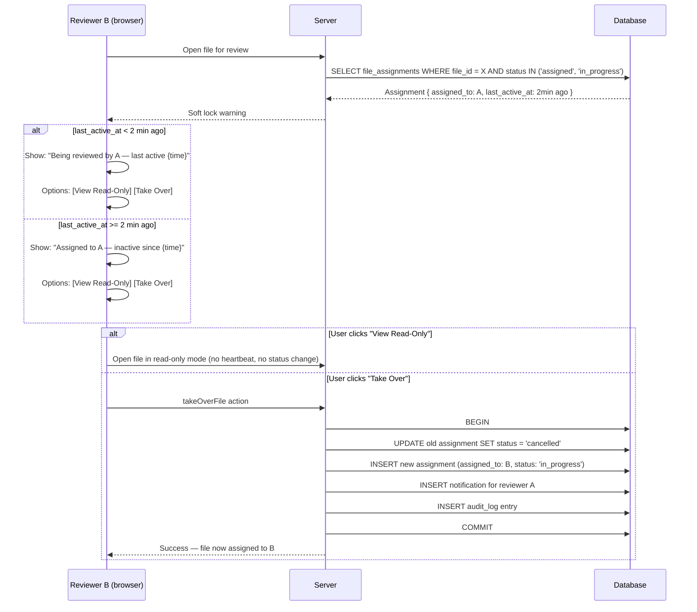
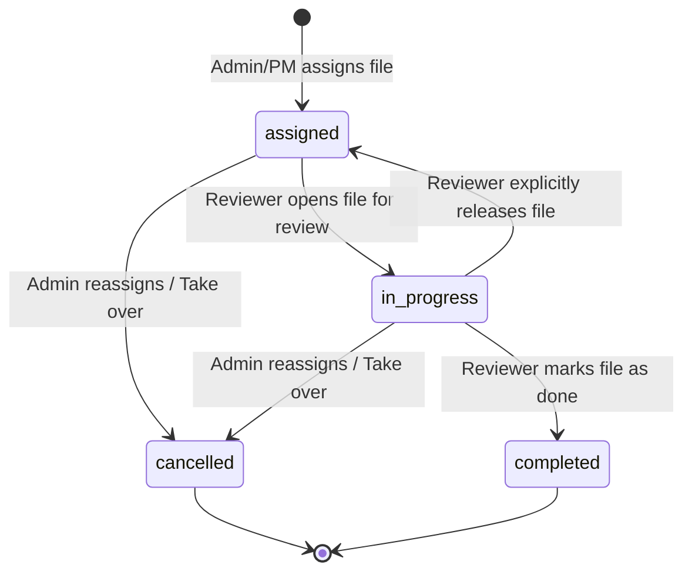

# File Assignment & Soft Lock — UX & Technical Design Spike

**Date:** 2026-03-30
**Epic:** 6 — Batch Processing & Team Collaboration
**Story:** 6.1 — File Assignment & Language-Pair Matching
**FRs:** FR56 (file assignment), FR57 (soft lock), FR58 (priority queue)
**NFRs:** NFR17 (no progress lost), NFR20 (6-9 concurrent users MVP)

---

## 1. Existing Schema & Patterns Audit

### 1.1 What Already Exists

The `file_assignments` table is **already defined** in Drizzle schema at `src/db/schema/fileAssignments.ts`:

```
fileAssignments = pgTable('file_assignments', {
  id:          uuid PK defaultRandom
  fileId:      uuid NOT NULL → files.id CASCADE
  projectId:   uuid NOT NULL → projects.id CASCADE
  tenantId:    uuid NOT NULL → tenants.id RESTRICT
  assignedTo:  uuid NOT NULL → users.id RESTRICT
  assignedBy:  uuid NOT NULL → users.id RESTRICT
  status:      varchar(20) NOT NULL default 'pending' — typed as FileAssignmentStatus
  priority:    varchar(20) nullable
  notes:       text nullable
  createdAt:   timestamptz NOT NULL defaultNow
  updatedAt:   timestamptz NOT NULL defaultNow
})
```

Status type in `src/types/assignment.ts`:
```typescript
export const FILE_ASSIGNMENT_STATUSES = ['pending', 'accepted', 'completed'] as const
export type FileAssignmentStatus = (typeof FILE_ASSIGNMENT_STATUSES)[number]
```

Relations are defined in `src/db/schema/relations.ts` — `fileAssignments` has relations to file, project, tenant, assignedToUser, assignedByUser.

### 1.2 Gap Analysis: Schema vs AC

The AC specifies the table should contain:
> id, file_id, project_id, tenant_id, assigned_to, assigned_by, priority (normal/urgent), status (assigned/in_progress/completed), assigned_at, started_at, completed_at

| AC Field | Current Schema | Gap |
|----------|---------------|-----|
| id | `id` uuid PK | OK |
| file_id | `fileId` FK | OK |
| project_id | `projectId` FK | OK |
| tenant_id | `tenantId` FK | OK |
| assigned_to | `assignedTo` FK | OK |
| assigned_by | `assignedBy` FK | OK |
| priority | `priority` varchar(20) nullable | Needs NOT NULL + default 'normal'. AC says "normal/urgent" |
| status | `status` varchar(20) default 'pending' | **Mismatch**: current = pending/accepted/completed. AC = assigned/in_progress/completed |
| assigned_at | `createdAt` (alias) | AC names it explicitly — `createdAt` serves this role |
| started_at | **Missing** | Need `startedAt` timestamptz nullable — set when status -> in_progress |
| completed_at | **Missing** | Need `completedAt` timestamptz nullable — set when status -> completed |
| last_active_at | **Missing** | Needed for soft lock display: "last active {time}" |

### 1.3 Required Schema Changes

**Migration needed** (before story implementation):

1. **Add columns:** `startedAt`, `completedAt`, `lastActiveAt` (all nullable timestamptz)
2. **Update status values:** Change from `pending/accepted/completed` to `assigned/in_progress/completed` (AC-aligned)
3. **Make priority NOT NULL with default:** `priority varchar(20) NOT NULL DEFAULT 'normal'`
4. **Add unique constraint:** `UNIQUE(file_id, tenant_id)` — one active assignment per file (reassignment replaces, not stacks)
5. **Add indexes:** `idx_file_assignments_assigned_to_status` for workload queries, `idx_file_assignments_file_tenant` for soft lock lookups

**Updated type definition:**
```typescript
export const FILE_ASSIGNMENT_STATUSES = ['assigned', 'in_progress', 'completed', 'cancelled'] as const
export type FileAssignmentStatus = (typeof FILE_ASSIGNMENT_STATUSES)[number]

export const FILE_ASSIGNMENT_PRIORITIES = ['normal', 'urgent'] as const
export type FileAssignmentPriority = (typeof FILE_ASSIGNMENT_PRIORITIES)[number]
```

Note: Added `cancelled` status for "Take over" flow — old assignment becomes cancelled, new one created.

### 1.4 Existing UI

No file assignment UI exists yet. `src/features/project/` contains only project CRUD actions and language pair config. The file assignment feature needs to be built from scratch within the project feature module or a dedicated `assignment` feature module.

**Recommendation:** Co-locate in `src/features/project/` since file assignment is a project-level concern (files belong to projects). Add `components/ReviewerSelector.tsx`, `actions/assignFile.action.ts`, `actions/takeOverFile.action.ts`.

---

## 2. ReviewerSelector Component Design

### 2.1 Data Flow

```
Server Component (page) → fetch eligible reviewers → pass to ReviewerSelector (client)
```

**Server-side query to fetch eligible reviewers:**
```
SELECT u.id, u.display_name, u.native_languages,
       COUNT(fa.id) FILTER (WHERE fa.status IN ('assigned', 'in_progress')) AS workload
FROM users u
JOIN user_roles ur ON ur.user_id = u.id AND ur.tenant_id = :tenantId
LEFT JOIN file_assignments fa ON fa.assigned_to = u.id AND fa.tenant_id = :tenantId
WHERE ur.tenant_id = :tenantId
  AND ur.role IN ('qa_reviewer', 'native_reviewer')
  AND u.native_languages @> :targetLangJsonb   -- contains file's target language
GROUP BY u.id, u.display_name, u.native_languages
ORDER BY workload ASC, u.display_name ASC
```

Notes:
- `native_languages` is stored as `jsonb` array of BCP-47 codes on the `users` table
- File's target language is derived from the project's `targetLangs` array or from segment-level `targetLang` (via `deriveLanguagePair`)
- Sort by workload ascending so least-loaded reviewers appear first

### 2.2 UI Wireframe Description

```
+------------------------------------------------------------------+
| Assign File: report_th-TH_v2.sdlxliff                           |
| Target: th-TH                                                    |
+------------------------------------------------------------------+
| Reviewer:  [ v Select reviewer...                              ] |
|            +---------------------------------------------------+ |
|            | * Somchai P.     [th-TH] [ja-JP]     2 files      | |
|            |   Nattapong K.   [th-TH]             5 files      | |
|            |   Waraporn S.    [th-TH] [zh-CN]     0 files      | |
|            +---------------------------------------------------+ |
|                                                                  |
| Priority:  ( ) Normal    (*) Urgent                              |
|                                                                  |
| Notes:     [Optional notes for reviewer...                     ] |
|                                                                  |
| [Cancel]                                    [Assign File]        |
+------------------------------------------------------------------+

Legend:
- * = suggested (lowest workload with matching language)
- [th-TH] = language badge (green if matches file target, gray otherwise)
- "2 files" = current active workload count
```

### 2.3 Component Props

```typescript
type ReviewerOption = {
  id: string
  displayName: string
  nativeLanguages: string[]
  workload: number       // active assignment count
}

type ReviewerSelectorProps = {
  fileId: string
  fileName: string
  targetLang: string     // file's target language (BCP-47)
  projectId: string
  reviewers: ReviewerOption[]
  currentAssignment: {   // null if unassigned
    assignedTo: string
    assignedToName: string
    status: FileAssignmentStatus
  } | null
  onAssign: (data: { reviewerId: string; priority: FileAssignmentPriority; notes: string | null }) => void
}
```

### 2.4 Interaction Details

1. **Dropdown** uses shadcn `Combobox` (searchable) — reviewer list may be long in enterprise tenants
2. **Language badges** — green badge for languages matching the file's target language, gray for others
3. **Workload indicator** — shows count + visual bar (e.g., 0-2 green, 3-5 yellow, 6+ red)
4. **Suggested reviewer** — auto-select reviewer with lowest workload who has matching language. Star icon next to name
5. **Urgency toggle** — radio group (Normal/Urgent). Urgent shows red badge icon
6. **Already assigned warning** — if file has existing assignment, show banner: "Currently assigned to {name} (status: {status}). Reassigning will notify them."
7. **Keyboard accessible** — all controls reachable via Tab, dropdown navigable via arrow keys

### 2.5 Bulk Assignment

For batch operations (multiple files), a separate `BulkAssignDialog` wraps ReviewerSelector:
- Select multiple files via checkbox in file list
- "Assign Selected" button opens dialog
- Shows ReviewerSelector with file count: "Assigning 5 files to..."
- Creates one `file_assignment` row per file in a single transaction

---

## 3. Soft Lock Mechanism

### 3.1 Design Options

| Approach | Description | Pros | Cons |
|----------|------------|------|------|
| **A: DB `last_active_at` column** | Update `file_assignments.last_active_at` periodically via heartbeat. Query on file open to check | Simple, no new infrastructure, survives page refresh | Requires periodic heartbeat (polling), stale if user closes browser without cleanup |
| **B: Supabase Realtime Presence** | Use Presence feature to track which users are on which files | True real-time, auto-cleanup on disconnect | Presence is ephemeral (no persistence), more complex, limited to 100 concurrent users per channel |
| **C: Hybrid (DB + Presence)** | `last_active_at` in DB as source of truth, Presence for instant UI updates | Best of both worlds | Most complex |

### 3.2 Recommended Approach: Option A (DB `last_active_at`)

**Rationale:**
- NFR20 targets 6-9 concurrent users. Presence is overkill for this scale
- `last_active_at` is durable (survives refresh) and queryable (for dashboards/reports)
- Aligns with existing patterns in the codebase (DB-first, Realtime for push notifications)
- Avoids introducing Presence API complexity (no existing usage in codebase)
- Staleness is acceptable — a 2-minute timeout is standard for soft locks

### 3.3 Heartbeat Mechanism

**Client-side:** `useFilePresence` hook sends heartbeat every 30 seconds while file is open for review.

```
Browser tab active + file open for review
  → POST /api/file-assignment/heartbeat (Server Action)
  → UPDATE file_assignments SET last_active_at = NOW()
    WHERE file_id = :fileId AND assigned_to = :userId AND tenant_id = :tenantId
```

**Visibility API integration:** Pause heartbeat when tab is hidden (`document.visibilityState === 'hidden'`). Resume on focus. This prevents stale "active" timestamps from backgrounded tabs.

**Stale threshold:** If `NOW() - last_active_at > 2 minutes`, consider the reviewer inactive. Display shows "last active 5 minutes ago" rather than "currently reviewing".

### 3.4 Soft Lock Warning Flow



### 3.5 Race Condition: Simultaneous "Take Over"

**Scenario:** Reviewers B and C both see the soft lock warning and click "Take Over" at the same time.

**Solution: Optimistic locking via `previous_assignee` check**

The `takeOverFile` Server Action includes the current assignment ID in the request. The DB update uses:

```sql
UPDATE file_assignments
SET status = 'cancelled', updated_at = NOW()
WHERE id = :currentAssignmentId
  AND status IN ('assigned', 'in_progress')  -- Not already cancelled
  AND tenant_id = :tenantId
RETURNING id
```

If `RETURNING` returns 0 rows, the assignment was already taken over by someone else. Return a conflict error to the UI: "This file was just reassigned. Please refresh."

This is the same optimistic locking pattern used in `review.store.ts` for finding undo (Guardrail #25: Server Action verifies `previous_state` match before revert).

### 3.6 Read-Only Mode

When a user opens a file in read-only mode:
- All finding action buttons (Accept/Reject/Flag) are disabled
- Keyboard shortcuts (A/R/F) are suppressed
- A persistent banner at top: "Read-only mode — assigned to {name}"
- User can still navigate findings, view details, see back-translations
- No heartbeat is sent (does not affect soft lock timestamp)

### 3.7 Soft Lock Warning UI

```
+------------------------------------------------------------------+
| [!] This file is assigned to Somchai P.                          |
|     Status: In Progress   Last active: 3 minutes ago             |
|                                                                  |
|     [View Read-Only]    [Take Over (notify Somchai)]             |
+------------------------------------------------------------------+
```

- Displayed as a full-width banner below the file header, above the findings list
- Uses `AlertTriangle` icon (yellow/amber) for visual weight
- "Take Over" button includes the assignee name to make it clear a notification will be sent
- Accessible: `role="alert"`, `aria-live="polite"`

---

## 4. File Assignment Status Machine

### 4.1 State Transitions



### 4.2 Transition Rules

| From | To | Trigger | Who Can Do It | Side Effects |
|------|----|---------|---------------|--------------|
| (none) | assigned | `assignFile` action | Admin, PM (qa_reviewer with assign permission) | Notification to assignee, audit log |
| assigned | in_progress | Open file for review | Assigned reviewer only | Set `startedAt`, start heartbeat |
| assigned | cancelled | Reassign / Take over | Admin, PM, or another reviewer via "Take over" | Notification to original assignee, new assignment created |
| in_progress | completed | "Mark as Done" button | Assigned reviewer, Admin | Set `completedAt`, audit log |
| in_progress | cancelled | Reassign / Take over | Admin, PM, or another reviewer via "Take over" | Notification to original reviewer |
| in_progress | assigned | "Release File" action | Assigned reviewer | Clear `startedAt`, stop heartbeat |

### 4.3 Integration with File Status

The `file_assignments.status` is independent from `files.status` (pipeline status). They track different concerns:

| Field | Domain | Values | Purpose |
|-------|--------|--------|---------|
| `files.status` | Pipeline processing | uploaded, parsing, parsed, l1_processing, ..., l3_completed, ai_partial, failed | Tracks QA analysis progress |
| `file_assignments.status` | Reviewer workflow | assigned, in_progress, completed, cancelled | Tracks human review progress |

A file can be `l3_completed` (pipeline done) but still `assigned` (reviewer hasn't started yet). Or `in_progress` (reviewer working) while being `ai_partial` (some pipeline layers failed).

---

## 5. Priority Queue via Inngest

### 5.1 Current Inngest Concurrency Model

From `src/features/pipeline/inngest/processFile.ts`:

```typescript
inngest.createFunction(
  {
    id: 'process-file-pipeline',
    retries: 3,
    concurrency: [{ key: 'event.data.projectId', limit: 1 }],
    onFailure: onFailureFn,
  },
  { event: 'pipeline.process-file' },
  handlerFn,
)
```

This serializes pipeline processing per project (only 1 file processed at a time per project). Priority must work within this constraint.

### 5.2 Design Options

| Approach | Description | Pros | Cons |
|----------|------------|------|------|
| **A: Inngest `priority` field** | Use Inngest's built-in `priority` config to process urgent events first | Native support, no custom code, respects concurrency | Requires Inngest v3 priority feature (verify availability) |
| **B: Separate urgent queue** | Two Inngest functions: `process-file-urgent` (concurrency 1) and `process-file-normal` (concurrency 1) | Clear separation | Doubles function count, both compete for resources, complex to manage |
| **C: Application-level ordering** | `processBatch` sorts files by priority before dispatching events | Simple, no Inngest changes | Only works within a single batch — cross-batch ordering not guaranteed |
| **D: Priority in event data + custom concurrency** | Include `priority` in event data, use Inngest's `priority` function config | Clean, event-driven | Needs Inngest priority feature |

### 5.3 Recommended Approach: Option A (Inngest `priority` field)

Inngest supports a `priority` configuration that accepts an expression evaluated against event data:

```typescript
inngest.createFunction(
  {
    id: 'process-file-pipeline',
    retries: 3,
    concurrency: [{ key: 'event.data.projectId', limit: 1 }],
    priority: {
      // Inngest priority: higher number = processed first
      // urgent = 100, normal = 0
      run: "event.data.priority == 'urgent' ? 100 : 0",
    },
    onFailure: onFailureFn,
  },
  { event: 'pipeline.process-file' },
  handlerFn,
)
```

**How it works with concurrency:**
- When multiple events are queued for the same `projectId`, Inngest picks the one with highest priority first
- If an urgent file arrives while a normal file is processing, it waits until the current file completes (concurrency limit 1), then runs next
- This is exactly the behavior we want: urgent files jump the queue but don't interrupt in-progress work

**Event data change:**
Add `priority: 'normal' | 'urgent'` to `PipelineFileEventData` and `PipelineBatchEventData`. Default to `'normal'` if not provided (backward compatible).

### 5.4 Fallback: Application-Level Ordering

If Inngest priority is unavailable or insufficient:

In `processBatch`, sort `fileIds` before dispatching:

```typescript
const sortedFileIds = [...fileIds].sort((a, b) => {
  const aPriority = filePriorityMap.get(a) === 'urgent' ? 0 : 1
  const bPriority = filePriorityMap.get(b) === 'urgent' ? 0 : 1
  return aPriority - bPriority
})
```

This ensures urgent files within a batch are dispatched first. Combined with Inngest's FIFO queue within the same concurrency key, this provides approximate priority ordering.

### 5.5 UI: Urgent Badge in Reviewer Queue

When a file has `priority = 'urgent'`:
- File list shows a red "Urgent" badge next to the filename
- Urgent files are sorted to the top of the reviewer's file list
- Dashboard shows urgent file count: "3 urgent files pending review"

---

## 6. RLS Considerations

### 6.1 Pattern Reference

The `finding_assignments` RLS in `supabase/migrations/00026_story_5_2b_rls_scoped_access.sql` provides the template. Key patterns:

- JWT claims: `tenant_id`, `user_role`, `sub` (user ID)
- Admin + QA: full tenant CRUD
- Native reviewer: restricted to own assignments
- Composite index for performance

### 6.2 file_assignments RLS Policy Design

```sql
-- Enable RLS
ALTER TABLE file_assignments ENABLE ROW LEVEL SECURITY;

-- Admin + QA: full tenant SELECT
CREATE POLICY "file_assignments_select_admin_qa" ON file_assignments
  FOR SELECT TO authenticated
  USING (
    tenant_id = ((SELECT auth.jwt()) ->> 'tenant_id')::uuid
    AND ((SELECT auth.jwt()) ->> 'user_role') IN ('admin', 'qa_reviewer')
  );

-- Native reviewer: SELECT own assignments only
CREATE POLICY "file_assignments_select_native" ON file_assignments
  FOR SELECT TO authenticated
  USING (
    tenant_id = ((SELECT auth.jwt()) ->> 'tenant_id')::uuid
    AND ((SELECT auth.jwt()) ->> 'user_role') = 'native_reviewer'
    AND assigned_to = ((SELECT auth.jwt()) ->> 'sub')::uuid
  );

-- Admin + QA: INSERT (they create assignments)
CREATE POLICY "file_assignments_insert_admin_qa" ON file_assignments
  FOR INSERT TO authenticated
  WITH CHECK (
    tenant_id = ((SELECT auth.jwt()) ->> 'tenant_id')::uuid
    AND ((SELECT auth.jwt()) ->> 'user_role') IN ('admin', 'qa_reviewer')
  );

-- Admin + QA: UPDATE (status transitions, reassignment)
CREATE POLICY "file_assignments_update_admin_qa" ON file_assignments
  FOR UPDATE TO authenticated
  USING (
    tenant_id = ((SELECT auth.jwt()) ->> 'tenant_id')::uuid
    AND ((SELECT auth.jwt()) ->> 'user_role') IN ('admin', 'qa_reviewer')
  )
  WITH CHECK (
    tenant_id = ((SELECT auth.jwt()) ->> 'tenant_id')::uuid
    AND ((SELECT auth.jwt()) ->> 'user_role') IN ('admin', 'qa_reviewer')
  );

-- Assigned reviewer: UPDATE own assignment (status transitions only)
-- Whitelist non-destructive transitions: assigned -> in_progress, in_progress -> completed
CREATE POLICY "file_assignments_update_assigned" ON file_assignments
  FOR UPDATE TO authenticated
  USING (
    tenant_id = ((SELECT auth.jwt()) ->> 'tenant_id')::uuid
    AND assigned_to = ((SELECT auth.jwt()) ->> 'sub')::uuid
  )
  WITH CHECK (
    tenant_id = ((SELECT auth.jwt()) ->> 'tenant_id')::uuid
    AND assigned_to = ((SELECT auth.jwt()) ->> 'sub')::uuid
    AND status IN ('assigned', 'in_progress', 'completed')
  );

-- Admin only: DELETE
CREATE POLICY "file_assignments_delete_admin" ON file_assignments
  FOR DELETE TO authenticated
  USING (
    tenant_id = ((SELECT auth.jwt()) ->> 'tenant_id')::uuid
    AND ((SELECT auth.jwt()) ->> 'user_role') = 'admin'
  );
```

### 6.3 Permission Matrix

| Action | Admin | QA Reviewer (PM) | Native Reviewer | Assigned Reviewer |
|--------|-------|-------------------|-----------------|-------------------|
| View all assignments | Yes | Yes | Own only | Own only |
| Create assignment | Yes | Yes | No | No |
| Reassign (cancel + create) | Yes | Yes | No | No |
| Update own status | Yes | Yes | No | Yes |
| Take over | Yes | Yes | No | Yes (via soft lock UI) |
| Delete assignment | Yes | No | No | No |

Note: "Take Over" for a non-admin reviewer works as: (1) cancel old assignment (Admin/QA policy or service_role for the update), (2) create new assignment. The Server Action runs with admin/service-level access for the cancellation step, then creates the new assignment. App-level auth check determines who can trigger it.

### 6.4 App-Level Authorization (Double Defense)

Per Guardrail #64 (app-level + RLS double defense):

```typescript
// In assignFile.action.ts
const { role } = await requireRole(['admin', 'qa_reviewer'])

// In takeOverFile.action.ts
const { userId, role } = await requireRole(['admin', 'qa_reviewer', 'native_reviewer'])
// Additional check: native_reviewer can only take over if they have matching language
```

### 6.5 Realtime for file_assignments

Enable Realtime to push assignment changes to connected clients:

```sql
DO $$
BEGIN
  IF NOT EXISTS (
    SELECT 1 FROM pg_publication_tables
    WHERE pubname = 'supabase_realtime' AND tablename = 'file_assignments'
  ) THEN
    ALTER PUBLICATION supabase_realtime ADD TABLE file_assignments;
  END IF;
END $$;
```

This enables:
- Reviewer sees "New file assigned to you" in real-time
- Soft lock warning updates when the original reviewer becomes active/inactive
- Dashboard workload counts update live

### 6.6 Performance Indexes

```sql
CREATE INDEX IF NOT EXISTS idx_file_assignments_assigned_to_status
  ON file_assignments (assigned_to, status)
  WHERE status IN ('assigned', 'in_progress');

CREATE INDEX IF NOT EXISTS idx_file_assignments_file_tenant
  ON file_assignments (file_id, tenant_id);

CREATE INDEX IF NOT EXISTS idx_file_assignments_project_status
  ON file_assignments (project_id, status);
```

---

## 7. Notification Integration

### 7.1 Events That Trigger Notifications

| Event | Recipient | Message | Metadata |
|-------|-----------|---------|----------|
| File assigned | Assigned reviewer | "File '{filename}' assigned to you" | `{ fileId, projectId, priority }` |
| File reassigned (take over) | Original reviewer | "{name} took over file '{filename}'" | `{ fileId, projectId, takenOverBy }` |
| Urgent flag set | Assigned reviewer | "File '{filename}' marked as urgent" | `{ fileId, projectId }` |
| Assignment completed | Admin who assigned | "{reviewer} completed review of '{filename}'" | `{ fileId, projectId, assignmentId }` |

### 7.2 Notification Delivery

Uses existing `notifications` table and Supabase Realtime (pattern from Story 6.2 AC). Non-blocking per Guardrail #74.

```typescript
// In assignFile.action.ts — after successful assignment
try {
  await writeNotification({
    userId: assignedTo,
    tenantId,
    type: 'file_assigned',
    title: `File assigned to you`,
    body: `"${fileName}" has been assigned to you${priority === 'urgent' ? ' (Urgent)' : ''}`,
    metadata: { fileId, projectId, priority },
  })
} catch (err) {
  logger.error({ err, fileId }, 'Failed to write assignment notification — non-blocking')
}
```

---

## 8. Implementation Recommendations

### 8.1 Migration Plan

1. **Migration file:** `supabase/migrations/00028_story_6_1_file_assignments.sql`
   - Add columns: `started_at`, `completed_at`, `last_active_at`
   - Make `priority` NOT NULL DEFAULT 'normal'
   - Update status default from 'pending' to 'assigned'
   - Add unique constraint on `(file_id, tenant_id)` where `status NOT IN ('cancelled', 'completed')` (partial unique — only one active assignment per file)
   - Add RLS policies
   - Add indexes
   - Enable Realtime

2. **Drizzle schema update:** `src/db/schema/fileAssignments.ts`
   - Add `startedAt`, `completedAt`, `lastActiveAt` columns
   - Update `priority` to NOT NULL with default
   - Update `status` default to 'assigned'

3. **Type update:** `src/types/assignment.ts`
   - Change `FILE_ASSIGNMENT_STATUSES` to `['assigned', 'in_progress', 'completed', 'cancelled']`
   - Add `FILE_ASSIGNMENT_PRIORITIES`

### 8.2 Server Actions

| Action | File | Purpose |
|--------|------|---------|
| `assignFile.action.ts` | `src/features/project/actions/` | Create file assignment |
| `takeOverFile.action.ts` | `src/features/project/actions/` | Cancel existing + create new assignment |
| `updateAssignmentStatus.action.ts` | `src/features/project/actions/` | Status transitions (assigned -> in_progress, etc.) |
| `heartbeat.action.ts` | `src/features/project/actions/` | Update `last_active_at` for soft lock |
| `getEligibleReviewers.action.ts` | `src/features/project/actions/` | Fetch reviewers by language pair + workload |

### 8.3 Components

| Component | File | Purpose |
|-----------|------|---------|
| `ReviewerSelector` | `src/features/project/components/ReviewerSelector.tsx` | Dropdown with language/workload info |
| `FileAssignmentDialog` | `src/features/project/components/FileAssignmentDialog.tsx` | Dialog wrapper for ReviewerSelector |
| `SoftLockBanner` | `src/features/review/components/SoftLockBanner.tsx` | Warning banner when file is locked |
| `UrgentBadge` | `src/components/ui/UrgentBadge.tsx` | Reusable red "Urgent" badge |

### 8.4 Hooks

| Hook | Purpose |
|------|---------|
| `useFilePresence` | Heartbeat sender (30s interval, pauses on tab hidden) |
| `useFileAssignmentSubscription` | Realtime subscription for assignment changes |
| `useSoftLock` | Checks current assignment on file open, returns lock state |

### 8.5 Story Subtask Breakdown (Suggested)

1. **Schema + Migration + RLS** — DB layer (1 task)
2. **Server Actions** — assignFile, takeOverFile, heartbeat, getEligibleReviewers (1 task)
3. **ReviewerSelector + FileAssignmentDialog** — UI for assignment (1 task)
4. **SoftLockBanner + useFilePresence** — Soft lock UI + heartbeat (1 task)
5. **Inngest Priority** — Add priority to pipeline events (1 task)
6. **Notifications** — Assignment notification integration (1 task)
7. **E2E Tests** — Full flow: assign, soft lock, take over, priority (1 task)

---

## 9. Open Questions

1. **Should native reviewers be able to "Take Over"?** The AC says "the second reviewer can choose" without role restriction. Recommendation: Allow all authenticated reviewers within the tenant, but log the action prominently in audit.

2. **One assignment per file, or history?** Recommendation: Keep all assignments (cancelled/completed) for audit trail. Use partial unique index to enforce only one active assignment per file.

3. **Bulk assignment: same reviewer for all files, or per-file?** AC mentions "batch of uploaded files" — support both: quick "assign all to X" and per-file assignment via the file list.

4. **Heartbeat frequency:** 30 seconds is proposed. Should this be configurable per tenant? Recommendation: Hardcode 30s for MVP, make configurable in Epic 9 (admin settings).

5. **Inngest priority availability:** Verify Inngest v3 supports the `priority` config with expression syntax. If not available, fall back to application-level ordering in `processBatch`.
