# UX Design Specification — qa-localization-tool

**Author:** Mona
**Date:** 2026-02-14

---

## Executive Summary

### Project Vision

**qa-localization-tool** is a standalone AI-powered localization QA web application — the first in the market to combine deterministic rule-based checks (Xbench parity) with multi-layer AI semantic analysis and confidence-based automation in a standalone platform.

**Core Value — Single-Pass Completion:** Shifts the paradigm from "multiple review rounds" to "one pass, done" by eliminating the QA → Proofreader → QA review loop entirely. This is achieved through 5 interdependent Pillars:

| # | Pillar | UX Implication |
|:-:|--------|---------------|
| 1 | **Intelligent Prioritization** | Score + severity tells reviewers what to focus on — UI must surface score prominently |
| 2 | **Progressive Disclosure** | Critical → Major → Minor (collapsed) — information architecture must layer clearly |
| 3 | **Confidence-based Trust** | Visual indicators (High/Medium/Low) enable instant decision-making — must be prominent, not interpretive |
| 4 | **Language Bridge** | AI explanation + back-translation for non-native reviewers — must be designed as first-class feature |
| 5 | **Actionable Suggestions** | Not just "wrong" but "here's the fix" with confidence — inline display alongside each finding |

### Target Users

**Primary Personas — 3 roles, 3 distinct need profiles:**

**Persona 1: คุณแพร (Senior QA Reviewer, EN→TH) — Power User**
- 5 years using Xbench daily, knows every strength and weakness → trust must be built from rule-based parity first
- Batch workflow: 10-15 files/day → batch upload + batch summary is the default experience
- Requires segment navigation, bulk accept/reject, progressive disclosure
- Trust journey: compare with Xbench → glance at Xbench → stop opening Xbench
- **Pain**: False positive fatigue — if AI flags incorrectly too often, she will abandon the tool
- **Hidden pain**: "วงจรแห่งการไม่ไว้ใจ" — no single source of truth → must check multiple times
- **Goal**: "The One Check" — single pass completion without sending to proofreader

**Persona 2: คุณนิด (QA Reviewer, non-native ZH/JA/KO) — Language Bridge User**
- Cannot read target language → must rely on AI explanation + back-translation
- 3 actions: Accept / Reject / **Flag for native review** (third action is critical)
- Smart Report with 3 tiers: Verified / Non-native accepted / Needs native verification
- Per-language confidence calibration (EN→ZH/JA/KO starts at 92% threshold)
- Non-native safety net: "Accepted by non-native reviewer" auto-tag on all decisions
- **Goal**: Team of 6-9 covers all languages without relying on freelance native reviewers

**Persona 3: PM/Coordinator — Self-service User**
- Not a QA expert → auto-pass + simple summary is sufficient
- Economy mode as default (cost-aware, tooltip explains Thorough cost)
- Route to QA reviewer when score is low (manual reviewer selection)
- Content-type warning for sensitive content (legal/medical/financial)
- Client feedback loop: simple ✅/❌ after delivery
- **Goal**: Ship files to client without waiting in QA queue

**Secondary — VP/Director (Dashboard Only)**
- Views dashboard only: summary cards, quality trend chart, activity feed, export PDF/Excel
- Must prove ROI to C-level → dashboard = survival tool for QA team's headcount justification
- Measures: total files processed, average score, auto-pass rate, estimated hours saved

### Key Design Challenges

**1. Trust Architecture — The challenge that defines product success** 🔑
- Rule-based must achieve 100% Xbench parity before users will trust AI layer
- "Recommended pass" soft launch Month 1 → true "Auto-pass" Month 2+ (based on agreement rate > 99%)
- Spot check mode: expanded detail (Week 1-2) → collapsed (Week 3+) → glance & confirm (Month 2+)
- Trust recovery path: if parity test fails → "Report missing check" + recovery messaging + visible fix
- AI Learning Indicator: show patterns learned + accuracy trend ("AI accuracy EN→TH: 85% → 91%")
- Pre-launch parity certification: คุณแพร must sign-off at least 3 rounds

**2. Dual-layer Information Architecture** 📊
- **Horizontal layers**: Batch summary → File detail → Segment detail → Issue detail
- **Vertical layers**: Rule-based results (instant, < 5s) → AI results (progressive streaming via Supabase Realtime)
- Both dimensions must work together smoothly — no jumpy transitions, no confusing state changes
- "AI pending" badge + rule-based first → AI findings stream in progressively
- Layer 1 results inject into AI prompts as context → AI knows what to skip (zero overlap)

**3. Multi-persona Progressive Disclosure** 👥
- PM: batch summary + auto-pass → done (minimal depth)
- QA Reviewer: drill down to segment + accept/reject/flag (full depth)
- Non-native Reviewer: AI explanation + back-translation + Flag for native review (specialized depth)
- VP: dashboard only → never sees review screens
- Same data, different depth — role-based views are UX-level differences, not just permissions

**4. False Positive Management** 💣
- Bulk reject + "Suppress this pattern" (offered after 3+ rejects of same pattern) → reduce fatigue
- AI Learning status with 2 distinct states: "📝 Feedback logged (50)" vs "✅ Applied to AI (32 patterns)"
- Option to disable AI suggestions temporarily (use rule-based only mode)
- False positive rate tracking per language pair with visible improvement trend
- AI update changelog: "AI updated: +12 patterns, accuracy EN→TH: 85% → 91%"

**5. Dual Taxonomy UX (QA Cosmetic + MQM)** 🏷️
- UI displays QA Cosmetic terms familiar to the team (from production standards)
- Reports/exports use MQM standard terms (industry-standard for clients/enterprise)
- Admin mapping editor UI — Mona must control the mapping herself without dev involvement
- Challenge: prevent user confusion between 2 taxonomy systems in the same interface

**6. First 5 Minutes — Onboarding that delivers value immediately** ⏱️
- "Time to first value < 5 minutes" — must budget time carefully: Create Project + set language pair + import glossary + upload file → all must be minimal friction
- First 30 seconds: guided onboarding flow, not empty dashboard
- First-time user onboarding tour: 5-step walkthrough (severity → actions → auto-pass → report → feedback)
- Cost estimation before Run: "Thorough: ~$0.15 for this file, ~2 min | Economy: ~$0.03, ~30s"
- Trust calibration messaging: communicate that AI is assistant not oracle, false positive target < 10%

**7. Progressive Streaming Score Behavior** ⚡
- Score will "jump" as AI findings arrive (97 → 72 if AI finds Critical issue)
- Must have "interim" badge: "Score: 97 (rule-based only) → Analyzing with AI..." → "Final Score: 72"
- Queue position visibility: "Your batch: 3rd in queue, estimated start: 2 min"
- Progress granularity for large files: "Processing: 2,847 / 8,000 segments (36%)"
- Notification when batch completes — user may be doing other work while waiting
- Estimated time remaining display for long-running processes

**8. Error States & Edge Cases** ⚠️
- AI timeout mid-processing → partial results preservation + "Retry AI" button per file
- File parse failure → clear error message + supported format guidance
- Internet disconnection → graceful degradation + auto-retry when reconnected
- Wrong format upload → instant validation at upload time + format suggestion
- Per-file status in batch view: "AI complete ✅ / AI failed ⚠️ / Rule-based only 📋"
- Concurrent reviewers: file assignment/lock — "In review by คุณแพร" visible to others
- Duplicate file detection: "This file was uploaded yesterday (Score 97) — re-run?"

### Design Opportunities

**1. Language Bridge — Core differentiator no competitor offers** ⭐
- AI explanation in English + back-translation enables non-native reviewers to understand meaning without reading target language
- Must be designed as first-class experience — not hidden in tooltip
- Confidence indicator per language pair: visual High/Medium/Low (not just numbers)
- Per-language confidence calibration: system gets "smarter" per language pair over time

**2. Progressive Streaming UX** ⚡
- Rule-based results < 5 seconds → AI streams in progressively (via Supabase Realtime)
- Design so user can "start working immediately" from rule-based results while AI processes
- Score updates live as AI findings arrive — with clear interim vs final state
- "Work while you wait" pattern: review rule-based findings first, AI enriches later

**3. Confidence-driven Decision Making** 🎯
- High (>85%) / Medium (70-85%) / Low (<70%) visual indicators → reduces cognitive load instantly
- Bulk accept for high-confidence findings (>90%) → dramatically reduces review time
- Per-language calibration → system accuracy improves per language pair over time
- Confidence accuracy dashboard (Growth): "EN→ZH AI confirmed 9/10 findings"

**4. QA Certificate — Trust chain to client** 📜
- 1-click PDF generation → PM can send to client immediately
- Audit trail that proves every decision → compliance-ready documentation
- Detail levels: Standard (pass/fail summary) + Detailed (enterprise: checks performed, segments analyzed)

**5. Self-healing Foundation (Growth Phase Design)** 💊
- Growth phase: AI not only detects but "fixes" with before/after preview
- UX must design foundation that supports 💊 icon + Accept/Modify/Reject flow from MVP architecture
- Trust Gateway: High confidence → auto-apply (Vision), Medium → suggest, Low → flag only
- Progressive trust: Shadow Mode (invisible) → Assisted Mode (visible) → Autonomous Mode (auto-apply)

**6. Data-driven Quality Moat Visualization** 📈
- Show AI accuracy trend that "grows" in front of user — builds emotional investment
- "AI accuracy for EN→TH: 85% → 91% (learned from 23 feedback signals)" → creates loyalty
- Dashboard for VP transforms QA from cost center to measurable quality asset
- Moat: more usage = more accuracy = harder for competitors to match

**7. Emotional Journey Design** 💝
- Map emotional states alongside functional journey:
  - **Skepticism** (Day 1) → comparison-friendly UX, Xbench parity visible and prominent
  - **Cautious testing** (Week 1-2) → spot check mode expanded, easy Xbench side-by-side comparison
  - **Pleasant surprise** (Aha! moment) → AI catches what Xbench can't — highlight prominently with celebration moment
  - **Growing trust** (Week 3-4) → spot check mode reduces, auto-pass begins to feel safe
  - **Full reliance** (Month 2+) → streamlined flow, minimal detail shown, maximum efficiency
- "Xbench Comfort Blanket" pattern: design for easy side-by-side comparison during transition period — let user close Xbench on their own terms
- Trust recovery path: if tool misses something → "Report missing check" + visible fix deployed + rebuild cycle with messaging

## Core User Experience

### Defining Experience

**Core Action Loop — "Review & Decide":**

The defining interaction of qa-localization-tool is the **Finding Review Decision Moment** — the 3-5 seconds when a reviewer looks at a finding and decides: Accept, Reject, or Flag. Everything in the UX must serve this moment. Users perform this loop **100-300 times/day** (10-15 files × 10-30 findings/file) — every millisecond of friction is amplified.

```
                    BATCH LEVEL
                    ┌─────────────────────────┐
                    │ Batch Summary            │
                    │ "7 auto-pass, 3 review"  │
                    │ Click file → drill down  │
                    └──────────┬──────────────┘
                               ▼
                    FILE LEVEL
                    ┌─────────────────────────┐
                    │ File: report_TH.sdlxliff │
                    │ Score: 72 │ 17 findings  │
                    │ Auto-scroll to 1st Crit  │
                    └──────────┬──────────────┘
                               ▼
              ┌──── CORE LOOP (100+ times/day) ────────┐
              │                                         │
              │   1. 👁️ Scan: Severity → Type → Layer    │
              │   2. 📖 Read: Source/Target highlight    │
              │      + Language Bridge (if non-native)   │
              │   3. 🎯 Check: Confidence + Suggestion   │
              │   4. ⚡ Decide: Accept(A) / Reject(R)    │
              │      / Flag(F)                           │
              │   5. → Auto-advance to next finding      │
              │                                         │
              └──────────┬──────────────────────────────┘
                         │ All findings resolved
                         ▼
                    FILE COMPLETE
                    ┌─────────────────────────┐
                    │ "Review Complete ✅"      │
                    │ → Next file in batch     │
                    └──────────┬──────────────┘
                               │ All files done
                               ▼
                    BATCH COMPLETE
                    ┌─────────────────────────┐
                    │ "Batch done! Export?"     │
                    │ [📄 Report] [📜 Cert]    │
                    └─────────────────────────┘
```

#### Visual Scan Path — "3-Second Decision"

Every finding is designed for a left-to-right, top-to-bottom scan completing in 3 seconds:

| Second | Phase | What the eye sees |
|:---:|-------|------------------|
| 1st | **PRIORITY SCAN** | Severity badge (🔴 Critical / 🟠 Major / 🟡 Minor) → Error type (QA Cosmetic term) → Layer badge (Rule / AI) |
| 2nd | **UNDERSTAND** | Source segment (highlighted) → Target segment (error highlighted) → AI Suggestion + Confidence indicator |
| 3rd | **DECIDE** | Action buttons: Accept (A) / Reject (R) / Flag (F) with keyboard hotkeys |

#### Finding Information Hierarchy

| Priority | Element | Purpose | Source |
|:---:|---------|--------|--------|
| 1st | **Severity badge** | Determines whether to read in detail — Critical must read, Minor may bulk accept | PRD: Intelligent Prioritization |
| 2nd | **Error type** | What kind of error — Terminology? Consistency? Mistranslation? (QA Cosmetic terms in UI) | Dual Taxonomy |
| 3rd | **Source + Target** | Actual context — highlight only the problematic part, not entire segment | PRD: Progressive Disclosure |
| 4th | **Suggestion** | "Fix it to what" — not just flagging errors but providing solutions | PRD Pillar 5: Actionable Suggestions |
| 5th | **Confidence** | "How trustworthy" — 🟢 High >85% / 🟡 Medium 70-85% / 🔴 Low <70% | PRD Pillar 3: Confidence-based Trust |
| 6th | **Layer badge** | Rule-based (deterministic) vs AI (semantic) — builds trust literacy over time | 3-Layer Pipeline |

#### Per-Persona View Differences

| Element | คุณแพร (Native QA) | คุณนิด (Non-native QA) |
|---------|-------------------|----------------------|
| Language Bridge | Hidden (not needed) | **Always visible** — first-class, never collapsed |
| Flag action | Not available (she is the native reviewer) | **Available** — "Flag for native review" |
| Confidence weight | Supplementary (she can judge herself) | **Primary decision factor** when cannot read target language |
| AI Explanation | Optional expand | **Always visible** |
| Core actions | Accept / Reject | Accept / Reject / **Flag** |
| Extended actions | Note / Source Issue / Add Finding / Severity Override | Note / Source Issue / Add Finding / Severity Override |

#### Action Sub-flows

**✓ Accept (Hotkey: A)** — Zero friction
- 1 click → finding greyed out → cursor auto-advances to next finding
- No confirmation dialog
- Marked as "Accepted" in audit trail
- Undo: Ctrl+Z (available within session)

**✗ Reject (Hotkey: R)** — Optional feedback
- 1 click → finding marked rejected → optional reason dropdown appears (not mandatory)
- Reason options: False positive / Already fixed / Intentional / Other (free text)
- Reason data feeds AI learning when provided
- **Pattern suppression:** After 3+ rejects of same error pattern → "Suppress this pattern for this project? [Yes / No]"

**⚑ Flag (Hotkey: F)** — Non-native reviewer only
- 1 click → finding marked "Needs native review" → cursor advances
- Auto-notify native reviewer(s) assigned to that language pair (see Safeguard #7)
- Flag counter badge visible on dashboard for assigned native reviewers
- Flag resolution feedback: notifies flagger when native reviewer resolves the item
- In Smart Report: appears in "Needs Native Verification" tier

**📝 Note (Hotkey: N)** — Stylistic observations (see Edge Case #10)
- 1 click → finding marked "Noted — no action required" → cursor advances
- No MQM score penalty — acknowledged but not treated as error
- In Report: appears in separate "Stylistic Observations" section

**🔤 Source Issue (Hotkey: S)** — Source text problems (see Edge Case #11)
- 1 click → finding marked "Source issue" → cursor advances
- No translation score penalty — problem is in source, not translation
- In Report: appears in "Source Quality Issues" section → routed to content team

**Severity Override** — Available on Accept action (see Edge Case #5)
- Accept dropdown: "Accept" (keep severity) / "Accept as Major" / "Accept as Minor"
- Score recalculates using overridden severity
- Audit trail records original AI severity + reviewer override + reason

**➕ Add Finding (Hotkey: +)** — Manual finding (see Edge Case #7)
- Select segment → specify error type + severity → creates manual finding with "👤 Manual" badge
- Affects MQM score + serves as AI training data for missed issues

#### Bulk Operations

- **Shift+Click** multi-select → "Accept Selected (N)"
- **Filter + Accept All:** Filter by Confidence: High + Severity: Minor → "Accept All Filtered"
- **Rules:** ❌ Cannot bulk accept Critical (must review individually) / ⚠️ Bulk accept Major requires confirmation / ✅ Bulk accept Minor + High confidence — no confirmation needed
- **Spot check safety net:** After bulk accept >10 findings → show 2-3 random samples for quick verification (see Safeguard #8)
- **Bulk accept accuracy tracking:** Per-user metric visible in profile — builds accountability

#### Keyboard Navigation

| Scope | Shortcut | Action |
|-------|----------|--------|
| Within file | ↓ / ↑ | Next / Previous finding |
| Within file | Tab | Next **unresolved** finding (skip accepted/rejected) |
| Within file | Ctrl+↓ / Ctrl+↑ | Next / Previous **Critical** finding |
| Between files | Alt+↓ / Alt+↑ | Next / Previous file in batch |
| Global | Alt+Home | Back to batch summary |

| Global | Ctrl+K | **Command palette** — search, filter, navigate (see Safeguard #4) |
| Review mode | Ctrl+Enter | **Focus mode** — finding detail expands inline, full keyboard flow |
| Global | Ctrl+F | Filter panel toggle |
| Global | Ctrl+B | Bulk select mode |
| Global | Escape | Back to list / close panel |

**Smart Navigation behaviors:**
- Open new file → auto-scroll to **first Critical finding** (not first segment)
- Tab skips resolved findings → focus only on remaining work
- Progress indicator: "Finding 3/17 (14 remaining)"
- **Resume on return:** "Continue from Finding #15?" when returning to partially-reviewed file (see Safeguard #9)

#### Finding States

| State | Icon | Meaning | Score Impact |
|-------|:---:|---------|:---:|
| Pending | ⬜ | Not yet reviewed (default) | Pending |
| Accepted | ✅ | Reviewer confirms this is a real error | Yes (MQM penalty) |
| Accepted (override) | ✅↓ | Confirmed but severity downgraded by reviewer | Yes (reduced penalty) |
| Rejected | ❌ | False positive or intentional | No penalty |
| Flagged | 🚩 | Needs native review (non-native reviewer only) | Pending until resolved |
| Noted | 📝 | Stylistic observation — no action required | No penalty |
| Source Issue | 🔤 | Problem in source text, not translation | No penalty |
| Manual | 👤 | Manually added by reviewer (tool missed it) | Yes (MQM penalty) |

When all findings in a file are resolved → File status changes to "Review Complete ✅" → Auto-navigate to next file in batch.

#### Core Loop Design Safeguards (Pre-mortem Findings)

Ten failure modes identified through pre-mortem analysis, with preventive design measures:

**Safeguard 1: Decision Fatigue Prevention** (Severity: Critical)
- Problem: 450 Accept/Reject decisions/day causes cognitive exhaustion — Xbench doesn't require per-finding decisions
- Prevention:
  - **Auto-resolve mode**: Findings with High confidence (>90%) + Minor severity → auto-accepted with "Auto-accepted" badge, reviewable in audit log
  - **"Acknowledge & Continue" mode**: Alternative to mandatory Accept/Reject — reviewer sees finding, moves on, finding logged as "Reviewed — no action" for audit trail
  - **Smart batching**: Group similar findings (e.g., 8 terminology issues of same pattern) → resolve as group with single decision

**Safeguard 2: False Positive Management** (Severity: Critical)
- Problem: AI false positive rate >15% makes rejection the dominant activity
- Prevention:
  - **Confidence threshold filter**: Default hide findings with confidence <70% — user can toggle "Show low-confidence findings"
  - **AI credibility indicator per file**: "AI accuracy for this language pair: 91%" — sets expectations upfront
  - Pattern suppression after 3+ rejects (already designed in Action Sub-flows)

**Safeguard 3: Context Switch Reduction** (Severity: Major)
- Problem: Dual monitor = 600+ eye switches/day between QA tool and CAT tool
- Prevention:
  - **Surrounding segments display**: Show 1-2 segments before/after the finding segment for inline context
  - **One-click segment jump**: Copy segment ID + deep link format that Trados can consume
  - **Mini source/target preview**: Show enough context within the finding card to minimize CAT tool lookups

**Safeguard 4: Full Keyboard-Driven Flow** (Severity: Major)
- Problem: Keyboard shortcuts cover only ~40% of real workflow — side panel, filters, navigation require mouse
- Prevention:
  - **Command palette** (Ctrl+K): Search, filter, navigate — all from keyboard
  - **Side panel always visible** in review mode — no click to open/close
  - **Focus mode** (Ctrl+Enter): Finding detail expands inline instead of side panel — entire flow stays keyboard-only
  - Additional shortcuts: Ctrl+F = filter panel, Ctrl+B = bulk select mode, Escape = back to list

**Safeguard 5: Information Density Control** (Severity: Major)
- Problem: 7 elements per finding → 8-10 second scan time instead of target 3 seconds
- Prevention:
  - **Compact mode** (default): Severity + Source/Target highlight + Suggestion only — 3-second scan achievable
  - **Detailed mode** (toggle): Full view with confidence, layer badge, AI explanation — for uncertain findings
  - **Per-finding expand**: Click/Enter to toggle individual finding between compact and detailed
  - User preference saved: compact/detailed default persists across sessions

**Safeguard 6: Score Transition Clarity** (Severity: Minor)
- Problem: Score jumps from 97→72 mid-review causes anxiety and distrust
- Prevention:
  - Score badge shows **phase**: "97 (Rule-based)" → "Analyzing..." → "72 (Final)"
  - **Score change notification**: Toast message "Score updated: AI found 2 Critical issues — tap to view"
  - **Score change log**: Expandable history showing what caused each score change
  - Already designed interim badge in Step 2 — ensure animation/transition is smooth, not jarring

**Safeguard 7: Flag Workflow Completion** (Severity: Critical)
- Problem: Flagged findings go into a black hole — no notification, no assignment, no follow-up
- Prevention:
  - **Auto-notify**: When findings are flagged → notification sent to native reviewer(s) assigned to that language pair
  - **Flag counter badge**: Dashboard shows "5 items waiting for native review" for assigned native reviewers
  - **Flag expiry warning**: "3 flagged items pending >48 hours — escalate to project lead?"
  - **Flag resolution feedback**: When native reviewer resolves → คุณนิด gets notified "Your flagged item was confirmed as error / dismissed"

**Safeguard 8: Bulk Accept Safety Net** (Severity: Major)
- Problem: Habitual bulk accept leads to missed real issues → client complaints → trust collapse
- Prevention:
  - **Spot check prompt**: After bulk accept >10 findings → show 2-3 random samples: "Quick check — these were bulk accepted. Look correct?"
  - **Bulk accept accuracy tracking**: Per-user metric, visible to self: "Your bulk accept accuracy: 97% (3/100 overturned by client feedback)"
  - **Weekly bulk accept report**: Summary of what was bulk accepted + any client-reported issues in those items

**Safeguard 9: Review State Persistence** (Severity: Minor)
- Problem: Close browser mid-review → return → lost position → re-review or missed findings
- Prevention:
  - **Auto-save**: Every Accept/Reject/Flag saves immediately (Supabase real-time)
  - **Resume prompt**: "Welcome back — you reviewed 14/28 findings in report_TH.sdlxliff. Continue from Finding #15?"
  - **Default filter on return**: Show only unresolved findings when resuming a partially-reviewed file
  - **Session breadcrumb**: Visual indicator of last-reviewed position in the finding list

**Safeguard 10: Back-translation Reliability Signal** (Severity: Major)
- Problem: AI back-translation can be wrong → non-native reviewer makes wrong decision based on it
- Prevention:
  - **Back-translation confidence**: Separate indicator from finding confidence — "Back-translation reliability: 🟢 High / 🟡 Use with caution"
  - **"When in doubt, Flag" principle**: Prominent in Language Bridge UI — reinforces that Flag is the safe option
  - **Dual back-translation**: For Low reliability cases, show 2 alternative back-translations for cross-reference
  - **Back-translation accuracy tracking**: Per language pair, improves over time with feedback

#### Core Loop Edge Cases (What If Scenarios)

Twelve edge case scenarios explored through What If analysis, with design implications:

**Edge Case 1: High-Volume Files (200+ findings)**
- Scenario: Large low-quality file generates 200+ findings — current Core Loop design assumes 10-30
- Design response:
  - **Triage mode**: Auto-activate when findings > 50 — show Critical + Major only, Minor collapsed under "and 147 Minor findings"
  - **Error pattern grouping**: "23 Terminology errors (same pattern: 'cloud computing')" → resolve as group with single decision
  - **Re-translation threshold**: When findings > N and score < 50 → "This file may need re-translation — review top issues or reject file?"

**Edge Case 2: AI Findings Arrive Mid-Review**
- Scenario: User reviewing rule-based findings → AI completes → 8 new findings appear
- Design response:
  - **Append-only rule**: New AI findings always append to END of list — never insert into middle of active review
  - **Non-disruptive notification**: Toast "AI found 8 additional findings — added to end of list"
  - **Dual progress display**: "10/15 reviewed (rule-based) | +8 AI findings pending"
  - **Focus mode protection**: If user is in Focus mode → badge count updates silently, no toast interruption

**Edge Case 3: Concurrent Reviewers on Same File**
- Scenario: Two reviewers open the same file simultaneously
- Design response:
  - **Soft lock on first action**: File locks when reviewer performs first Accept/Reject/Flag (not on open — viewing is free)
  - **Lock visibility**: "In review by คุณแพร" banner for second viewer
  - **View-only mode**: Second reviewer can view findings but actions are disabled
  - **Lock timeout**: Auto-release after 30 minutes of inactivity with warning at 25 minutes
  - **Lock override**: Project lead can force-release lock if needed

**Edge Case 4: Same Error Across 50 Segments / 10 Files**
- Scenario: Glossary term mistranslated consistently across entire batch
- Design response:
  - **Cross-file pattern detection**: "This error appears in 50 segments across 10 files"
  - **"Resolve pattern" action**: Accept/Reject the pattern once → auto-apply to all instances across batch
  - **Batch-level pattern summary**: Surfaced in batch summary view, not just per-file
  - **Glossary update prompt**: After accepting terminology pattern → "Add correction to glossary for future runs?"

**Edge Case 5: Severity Disagreement**
- Scenario: AI classifies finding as Critical but reviewer considers it Minor (stylistic preference)
- Design response:
  - **Severity override**: Accept finding but change severity — "Accept as Minor" dropdown on Accept action
  - **Score recalculation**: MQM score recalculates using overridden severity (penalty 1 instead of 25)
  - **Audit trail**: "AI: Critical → Reviewer override: Minor (reason: stylistic preference)"
  - **AI calibration data**: Severity overrides feed AI training for better future classification

**Edge Case 6: Glossary Is Wrong**
- Scenario: Rule-based flags "doesn't match glossary" but the glossary entry itself is outdated/incorrect
- Design response:
  - **"Flag glossary issue" action**: From finding → create glossary maintenance task without leaving review
  - **Glossary quick-edit**: Optional 1-click path to update glossary entry inline
  - **Re-run offer**: After glossary update → "Re-run affected files with updated glossary?"
  - Prevents repeated false positives from incorrect glossary entries

**Edge Case 7: Manual Finding Addition**
- Scenario: Reviewer spots an error that neither rule-based nor AI detected — wants to include in report
- Design response:
  - **"Add finding" action (+)**: Select segment → specify error type + severity → creates manual finding
  - **Manual finding badge**: "👤 Manual" layer badge — distinct from Rule/AI in report
  - **Score impact**: Manual findings affect MQM score calculation
  - **AI training signal**: Manual findings = high-value "missed issue" training data for AI improvement
  - Aligns with "Report missing check" from Trust Recovery path

**Edge Case 8: Rule-based vs AI Contradiction**
- Scenario: Rule says "Missing number '500'" but AI says "Correctly converted to Thai numeral '๕๐๐'"
- Design response:
  - **Conflict merge**: When AI contradicts rule-based finding → merge into single finding showing both perspectives
  - **Display format**: "Rule: ❌ Missing number | AI: ✅ Correctly adapted (92% confidence)"
  - **Single decision**: User resolves once, not twice — reduces decision fatigue
  - **Architecture note**: 3-Layer Pipeline already injects L1 results into AI context — AI should resolve conflicts at analysis time, presenting merged view to user

**Edge Case 9: Re-run Previously Reviewed File**
- Scenario: Updated file version re-uploaded after initial review
- Design response:
  - **Delta review mode**: "12 findings resolved from previous version, 5 new findings, 3 changed"
  - **Decision carry-over**: Identical findings from previous review → auto-apply previous Accept/Reject decisions
  - **Version comparison badge**: "v2 — Changes: 45 segments modified"
  - **Score comparison**: "Previous: 72 → Current: 89 (+17)" — visible improvement

**Edge Case 10: Subjective / Stylistic Findings**
- Scenario: AI flags tone/register mismatch — no clear right/wrong, matter of preference
- Design response:
  - **"Note" action (4th action)**: Acknowledge observation without Accept/Reject — "Reviewed, no action required"
  - **No MQM penalty**: "Note" findings do not affect quality score
  - **Separate report section**: "Stylistic Observations" — distinct from error findings in export
  - Alternative: AI classifies as "Preference" severity level (below Minor) with near-zero penalty weight

**Edge Case 11: Source Text Contains Errors**
- Scenario: Translation accurately reflects source, but source English itself is wrong
- Design response:
  - **"Source issue" action**: Flag that the problem originates in source text, not translation
  - **Separate report section**: "Source Quality Issues" — routed to content/writing team, not translation team
  - **No translation score penalty**: Source issues do not penalize translation quality score
  - **Source issue tracking**: Aggregate source issues across files → "Source quality report for content team"

**Edge Case 12: Mixed Language Pairs in Batch**
- Scenario: Single batch contains EN→TH + EN→ZH + EN→JA files
- Design response:
  - **Group by language pair**: Batch summary shows language pair groups, not flat file list
  - **Per-language AI confidence**: "AI accuracy for EN→TH: 91% | EN→JA: 78%" at group header
  - **Language-specific thresholds**: Auto-pass threshold may differ by language pair (configurable per project)
  - **Language pair filter**: Filter batch view by language pair for focused review

**Three layers of core experience by persona:**

| Persona | Core Experience | Depth Required |
|---------|----------------|:-:|
| **คุณแพร** | Finding Review + Decision (Accept/Reject) at segment level | Full |
| **คุณนิด** | Finding Review + Language Bridge (AI explanation + back-translation) + Flag for native | Full + Language Bridge |
| **PM** | Batch Summary + Auto-pass confirmation | Summary only |
| **VP** | Dashboard metrics | Metrics only |

**"Zero-click Value" Target:** Files that are clean should flow from upload to auto-pass without any user interaction — the ultimate expression of single-pass completion.

### Platform Strategy

**Platform:** Web application (Next.js App Router + shadcn/ui + Tailwind CSS)

**Dual Monitor Workspace Design:**

| Left Monitor | Right Monitor (Our Tool) |
|:---:|:---:|
| CAT Tool (Trados Studio) — source/target segments in translation context | qa-localization-tool — batch summary, issue list, review actions |

**Design Constraints from Dual Monitor Setup:**
- Tool must work well at **single monitor width** (not requiring dual-screen itself)
- **Side panel (Sheet) pattern** for segment detail — no full page navigation, no tab switching
- **Issue → Segment navigation** opens detail in side panel instantly
- **Copy segment ID** to clipboard for cross-referencing in CAT tool on other monitor
- Layout must be **information-dense but scannable** — QA reviewers process 10-15 files/day, every pixel counts

**Input Method:** Primarily mouse + keyboard. Keyboard shortcuts for power users (Accept = A, Reject = R, Flag = F, Next = ↓, Bulk select = Shift+Click)

**Responsive Considerations:** Desktop-first design. Tablet/mobile for VP dashboard viewing only (read-only metrics). Core review workflow is desktop-only.

**Offline:** Not required — all processing requires AI API access. Graceful handling of connection loss with auto-retry.

### Effortless Interactions

**Things that happen automatically (zero user effort):**

| Automatic Action | How | User Sees |
|-----------------|-----|-----------|
| Language pair detection | Read from XLIFF/SDLXLIFF metadata | Pre-filled, editable if wrong |
| File format detection | Extension + XML namespace inspection | Correct parser selected silently |
| SDLXLIFF confirmation states | Skip "Approved" segments, focus "Draft"/"Translated" | Fewer segments to review = faster |
| Trados comments as AI context | Read `<sdl:cmt>` → inject into AI prompt | Better AI accuracy (user doesn't see this) |
| Glossary matching | Precomputed index at import time → instant match per run | Glossary violations appear in rule-based results |
| Score calculation | MQM formula: `100 - (Penalties / WordCount × 1000)` | Score badge on every file |
| Auto-pass routing | Score >= 95 + 0 Critical + AI L2 clean | "Auto-pass ✅" badge — no action needed |
| Duplicate detection | File hash comparison | "Uploaded yesterday (Score 97) — re-run?" prompt |
| Batch summary | Aggregate all file results | "7 auto-pass, 3 need review" at a glance |
| Severity classification | Rule-based = predetermined, AI = MQM auto-classify | Color-coded severity badges |
| Economy mode for PM | Role-based default | PM sees Economy as default, QA sees mode selector |

**Effortless Patterns:**
- **Drag & drop upload** — drop files anywhere on the page
- **Batch = default** — uploading multiple files is the primary flow, single file is the exception
- **Progressive results** — start reviewing rule-based findings while AI still processing
- **Bulk accept** — select multiple high-confidence findings, one click to accept all
- **Smart defaults** — Economy for PM, Thorough available for QA, threshold set once per project

### Critical Success Moments

**Moment 1: "Xbench Parity Proof" (Day 1) — TRUST FOUNDATION**
> คุณแพรเปิด Xbench report ข้างๆ เทียบทีละจุด → tool ของเราจับได้ทุกอย่างที่ Xbench จับได้ → "ไม่พลาดแม้แต่จุดเดียว"
> **If this fails:** Trust destroyed permanently. Tool becomes "another check" not "the one check."
> **UX requirement:** Rule-based results must appear instantly and be clearly labeled by check type for easy comparison.

**Moment 2: "AI Sees What Xbench Can't" (Day 1-3) — AHA! MOMENT**
> AI flags: "Segment #47: 'bank account' translated as 'ริมฝั่งแม่น้ำ' — should be 'บัญชีธนาคาร'" confidence 94%
> **If this succeeds:** "โอ้โห Xbench ไม่เคยจับแบบนี้ได้!" → emotional hook that drives continued usage
> **UX requirement:** AI findings must visually stand out from rule-based findings. The first AI finding should feel like a revelation.

**Moment 3: "The Language Bridge" (Week 1) — SCALABILITY UNLOCK**
> คุณนิด sees AI explanation + back-translation for EN→ZH file → understands the meaning error without reading Chinese
> **If this succeeds:** Team of 6-9 can cover all languages without native reviewers → game changer
> **UX requirement:** Back-translation + explanation must be prominent, not collapsed or hidden.

**Moment 4: "Batch Summary Magic" (Week 1-2) — EFFICIENCY PROOF**
> Upload 12 files → "8 auto-pass, 4 need review" → done by lunch instead of 2 days with proofreader loop
> **If this succeeds:** Single-pass completion proven. Proofreader loop eliminated.
> **UX requirement:** Batch summary must be the FIRST thing seen after processing. Clear, immediate, actionable.

**Moment 5: "Auto-pass Trusted" (Month 2+) — FULL ADOPTION**
> PM uploads urgent files → 2 auto-pass → ships to client without waiting for QA → no complaints from client
> **If this succeeds:** QA becomes self-service. Team capacity 2-3x.
> **UX requirement:** Auto-pass audit trail must be accessible and convincing. QA Certificate available.

**Moment 6: "AI Learning Visible" (Month 1-3) — EMOTIONAL INVESTMENT**
> "AI accuracy EN→TH: 85% → 91% (learned from your 23 feedback signals)"
> **If this succeeds:** User feels ownership. "MY tool is getting smarter because of ME."
> **UX requirement:** AI learning indicator must be visible, personal, and tied to user's own contributions.

### Experience Principles

Seven guiding principles that govern every UX decision in this product:

| # | Principle | Description | Example |
|:-:|----------|-------------|---------|
| 1 | **Trust Before Features** | Rule-based parity must be proven before AI features matter. Never sacrifice basic accuracy for advanced capabilities. | Xbench parity 100% is MVP Gate — no exceptions |
| 2 | **Instant Value, Progressive Depth** | Show actionable results immediately (rule-based < 5s). Let AI enrich progressively. Never make users wait for everything to finish. | Rule-based findings first → AI streams in → Score updates live |
| 3 | **Decide in 3 Seconds** | Every finding must provide enough context for a 3-5 second decision. Confidence indicator + suggestion + severity = instant decision support. | 🟢 High confidence + suggestion shown inline = Accept immediately |
| 4 | **Batch First, File Second** | The default experience is batch processing (10-15 files). Single file is the exception. Summary → Drill down, never the reverse. | Batch summary as landing page after processing |
| 5 | **Show the Learning** | Make AI improvement visible and personal. Users who see the system learning from THEIR feedback develop loyalty no competitor can replicate. | "AI learned 12 patterns from your feedback — accuracy: 85% → 91%" |
| 6 | **Safe to Trust, Easy to Override** | Auto-pass must be safe (audit trail, weekly blind audit). But overriding must be frictionless (1-click reject, report missed issue). Trust is earned gradually, never forced. | "Recommended pass" Month 1 → true "Auto-pass" Month 2+ |
| 7 | **Design for the Dual Monitor QA Reviewer** | Core users work with CAT tool on one screen and our tool on the other. Information density matters. Every click saved is multiplied by 10-15 files/day. | Side panel for detail, keyboard shortcuts, compact data tables |

## Desired Emotional Response

### Primary Emotional Goals

**Overarching Emotion: "Provable Confidence" (ความมั่นใจที่พิสูจน์ได้)**

Not just "feeling" confident — the tool must provide **evidence** for every confidence claim (score, audit trail, parity proof). This is the emotional foundation that differentiates qa-localization-tool from competitor tools that ask users to "just trust."

| Persona | Current Pain | Target Emotion | Evidence Mechanism |
|---------|-------------|---------------|-------------------|
| **คุณแพร** | "วงจรแห่งการไม่ไว้ใจ" — no single source of truth, must check multiple times | **Confident + In Control** — "จับได้หมด ไม่พลาดแม้แต่จุดเดียว" | Xbench parity proof, 100% rule-based match, audit trail |
| **คุณนิด** | Cannot read target language, depends on native reviewers | **Capable + Unafraid** — "ฉันรีวิวภาษาจีนได้โดยไม่ต้องอ่านจีน" | Language Bridge (back-translation + AI explanation), confidence indicator, Flag safety net |
| **PM** | Waiting in QA queue, afraid to ship without QA sign-off | **Relieved + Fast** — "ส่งได้เลย ไม่ต้องรอใคร" | Auto-pass badge, QA Certificate, score threshold |
| **VP** | Cannot prove QA team value to C-level | **Justified + Proud** — "ทีม QA สร้าง ROI ชัดเจน" | Dashboard metrics, quality trends, hours saved calculation |

### Emotional Journey Mapping

**Phase 1: Skepticism (Day 1)**
- User emotion: "อีก tool หนึ่ง... ได้จริงเหรอ?"
- Design response: Comparison-friendly UX — rule-based results labeled by check type for easy Xbench side-by-side verification
- Target transition trigger: "ไม่พลาดแม้แต่จุดเดียวที่ Xbench จับได้" → skepticism cracks

**Phase 2: Cautious Testing (Week 1-2)**
- User emotion: "ลองดูก่อน แต่ยังเปิด Xbench ไว้ข้างๆ"
- Design response: Spot check mode with expanded detail — easy to verify every finding. "Xbench Comfort Blanket" pattern: let user close Xbench on their own terms
- Target transition trigger: "AI จับ error ที่ Xbench จับไม่ได้!" → AHA moment → emotional hook

**Phase 3: Pleasant Surprise (Week 2-3)**
- User emotion: "โอ้โห ไม่คิดว่าจะจับได้!"
- Design response: AI findings visually distinct from rule-based — the first AI finding should feel like a revelation. Celebrate the moment subtly (not confetti — professional context)
- Target transition trigger: Multiple AI catches build pattern → "tool นี้ฉลาดกว่าที่คิด"

**Phase 4: Growing Trust (Week 3-4)**
- User emotion: "เริ่มไว้ใจได้ ไม่ต้องเช็คทุกอัน"
- Design response: Spot check mode starts collapsing — user sees less detail by default. Auto-accept for High confidence + Minor begins to feel safe. Bulk accept becomes routine
- Target transition trigger: "Recommended pass" files consistently clean → trust in auto-pass grows

**Phase 5: Full Reliance (Month 2+)**
- User emotion: "tool ฉัน tool เดียว ไม่ต้องเปิดอย่างอื่น"
- Design response: Streamlined flow — minimal detail shown, maximum efficiency. Auto-pass is trusted. Xbench uninstalled (or forgotten)
- Target transition trigger: PM ships auto-pass files without QA → no client complaints → "The One Check" achieved

**Phase 6: Ownership (Month 3+)**
- User emotion: "tool ฉลาดขึ้นเพราะฉัน"
- Design response: AI learning indicator personal and visible — "AI learned 23 patterns from YOUR feedback"
- Target transition trigger: "AI accuracy EN→TH: 85% → 91%" — user feels invested, switching cost becomes emotional not just functional

### Micro-Emotions

**Critical micro-emotion pairs within the Core Action Loop:**

| Moment | Desired Emotion | Emotion to Avoid | Design Mechanism |
|--------|----------------|-----------------|-----------------|
| See finding severity | **Clarity** — instant priority understanding | Confusion — "how bad is this?" | Color-coded severity badges |
| Read source/target | **Recognition** — "I see the problem" | Overwhelm — too much text to parse | Highlight only problematic part, not full segment |
| Check confidence | **Trust calibration** — "I know how much to trust this" | Blind trust OR complete skepticism | Indicators with percentage + layer badge |
| See suggestion | **Relief** — "I don't have to think of the fix myself" | Frustration — suggestion is wrong/unhelpful | Suggestion shown inline + severity override if disagreed |
| Make decision | **Decisiveness** — "I'm sure about this" | Anxiety — "what if I'm wrong?" | Undo available + audit trail + "When in doubt, Flag" |
| After decision | **Progress** — "moving forward efficiently" | Tedium — "still 200 more to go..." | Progress indicator + smart grouping for similar findings |
| AI findings arrive | **Enrichment** — "more insight, better quality" | Disruption — "stop changing things!" | Append-only + non-disruptive notification |
| Score changes | **Understanding** — "I know why it changed" | Anxiety — "what happened?!" | Score change log + clear interim vs final labeling |
| Encounter false positive | **Empowerment** — "I can teach the system" | Frustration — "another wrong answer" | Reject → feedback → pattern suppression → AI learns |
| Complete a file | **Accomplishment** — "done, and done right" | Uncertainty — "did I miss something?" | "Review Complete" + auto-navigate next file |
| Complete a batch | **Definitive completion** — "เสร็จจริงๆ ไม่ต้องส่งซ้ำ" | Lingering doubt — "hope the client doesn't find anything" | QA Certificate + audit trail + score summary |
| Return to tool next day | **Familiarity** — "back to my tool" | Dread — "ugh, more reviewing" | Resume prompt + show yesterday's progress + AI learning update |

### Design Implications

**Emotion-to-UX Design Connection Map:**

| Target Emotion | UX Design Approach | Specific Implementation |
|---------------|-------------------|------------------------|
| **Provable Confidence** | Evidence-first UI — never claim without proof | Score = formula visible, Parity = check-by-check comparison, Auto-pass = audit trail accessible |
| **Capability (non-native)** | Language Bridge as first-class feature | Back-translation always visible for non-native, confidence indicator per language pair, "When in doubt, Flag" principle |
| **Efficiency** | Minimize decisions per unit of value | Auto-resolve High+Minor, cross-file pattern resolve, batch-level actions, keyboard-only flow |
| **Control** | Override everything, force nothing | Severity override, manual finding addition, Note action, rule-based only mode toggle, confidence threshold filter |
| **Progressive Trust** | Earned trust, never forced | "Recommended pass" → true Auto-pass timeline, spot check mode reduces naturally, AI accuracy trend visible |
| **Ownership** | Personal AI learning visible | "AI learned N patterns from YOUR feedback", per-user accuracy metrics, feedback impact notifications |
| **Safety during errors** | Every error state has: what happened + nothing lost + what to do next | Partial results preserved, retry per file, graceful degradation, auto-save review state |
| **Accomplishment** | Clear completion signals at every level | File "Review Complete", batch summary, QA Certificate generation, score comparison for re-runs |

**Negative Emotions to Actively Prevent:**

| Emotion | Cause | Prevention |
|---------|-------|-----------|
| **Decision fatigue** | 450 Accept/Reject per day | Auto-resolve mode, smart grouping, bulk accept, Triage mode for 200+ findings |
| **False positive frustration** | AI flags incorrectly >10% | Confidence threshold filter, pattern suppression, AI accuracy indicator, rule-based only mode |
| **Context switch exhaustion** | 600+ eye switches between monitors/day | Surrounding segments in finding card, sufficient inline context, copy segment ID |
| **Score anxiety** | Score jumps unexpectedly mid-review | Interim badge, score change notification with reason, score change log |
| **Flag futility** | Flagged items never get attention | Auto-notify native reviewer, flag counter badge, expiry warning, resolution feedback |
| **Lost progress panic** | Close browser, lose position | Auto-save, resume prompt, unresolved filter default on return |
| **Overwhelm** | Too much information per finding | Compact/Detailed mode toggle, progressive disclosure within finding |

### Emotional Design Principles

Five principles that translate emotional goals into actionable design rules:

| # | Principle | Rule | Measurement |
|:-:|----------|------|------------|
| 1 | **Evidence Over Assertion** | Never tell users to "trust" — show them why they should. Every confidence claim must have visible proof. | Users can explain WHY they trust the tool (not just "it feels right") |
| 2 | **Celebrate Quietly** | Mark achievements without interrupting flow. Professional QA context — no gamification. Progress indicators and completion badges should feel informative, not patronizing. | No confetti, no "Great job!" popups — completion signals are clean and professional |
| 3 | **Frustration Has a 3-Strike Limit** | If the same frustration occurs 3 times (false positive, repeated error, slow response), proactively offer a solution — don't wait for the user to find it. | Pattern suppression prompt after 3 rejects, "Suppress this check?" after repeated dismissals |
| 4 | **Progress Must Always Move Forward** | Progress indicators should never go backwards. AI findings append to end, not middle. Score changes explain themselves. Batch progress only increments. | "10/15 reviewed + 8 AI pending" (never "10/23" that feels like regression) |
| 5 | **The Tool Remembers, The User Doesn't Have To** | Auto-save everything, resume intelligently, carry over decisions to re-runs, remember user preferences. The cognitive burden of "where was I?" should never exist. | Resume prompt accuracy, decision carry-over rate, zero re-review of already-decided findings |

## UX Pattern Analysis & Inspiration

### Inspiring Products Analysis

**1. Xbench — Direct Competitor (Replace & Surpass)**

The benchmark tool that คุณแพร has used daily for 5 years. Every UX decision will be compared against Xbench.

| Aspect | Xbench Strength | Xbench Weakness (Our Opportunity) |
|--------|----------------|----------------------------------|
| Detection | Fast rule-based checks, deterministic, reliable | No AI — catches patterns only, not meaning |
| Suggestions | N/A | No suggestions — only flags errors, never proposes fixes |
| Confidence | N/A | No confidence levels — every finding treated equally, must review all |
| Workflow | Integrated in Trados — no app switching | No batch summary, file-by-file only |
| Learning | N/A | No learning — same false positives forever |
| Interactivity | N/A | Static report — no Accept/Reject, no interactive review |

**2. Grammarly — Closest UX Pattern (AI Suggestion Model)**

AI-powered writing assistant that pioneered the inline suggestion + Accept/Dismiss pattern. The most relevant UX reference for our Core Action Loop.

| Grammarly Pattern | What It Does Well | Our Adaptation |
|-------------------|------------------|----------------|
| Inline suggestion card | Error + fix in one view, 1-click accept | Finding card: severity + source/target + suggestion + Accept/Reject |
| Color-coded categories | Correctness (red) / Clarity (blue) / Engagement (green) | Severity badges: Critical (red) / Major (orange) / Minor (yellow) |
| "Why" explanation | Explains grammar rule behind the error | AI explanation + back-translation (Language Bridge) |
| Overall score | Score updates as user fixes issues | MQM score badge that updates live as findings are resolved |
| 1-click accept | Zero-friction suggestion application | Accept (A) hotkey — zero confirmation |

Key insight: Grammarly proved that **"Show the Fix, Not Just the Error"** dramatically accelerates user decisions — this validates our Pillar 5 (Actionable Suggestions).

**3. GitHub Pull Request Review — Review & Decide Pattern**

Code review workflow with Accept/Reject/Comment pattern that maps directly to our Core Action Loop.

| GitHub Pattern | What It Does Well | Our Adaptation |
|---------------|------------------|----------------|
| File tree with status | ✅ Reviewed / ⬜ Not reviewed per file | Batch file list with Review Complete / Pending / AI Processing status |
| Inline diff highlighting | Shows only changed lines, not entire file | Source/Target with error-specific highlighting |
| "Viewed" checkbox | Mark file as reviewed → collapse → focus remaining | Finding states (8 states) with richer semantics |
| Batch approve | "Approve" entire PR after reviewing all files | Batch-level Accept All Filtered |
| Pending review count | "3 files remaining" | "Finding 14/28 (14 remaining)" progress indicator |

Key insight: GitHub's **"mark as viewed then move on"** pattern is the closest existing UX to our Core Loop — we enhance it with confidence + suggestion.

**4. Linear — Keyboard-First Professional UX**

Proves that "professional + fast + beautiful" is achievable — information density without overwhelming users.

| Linear Pattern | What It Does Well | Our Adaptation |
|---------------|------------------|----------------|
| Cmd+K command palette | Search, navigate, action — all from keyboard | Ctrl+K command palette (designed in Safeguard #4) |
| Keyboard-first design | Every action has shortcut, power users never touch mouse | Full keyboard navigation (A/R/F/N/S/Tab/↑↓) |
| Contextual side panel | Click item → detail in right panel, no page change | Sheet component for finding detail — always visible in review mode |
| Speed & optimistic UI | Instant transitions, no loading spinners | Optimistic UI for Accept/Reject — instant visual feedback |
| Batch operations | Multi-select → bulk update | Multi-select + bulk accept with keyboard (Ctrl+B) |

Key insight: Linear proves that **command palette + keyboard-first** = power user adoption accelerator — คุณแพร will feel "this tool understands real workers."

**5. VS Code — Panel System & Power User Ecosystem**

Power user patterns for information-dense, dual-monitor workflows.

| VS Code Pattern | What It Does Well | Our Adaptation |
|----------------|------------------|----------------|
| Problems panel | List errors/warnings with severity, click → jump to location | Finding list: severity + type + location → click to navigate |
| Status bar | Persistent global indicators (branch, error count, language) | Persistent score badge + progress + AI status + mode indicator |
| Breadcrumb navigation | file > class > method → always know location | Batch > File > Finding → always know navigation context |
| Split view | Side-by-side comparison | Source/Target side-by-side within finding card |
| Error count badges | Error/Warning counts in status bar and file tree | Finding count by severity in file and batch headers |

Key insight: VS Code's **Problems Panel** is the closest existing UX to our finding list — severity icons, click-to-navigate, count badges. Primary reference for our finding list component.

### Transferable UX Patterns

**Navigation Patterns:**
- **Command palette** (from Linear) — keyboard-first search/navigate/action for power users
- **File tree with review status** (from GitHub) — batch file list with progress indicators
- **Breadcrumb navigation** (from VS Code) — Batch > File > Finding context always visible
- **Side panel detail** (from Linear) — finding detail without page navigation

**Interaction Patterns:**
- **Inline suggestion Accept/Dismiss** (from Grammarly) — 1-click decision on AI suggestions
- **"Viewed" progressive completion** (from GitHub) — mark as reviewed, collapse, focus remaining
- **Batch operations with keyboard** (from Linear) — multi-select + bulk action
- **Click-to-navigate from list** (from VS Code Problems Panel) — finding list → jump to detail

**Visual Patterns:**
- **Color-coded severity** (from Grammarly) — instant priority recognition without reading
- **Inline diff highlighting** (from GitHub) — show only the problematic part, not entire segment
- **Persistent status bar** (from VS Code) — global indicators always visible
- **Optimistic UI** (from Linear) — instant visual feedback on actions, no loading delay

### Anti-Patterns to Avoid

| Anti-Pattern | Source | Why Avoid | Our Prevention |
|-------------|--------|-----------|---------------|
| **Jira complexity** | Jira | Too many fields, options, clicks — users drown in configuration | Minimal configuration, smart defaults, progressive disclosure |
| **Static QA reports** | Xbench, traditional tools | Non-interactive report → can't Accept/Reject → still need separate step | Interactive review IN the tool, not separate report |
| **Premium upsell interruption** | Grammarly | "Upgrade to see more!" mid-flow breaks concentration | Economy/Thorough is cost transparency, never interrupts review |
| **Notification overload** | Slack | Too many notifications → all ignored → nothing matters | Selective: batch complete, flag resolved, AI learning milestone only |
| **Modal dialog chains** | Enterprise tools | "Are you sure?" → "Really sure?" → rage quit | Zero confirmation for Accept, undo instead of confirm |
| **Dashboard-first landing** | Analytics tools | Empty dashboard before actual work → no immediate value | Landing on batch upload / active review, dashboard is secondary |
| **Forced onboarding tour** | Many SaaS | 15-step tour before you can do anything | Optional 5-step walkthrough, dismissible, value visible immediately |
| **Excel-based QA workflow** | Current fallback | No structure, no automation, copy-paste errors | Structured review flow, automated checks, complete audit trail |

### Design Inspiration Strategy

**Adopt (use directly):**

| Pattern | From | Rationale |
|---------|------|-----------|
| Inline suggestion card | Grammarly | Proven Accept/Dismiss pattern — maps directly to Core Loop |
| Command palette (Ctrl+K) | Linear | Keyboard-first power user essential |
| Problems panel UX | VS Code | Finding list with severity + click-to-navigate — closest existing pattern |
| File tree with review status | GitHub PR | Batch file list with progress — proven at massive scale |

**Adapt (modify for our context):**

| Pattern | From | Adaptation |
|---------|------|-----------|
| Score indicator | Grammarly | Writing score → MQM quality score with interim/final states + layer badges |
| Inline diff | GitHub | Code diff → source/target segment diff with error highlighting |
| Side panel detail | Linear | Issue detail → finding detail with Language Bridge, always visible |
| Severity categories | Grammarly | Grammar categories → QA Cosmetic error types with MQM mapping |
| "Viewed" checkbox | GitHub | File viewed → finding states (8 states) with richer semantics |

**Innovate (our unique differentiators — no existing product does these):**

| Innovation | Why Unique |
|-----------|-----------|
| Language Bridge | No product combines back-translation + AI explanation + confidence for non-native review |
| Cross-file pattern resolve | No QA tool offers "resolve this error pattern across 10 files with 1 action" |
| AI learning visibility | No competitor shows "AI learned 23 patterns from YOUR feedback" — creates emotional ownership |
| Rule-to-AI context injection | Layer 1 results feed Layer 2-3 prompts — zero duplicate findings |
| Progressive streaming review | Start reviewing rule-based while AI still processing — competitors make you wait |
| Confidence-driven bulk accept | Bulk accept filtered by confidence level — not just "select all" |

**Avoid (incompatible with our product):**

| Pattern | Why Avoid |
|---------|-----------|
| Gamification / confetti | Professional QA context — Emotional Design Principle #2 "Celebrate Quietly" |
| Feature gating / upsell | Economy/Thorough is cost transparency, not feature lock |
| Mandatory onboarding | Users want value in < 5 minutes, not a tour |
| Tab-based navigation | Dual monitor = side panel pattern, not tabs — Principle #7 |
| Dark patterns for engagement | QA tool must earn trust, not manipulate usage |

## Design System Foundation

### Design System Choice

**Selected: shadcn/ui + Tailwind CSS** (Themeable System)

| Attribute | Detail |
|-----------|--------|
| **Type** | Copy-paste component collection (not npm package) |
| **Base** | Built on Radix UI primitives + Tailwind CSS |
| **Framework** | Next.js App Router (React Server Components compatible) |
| **Styling** | Tailwind CSS utility-first + CSS variables for theming |
| **Accessibility** | Radix UI handles ARIA attributes automatically |
| **CLI** | `npx shadcn@latest init` / `npx shadcn@latest add` |

### Rationale for Selection

| Factor | shadcn/ui | MUI (Material) | Ant Design | Custom |
|--------|:---------:|:--------------:|:----------:|:------:|
| **Full code ownership** | Yes — copy into project, modify freely | No — npm dependency | No — npm dependency | Yes |
| **Information density** | Customizable spacing | Material spacing too generous | Decent but opinionated | Yes |
| **Tailwind CSS native** | Built for it | Emotion/styled | Less/CSS Modules | Yes |
| **Next.js App Router** | RSC compatible | Client-only | Client-only | Yes |
| **Development speed** | Pre-built + customizable | Pre-built | Pre-built | Slow |
| **Visual uniqueness** | Fully themeable | Looks like Google | Looks like Ant | Yes |
| **Dual monitor density** | Compact mode achievable | Too spacious | OK | Yes |
| **Bundle size** | Import only what you use | Large | Large | Yes |

**Alignment with Experience Principles:**

1. **Principle #7 (Dual Monitor QA Reviewer)** — shadcn/ui allows compact, information-dense layouts that MUI's Material spacing cannot achieve
2. **Principle #3 (Decide in 3 Seconds)** — Full control over component internals means we can optimize every finding card element for scan speed
3. **Inspiration: Linear** — Linear uses Radix UI (same base as shadcn/ui) for their keyboard-first, professional UI — proven at scale
4. **Inspiration: VS Code** — shadcn/ui's Data Table + Command component enable Problems Panel and Command Palette patterns
5. **Code ownership** — No dependency lock-in, no breaking changes from upstream — essential for a long-lived product

### Implementation Approach

#### shadcn/ui Components to Use

| shadcn/ui Component | Our Usage | Customization Level |
|--------------------|-----------|:---:|
| **Data Table** (TanStack Table) | Finding list, batch file list, dashboard tables | Heavy — custom columns, row actions, keyboard nav |
| **Sheet** (Side Panel) | Finding detail panel, segment context | Medium — always-visible mode in review |
| **Command** | Ctrl+K command palette | Medium — custom actions and search scopes |
| **Badge** | Severity, status, layer, confidence indicators | Light — color variants for each type |
| **Toast** | AI findings notification, score change, flag resolved | Light — custom positioning and timing |
| **Card** | Batch summary cards, dashboard metric cards | Medium — compact variant for density |
| **Progress** | Review progress, file processing progress | Medium — dual progress variant |
| **Accordion** | Expandable finding detail (compact/detailed toggle) | Light |
| **Dialog** | Bulk accept Major confirmation, glossary quick-edit | Light |
| **Select/Combobox** | Language pair, filter dropdowns, severity override | Light |
| **Dropdown Menu** | Action menus, context menus, reason selection | Light |
| **Tooltip** | Confidence details, cost estimation, help text | Light |
| **Alert** | Error states, file parse failure, warnings | Light |
| **Skeleton** | Loading states for AI processing | Light |
| **Tabs** | Economy/Thorough mode, score breakdown | Light |
| **Charts** | Dashboard quality trends, AI accuracy graphs | Medium — MQM score visualization |

#### Custom Components to Build

Components designed from scratch using Radix primitives + Tailwind:

| Custom Component | Purpose | Key Elements | Inspired By |
|-----------------|---------|-------------|------------|
| **FindingCard** | Core Loop: single finding display | Severity + error type + source/target highlight + suggestion + confidence + layer + actions (A/R/F/N/S) | Grammarly suggestion card |
| **FindingCardCompact** | Compact mode: minimal info for fast scanning | Severity + source/target highlight + suggestion only | Grammarly inline underline |
| **LanguageBridge** | Non-native reviewer panel | Back-translation + AI explanation + back-translation confidence + "When in doubt, Flag" | Our innovation |
| **ScoreBadge** | MQM score display | Score number + phase label (Rule-based/Analyzing/Final) + color + change animation | Grammarly score circle |
| **ScoreChangeLog** | Score change history | Timeline of score changes with reasons | Git commit history |
| **BatchSummary** | Batch overview after processing | File tree with status icons + counts by severity + auto-pass/need review split | GitHub PR file tree |
| **ReviewProgress** | Dual progress indicator | "14/28 reviewed (rule-based) + 8 AI pending" | GitHub PR review progress |
| **AILearningIndicator** | AI accuracy trend display | Accuracy % + trend arrow + pattern count + personal attribution | Our innovation |
| **QACertificate** | PDF export preview | Score + checks performed + audit trail + date/reviewer | Professional certificate |
| **FindingPattern** | Cross-file pattern group | Pattern description + instance count + "Resolve all" action | Our innovation |
| **FileStatusCard** | Per-file status in batch | Filename + score + finding count + AI status + review status | GitHub PR file row |
| **SegmentContext** | Surrounding segments view | 1-2 segments before/after with highlight on target segment | GitHub diff context lines |

### Customization Strategy

#### Design Tokens — Color System

| Token | Usage | Value Intent |
|-------|-------|-------------|
| `--severity-critical` | Critical findings, urgent states | Red — demands immediate attention |
| `--severity-major` | Major findings, important states | Orange — needs attention |
| `--severity-minor` | Minor findings, informational | Yellow — low priority |
| `--confidence-high` | >85% confidence | Green — trustworthy |
| `--confidence-medium` | 70-85% confidence | Yellow — proceed with caution |
| `--confidence-low` | <70% confidence | Red — verify manually |
| `--layer-rule` | Rule-based finding badge | Neutral/Blue — deterministic, reliable |
| `--layer-ai` | AI finding badge | Purple — intelligent, semantic |
| `--status-pass` | Auto-pass, review complete | Green — safe |
| `--status-pending` | Processing, awaiting review | Gray — waiting |
| `--status-fail` | Needs review, issues found | Red — action needed |

#### Typography Strategy

| Context | Font Choice | Rationale |
|---------|------------|-----------|
| UI elements | System sans-serif (Inter via Tailwind) | Clean, professional, readable at small sizes |
| Segment text (source/target) | Monospace (JetBrains Mono or similar) | Accurate character display, CJK alignment |
| Score numbers | Tabular figures (monospaced numerals) | Numbers align properly, score changes don't shift layout |
| Thai/CJK text | System font stack with CJK fallbacks | Proper rendering across all target languages |

#### Spacing & Density

| Mode | Use Case | Spacing Scale |
|------|----------|:---:|
| **Compact** (default) | Review mode — information density for power users | 0.75x base |
| **Comfortable** | Onboarding, first-time users, dashboard | 1x base (shadcn/ui default) |

Compact mode is default because Experience Principle #7 demands information density for dual-monitor QA reviewers processing 10-15 files/day.

#### Dark Mode

- Not MVP priority — professional QA environment typically uses well-lit offices
- Easy to add later — shadcn/ui CSS variables make dark mode a theme switch, not a rebuild
- Consider for Growth Phase — some reviewers work late shifts, dark mode reduces eye strain

## Defining Core Experience

### The Defining Experience

**"Upload, scan, decide, ship — in one pass."**

If a user had to describe qa-localization-tool to a colleague in one sentence:

| Persona | "Describe to friend" | Emotional Hook |
|---------|---------------------|---------------|
| **คุณแพร** | "อัพโหลดไฟล์ → เห็น error ทันทีพร้อมวิธีแก้ → กด Accept/Reject → ส่งลูกค้า ไม่ต้องส่ง proofreader" | "เสร็จจริงใน 1 รอบ" |
| **คุณนิด** | "มันแปล error กลับมาเป็นอังกฤษให้ — ฉันรีวิวภาษาจีนได้โดยไม่ต้องอ่านจีน" | "ฉันทำได้สิ่งที่เคยเป็นไปไม่ได้" |
| **PM** | "อัพโหลดไฟล์ → ถ้าคะแนนผ่าน ส่งลูกค้าได้เลย ไม่ต้องรอ QA" | "ไม่ต้องรออีกแล้ว" |
| **VP** | "เห็น dashboard ว่าทีม QA process กี่ไฟล์ คุณภาพเท่าไหร่ ประหยัดเวลากี่ชั่วโมง" | "พิสูจน์คุณค่าทีมได้" |

**The "Tinder Swipe" Equivalent:**

Tinder = Swipe right/left. qa-localization-tool = **"See finding → Accept/Reject in 3 seconds."** The 3-second finding decision is our "swipe" — repeated hundreds of times per day, must be instant, satisfying, and decisive. Everything in the product exists to make this moment perfect.

### User Mental Model

**How users currently think about QA — and where our tool shifts their model:**

#### คุณแพร's Mental Model (Power User — Xbench Veteran)

**Current model (Xbench):**
```
Run Xbench → Get static report → Read top to bottom →
  Open CAT tool → Find segment → Fix → Re-run Xbench →
    Send to Proofreader → Wait → Get corrections → QA again → Ship
```

**Key beliefs she brings:**
- "QA report is a document I READ, not a workspace I WORK IN"
- "Tool checks, I decide EVERYTHING — tool is never right on its own"
- "Same input = same output — deterministic is trustworthy, AI is unreliable"
- "False positive = disrespect for my time — 1 wrong answer outweighs 10 right ones"
- "I am the expert, tool is the assistant — never the other way around"

**Mental model shift required:**

| From (Xbench) | To (Our Tool) | Friction Point |
|---------------|--------------|---------------|
| Static report to read | Interactive workspace to work in | "Where's my report?" → Review mode IS the report |
| Review → Proofreader → QA again | Review → Done (single pass) | "How can I trust without second check?" → Audit trail + certificate |
| Tool flags only | Tool flags AND suggests fixes | "Don't tell me what to do" → Suggestions are offers, not commands |
| Every finding needs full attention | High-confidence findings can be bulk accepted | "I need to check everything" → Trust builds gradually over weeks |
| AI = unreliable black box | AI = learning assistant with visible accuracy | "How do I know AI is right?" → Confidence indicators + accuracy trend |

**Workarounds she currently uses (that our tool eliminates):**
- Excel spreadsheet to track reviewed files → automatic state persistence
- Copy-paste segment IDs between Xbench and Trados → click-to-navigate + copy ID
- Mental note of recurring false positives → pattern suppression after 3 rejects
- Ask colleagues on Slack about uncertain findings → Flag action with notification

#### คุณนิด's Mental Model (Non-native Reviewer)

**Current model:**
```
Open file → Read what I can → Guess what I can't →
  Ask native speaker colleague → Wait for answer →
    Decide based on their response → Flag uncertainty in Excel →
      Hope nothing was missed
```

**Key beliefs she brings:**
- "I can't judge what I can't read — I need a human translator"
- "Asking for help = showing incompetence" (cultural: ไม่อยากรบกวน)
- "Better to flag too much than miss something"
- "My judgment is limited by my language skills"

**Mental model shift required:**

| From (Current) | To (Our Tool) | Friction Point |
|----------------|--------------|---------------|
| "I can't read this" | "AI translates back to English for me" | "Can I trust the back-translation?" → Back-translation confidence indicator |
| Ask colleague, wait for answer | Flag in tool, get notified when resolved | "Will anyone look at my flags?" → Auto-notify + resolution feedback |
| Binary: I understand / I don't | Spectrum: High / Use with caution / Flag for native | "It's OK to be partially confident?" → Confidence levels give permission |
| My value = my language skills | My value = my QA judgment + AI augmentation | "Am I being replaced?" → AI assists, human decides |

#### PM's Mental Model

**Current model:**
```
Receive translated files → Put in QA queue → Wait 1-3 days →
  Get QA report → Send to Proofreader → Wait again →
    Get corrected files → Final QA → Ship to client
```

**Key beliefs:** "QA = bottleneck between me and delivery" / "I just need: can I ship this? Yes or no" / "I don't understand QA details, I trust the QA team"

**Mental model shift:** Wait in QA queue → Self-service upload and instant answer. "But what if auto-pass is wrong?" → Audit trail + QA Certificate provides proof.

#### VP's Mental Model

**Current:** Cannot measure QA team output, cannot prove ROI to C-level, quality is subjective.

**Shift:** Dashboard transforms QA from invisible process to measurable asset with KPIs (files processed, average score, auto-pass rate, hours saved).

### Success Criteria

**Measurable "this just works" indicators:**

| Criteria | Measurement | Target |
|----------|------------|--------|
| **Time to first result** | Upload to first findings visible | < 5 seconds (rule-based) |
| **Decision speed per finding** | Avg time from seeing finding to Accept/Reject | < 3 seconds for High confidence |
| **Batch completion time** | 12 files from upload to export | < 30 minutes (vs 2 days with proofreader loop) |
| **Auto-pass accuracy** | Auto-passed files with zero client complaints | > 99% |
| **False positive rate** | Findings rejected as false positive / total | < 10% (target < 5% after calibration) |
| **Keyboard-only review** | % of Core Loop completable without mouse | > 80% for power users |
| **Resume accuracy** | Return to partial review → correct position restored | 100% |
| **Language Bridge usability** | Non-native decision accuracy vs native reviewer | > 90% agreement rate |
| **Score comprehension** | Users who understand and trust the score | < 5% report "score confusion" |
| **Zero re-review** | Files needing second QA round | < 3% (vs current ~40%) |

### Novel vs Established UX Patterns

| Pattern | Classification | Education Needed? |
|---------|:---:|---------|
| Finding list with severity badges | **Established** (VS Code) | None |
| Accept/Reject per finding | **Established** (GitHub PR) | None |
| Inline suggestion with confidence | **Established** (Grammarly) | Minimal |
| Command palette (Ctrl+K) | **Established** (Linear, VS Code) | None for power users |
| Batch upload → summary | **Established** (file management) | None |
| MQM quality score | **Adapted** (Grammarly → industry standard) | Minimal — "like a grade" |
| Side panel for detail | **Established** (Linear, email) | None |
| Language Bridge | **Novel** — our innovation | Yes — onboarding must explain |
| Cross-file pattern resolve | **Novel** — our innovation | Yes — tooltip explanation |
| AI learning visibility | **Novel** — our innovation | Minimal — self-explanatory |
| Progressive streaming | **Novel** — our innovation | Yes — first-time explanation |
| Confidence-driven bulk accept | **Novel** — our innovation | Minimal — filter UI |
| Auto-pass with audit trail | **Adapted** (CI/CD → QA) | Yes — trust built gradually |

8/13 patterns are Established or Adapted — users feel familiar with ~60% of the interface immediately. The 5 Novel patterns are our differentiators and need targeted onboarding.

### Experience Mechanics

The detailed step-by-step mechanics of the Core Action Loop are defined in the **Core User Experience** section (Step 3), including visual scan path, per-persona views, 7 action types, 8 finding states, bulk operations, keyboard navigation, 10 design safeguards, and 12 edge case responses.

**Mechanics summary — 4 phases of core interaction:**

| Phase | User Action | System Response | Completion Signal |
|-------|-----------|----------------|------------------|
| **1. Initiation** | Drag & drop files → Select mode → Run | Validation → Queue → Processing | "Processing: 3 files queued" |
| **2. Scanning** | View batch summary → Identify files needing review | Rule-based < 5s → AI streams progressively | "7 auto-pass, 3 need review" |
| **3. Reviewing** | Drill into file → Core Loop × N findings | States update → Progress advances → Score recalculates | "Review Complete" per file |
| **4. Completing** | Export report → Generate certificate → Deliver | Report → Certificate PDF → Audit trail sealed | "Batch complete — Export ready" |

## Visual Design Foundation

### Color System

#### Brand Color Direction: "Intelligent Professional"

Product must convey: Trust (professional, reliable), Intelligence (AI-powered, innovative), Calm focus (reduces QA anxiety).

#### Primary Palette

**Primary: Indigo** — conveys intelligence + innovation, differentiates from generic blue enterprise tools

| Token | Tailwind | Usage | Hex |
|-------|----------|-------|-----|
| `--primary` | `indigo-600` | Primary buttons, active states, links | #4F46E5 |
| `--primary-hover` | `indigo-700` | Button hover, active links | #4338CA |
| `--primary-foreground` | `white` | Text on primary backgrounds | #FFFFFF |
| `--primary-muted` | `indigo-50` | Primary background tint, selected rows | #EEF2FF |
| `--primary-subtle` | `indigo-100` | AI processing indicators, AI layer badge background | #E0E7FF |

**Why Indigo:** Blue is too generic (every enterprise tool). Purple is too playful. Teal feels medical. Green conflicts with "pass/success" semantic. Indigo = intelligence + trust + modern.

#### Neutral Palette: Slate

| Token | Tailwind | Usage | Hex |
|-------|----------|-------|-----|
| `--background` | `white` | Page background | #FFFFFF |
| `--surface` | `slate-50` | Card/panel backgrounds | #F8FAFC |
| `--surface-raised` | `slate-100` | Sidebar, elevated surfaces | #F1F5F9 |
| `--border` | `slate-200` | Borders, dividers | #E2E8F0 |
| `--border-strong` | `slate-300` | Focus rings, stronger dividers | #CBD5E1 |
| `--text-muted` | `slate-400` | Placeholder text, disabled | #94A3B8 |
| `--text-secondary` | `slate-500` | Secondary labels, timestamps | #64748B |
| `--text-body` | `slate-700` | Body text | #334155 |
| `--text-heading` | `slate-900` | Headings, primary text | #0F172A |

#### Semantic Colors (expanded from Step 6)

**Severity:**

| Severity | Background | Badge | Text | Hex (Badge) |
|----------|-----------|-------|------|-------------|
| **Critical** | `red-50` | `red-600` | `red-900` | #DC2626 |
| **Major** | `orange-50` | `orange-500` | `orange-900` | #F97316 |
| **Minor** | `yellow-50` | `yellow-500` | `yellow-900` | #EAB308 |

**Confidence:**

| Level | Background | Indicator | Hex |
|-------|-----------|-----------|-----|
| **High** (>85%) | `emerald-50` | `emerald-500` | #10B981 |
| **Medium** (70-85%) | `amber-50` | `amber-500` | #F59E0B |
| **Low** (<70%) | `red-50` | `red-500` | #EF4444 |

**Layer:**

| Layer | Background | Badge | Rationale |
|-------|-----------|-------|-----------|
| **Rule-based** | `slate-100` | `slate-500` | Neutral — deterministic, reliable |
| **AI** | `indigo-50` | `indigo-500` | Primary — highlights AI as differentiator |
| **Manual** | `amber-50` | `amber-600` | Warm — human-added, personal |

**Status:**

| Status | Color | Usage |
|--------|-------|-------|
| **Pass / Complete** | `emerald-500` | Auto-pass, review complete, success |
| **Pending** | `slate-400` | Awaiting review, queued |
| **AI Processing** | `indigo-500` (animated) | AI analyzing — pulsing animation |
| **Needs Review** | `orange-500` | Files requiring human review |
| **Error / Failed** | `red-500` | Parse failure, AI timeout |

#### Color Accessibility (WCAG 2.1 AA)

- All body text meets 4.5:1 contrast ratio against background
- UI components (badges, buttons) meet 3:1 minimum
- Never rely on color alone — always pair with icon or text label
- Severity = color AND label, Confidence = color AND percentage
- All interactive elements have visible focus ring (2px `slate-300`)

### Typography System

#### Font Stack

| Role | Font | Fallback | Rationale |
|------|------|----------|-----------|
| **UI** | Inter | system-ui, sans-serif | Clean, professional, variable font |
| **Segment text** | JetBrains Mono | Consolas, monospace | Accurate character display, CJK-friendly |
| **Score numbers** | Inter (tabular figures) | — | Monospaced numerals prevent layout shift |
| **Thai text** | Sarabun or system Thai | Tahoma, sans-serif | Thai readability at compact sizes |
| **CJK text** | Noto Sans CJK | system CJK stack | Chinese, Japanese, Korean consistency |

#### Type Scale — Compact Mode (default)

| Level | Size | Weight | Line Height | Usage |
|-------|:---:|:---:|:---:|-------|
| **Display** | 24px | 700 | 1.2 | Page titles ("Batch Summary") |
| **H1** | 20px | 600 | 1.3 | Section headers |
| **H2** | 16px | 600 | 1.4 | File names, sub-sections |
| **H3** | 14px | 600 | 1.4 | Finding card headers, column headers |
| **Body** | 13px | 400 | 1.5 | Default text, finding content |
| **Body Small** | 12px | 400 | 1.5 | Secondary info, metadata |
| **Caption** | 11px | 400 | 1.4 | Labels, badges, tooltips |
| **Mono Body** | 13px | 400 | 1.6 | Source/target segments (JetBrains Mono) |
| **Mono Small** | 12px | 400 | 1.5 | Segment IDs, technical refs |

Comfortable mode: all sizes scale up by 1 step.

**Typography rules:**
- Body text minimum 13px — never smaller (accessibility)
- Segment text always monospace — consistency across all languages
- Score numbers always tabular figures — prevents layout shift
- Error type labels: UPPERCASE + caption size — scannable without dominating
- Suggestion text: italic + body size — visually distinct from error text
- Thai text: line-height 1.6+ for tall characters
- CJK text: line-height 1.7+ and slightly larger base size

### Spacing & Layout Foundation

#### Spacing Scale (Base: 4px)

| Token | Compact | Comfortable | Usage |
|-------|:---:|:---:|-------|
| `space-1` | 2px | 4px | Inline gaps (badge padding) |
| `space-2` | 4px | 8px | Tight gaps (badges, icon+label) |
| `space-3` | 8px | 12px | Component internal padding |
| `space-4` | 12px | 16px | Card padding, list item padding |
| `space-5` | 16px | 24px | Section gaps, card gaps |
| `space-6` | 24px | 32px | Major section divisions |
| `space-8` | 32px | 48px | Page-level spacing |

#### Application Layout Structure

```
┌─────────────────────────────────────────────────────┐
│ Top Bar (48px): Logo │ Breadcrumb │ Project │ User  │
├────────┬────────────────────────────┬───────────────┤
│Sidebar │     Main Content Area      │  Detail Panel │
│(48px)  │     (flexible)             │   (400px)     │
│        │                            │               │
│ 📁     │  [Finding List / Batch     │  [Finding     │
│ 📊     │   Summary / Dashboard]     │   Detail /    │
│ ⚙️     │                            │   Language    │
│        │                            │   Bridge]     │
├────────┴────────────────────────────┴───────────────┤
│ Status Bar (32px): Score │ Progress │ AI │ Shortcuts │
└─────────────────────────────────────────────────────┘
```

| Element | Width | Behavior |
|---------|-------|----------|
| **Sidebar** | 48px collapsed (icons) / 240px expanded | Default collapsed in review mode |
| **Main Content** | Flexible (min 600px) | Fills remaining space |
| **Detail Panel** | 400px | Always visible in review mode, resizable |
| **Top Bar** | Full width, 48px | Fixed — never scrolls |
| **Status Bar** | Full width, 32px | Fixed — persistent indicators |
| **Minimum app width** | 1024px | Must work on single monitor |

**Layout rules:**
- Detail Panel always visible in review mode — no click to open (keyboard-first)
- Sidebar collapsed by default — maximizes main content
- Main content scrolls independently from Detail Panel
- Status bar persists — score, progress, AI status always visible (VS Code pattern)

#### Grid System

- 12-column grid for main content (Tailwind default)
- Gutter: 16px (compact) / 24px (comfortable)
- Content max-width: none — fill available space (information density)
- Dashboard: max-width 1440px centered

#### Component Spacing Patterns

| Component | Padding (compact) | Notes |
|-----------|:---:|-----------|
| Finding card | 8px, 4px gap | Dense but readable — 3-second scan |
| Badge | 2px vert, 6px horiz | Tight — maximize text space |
| Action button | 32px min-w, 28px h | Compact but clickable |
| Data table row | 8px vert | More findings visible without scroll |
| Side panel section | 12px padding, 8px gap | Clear separation |

### Accessibility Considerations

| Requirement | Implementation |
|-------------|---------------|
| **Color contrast** | All text 4.5:1, UI components 3:1 (WCAG 2.1 AA) |
| **Color independence** | Color always paired with icon or text label |
| **Focus indicators** | 2px `slate-300` focus ring on all interactive elements |
| **Keyboard navigation** | Full keyboard access (Step 3 shortcuts) |
| **Screen reader** | Radix UI provides ARIA attributes automatically |
| **Text scaling** | Layout intact at 200% zoom |
| **Motion** | Respect `prefers-reduced-motion` for animations |
| **Target size** | Min 24×24px (compact) / 44×44px (comfortable) |
| **Thai/CJK** | Adequate line height, proper font fallbacks |
| **RTL** | Not MVP but layout avoids hard-coded LTR assumptions |

## Design Direction Decision

### Design Direction: "Intelligent Professional Workspace"

A keyboard-first, information-dense review workspace with Linear's speed, VS Code's panel system, and Grammarly's suggestion UX — powered by an indigo-toned professional aesthetic.

### Design Directions Explored

| Direction | Finding Card | Detail Panel | Density | Best For |
|:-:|-------------|-------------|:---:|---------|
| **A: Row-based** | Compact table rows (VS Code Problems Panel) | Side panel, always visible | Ultra-dense | Power users processing 300+ findings/day |
| **B: Card-based** | Individual cards with full info (Grammarly) | Inline expand within card | Medium | Non-native users needing Language Bridge space |
| **C: Hybrid** | Compact rows default + expand to card on focus | Side panel, always visible | Adaptive | All personas — compact scan, detailed when needed |

### Chosen Direction: Hybrid (C)

Combines density of row-based for scanning with richness of card-based for decision-making.

**How it works:**

```
DEFAULT STATE (Compact Row — for scanning):
┌──────────────────────────────────────────────────────┐
│ 🔴 Critical │ Terminology │ AI │ "bank → ริม..." │ ✓ ✗ │
│ 🟠 Major    │ Consistency │ Rule│ "app → แอ..."  │ ✓ ✗ │
│ 🟡 Minor    │ Number      │ Rule│ "500 → ..."    │ ✓ ✗ │
└──────────────────────────────────────────────────────┘

FOCUSED STATE (Expanded — for deciding):
┌──────────────────────────────────────────────────────┐
│ 🔴 Critical │ Terminology │ AI ▪▪                    │
│──────────────────────────────────────────────────────│
│ SRC: "Please transfer to your bank account"          │
│ TGT: "กรุณาโอนไปยัง ริมฝั่งแม่น้ำ ของคุณ"            │
│ 💡 "บัญชีธนาคาร"                         🟢 94%      │
│──────────────────────────────────────────────────────│
│  [✓ Accept]   [✗ Reject]   [📝 Note]   [+ More ▼]   │
└──────────────────────────────────────────────────────┘

DETAIL PANEL (Side — for deep context):
┌─────────────────────┐
│ Finding #3 of 17    │
│─────────────────────│
│ Segment Context     │
│ ...preceding seg... │
│ ▶ TARGET SEGMENT ◀  │
│ ...following seg... │
│─────────────────────│
│ 🌐 Language Bridge  │
│ Back-translation:   │
│ "bank riverside"    │
│ AI Explanation:...  │
│─────────────────────│
│ Score Impact: -25   │
│ Layer: AI (L2)      │
│ Similar: 3 files    │
└─────────────────────┘
```

### Design Rationale

| Decision | Rationale | Principle |
|----------|-----------|:-:|
| **Hybrid rows** | Compact for scanning (3s target), expandable for deciding | #3 Decide in 3 Seconds |
| **Side panel always visible** | No click to open = keyboard-first flow | #7 Dual Monitor QA Reviewer |
| **Row → focus expand** | Progressive disclosure within finding list | #2 Instant Value, Progressive Depth |
| **Indigo accent on AI** | AI findings visually distinct — builds trust literacy | #1 Trust Before Features |
| **Status bar persistent** | Score, progress, AI status always visible | #5 Show the Learning |
| **Sidebar collapsed** | Maximize main content for information density | #7 Dual Monitor QA Reviewer |

**Why Hybrid over alternatives:**
- **Not Row-only (A):** Too dense for คุณนิด who needs Language Bridge space, no room for suggestion text
- **Not Card-only (B):** Too spacious — only 3-4 visible without scroll, คุณแพร needs density for 300+ findings/day
- **Hybrid:** 8-12 rows visible in compact → expand selected row for rich context → side panel for deep detail. Adapts to persona: คุณแพร stays compact, คุณนิด expands for Language Bridge

### Implementation Approach

| View | Component | Trigger |
|------|----------|---------|
| Compact row | `<FindingRow>` via Data Table | Default for all findings |
| Expanded finding | `<FindingCard>` replaces row inline | Arrow key focus / click / Enter |
| Detail panel | `<Sheet>` (always open) | Auto-updates on focused finding change |
| Compact/Detailed toggle | Global setting | User preference, persisted |

**Transitions:** Row expand 150ms ease-out, panel swap 100ms crossfade, score update 300ms morph. Respect `prefers-reduced-motion`.

## User Journey Flows

### UJ1: First-Time Setup — "The Trust Test" (คุณแพร, Week 1-2)

**Goal:** สร้าง trust ให้ power user ที่มี baseline expectation จาก Xbench

**Entry Points:** Direct URL / email invitation from PM


**Key UX Decisions:**
| Decision | Rationale |
|----------|-----------|
| Onboarding tour = 5 steps max | Respect power user patience — skippable after step 1 |
| "Try with a file you already QA'd" prompt | Enables side-by-side comparison — builds trust through evidence |
| Rule-based first, AI streams later | Match Xbench mental model first, then exceed it |
| Report Missing Check = prominent action | Trust recovery path — user feels heard, not ignored |

**Emotional Arc:** Skepticism → Cautious testing → "It caught everything Xbench catches" → "It catches MORE" → Trust

---

### UJ2: Batch QA Review — "Single-Pass Day" (คุณแพร, Daily, Month 1+) — Critical

**Goal:** ทำ 12 ไฟล์ให้เสร็จใน half day — ไม่มี proofreader loop

**Entry Point:** Dashboard → Project → Batch Upload


**Detailed Sub-flows:**

#### Batch Summary Interaction
```
┌─────────────────────────────────────────────────────────────┐
│  Batch Summary: Monday batch (12 files)         2m 14s      │
│─────────────────────────────────────────────────────────────│
│                                                             │
│  Recommended Pass (8)             Need Review (4)           │
│  ┌──────────────────────┐         ┌──────────────────────┐  │
│  │ file-01.xlf  Score 98│         │ file-03.xlf  Score 82│  │
│  │ file-02.xlf  Score 97│         │ file-07.xlf  Score 78│  │
│  │ file-04.xlf  Score 99│         │ file-09.xlf  Score 85│  │
│  │ file-05.xlf  Score 96│         │ file-11.xlf  Score 71│  │
│  │ file-06.xlf  Score 97│         └──────────────────────┘  │
│  │ file-08.xlf  Score 98│                                   │
│  │ file-10.xlf  Score 96│         [Review file-11 first]    │
│  │ file-12.xlf  Score 99│          (lowest score)           │
│  └──────────────────────┘                                   │
│                                                             │
│  [Confirm All Passed]   [Export Report]   [Details]          │
└─────────────────────────────────────────────────────────────┘
```

#### Progressive Disclosure Detail
| Phase | Visible | Interaction |
|:-----:|---------|-------------|
| **Initial** | Critical findings expanded, Major headers visible, Minor collapsed | Auto-scroll to first Critical |
| **Scan** | Row-based compact view, severity badge + category + preview | Arrow keys navigate, Enter expands |
| **Decide** | Expanded finding card with source/target/suggestion/confidence | A/R/F/N keys for action |
| **Bulk** | Checkbox column visible, bulk action bar appears on selection | Shift+Click range select |
| **Complete** | Score recalculates, next file auto-loads if in batch | Summary toast notification |

#### Keyboard-First Flow
| Phase | Keys | Action |
|-------|------|--------|
| Navigate findings | `J` / `K` | Next / Previous finding |
| Expand/Collapse | `Enter` / `Esc` | Open detail / Close detail |
| Quick actions | `A` `R` `F` `N` | Accept / Reject / Flag / Note |
| Bulk select | `Shift+J/K` | Extend selection |
| Bulk action | `Ctrl+A` `Ctrl+R` | Bulk Accept / Bulk Reject |
| File navigation | `]` / `[` | Next file / Previous file |
| Command palette | `Ctrl+K` | Search actions, files, findings |

---

### UJ3: Non-Native Language Review — "The Language Bridge" (คุณนิด) — Critical

**Goal:** Review ไฟล์ภาษาที่อ่านไม่ออก (EN→ZH, EN→JA) โดยไม่ต้องรอ native reviewer

**Entry Point:** Dashboard → Project → Upload (same as UJ2 but with Language Bridge activated)


#### Language Bridge Panel Design
```
┌───────────────────────────────────────────┐
│ Language Bridge                            │
│───────────────────────────────────────────│
│                                           │
│ SOURCE (EN):                              │
│ "Please submit the quarterly report"      │
│                                           │
│ TARGET (ZH):                              │
│ "请提交月度报告"                            │
│                                           │
│ BACK-TRANSLATION:                         │
│ "Please submit the monthly report"        │
│                                           │
│ AI EXPLANATION:                            │
│ "The source specifies 'quarterly' (every  │
│  3 months) but the translation says       │
│  'monthly' (every month). This changes    │
│  the reporting frequency requirement."    │
│                                           │
│ CONFIDENCE: 89%                            │
│                                           │
│ ZH threshold: 92% (higher for CJK)        │
│───────────────────────────────────────────│
│ [Accept]  [Flag]  [Reject]                │
└───────────────────────────────────────────┘
```

#### Per-Language Confidence Thresholds
| Language Pair | Accept Threshold | Flag Threshold | Rationale |
|:---:|:---:|:---:|---------|
| EN→TH | >= 85% | 70-84% | Reviewer (คุณแพร) reads target |
| EN→ZH | >= 92% | 75-91% | Non-native — higher bar needed |
| EN→JA | >= 92% | 75-91% | Non-native — higher bar needed |
| EN→AR | >= 90% | 72-89% | RTL + non-native |

#### Non-Native Safety Net
- Every Accept by non-native auto-tagged: `"Accepted by non-native reviewer — subject to native audit"`
- Smart Report separates native-verified vs non-native-accepted sections
- Weekly audit: random 10% of non-native accepts reviewed by native speaker
- Per-language accuracy tracking drives threshold calibration

---

### UJ4: PM Self-Service — "The Self-Service Shortcut" (PM, Month 2+)

**Goal:** PM ส่งไฟล์ให้ลูกค้าได้วันศุกร์ โดยไม่ต้องรอคิว QA

**Entry Point:** Dashboard → Project → Quick Upload (simplified PM view)


**PM-Specific UX Adaptations:**
| Element | PM View | QA Reviewer View |
|---------|---------|------------------|
| Default mode | Economy | Thorough |
| Batch summary | Prominent pass/fail | Detailed score breakdown |
| Finding detail | Simplified — action buttons only | Full context + Language Bridge |
| Report | 1-click export | Customizable sections |
| Cost indicator | Visible per file (see below) | Hidden (not relevant) |
| Onboarding | Lightweight 3-step PM guide | Skippable 5-step tour |
| Reviewer routing | Reviewer selector with availability | N/A (is the reviewer) |

#### PM Cost Estimation Display

```
┌──────────────────────────────────────────────┐
│ 12 files ready                               │
│──────────────────────────────────────────────│
│ file-01.xlf   4,200 seg   ~$0.12            │
│ file-02.xlf   1,800 seg   ~$0.05            │
│ file-03.xlf   3,100 seg   ~$0.09            │
│──────────────────────────────────────────────│
│ Mode: [Economy ▼]    Total: ~$0.26           │
│       [Thorough ▼]   Total: ~$1.30 (5x)     │
│                                              │
│ Estimate based on segment count.             │
│ Actual cost may vary by AI complexity.       │
└──────────────────────────────────────────────┘
```

#### Reviewer Selection UI (Route to QA)

```
┌──────────────────────────────────────────────┐
│ Route to QA Reviewer                         │
│──────────────────────────────────────────────│
│ Language pair: EN→TH                         │
│                                              │
│ Available Reviewers:                         │
│ ┌────────────────────────────────────────┐   │
│ │ 🟢 คุณแพร  │ EN→TH, EN→JA │ 2 active │   │
│ │ 🟡 คุณนิด  │ EN→TH, EN→ZH │ 5 active │   │
│ │ 🔴 คุณสม   │ EN→TH        │ Offline  │   │
│ └────────────────────────────────────────┘   │
│                                              │
│ Issues to route: 2 Critical                  │
│ Priority: [Urgent 🔴 ▼]                     │
│ Note: [Optional message to reviewer      ]   │
│                                              │
│ [Send to คุณแพร]              [Cancel]       │
└──────────────────────────────────────────────┘
```

Reviewer receives notification: "PM assigned 2 Critical issues — Urgent"

---

### UJ5: Dashboard & Reporting — "The Auto-Pass Audit" (PM)

**Goal:** พิสูจน์คุณภาพให้ลูกค้าด้วย audit trail และ QA certificate

**Entry Point:** Dashboard → Project → File History

```mermaid
flowchart TD
    A["Client asks: What QA was performed?"] --> B[PM opens Dashboard]
    B --> C[Project → File History]
    C --> D["3 files — status: Auto-passed"]

    D --> E[Click file → QA Audit Trail]
    E --> F["Rule-based: 127/127 checks passed"]
    E --> G["AI screening: 342 segments, 0 Critical, 0 Major"]
    E --> H["Score: 97/100 — 2 Minor cosmetic"]

    H --> I["Generate QA Certificate — 1 click"]
    I --> J[PDF Certificate]
    J --> J1["File name, language pair, date"]
    J --> J2["Score: 97/100"]
    J --> J3["All check categories passed"]
    J --> J4["Conclusion: Passed automated QA"]

    J --> K[Send to client]

    K --> L{Client finds issue later?}
    L -->|Yes| M["PM opens audit trail → Issue was Minor, context-dependent"]
    M --> N["Report Missed Issue button"]
    N --> O["System logs → AI learns → Catches next time"]
    L -->|No| P[Trust reinforced]
```



#### Dashboard Overview Layout
```
┌──────────────────────────────────────────────────────────┐
│  Project Dashboard: Client-ABC EN→TH                     │
│──────────────────────────────────────────────────────────│
│                                                          │
│  This Week          │  Trends                            │
│  ┌────────────────┐ │  ┌──────────────────────────────┐  │
│  │ Files: 47      │ │  │ Avg Score: 94.2 (+2.1)      │  │
│  │ Auto-pass: 38  │ │  │ Auto-pass rate: 81%          │  │
│  │ Reviewed: 9    │ │  │ False positive: 12%           │  │
│  │ Avg Score: 94  │ │  │ AI accuracy: 91%              │  │
│  └────────────────┘ │  └──────────────────────────────┘  │
│                     │                                    │
│  Recent Files                                            │
│  ┌─────────────┬───────┬────────┬───────────┬─────────┐  │
│  │ File        │ Score │ Status │ Issues    │ Actions │  │
│  │ doc-47.xlf  │ 97    │ Pass   │ 2 Minor  │ Cert    │  │
│  │ doc-46.xlf  │ 82    │ Done   │ 2C 3M    │ View    │  │
│  │ doc-45.xlf  │ 98    │ Pass   │ 0        │ Cert    │  │
│  └─────────────┴───────┴────────┴───────────┴─────────┘  │
└──────────────────────────────────────────────────────────┘
```

---

### UJ6: AI Feedback & Learning — "The False Positive Storm" (คุณแพร)

**Goal:** ลด false positive rate ผ่าน feedback loop — user sees AI improving from their input

**Entry Point:** Review flow (within UJ2) when encountering many false positives


**AI Learning Visibility:**
| Indicator | Location | Trigger |
|-----------|----------|---------|
| Inline learning badge | After bulk reject | "AI learning from your feedback" |
| Accuracy trend | Side panel → AI tab | Per language pair, per category |
| Improvement banner | Top of review screen | When false positive rate drops > 10% |
| Pattern count | Settings → AI Learning | "23 patterns learned for EN→TH" |
| Suppress action | Finding context menu | After 3+ rejects of same pattern (see below) |

#### Suppress Pattern Interaction

**Trigger:** System detects 3+ rejections of the same error pattern (e.g., "Thai idiom misclassified as mistranslation") within a session or across sessions for the same language pair.

**Flow:**
```
3rd rejection of same pattern → Toast appears:
┌──────────────────────────────────────────────┐
│ 🧠 Pattern detected: "Thai idiom" (3 rejects)│
│                                              │
│ [Suppress this pattern]  [Keep checking]      │
└──────────────────────────────────────────────┘

If "Suppress this pattern":
┌──────────────────────────────────────────────┐
│ Suppress "Thai idiom false positive"         │
│──────────────────────────────────────────────│
│ Scope:  ○ This file only                    │
│         ● This language pair (EN→TH)         │
│         ○ All language pairs                 │
│                                              │
│ Duration: ● Until AI accuracy improves       │
│           ○ Permanently                      │
│           ○ This session only                │
│                                              │
│ [Suppress]                    [Cancel]        │
└──────────────────────────────────────────────┘

After suppression:
- Matching findings auto-rejected with "Suppressed" tag
- Suppressed patterns listed in Settings → AI Learning
- Can be re-enabled anytime from Settings
- AI still receives rejection data for training
```

**Undo:** Settings → AI Learning → Suppressed Patterns → [Re-enable] per pattern

---

### Journey Patterns

Cross-journey patterns identified across all 6 user journeys:

#### Navigation Patterns
| Pattern | Used In | Implementation |
|---------|---------|----------------|
| **Progressive Loading** | UJ1, UJ2, UJ3 | Rule-based instant → AI streams in → badge updates |
| **Batch → Detail Drill** | UJ2, UJ4, UJ5 | Summary view → click file → finding list → finding detail |
| **Keyboard-First Navigation** | UJ2, UJ3 | J/K navigate, A/R/F/N act, Ctrl+K command palette |
| **Panel Auto-Update** | UJ2, UJ3 | Side panel reflects focused finding — no click needed |

#### Decision Patterns
| Pattern | Used In | Implementation |
|---------|---------|----------------|
| **Confidence-Guided Action** | UJ2, UJ3 | High confidence → quick Accept, Low → read context → decide |
| **Trust Escalation** | UJ1, UJ2, UJ4 | Recommended pass → Spot check → Auto-pass (over months) |
| **Non-Native Safety Net** | UJ3 | Auto-tag + 3-tier report + native audit sample |
| **Bulk with Safeguard** | UJ2, UJ6 | Bulk select → confirmation dialog if > 5 items |

#### Feedback Patterns
| Pattern | Used In | Implementation |
|---------|---------|----------------|
| **Visible Learning** | UJ5, UJ6 | AI Learning Indicator + accuracy trend + improvement banner |
| **Recovery Path** | UJ1, UJ5 | Report Missing Check + Report Missed Issue → system learns |
| **Trust Signal** | UJ1, UJ2 | Score prominence, audit trail, QA certificate |
| **Progressive Trust** | UJ1, UJ2 | Skepticism → Evidence → Confidence → Reliance |

### Flow Optimization Principles

| # | Principle | Application | Journeys |
|:-:|-----------|------------|:--------:|
| 1 | **Minimize steps to value** | Rule-based results in < 3s, no waiting for AI to start working | All |
| 2 | **Parallel work enabled** | Review L1 findings while AI processes — never idle | UJ2, UJ3 |
| 3 | **Smart defaults reduce decisions** | Economy mode for PM, Thorough for QA, auto-threshold per language | UJ2, UJ3, UJ4 |
| 4 | **Batch before detail** | Always show summary first — user decides what needs attention | UJ2, UJ4, UJ5 |
| 5 | **Trust through transparency** | Audit trail, QA certificate, accuracy metrics always accessible | UJ1, UJ5, UJ6 |
| 6 | **Recovery over perfection** | Every miss has a recovery path — Report Missing, Report Missed, Flag | UJ1, UJ5, UJ6 |
| 7 | **Keyboard-first, mouse-optional** | Full review possible without touching mouse — 300+ findings/day | UJ2, UJ3 |
| 8 | **Show the learning** | AI improvement visible — builds trust through demonstrated growth | UJ5, UJ6 |

## Component Strategy

### Component-to-Journey Dependency Map

| Component | UJ1 | UJ2 | UJ3 | UJ4 | UJ5 | UJ6 | Criticality |
|-----------|:---:|:---:|:---:|:---:|:---:|:---:|:-----------:|
| **FindingCard** | | Core | Core | | | Core | P0 |
| **FindingCardCompact** | | Core | | | | Core | P0 |
| **BatchSummary** | | Core | Core | Core | | | P0 |
| **LanguageBridge** | | | Core | | | | P0 |
| **ScoreBadge** | Used | Core | Used | Used | Core | | P0 |
| **ReviewProgress** | | Core | Core | | | | P0 |
| **FileStatusCard** | | Core | Used | Core | Core | | P1 |
| **SegmentContext** | Used | Core | Core | | | | P1 |
| **AILearningIndicator** | | | | | | Core | P1 |
| **ScoreChangeLog** | | Used | | | Core | Used | P2 |
| **QACertificate** | | | | | Core | | P2 |
| **FindingPattern** | | Used | | | | Used | P2 |

### Component Composition Tree

```
App Layout
├── Sidebar (shadcn Sheet — collapsible)
│   ├── ProjectSelector (shadcn Select)
│   └── NavigationMenu (shadcn)
│
├── Main Content Area
│   ├── BatchView
│   │   ├── BatchSummary ★
│   │   │   ├── FileStatusCard ★ (× N files)
│   │   │   │   ├── ScoreBadge ★
│   │   │   │   └── Badge (shadcn — severity counts)
│   │   │   └── BatchActionBar
│   │   │       ├── Button (shadcn — Confirm All Passed)
│   │   │       └── Button (shadcn — Export Report)
│   │   │
│   │   └── ReviewView (per-file)
│   │       ├── ReviewHeader
│   │       │   ├── ScoreBadge ★
│   │       │   ├── ReviewProgress ★
│   │       │   └── ModeSelector (shadcn Tabs — Economy/Thorough)
│   │       │
│   │       ├── FindingList (shadcn Data Table)
│   │       │   ├── FindingCardCompact ★ (default row)
│   │       │   │   ├── Badge (shadcn — severity)
│   │       │   │   ├── Badge (shadcn — layer: Rule/AI)
│   │       │   │   └── InlineActions (A/R buttons)
│   │       │   │
│   │       │   └── FindingCard ★ (expanded on focus)
│   │       │       ├── SegmentHighlight (source/target diff)
│   │       │       ├── SuggestionBlock
│   │       │       │   ├── Badge (shadcn — confidence %)
│   │       │       │   └── Tooltip (shadcn — confidence detail)
│   │       │       └── ActionBar (A/R/F/N/S/+ buttons)
│   │       │
│   │       └── BulkActionBar (appears on multi-select)
│   │           ├── SelectionCount
│   │           ├── BulkAccept / BulkReject
│   │           └── Dialog (shadcn — confirmation if > 5)
│   │
│   └── DashboardView
│       ├── MetricCards (shadcn Card × 4)
│       ├── TrendCharts (shadcn Charts)
│       ├── RecentFiles (shadcn Data Table)
│       │   └── FileStatusCard ★ (per row)
│       └── AILearningIndicator ★
│
├── Detail Panel (shadcn Sheet — always visible in review)
│   ├── SegmentContext ★
│   │   └── SegmentRow (× 3-5 surrounding segments)
│   ├── LanguageBridge ★ (if non-native language pair)
│   │   ├── BackTranslation
│   │   ├── AIExplanation
│   │   └── ConfidenceBar
│   ├── ScoreChangeLog ★
│   └── FindingPattern ★ (if cross-file pattern detected)
│
└── Overlays
    ├── Command (shadcn — Ctrl+K palette)
    ├── Toast (shadcn — notifications)
    ├── QACertificate ★ (modal preview + PDF export)
    └── OnboardingTour (step-by-step overlay)
```

★ = Custom component | unmarked = shadcn/ui component

### Custom Component Specifications

#### FindingCard (P0 — Core Loop)

**Purpose:** Primary interaction unit — where reviewers make accept/reject decisions 100-300 times/day

**Anatomy:**
```
┌─────────────────────────────────────────────────────────┐
│ [Severity] [Category]  [Layer Badge]         [#14/28]   │  ← Header
│─────────────────────────────────────────────────────────│
│ SRC: "Please transfer to your ███ account"              │  ← Source with highlight
│ TGT: "กรุณาโอนไปยัง ████████████ ของคุณ"                │  ← Target with highlight
│─────────────────────────────────────────────────────────│
│ Suggestion: "บัญชีธนาคาร"             Confidence: 94%   │  ← Suggestion block
│─────────────────────────────────────────────────────────│
│ [A Accept] [R Reject] [F Flag] [N Note] [S Source] [+]  │  ← Action bar
└─────────────────────────────────────────────────────────┘
```

**States:**

| State | Visual | Trigger | Score Impact |
|-------|--------|---------|:---:|
| **Pending** | White background, full actions visible | Initial state | None |
| **Focused** | Light indigo border, side panel syncs | Arrow key / click | None |
| **Accepted** | Green-tinted, strikethrough on finding | `A` key / Accept click | Penalty removed |
| **Accepted (override)** | Green-tinted + override badge | Accept after previous Reject | Penalty removed |
| **Rejected** | Red-tinted, dimmed | `R` key / Reject click | Penalty kept |
| **Flagged** | Yellow-tinted, flag icon | `F` key / Flag click | Pending |
| **Noted** | Blue-tinted, note icon | `N` key / Note click | Unchanged |
| **Source Issue** | Purple-tinted, source icon | `S` key | Reclassified |

**Variants:**

| Variant | Usage | Differences |
|---------|-------|-------------|
| `default` | Standard finding display | Full anatomy as shown |
| `compact` | When user toggles compact mode globally | Merges into FindingCardCompact |
| `bulk-selected` | Multi-select mode active | Checkbox visible, highlight border |
| `ai-pending` | AI layer still processing | Suggestion area shows skeleton loader |
| `manual` | User-added finding via `+` | "Manual" badge, no confidence score |

**Accessibility:**
- `role="row"` within Data Table, `aria-selected` for focused state
- Action buttons: `aria-label="Accept finding 14 of 28 — Critical terminology error"`
- State changes announce via `aria-live="polite"`: "Finding accepted. Score updated to 87."
- Full keyboard: `A/R/F/N/S` keys only active when finding is focused
- High contrast: severity colors meet 3:1 against both light and dark backgrounds

**Interaction Behavior:**
- `Enter` on compact row → expand to full FindingCard (150ms ease-out)
- `Esc` → collapse back to compact row
- Action key → apply state + auto-advance to next pending finding
- `Shift+A/R` → add to bulk selection instead of individual action

#### FindingCardCompact (P0 — Scanning Mode)

**Purpose:** Maximally dense row for rapid scanning — power user default

**Anatomy:**
```
│ 🔴 │ Terminology │ AI │ "bank → ริม..." │ 94% │ ✓ ✗ │
```

**Columns:** Severity icon (16px) | Category (text) | Layer badge (Rule/AI) | Preview (truncated source→target) | Confidence % | Quick actions (Accept/Reject icons)

**States:** Same 8 states as FindingCard — indicated by row background tint + left border color

**Interaction:** Click/Enter → expands inline to full FindingCard. Quick action icons allow Accept/Reject without expanding.

#### LanguageBridge (P0 — Non-Native Critical)

**Purpose:** Enable non-native reviewers to understand and act on findings in languages they cannot read

**Anatomy:**
```
┌───────────────────────────────────────┐
│ Language Bridge                  [?]   │
│───────────────────────────────────────│
│ SOURCE (EN):                          │
│ "Please submit the quarterly report"  │
│                                       │
│ TARGET (ZH):                          │
│ "请提交月度报告"                       │
│                                       │
│ BACK-TRANSLATION:                     │
│ "Please submit the monthly report"    │
│  difference highlighted               │
│                                       │
│ AI EXPLANATION:                        │
│ "Source: every 3 months               │
│  Target: every month                  │
│  → frequency mismatch"               │
│                                       │
│ Confidence: 89%                        │
│ ZH threshold: 92%                     │
│───────────────────────────────────────│
│ [Accept] [Flag for Native] [Reject]   │
│ "When in doubt, Flag"                 │
└───────────────────────────────────────┘
```

**States:**

| State | Visual | Condition |
|-------|--------|-----------|
| **Standard** | Full panel as shown | Non-native language pair detected |
| **Hidden** | Panel not rendered | Native language pair (e.g., คุณแพร reviewing EN→TH) |
| **Confidence Warning** | Orange border, "Flag recommended" text | Confidence below language threshold |
| **Loading** | Back-translation + explanation show skeleton | AI still generating explanation |
| **Error** | "Back-translation unavailable" fallback | AI explanation failed |

**Accessibility:**
- `aria-label="Language Bridge panel for Chinese to English back-translation"`
- Back-translation diff highlighted with `<mark>` + `aria-label="difference from source"`
- "When in doubt, Flag" — visible guidance reduces decision anxiety

#### BatchSummary (P0 — Entry Point for UJ2/UJ3/UJ4)

**Purpose:** First view after batch processing — instant triage of files into pass/review categories

**Anatomy:**
```
┌─────────────────────────────────────────────────────────┐
│ Batch Summary: Monday batch (12 files)        2m 14s    │
│─────────────────────────────────────────────────────────│
│                                                         │
│  Recommended Pass (8)           Need Review (4)         │
│  ┌───────────────────────┐      ┌───────────────────┐   │
│  │ FileStatusCard × 8    │      │ FileStatusCard × 4│   │
│  │ (sorted by score desc)│      │ (sorted by score  │   │
│  │                       │      │  asc — worst first)│  │
│  └───────────────────────┘      └───────────────────┘   │
│                                                         │
│  [Confirm All Passed]  [Export Report]  [View Details]   │
└─────────────────────────────────────────────────────────┘
```

**States:**

| State | Visual | Trigger |
|-------|--------|---------|
| **Processing** | Files appear one-by-one as L1 completes, AI status badges | During batch run |
| **Complete** | Full summary with pass/review split | All layers done |
| **Partial** | Some files complete, some still processing | Large batch, AI queue |
| **All Passed** | Celebratory state — all green, prominent Confirm All | Score > 95 all files |
| **All Need Review** | No pass section, review section expanded | Score < 95 all files |

**Interaction:**
- Click FileStatusCard → navigate to that file's ReviewView
- "Need Review" files sorted worst-first (lowest score at top) — helps prioritize
- "Confirm All Passed" — single action for all passing files (audit trail records per-file)

#### ScoreBadge (P0 — Ubiquitous)

**Purpose:** MQM quality score display — the most-glanced element in the entire UI

**Anatomy:**
```
┌─────────────┐
│  82         │  ← Score number (large, tabular figures)
│  Analyzing  │  ← Phase label
└─────────────┘
```

**Variants:**

| Variant | Size | Usage |
|---------|:----:|-------|
| `lg` | 48px number | File header, batch summary |
| `md` | 24px number | Finding list header, dashboard cards |
| `sm` | 16px number | Inline within tables, file status rows |

**States:**

| State | Color | Label | Condition |
|-------|-------|-------|-----------|
| **Pass** | Green (--status-pass) | "Passed" | Score >= 95 AND 0 Critical |
| **Review** | Orange (--status-pending) | "Review" | Score < 95 OR has Critical |
| **Fail** | Red (--status-fail) | "Fail" | Score < 70 |
| **Analyzing** | Indigo pulse animation | "Analyzing..." | AI layer in progress |
| **Rule-only** | Blue | "Rule-based" | Only L1 complete |

**Animation:** Score number morphs on change (300ms ease-out). Old value fades out, new value fades in. Direction indicates improvement (slide up) or decline (slide down). Respects `prefers-reduced-motion`.

#### ReviewProgress (P0 — Review Session Tracking)

**Purpose:** Dual-track progress showing reviewed findings vs total, with AI processing status

**Anatomy:**
```
┌──────────────────────────────────────────────────┐
│ Reviewed: 14/28            AI: 8 pending         │
│ ████████████░░░░░░░░░░░░░  ██████░░░░░░░░░░░░░░  │
│ 50% complete               Processing L2...      │
└──────────────────────────────────────────────────┘
```

**States:**
- **Active:** Both bars updating, review count increments on each action
- **AI Complete:** Right bar full green, "AI Complete" label
- **Review Complete:** Left bar full, "All reviewed" with checkmark
- **All Done:** Both complete — file summary and next file prompt

#### SegmentContext (P1 — Decision Support)

**Purpose:** Show surrounding segments for translation context — prevents out-of-context decisions

**Anatomy:**
```
┌──────────────────────────────────────┐
│ Segment Context                      │
│──────────────────────────────────────│
│ #45  "The user should navigate..."   │  ← Previous (dimmed)
│ #46  "Click on the account..."       │  ← Previous (dimmed)
│ #47  "Transfer to your bank..."   ◀  │  ← TARGET (highlighted)
│ #48  "Confirm the transaction..."    │  ← Next (dimmed)
│ #49  "A receipt will be sent..."     │  ← Next (dimmed)
└──────────────────────────────────────┘
```

**Interaction:** Click any surrounding segment → navigate there (if it has findings). Segment count configurable (1-3 segments before/after, default 2).

#### AILearningIndicator (P1 — Trust Building)

**Purpose:** Make AI improvement visible — builds trust through demonstrated growth

**Anatomy:**
```
┌──────────────────────────────────────┐
│ AI Learning — EN→TH                  │
│──────────────────────────────────────│
│ Accuracy:  47% → 92%   +45%         │
│ Patterns learned: 23                 │
│ From your feedback: 18               │
│ Last improved: 2 hours ago           │
│──────────────────────────────────────│
│ [View learned patterns]              │
└──────────────────────────────────────┘
```

**States:**
- **Learning:** Pulse animation after user provides feedback — "Learning from your feedback..."
- **Improved:** Green highlight when accuracy increases — shows delta
- **Stable:** Neutral — no recent changes
- **New Language:** "Building model for EN→ZH — needs 10+ feedbacks to calibrate"

#### FileStatusCard (P1 — Batch Context)

**Purpose:** Per-file status row in batch summary and dashboard

**Anatomy:**
```
│ doc-03.xlf │ 82 │ Need Review │ 2C 3M 14m │ [Review] │
```

**Columns:** Filename | ScoreBadge (sm) | Status | Issue counts by severity | Action button

#### QACertificate (P2 — Client Deliverable)

**Purpose:** 1-click PDF generation for client quality proof

**Anatomy:** Modal preview showing: file metadata, score, all check categories with pass/fail status, issue summary, conclusion statement, timestamp + reviewer info.

**Interaction:** Preview in modal (React component) → "Download PDF" button → server-side PDF generation via Puppeteer/Playwright snapshot for pixel-perfect Thai text rendering. Client-side jsPDF fallback if server unavailable.

#### ScoreChangeLog (P2 — Audit Trail)

**Purpose:** Timeline of score changes with reasons — audit trail for accountability

**Anatomy:** Vertical timeline: each entry shows timestamp, action (Accept/Reject/Flag), score delta, cumulative score. Git-commit-history style.

#### ReviewerSelector (P1 — Collaboration)

**Purpose:** PM selects QA reviewer to route critical issues to — with availability and language pair matching

**Anatomy:** See Reviewer Selection UI wireframe in UJ4 section.

**States:**
- **Default:** Reviewer list filtered by file's language pair
- **Selected:** Chosen reviewer highlighted, Send button enabled
- **Sent:** Confirmation toast, finding list updates with "Routed to คุณแพร" badge

**Accessibility:** `role="listbox"` with `aria-label="Select reviewer"`, availability indicator has text label not just color

#### FindingPattern (P2 — Cross-File Intelligence)

**Purpose:** Group related findings across multiple files — "This pattern appears in 5 files"

**Anatomy:** Pattern description + instance count + file list + "Resolve all instances" bulk action.

**Architecture Note:** This is a backend-heavy feature, not just a UI component. Requires:
- Similarity detection algorithm (embedding-based or regex pattern matching) in backend
- Cross-file index structure in Supabase
- "Resolve all" = batch mutation across multiple files
- Must be designed in Architecture phase alongside the UI component

### Component Implementation Strategy

#### Build Approach

| Principle | Implementation |
|-----------|---------------|
| **shadcn/ui as foundation** | Install base components first, customize incrementally |
| **Composition over inheritance** | Custom components compose shadcn primitives — never fork |
| **Tokens for consistency** | All custom components use shared design tokens from Visual Foundation |
| **Storybook-driven** | Each custom component gets Storybook stories for all states/variants |
| **Accessibility-first** | ARIA attributes and keyboard support built in from day 1, not bolted on |

#### Shared Patterns Across Custom Components

| Pattern | Components Using It | Implementation |
|---------|-------------------|----------------|
| **State tinting** | FindingCard, FindingCardCompact | Background color from state → CSS variable |
| **Keyboard shortcut** | FindingCard, BatchSummary, ReviewProgress | Shared `useKeyboardActions` hook |
| **Score animation** | ScoreBadge, ScoreChangeLog | Shared `useAnimatedNumber` hook |
| **Progressive loading** | LanguageBridge, FindingCard (ai-pending) | Skeleton → content transition |
| **Bulk selection** | FindingCard, FileStatusCard | Shared `useBulkSelection` hook |
| **Keyboard range select** | FindingCard (Shift+J/K) | Shared `useKeyboardRangeSelect` hook — TanStack Table lacks native keyboard range select |
| **Optimistic update** | FindingCard, ScoreBadge | Shared pattern: `useMutation` + optimistic UI + server reconciliation |

### Implementation Roadmap

#### Phase 1 — Core Review Loop (MVP Sprint 1-3)

> **Note (Party Mode Review):** Timeline adjusted from 2 to 3 sprints based on developer review. FindingCardCompact→FindingCard inline transition requires custom TanStack Table work, and keyboard range select needs a new custom hook.

| Order | Component | Type | Dependency | Effort |
|:-----:|-----------|:----:|------------|:------:|
| 1 | Data Table setup + custom row expansion | shadcn | None | L |
| 2 | Badge (severity/layer/confidence) | shadcn | None | S |
| 3 | ScoreBadge | Custom | None | S |
| 4 | FindingCardCompact | Custom | Badge, ScoreBadge | M |
| 5 | FindingCard | Custom | FindingCardCompact, Badge | L |
| 6 | `useKeyboardRangeSelect` hook | Custom | Data Table | M |
| 7 | Sheet (detail panel) | shadcn | None | S |
| 8 | SegmentContext | Custom | None | M |
| 9 | ReviewProgress | Custom | Progress (shadcn) | S |
| 10 | Command palette (3-tier search) | shadcn | None | M |
| 11 | Toast notifications | shadcn | None | S |

#### Phase 2 — Batch & Language Bridge (MVP Sprint 4-5)

| Order | Component | Type | Dependency | Effort |
|:-----:|-----------|:----:|------------|:------:|
| 12 | FileStatusCard | Custom | ScoreBadge, Badge | M |
| 13 | BatchSummary | Custom | FileStatusCard | L |
| 14 | LanguageBridge | Custom | None | L |
| 15 | ReviewerSelector | Custom | None | M |
| 16 | Dialog (bulk confirmation) | shadcn | None | S |
| 17 | Skeleton (AI loading) | shadcn | None | S |
| 18 | Alert (error states) | shadcn | None | S |

#### Phase 3 — Dashboard & Trust (MVP Sprint 6-7)

| Order | Component | Type | Dependency | Effort |
|:-----:|-----------|:----:|------------|:------:|
| 19 | Card (metric cards) | shadcn | None | S |
| 20 | Charts (trend graphs) | shadcn | None | M |
| 21 | AILearningIndicator | Custom | Charts | M |
| 22 | Tabs (mode selector, score breakdown) | shadcn | None | S |
| 23 | ScoreChangeLog | Custom | None | M |
| 24 | Lightweight PM Onboarding (3-step) | Custom | BatchSummary | M |

#### Phase 4 — Polish & Advanced (Post-MVP)

| Order | Component | Type | Dependency | Effort |
|:-----:|-----------|:----:|------------|:------:|
| 25 | QACertificate (server-side PDF) | Custom | ScoreBadge, all data, backend PDF pipeline | L |
| 26 | FindingPattern (requires backend similarity engine) | Custom | FindingCard, backend | L |
| 27 | OnboardingTour (full 5-step) | Custom | All review components | L |

**Effort legend:** S = Small (< 1 day) | M = Medium (1-2 days) | L = Large (3-5 days)

**Total:** 16 shadcn (configure) + 14 custom (build) = 30 components (+2 from Party Mode review: ReviewerSelector, PM Onboarding)
**Critical path:** Phase 1 — Data Table + FindingCard inline expansion + keyboard range select are the highest-risk items
**Timeline:** 7 MVP sprints (adjusted from 6 based on Party Mode developer review)

## UX Consistency Patterns

### 1. Action Patterns

#### Action Hierarchy

| Level | Action | Visual | Shortcut | Usage |
|:-----:|--------|--------|:--------:|-------|
| **Primary** | Accept | Green filled button | `A` | Confirm finding is valid — most frequent action |
| **Primary** | Reject | Red filled button | `R` | Dismiss finding as false positive |
| **Secondary** | Flag | Yellow outline button | `F` | Mark for native review / escalation |
| **Secondary** | Note | Blue outline button | `N` | Add comment without changing state |
| **Tertiary** | Source Issue | Purple outline button | `S` | Reclassify as source problem |
| **Tertiary** | Add Finding | Ghost button with `+` | `+` | Manually add finding not caught by system |
| **Destructive** | Severity Override | Dropdown in context menu | — | Change severity level (logged + reversible) |

#### Action Feedback Pattern

Every action follows the same feedback cycle:

```
User Action → Visual State Change (instant) → Score Update (300ms morph)
→ Toast Confirmation (subtle) → Auto-advance to next pending finding
```

| Step | Timing | Visual |
|------|:------:|--------|
| State change | 0ms | Row background tint changes immediately |
| Score morph | 300ms | Score number animates up/down |
| Toast | 500ms | "Finding accepted. Score: 87 → 89" — auto-dismiss 3s |
| Auto-advance | 200ms after action | Focus moves to next pending finding |

#### Action Reversibility

| Pattern | Rule | Implementation |
|---------|------|----------------|
| **All actions reversible** | No action is permanent — override appends new entry | Immutable log, latest entry = current state |
| **Undo shortcut** | `Ctrl+Z` undoes last action within current session | Reverts to previous state, re-applies score |
| **Override badge** | Changed decisions show "Override" badge | Audit trail visible in finding detail |
| **No confirmation for single actions** | Accept/Reject/Flag = instant, no dialog | Speed is critical for 300 findings/day |
| **Confirmation for bulk > 5** | Bulk actions on 6+ items show confirmation dialog | Prevents accidental mass actions |
| **Bulk undo = undo entire batch** | `Ctrl+Z` after bulk accept 8 items → undo all 8, not just last 1 | Bulk action is atomic — undo is atomic too |
| **Undo stack depth** | 20 actions per session, oldest dropped on overflow | Balance memory vs safety |

#### Bulk Action Pattern

```
Select (Shift+Click or Shift+J/K) → Bulk Action Bar appears at bottom
→ Show count: "8 findings selected"
→ [Bulk Accept] [Bulk Reject] [Clear Selection]
→ If > 5: Confirmation Dialog with summary
→ Execute → Individual toasts suppressed → Single summary toast
```

### 2. Feedback & Status Patterns

#### Notification Hierarchy

| Type | Visual | Position | Duration | Use Case |
|------|--------|:--------:|:--------:|----------|
| **Success** | Green toast, checkmark icon | Bottom-right | 3s auto-dismiss | Action completed, file passed |
| **Warning** | Yellow toast, alert icon | Bottom-right | 5s, manual dismiss | Confidence below threshold, bulk action large |
| **Error** | Red toast, error icon | Top-center | Persistent until dismissed | File parse failed, AI error, network issue |
| **Info** | Blue toast, info icon | Bottom-right | 4s auto-dismiss | AI layer complete, batch status update |
| **Progress** | Indigo inline indicator | In-context | Until complete | AI processing, file uploading |
| **Learning** | Purple inline badge | After action | 5s | "AI learning from your feedback" |

#### Status Color System

Consistent across all components:

| Color | Semantic | Used For |
|-------|----------|----------|
| **Green** | Safe / Complete / Pass | Auto-pass, accepted, score >= 95, high confidence |
| **Orange** | Attention / Review | Need review, score 70-94, medium confidence |
| **Red** | Critical / Fail / Urgent | Critical severity, score < 70, low confidence, errors |
| **Yellow** | Warning / Minor / Flagged | Minor severity, flagged findings, warnings |
| **Blue** | Info / Rule / Neutral | Rule-based layer, noted findings, informational |
| **Purple/Indigo** | AI / Processing / Premium | AI layer, processing state, AI learning |
| **Gray** | Inactive / Pending | Pending state, disabled, placeholder |

#### Score Change Feedback

Every score change is communicated consistently:

| Trigger | Visual | Animation |
|---------|--------|-----------|
| Finding accepted (penalty removed) | Score number increases, green flash | Slide up 300ms |
| Finding rejected (penalty kept) | Score unchanged, subtle gray pulse | None |
| AI findings arrive | Score may drop, orange flash if significant | Slide down 300ms |
| Batch confirm | All files update simultaneously | Staggered animation per file |

### 3. Loading & Progressive Patterns

#### 3-Layer Progressive Loading

```
PHASE 1: Upload (0-1s)
┌──────────────────────────────────────┐
│ Uploading file...                    │
└──────────────────────────────────────┘

PHASE 2: Rule-based (1-3s)
┌──────────────────────────────────────┐
│ Rule-based complete                  │
│ 14 findings found                    │
│ Score: 88 (Rule-based)               │
│ AI analyzing...                      │
└──────────────────────────────────────┘

PHASE 3: AI Layer 2 (10-30s)
┌──────────────────────────────────────┐
│ Rule-based: 14 findings              │
│ AI L2: 8/12 segments                 │
│ Score: 84 (Analyzing...)             │
└──────────────────────────────────────┘

PHASE 4: AI Layer 3 — Thorough only (30-120s)
┌──────────────────────────────────────┐
│ Rule-based: 14 findings              │
│ AI L2: Complete                      │
│ AI L3: Deep analysis                 │
│ Score: 82 (Analyzing...)             │
└──────────────────────────────────────┘

PHASE 5: Complete
┌──────────────────────────────────────┐
│ All layers complete                  │
│ Score: 82 (Final)                    │
│ 2 Critical, 3 Major, 14 Minor       │
└──────────────────────────────────────┘
```

#### Loading State Rules

| Rule | Implementation |
|------|----------------|
| **Never block the user** | Rule-based results are reviewable immediately while AI processes |
| **Show what's done, not what's pending** | Display completed findings first, AI pending as badge |
| **Skeleton for incoming content** | AI suggestion area shows skeleton until loaded |
| **Progress is always visible** | ReviewProgress component always in view during review |
| **Notification on completion** | Toast + badge when AI layers finish for background processing |
| **Partial results are preserved** | If AI times out, rule-based results remain valid and actionable |

#### Skeleton Loading Pattern

```
Before AI loads:
┌─────────────────────────────────────────┐
│ Critical │ Terminology │ AI             │
│─────────────────────────────────────────│
│ SRC: "Please transfer to your bank..." │
│ TGT: "กรุณาโอนไปยัง..."               │
│─────────────────────────────────────────│
│ ░░░░░░░░░░░░░░░░░░░  ← Suggestion      │
│ ░░░░░░░  ← Confidence                  │
│─────────────────────────────────────────│
│ [A] [R] [F] [N]  ← Actions available   │
└─────────────────────────────────────────┘
```

Actions are available even before AI suggestion loads — user can Accept/Reject based on source/target alone.

### 4. Navigation Patterns

#### Drill-Down Hierarchy

```
Dashboard → Project → Batch → File → Finding → Detail Panel
   (L1)      (L2)     (L3)    (L4)    (L5)       (L5 side)
```

| Level | View | Back Navigation | Keyboard |
|:-----:|------|:---------------:|:--------:|
| L1 | Dashboard overview | — | — |
| L2 | Project file list | Breadcrumb → Dashboard | `Esc` |
| L3 | Batch summary | Breadcrumb → Project | `Esc` |
| L4 | File review (finding list) | Breadcrumb → Batch | `Esc` or `[` |
| L5 | Finding focused + detail panel | `Esc` → unfocus finding | `Esc` |

#### Breadcrumb Pattern

Always visible at top of content area:

```
Dashboard / Project-ABC / Batch-Mon / file-03.xlf / Finding #14
```

- Each segment is clickable — navigates to that level
- Current level is bold, not clickable
- Truncation: middle segments collapse to `...` if > 4 levels

#### Keyboard Navigation Master Pattern

| Context | Key | Action |
|---------|:---:|--------|
| **Global** | `Ctrl+K` | Command palette |
| **Global** | `Esc` | Go up one level / close panel / cancel |
| **Global** | `?` | Show keyboard shortcuts overlay |
| **Finding List** | `J` / `K` | Next / Previous finding |
| **Finding List** | `Enter` | Expand focused finding |
| **Finding List** | `Esc` | Collapse expanded finding |
| **Finding List** | `A` `R` `F` `N` `S` | Action on focused finding |
| **Finding List** | `Shift+J/K` | Extend selection |
| **Finding List** | `Ctrl+A` | Select all visible |
| **Batch View** | `]` / `[` | Next / Previous file |
| **Batch View** | `Enter` | Open focused file |
| **Command Palette** | Type | Filter actions/files/findings |
| **Command Palette** | `Enter` | Execute selected action |
| **Command Palette** | `Esc` | Close palette |

#### Focus Management Rules

| Rule | Implementation |
|------|----------------|
| **Focus follows action** | After Accept/Reject → focus auto-advances to next pending |
| **Focus is visible** | Focused finding has indigo border + side panel syncs |
| **Focus is predictable** | Always moves forward (J) or backward (K), never jumps |
| **Focus persists** | Returning to a file restores last focused finding |
| **Skip resolved** | J/K skip accepted/rejected findings (configurable) |

### 5. Empty & Edge States

#### Empty State Pattern

| State | Message | Action | Visual |
|-------|---------|--------|--------|
| **No projects** | "Create your first project to get started" | [Create Project] button | Illustration + CTA |
| **No files** | "Upload XLIFF files to begin QA review" | [Upload Files] button, drag-drop zone | Upload icon + dashed border |
| **No findings** | "No issues found — this file is clean!" | Score: 100, auto-pass | Celebration checkmark |
| **No findings after filter** | "No findings match your filters" | [Clear Filters] link | Filter icon with X |
| **AI unavailable** | "AI analysis unavailable — rule-based results shown" | [Retry AI] button | Warning icon, rule-based results visible |
| **First batch** | "Your first batch! Here's what to expect..." | Brief explanation + [Start Review] | Onboarding card |

#### Error State Pattern

All errors follow this structure:

```
┌──────────────────────────────────────┐
│ [Error Title]                        │
│                                      │
│ [Human-readable explanation]         │
│                                      │
│ [Primary Recovery Action]            │
│ [Secondary: Contact support]         │
└──────────────────────────────────────┘
```

| Error Type | Title | Recovery Action |
|------------|-------|-----------------|
| File parse error | "Could not read this XLIFF file" | [Upload again] or [Check file format] |
| AI timeout | "AI analysis took too long" | [Retry AI] — rule-based results preserved |
| Network error | "Connection lost" | [Retry] — auto-retry 3x before showing |
| Batch partial failure | "2 of 12 files could not be processed" | [Retry failed files] — successful files unaffected |
| Glossary import error | "Some glossary entries could not be imported" | [View skipped entries] + [Import valid entries] |

#### Edge State: Concurrent Editing

| Scenario | Handling |
|----------|----------|
| Two reviewers open same file | Warning banner: "คุณแพร is also reviewing this file" — real-time via Supabase Realtime |
| Conflicting actions | **Last-write-wins with notification**: if คุณแพร accepts and คุณนิด rejects same finding within 5s, second action wins and first user sees toast "Finding #14 was changed by คุณนิด" with [View] link |
| Conflict prevention | Finding shows lock icon while another user is actively typing a note (soft lock, 30s timeout) |
| AI updates during review | New findings appear with "New" badge at bottom of list, existing decisions preserved, toast notification |
| Re-run on already reviewed file | Warning dialog (not just banner): "This file has existing reviews. Re-run will add new findings but preserve your decisions. [Re-run] [Cancel]" |

### 6. Search & Filter Patterns

#### Command Palette (Ctrl+K)

Global search across all contexts:

```
┌──────────────────────────────────────────────┐
│ Type a command or search...                  │
│──────────────────────────────────────────────│
│ ACTIONS                                      │
│   Accept all high-confidence findings        │
│   Export Smart Report                        │
│   Switch to Economy mode                     │
│                                              │
│ FILES                                        │
│   file-03.xlf (Score: 82, 5 findings)        │
│   file-07.xlf (Score: 78, 8 findings)        │
│                                              │
│ FINDINGS                                     │
│   #14 "bank" → "ริมฝั่ง" (Critical)          │
│   #23 "quarterly" → "月度" (Major)            │
└──────────────────────────────────────────────┘
```

**Scopes:** Type `>` for actions only, `#` for findings only, `@` for files only

#### Filter Bar Pattern

Persistent filter bar above finding list:

```
┌──────────────────────────────────────────────────────────────────┐
│ Severity: [All] Layer: [All] Status: [Pending] [Clear all]      │
└──────────────────────────────────────────────────────────────────┘
```

| Filter | Options | Default |
|--------|---------|:-------:|
| **Severity** | All, Critical, Major, Minor | All |
| **Layer** | All, Rule-based, AI | All |
| **Status** | All, Pending, Accepted, Rejected, Flagged | Pending |
| **Category** | All, Terminology, Consistency, Number, Grammar, ... | All |
| **Confidence** | All, High (>85%), Medium (70-85%), Low (<70%) | All |

**Filter interaction rules:**
- Filters are additive (AND logic)
- Active filters show as badges with X to remove
- Finding count updates instantly: "Showing 5 of 28 findings"
- Filter state persists per file within session
- `Ctrl+K` → "Clear all filters" action available

### 7. Form & Input Patterns

#### File Upload Pattern

```
┌──────────────────────────────────────────────┐
│                                              │
│       Drag & drop XLIFF files here           │
│       or [Browse Files]                      │
│                                              │
│       Supported: .xlf, .xliff, .sdlxliff     │
│       Max: 50 files per batch                │
│                                              │
└──────────────────────────────────────────────┘

After files dropped:
┌──────────────────────────────────────────────┐
│ 12 files ready                               │
│──────────────────────────────────────────────│
│ file-01.xlf          4,200 segments          │
│ file-02.xlf          1,800 segments          │
│ file-03.xlf          Format warning          │
│──────────────────────────────────────────────│
│ Mode: [Economy]  Priority: [Normal]          │
│                                              │
│ [Run QA]                    [Cancel]          │
└──────────────────────────────────────────────┘
```

#### Form Validation Pattern

| Rule | Implementation |
|------|----------------|
| **Validate on blur** | Field validates when user moves to next field |
| **Inline error messages** | Error text appears below field, red border |
| **No validation on empty** | Don't show error until user has interacted with field |
| **Submit button state** | Disabled until all required fields valid |
| **Success indicator** | Green checkmark on valid fields (subtle) |

#### Settings Pattern

Project settings use a consistent form layout:

```
┌──────────────────────────────────────────────┐
│ Project Settings                             │
│──────────────────────────────────────────────│
│                                              │
│ Project Name        [                     ]  │
│ Language Pair        [EN → TH]               │
│ Auto-pass Threshold  [95] (0-100)            │
│ Default Mode         [Economy / Thorough]    │
│ Glossary             [Upload CSV]  [View]    │
│                                              │
│ [Save Changes]                [Reset]        │
└──────────────────────────────────────────────┘
```

### Cross-Pattern Consistency Rules

Rules that apply across ALL patterns:

| # | Rule | Rationale |
|:-:|------|-----------|
| 1 | **Keyboard shortcut always shown** | Tooltip on every action button shows shortcut key |
| 2 | **Color = meaning, never decoration** | Green = safe, Red = critical, never used arbitrarily |
| 3 | **Animations respect reduced-motion** | All transitions check `prefers-reduced-motion` |
| 4 | **No modal for single-item actions** | Modals only for bulk (>5), destructive, or irreversible actions |
| 5 | **Toast position consistent** | Success/Info = bottom-right, Error = top-center |
| 6 | **Loading never blocks** | User can always act on available data while more loads |
| 7 | **State is always recoverable** | Undo, override, retry — no permanent dead ends |
| 8 | **Filter state communicates clearly** | Always show "X of Y" when filtered, clear-all always visible |
| 9 | **Empty states have CTAs** | Every empty state tells user what to do next |
| 10 | **Consistent spacing** | Compact mode (0.75x) for review, Comfortable (1x) for dashboard/settings |

## Responsive Design & Accessibility

### Responsive Strategy

#### Design Philosophy: Desktop-First Professional Tool

qa-localization-tool is a **desktop-first professional workspace** — not a consumer app. Users work at desks with dual monitors (CAT tool left, QA tool right). Responsive design serves graceful degradation, not mobile-first.

| Device | Priority | Use Case | User |
|--------|:--------:|----------|------|
| **Desktop 1440px+** | Primary | Daily QA review — dual monitor setup | คุณแพร, คุณนิด |
| **Desktop 1024-1439px** | Primary | Single monitor, laptop docked | All users |
| **Laptop 1024px** | High | On-the-go review, meetings | PM |
| **Tablet 768-1023px** | Low | Quick status check, batch confirm | PM only |
| **Mobile < 768px** | Minimal | Dashboard glance, notifications only | PM only |

#### Layout Adaptation Strategy

```
DESKTOP 1440px+ (Primary — Dual Monitor Right Panel)
┌──────┬──────────────────────────────┬───────────────┐
│ Side │ Finding List (Data Table)     │ Detail Panel  │
│ bar  │ Compact rows, full columns   │ Always visible│
│ (56px│ 8-12 rows visible            │ (360px fixed) │
│ coll)│                              │               │
└──────┴──────────────────────────────┴───────────────┘

DESKTOP 1024-1439px (Laptop)
┌──────┬──────────────────────────────┬───────────────┐
│ Side │ Finding List                  │ Detail Panel  │
│ bar  │ Some columns hidden          │ Collapsible   │
│(icon │ 6-8 rows visible             │ (300px)       │
│ only)│                              │               │
└──────┴──────────────────────────────┴───────────────┘

TABLET 768-1023px (Status Check)
┌──────────────────────────────────────────────────────┐
│ Top Nav (hamburger menu)                              │
│──────────────────────────────────────────────────────│
│ Finding List OR Detail Panel (toggle)                │
│ Simplified columns: severity + preview + action      │
│ Detail Panel = bottom sheet on tap                   │
└──────────────────────────────────────────────────────┘

MOBILE < 768px (Dashboard Only)
┌──────────────────────────┐
│ Top Nav                  │
│──────────────────────────│
│ Dashboard Summary Cards  │
│ Batch Status List        │
│ [Open on Desktop] CTA    │
│                          │
│ No review functionality  │
│ — notification + status  │
└──────────────────────────┘
```

### Breakpoint Strategy

| Breakpoint | Tailwind Class | Layout Change |
|:----------:|:--------------:|---------------|
| **>= 1440px** | `2xl:` | Full layout — sidebar + finding list + detail panel side-by-side |
| **>= 1280px** | `xl:` | Detail panel width reduces to 300px |
| **>= 1024px** | `lg:` | Sidebar collapses to icon-only (56px), detail panel collapsible |
| **>= 768px** | `md:` | Single column — finding list OR detail (toggle), bottom sheet for detail |
| **< 768px** | default | Dashboard-only mode — no review functionality |

**Breakpoint Rules:**

| Rule | Implementation |
|------|----------------|
| **Desktop is the design target** | All wireframes and specs are for >= 1024px |
| **No feature parity on mobile** | Mobile shows dashboard/status only — review requires desktop |
| **Tablet is read-mostly** | Tablet can view findings but review actions are desktop-optimized |
| **Banner on small screens** | "For the best review experience, use a desktop browser" |
| **User preference persists** | Sidebar collapsed/expanded state saved per user |

### Accessibility Strategy

#### Compliance Target: WCAG 2.1 AA

| Criterion | Requirement | Our Implementation |
|-----------|-------------|-------------------|
| **1.1.1 Non-text Content** | Alt text for all images | Severity icons have aria-labels, charts have data tables |
| **1.3.1 Info and Relationships** | Semantic structure | Data Table with proper `<thead>`, `<tbody>`, `role="row"` |
| **1.4.1 Use of Color** | Color not sole indicator | Severity uses icon + color + text label |
| **1.4.3 Contrast (Minimum)** | 4.5:1 text, 3:1 UI | All colors verified (see Visual Foundation) |
| **1.4.11 Non-text Contrast** | 3:1 for UI components | Buttons, badges, progress bars meet minimum |
| **2.1.1 Keyboard** | All functionality via keyboard | Full keyboard nav defined (see UX Patterns) |
| **2.1.2 No Keyboard Trap** | Esc always exits | Esc hierarchy: finding → file → batch → dashboard |
| **2.4.3 Focus Order** | Logical tab order | Finding list → detail panel → action bar |
| **2.4.7 Focus Visible** | Clear focus indicator | Indigo 2px ring, never hidden |
| **2.4.11 Focus Not Obscured** | Focus target visible | Sticky headers don't cover focused elements |
| **3.2.1 On Focus** | No context change on focus | Focus updates detail panel (same page, predictable) |
| **4.1.2 Name, Role, Value** | ARIA labels on all controls | Every action button, badge, and status labeled |
| **4.1.3 Status Messages** | Live regions for updates | Score changes via `aria-live="polite"` |

#### Screen Reader Implementation

| Component | ARIA Pattern | Announcement |
|-----------|-------------|--------------|
| **Finding List** | `role="grid"` with `aria-rowcount` | "Finding list, 28 findings, 14 pending" |
| **FindingCard** | `role="row"` with `aria-selected` | "Finding 14 of 28. Critical. Terminology. AI confidence 94%." |
| **Action Buttons** | `aria-label` with context | "Accept finding 14. Critical terminology error in segment 47." |
| **ScoreBadge** | `role="status"` + `aria-live="polite"` | "Quality score: 82 out of 100. Analyzing." |
| **ReviewProgress** | `role="progressbar"` + `aria-valuenow` | "Review progress: 14 of 28 findings reviewed. 50 percent." |
| **BatchSummary** | `role="region"` + `aria-label` | "Batch summary: 8 files passed, 4 need review." |
| **LanguageBridge** | `role="complementary"` + `aria-label` | "Language Bridge. Back-translation: Please submit the monthly report." |
| **Toast** | `role="alert"` (error) / `role="status"` (info) | Auto-announced based on type |
| **Filter Bar** | `aria-controls` pointing to finding list | "Severity filter: All. Layer filter: All. Showing 28 of 28 findings." |
| **Command Palette** | `role="combobox"` + `aria-expanded` | "Command palette. Type to search actions, files, or findings." |

#### Focus Management Strategy

| Scenario | Focus Behavior | ARIA |
|----------|----------------|------|
| Page load → Finding List | First pending finding receives focus | `aria-activedescendant` |
| Action (Accept/Reject) | Auto-advance to next pending | `aria-live` announces new finding |
| Expand finding | Focus moves to expanded card content | `aria-expanded="true"` |
| Close detail panel | Focus returns to finding that opened it | Focus trap released |
| Open command palette | Focus moves to search input | `aria-modal="true"` |
| Close command palette | Focus returns to previous element | Restore focus |
| Batch confirm dialog | Focus moves to primary action button | Focus trap inside dialog |
| Error toast | Announced but focus stays | `role="alert"` auto-announces |

#### Color Accessibility

| Consideration | Implementation |
|---------------|----------------|
| **Color blindness: Protanopia/Deuteranopia** | Red/green severity uses icons (circle/triangle/diamond) in addition to color |
| **Color blindness: Tritanopia** | Blue/yellow severity distinguished by icon shape, not color alone |
| **High contrast mode** | `@media (forced-colors: active)` — borders replace color fills |
| **Severity system** | Critical = filled circle + red, Major = triangle + orange, Minor = diamond + yellow — shape + color |

#### Multilingual Accessibility

| Language Challenge | Solution |
|-------------------|----------|
| **Thai text** | `lang="th"` attribute on Thai content segments — screen readers switch pronunciation |
| **Chinese/Japanese** | `lang="zh"` / `lang="ja"` on target segments |
| **Mixed content** | Each segment wrapper has appropriate `lang` attribute |
| **RTL (Arabic)** | `dir="rtl"` on Arabic segments, layout uses logical CSS properties (not left/right) |
| **Font sizing** | CJK characters at same font-size appear smaller — use 1.1x scale for CJK |

### Testing Strategy

#### Automated Testing

| Tool | What It Tests | When |
|------|--------------|:----:|
| **axe-core** (via @axe-core/react) | ARIA violations, contrast, structure | Every component in Storybook |
| **eslint-plugin-jsx-a11y** | JSX accessibility issues | Every build (CI) |
| **Lighthouse CI** | Performance + accessibility score | Every PR (target: a11y >= 95) |
| **Playwright** | Keyboard navigation flows | E2E test suite |

#### Manual Testing Checklist

| Test | Frequency | Owner |
|------|:---------:|-------|
| Keyboard-only navigation through entire review flow | Every sprint | Dev |
| Screen reader (VoiceOver) — complete UJ2 flow | Every 2 sprints | QA |
| Screen reader (NVDA on Windows) — complete UJ2 flow | Every 2 sprints | QA |
| Color contrast verification on new components | Before merge | Dev (via Storybook) |
| Tablet layout verification (iPad) | Every 2 sprints | QA |
| Thai/CJK text rendering across browsers | Every sprint | QA |

#### Browser Support Matrix

| Browser | Version | Priority | Notes |
|---------|:-------:|:--------:|-------|
| **Chrome** | Latest 2 | Primary | Primary dev/test target |
| **Edge** | Latest 2 | Primary | Same engine as Chrome |
| **Firefox** | Latest 2 | Secondary | Test keyboard nav differences |
| **Safari** | Latest 2 | Secondary | macOS users, VoiceOver testing |

### Implementation Guidelines

#### CSS Architecture for Responsive

```css
/* Approach: Desktop-first with min-width degradation */

/* Base styles = Desktop (>= 1024px) */
.finding-list { display: grid; grid-template-columns: 1fr 360px; }

/* Laptop adaptation */
@media (max-width: 1439px) {
  .detail-panel { width: 300px; }
}

/* Tablet — single column */
@media (max-width: 1023px) {
  .finding-list { grid-template-columns: 1fr; }
  .detail-panel { position: fixed; bottom: 0; /* bottom sheet */ }
}

/* Mobile — dashboard only */
@media (max-width: 767px) {
  .review-view { display: none; }
  .mobile-banner { display: block; }
}
```

#### Accessibility Development Rules

| # | Rule | Enforcement |
|:-:|------|-------------|
| 1 | Every interactive element has `aria-label` or visible text | eslint-plugin-jsx-a11y |
| 2 | Every icon-only button has `aria-label` | Code review checklist |
| 3 | Color is never the sole indicator | Design review checklist |
| 4 | Focus ring is never removed (`outline: none` banned) | ESLint rule |
| 5 | All images/icons have `alt` or `aria-hidden="true"` | eslint-plugin-jsx-a11y |
| 6 | Dynamic content uses `aria-live` regions | Component pattern library |
| 7 | Modals implement focus trap | Radix UI handles this |
| 8 | `lang` attribute set on all multilingual content | Component implementation |
| 9 | Touch targets >= 44x44px on tablet | Design review |
| 10 | `prefers-reduced-motion` respected for all animations | CSS/Framer Motion config |

## Party Mode Review Summary

> Cross-functional review conducted with 5 BMAD agents: Sally (UX), Winston (Architect), John (PM), Amelia (Developer), Quinn (QA). Date: 2026-02-14.

### Changes Applied from Review

| # | Finding | Category | Change Made |
|:-:|---------|:--------:|-------------|
| 1 | Score update latency | Architecture | Added `useOptimisticUpdate` shared pattern — client-side optimistic + server reconcile |
| 2 | Command Palette search scope | Architecture | Noted 3-tier search architecture (client/client/server) for Architecture phase |
| 3 | Reviewer Selection UI missing | UX Gap | Added `ReviewerSelector` component spec + wireframe in UJ4 |
| 4 | PM Cost Estimation UI missing | UX Gap | Added cost estimation wireframe in UJ4 PM section |
| 5 | Onboarding: PM needs minimal MVP onboarding | UX Gap | Added lightweight 3-step PM Onboarding to Phase 3 roadmap |
| 6 | Suppress Pattern interaction detail missing | UX Gap | Added complete Suppress Pattern sub-flow with scope/duration/undo in UJ6 |
| 7 | Bulk undo scope unclear | Spec Gap | Clarified: bulk undo is atomic (undo entire batch), 20-action stack depth |
| 8 | Concurrent editing conflict resolution | Spec Gap | Expanded: last-write-wins with notification, soft lock for notes, real-time via Supabase |
| 9 | TanStack Table inline row expansion = custom | Dev Effort | Adjusted Data Table effort M→L, noted custom row expansion requirement |
| 10 | Keyboard range select needs new hook | Dev Effort | Added `useKeyboardRangeSelect` as new shared hook + M effort |
| 11 | Phase 1 timeline too tight | Planning | Adjusted MVP Sprint 1-2 → Sprint 1-3, total MVP 6→7 sprints |
| 12 | QACertificate Thai text rendering | Architecture | Changed from client-side to server-side PDF (Puppeteer/Playwright) |
| 13 | FindingPattern = backend feature | Architecture | Added architecture note: requires similarity engine + cross-file index, effort M→L |
| 14 | FindingCard 40 state×variant combos | Dev Planning | Noted need for comprehensive Storybook coverage planning |
| 15 | 4 new actions to backport to PRD | PRD Sync | John to backport Note, Source Issue, Severity Override, Add Finding to PRD |

### Items Deferred to Architecture Phase

| Item | Owner | Why Deferred |
|------|:-----:|-------------|
| Score update: optimistic vs server reconcile pattern | Winston | Requires data flow architecture decisions |
| Command Palette 3-tier search implementation | Winston | Requires API design for finding search |
| FindingPattern similarity engine | Winston | Requires backend algorithm + index design |
| QACertificate PDF pipeline (Puppeteer) | Winston | Requires server infrastructure decision |
| Concurrent editing real-time sync | Winston | Requires Supabase Realtime channel design |
| Detail Panel width on 1024px | Sally | Requires testing with real content during implementation |

### PRD Backport Required

John (PM) to update PRD with:
- 4 new review actions: Note (N), Source Issue (S), Severity Override, Add Finding (+)
- Updated Finding States: 8 states (from original 3)
- Suppress Pattern as a new requirement in Category 4 (Review Actions)
