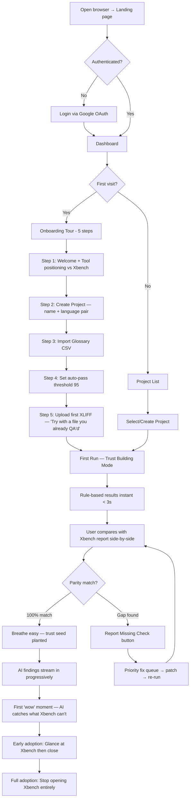
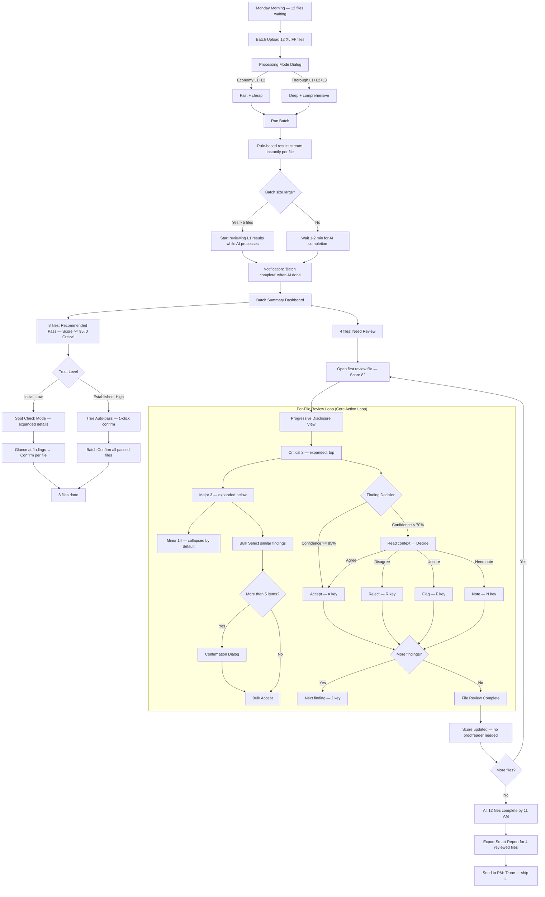
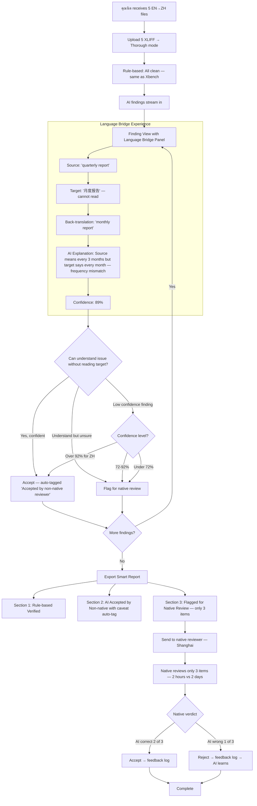
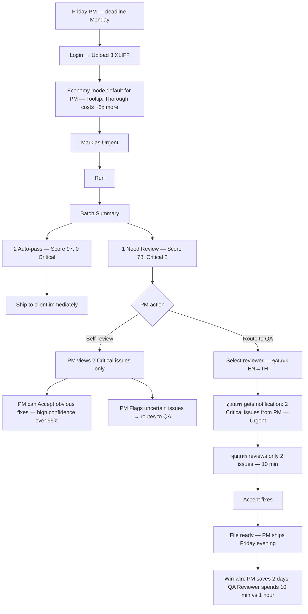
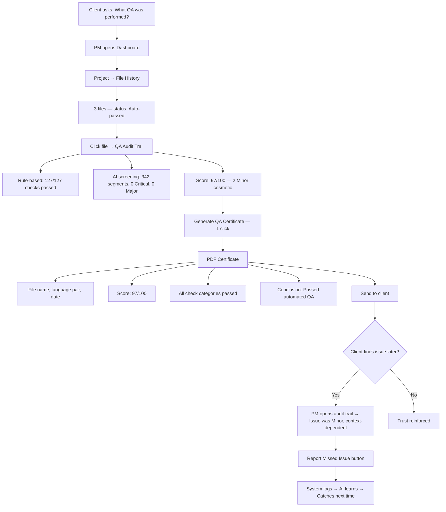
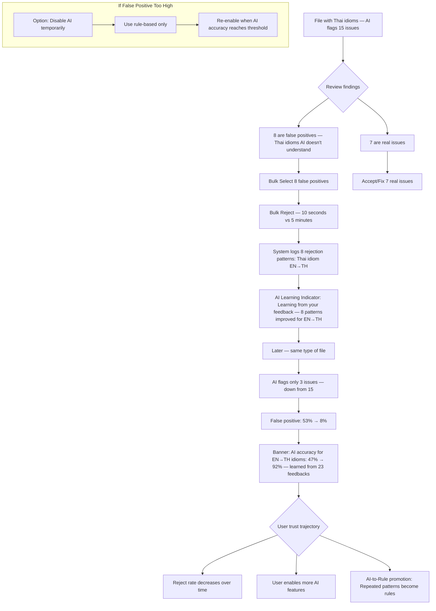

# User Journey Flows

## UJ1: First-Time Setup — "The Trust Test" (คุณแพร, Initial Phase)

**Goal:** สร้าง trust ให้ power user ที่มี baseline expectation จาก Xbench

**Entry Points:** Direct URL / email invitation from PM



**Key UX Decisions:**
| Decision | Rationale |
|----------|-----------|
| Onboarding tour = 5 steps max | Respect power user patience — skippable after step 1 |
| "Try with a file you already QA'd" prompt | Enables side-by-side comparison — builds trust through evidence |
| Rule-based first, AI streams later | Match Xbench mental model first, then exceed it |
| Report Missing Check = prominent action | Trust recovery path — user feels heard, not ignored |

**Emotional Arc:** Skepticism → Cautious testing → "It caught everything Xbench catches" → "It catches MORE" → Trust

---

## UJ2: Batch QA Review — "Single-Pass Day" (คุณแพร, Daily, Post-Onboarding) — Critical

**Goal:** ทำ 12 ไฟล์ให้เสร็จใน half day — ไม่มี proofreader loop

**Entry Point:** Dashboard → Project → Batch Upload



**Detailed Sub-flows:**

### Batch Summary Interaction
```
┌─────────────────────────────────────────────────────────────┐
│  Batch Summary: Monday batch (12 files)         2m 14s      │
│─────────────────────────────────────────────────────────────│
│                                                             │
│  Recommended Pass (8)             Need Review (4)           │
│  ┌──────────────────────┐         ┌──────────────────────┐  │
│  │ file-01.xlf  Score 98│         │ file-03.xlf  Score 82│  │
│  │ file-02.xlf  Score 97│         │ file-07.xlf  Score 78│  │
│  │ file-04.xlf  Score 99│         │ file-09.xlf  Score 85│  │
│  │ file-05.xlf  Score 96│         │ file-11.xlf  Score 71│  │
│  │ file-06.xlf  Score 97│         └──────────────────────┘  │
│  │ file-08.xlf  Score 98│                                   │
│  │ file-10.xlf  Score 96│         [Review file-11 first]    │
│  │ file-12.xlf  Score 99│          (lowest score)           │
│  └──────────────────────┘                                   │
│                                                             │
│  [Confirm All Passed]   [Export Report]   [Details]          │
└─────────────────────────────────────────────────────────────┘
```

### Progressive Disclosure Detail
| Phase | Visible | Interaction |
|:-----:|---------|-------------|
| **Initial** | Critical findings expanded, Major headers visible, Minor collapsed | Auto-scroll to first Critical |
| **Scan** | Row-based compact view, severity badge + category + preview | Arrow keys navigate, Enter expands |
| **Decide** | Expanded finding card with source/target/suggestion/confidence | A/R/F/N keys for action |
| **Bulk** | Checkbox column visible, bulk action bar appears on selection | Shift+Click range select |
| **Complete** | Score recalculates, next file auto-loads if in batch | Summary toast notification |

### Keyboard-First Flow
| Phase | Keys | Action |
|-------|------|--------|
| Navigate findings | `J / ↓` / `K / ↑` | Next / Previous finding |
| Expand/Collapse | `Enter` / `Esc` | Open detail / Close detail |
| Quick actions | `A` `R` `F` `N` | Accept / Reject / Flag / Note |
| Bulk select | `Shift+J/K` | Extend selection |
| Bulk action | `Ctrl+Shift+A` `Ctrl+Shift+R` | Bulk Accept / Bulk Reject |
| File navigation | `] / Alt+↓` / `[ / Alt+↑` | Next file / Previous file |
| Command palette | `Ctrl+K` | Search actions, files, findings |

---

## UJ3: Non-Native Language Review — "The Language Bridge" (คุณนิด) — Critical

**Goal:** Review ไฟล์ภาษาที่อ่านไม่ออก (EN→ZH, EN→JA) โดยไม่ต้องรอ native reviewer

**Entry Point:** Dashboard → Project → Upload (same as UJ2 but with Language Bridge activated)



### Language Bridge Panel Design
```
┌───────────────────────────────────────────┐
│ Language Bridge                            │
│───────────────────────────────────────────│
│                                           │
│ SOURCE (EN):                              │
│ "Please submit the quarterly report"      │
│                                           │
│ TARGET (ZH):                              │
│ "请提交月度报告"                            │
│                                           │
│ BACK-TRANSLATION:                         │
│ "Please submit the monthly report"        │
│                                           │
│ AI EXPLANATION:                            │
│ "The source specifies 'quarterly' (every  │
│  3 months) but the translation says       │
│  'monthly' (every month). This changes    │
│  the reporting frequency requirement."    │
│                                           │
│ CONFIDENCE: 89%                            │
│                                           │
│ ZH threshold: 92% (higher for CJK)        │
│───────────────────────────────────────────│
│ [Accept]  [Flag]  [Reject]                │
└───────────────────────────────────────────┘
```

### Per-Language Confidence Thresholds
| Language Pair | Accept Threshold | Flag Threshold | Rationale |
|:---:|:---:|:---:|---------|
| EN→TH | >= 85% | 70-84% | Reviewer (คุณแพร) reads target |
| EN→ZH | >= 92% | 75-91% | Non-native — higher bar needed |
| EN→JA | >= 92% | 75-91% | Non-native — higher bar needed |
| EN→AR | >= 90% | 72-89% | RTL + non-native |

> **Distinction:** These per-language acceptance thresholds are separate from the universal Confidence Badge levels (High >85%, Medium 70-85%, Low <70%) shown on every finding. The badge indicates AI confidence; the threshold determines when non-native reviewers should Flag rather than Accept.

### Non-Native Safety Net
- Every Accept by non-native auto-tagged: `"Accepted by non-native reviewer — subject to native audit"`
- Smart Report separates native-verified vs non-native-accepted sections
- Periodic audit: random 10% of non-native accepts reviewed by native speaker
- Per-language accuracy tracking drives threshold calibration

---

## UJ4: PM Self-Service — "The Self-Service Shortcut" (PM, Established Phase)

**Goal:** PM ส่งไฟล์ให้ลูกค้าได้วันศุกร์ โดยไม่ต้องรอคิว QA

**Entry Point:** Dashboard → Project → Quick Upload (simplified PM view)



**PM-Specific UX Adaptations:**
| Element | PM View | QA Reviewer View |
|---------|---------|------------------|
| Default mode | Economy | Thorough |
| Batch summary | Prominent pass/fail | Detailed score breakdown |
| Finding detail | Simplified — action buttons only | Full context + Language Bridge |
| Report | 1-click export | Customizable sections |
| Cost indicator | Visible per file (see below) | Hidden (not relevant) |
| Onboarding | Lightweight 3-step PM guide | Skippable 5-step tour |
| Reviewer routing | Reviewer selector with availability | N/A (is the reviewer) |

### PM Cost Estimation Display

```
┌──────────────────────────────────────────────┐
│ 12 files ready                               │
│──────────────────────────────────────────────│
│ file-01.xlf   4,200 seg   ~$0.12            │
│ file-02.xlf   1,800 seg   ~$0.05            │
│ file-03.xlf   3,100 seg   ~$0.09            │
│──────────────────────────────────────────────│
│ Mode: Selected via Processing Mode Dialog    │
│ Est:   Economy ~$0.26    Thorough ~$1.30    │
│                                              │
│ Estimate based on segment count.             │
│ Actual cost may vary by AI complexity.       │
└──────────────────────────────────────────────┘
```

### Reviewer Selection UI (Route to QA)

```
┌──────────────────────────────────────────────┐
│ Route to QA Reviewer                         │
│──────────────────────────────────────────────│
│ Language pair: EN→TH                         │
│                                              │
│ Available Reviewers:                         │
│ ┌────────────────────────────────────────┐   │
│ │ 🟢 คุณแพร  │ EN→TH, EN→JA │ 2 active │   │
│ │ 🟡 คุณนิด  │ EN→TH, EN→ZH │ 5 active │   │
│ │ 🔴 คุณสม   │ EN→TH        │ Offline  │   │
│ └────────────────────────────────────────┘   │
│                                              │
│ Issues to route: 2 Critical                  │
│ Priority: [Urgent 🔴 ▼]                     │
│ Note: [Optional message to reviewer      ]   │
│                                              │
│ [Send to คุณแพร]              [Cancel]       │
└──────────────────────────────────────────────┘
```

Reviewer receives notification: "PM assigned 2 Critical issues — Urgent"

---

## UJ5: Dashboard & Reporting — "The Auto-Pass Audit" (PM)

**Goal:** พิสูจน์คุณภาพให้ลูกค้าด้วย audit trail และ QA certificate

**Entry Point:** Dashboard → Project → File History



### Dashboard Overview Layout
```
┌──────────────────────────────────────────────────────────┐
│  Project Dashboard: Client-ABC EN→TH                     │
│──────────────────────────────────────────────────────────│
│                                                          │
│  This Week          │  Trends                            │
│  ┌────────────────┐ │  ┌──────────────────────────────┐  │
│  │ Files: 47      │ │  │ Avg Score: 94.2 (+2.1)      │  │
│  │ Auto-pass: 38  │ │  │ Auto-pass rate: 81%          │  │
│  │ Reviewed: 9    │ │  │ False positive: 12%           │  │
│  │ Avg Score: 94  │ │  │ AI accuracy: 91%              │  │
│  └────────────────┘ │  └──────────────────────────────┘  │
│                     │                                    │
│  Recent Files                                            │
│  ┌─────────────┬───────┬────────┬───────────┬─────────┐  │
│  │ File        │ Score │ Status │ Issues    │ Actions │  │
│  │ doc-47.xlf  │ 97    │ Pass   │ 2 Minor  │ Cert    │  │
│  │ doc-46.xlf  │ 82    │ Done   │ 2C 3M    │ View    │  │
│  │ doc-45.xlf  │ 98    │ Pass   │ 0        │ Cert    │  │
│  └─────────────┴───────┴────────┴───────────┴─────────┘  │
└──────────────────────────────────────────────────────────┘
```

---

## UJ6: AI Feedback & Learning — "The False Positive Storm" (คุณแพร)

**Goal:** ลด false positive rate ผ่าน feedback loop — user sees AI improving from their input

**Entry Point:** Review flow (within UJ2) when encountering many false positives



**AI Learning Visibility:**
| Indicator | Location | Trigger |
|-----------|----------|---------|
| Inline learning badge | After bulk reject | "AI learning from your feedback" |
| Accuracy trend | Side panel → AI tab | Per language pair, per category |
| Improvement banner | Top of review screen | When false positive rate drops > 10% |
| Pattern count | Settings → AI Learning | "23 patterns learned for EN→TH" |
| Suppress action | Finding context menu | After 3+ rejects of same pattern (see below) |

### Suppress Pattern Interaction

**Trigger:** System detects 3+ rejections of the same error pattern (e.g., "Thai idiom misclassified as mistranslation") within a session or across sessions for the same language pair.

**Flow:**
```
3rd rejection of same pattern → Toast appears:
┌──────────────────────────────────────────────┐
│ 🧠 Pattern detected: "Thai idiom" (3 rejects)│
│                                              │
│ [Suppress this pattern]  [Keep checking]      │
└──────────────────────────────────────────────┘

If "Suppress this pattern":
┌──────────────────────────────────────────────┐
│ Suppress "Thai idiom false positive"         │
│──────────────────────────────────────────────│
│ Scope:  ○ This file only                    │
│         ● This language pair (EN→TH)         │
│         ○ All language pairs                 │
│                                              │
│ Duration: ● Until AI accuracy improves       │
│           ○ Permanently                      │
│           ○ This session only                │
│                                              │
│ [Suppress]                    [Cancel]        │
└──────────────────────────────────────────────┘

After suppression:
- Matching findings auto-rejected with "Suppressed" tag
- Suppressed patterns listed in Settings → AI Learning
- Can be re-enabled anytime from Settings
- AI still receives rejection data for training
```

**Undo:** Settings → AI Learning → Suppressed Patterns → [Re-enable] per pattern

---

## Journey Patterns

Cross-journey patterns identified across all 6 user journeys:

### Navigation Patterns
| Pattern | Used In | Implementation |
|---------|---------|----------------|
| **Progressive Loading** | UJ1, UJ2, UJ3 | Rule-based instant → AI streams in → badge updates |
| **Batch → Detail Drill** | UJ2, UJ4, UJ5 | Summary view → click file → finding list → finding detail |
| **Keyboard-First Navigation** | UJ2, UJ3 | J/K navigate, A/R/F/N act, Ctrl+K command palette |
| **Panel Auto-Update** | UJ2, UJ3 | Side panel reflects focused finding — no click needed |

### Decision Patterns
| Pattern | Used In | Implementation |
|---------|---------|----------------|
| **Confidence-Guided Action** | UJ2, UJ3 | High confidence → quick Accept, Low → read context → decide |
| **Trust Escalation** | UJ1, UJ2, UJ4 | Recommended pass → Spot check → Auto-pass (progressive) |
| **Non-Native Safety Net** | UJ3 | Auto-tag + 3-tier report + native audit sample |
| **Bulk with Safeguard** | UJ2, UJ6 | Bulk select → confirmation dialog if > 5 items |

### Feedback Patterns
| Pattern | Used In | Implementation |
|---------|---------|----------------|
| **Visible Learning** | UJ5, UJ6 | AI Learning Indicator + accuracy trend + improvement banner |
| **Recovery Path** | UJ1, UJ5 | Report Missing Check + Report Missed Issue → system learns |
| **Trust Signal** | UJ1, UJ2 | Score prominence, audit trail, QA certificate |
| **Progressive Trust** | UJ1, UJ2 | Skepticism → Evidence → Confidence → Reliance |

## Flow Optimization Principles

| # | Principle | Application | Journeys |
|:-:|-----------|------------|:--------:|
| 1 | **Minimize steps to value** | Rule-based results in < 3s, no waiting for AI to start working | All |
| 2 | **Parallel work enabled** | Review L1 findings while AI processes — never idle | UJ2, UJ3 |
| 3 | **Smart defaults reduce decisions** | Economy mode for PM, Thorough for QA, auto-threshold per language | UJ2, UJ3, UJ4 |
| 4 | **Batch before detail** | Always show summary first — user decides what needs attention | UJ2, UJ4, UJ5 |
| 5 | **Trust through transparency** | Audit trail, QA certificate, accuracy metrics always accessible | UJ1, UJ5, UJ6 |
| 6 | **Recovery over perfection** | Every miss has a recovery path — Report Missing, Report Missed, Flag | UJ1, UJ5, UJ6 |
| 7 | **Keyboard-first, mouse-optional** | Full review possible without touching mouse — 300+ findings/day | UJ2, UJ3 |
| 8 | **Show the learning** | AI improvement visible — builds trust through demonstrated growth | UJ5, UJ6 |

